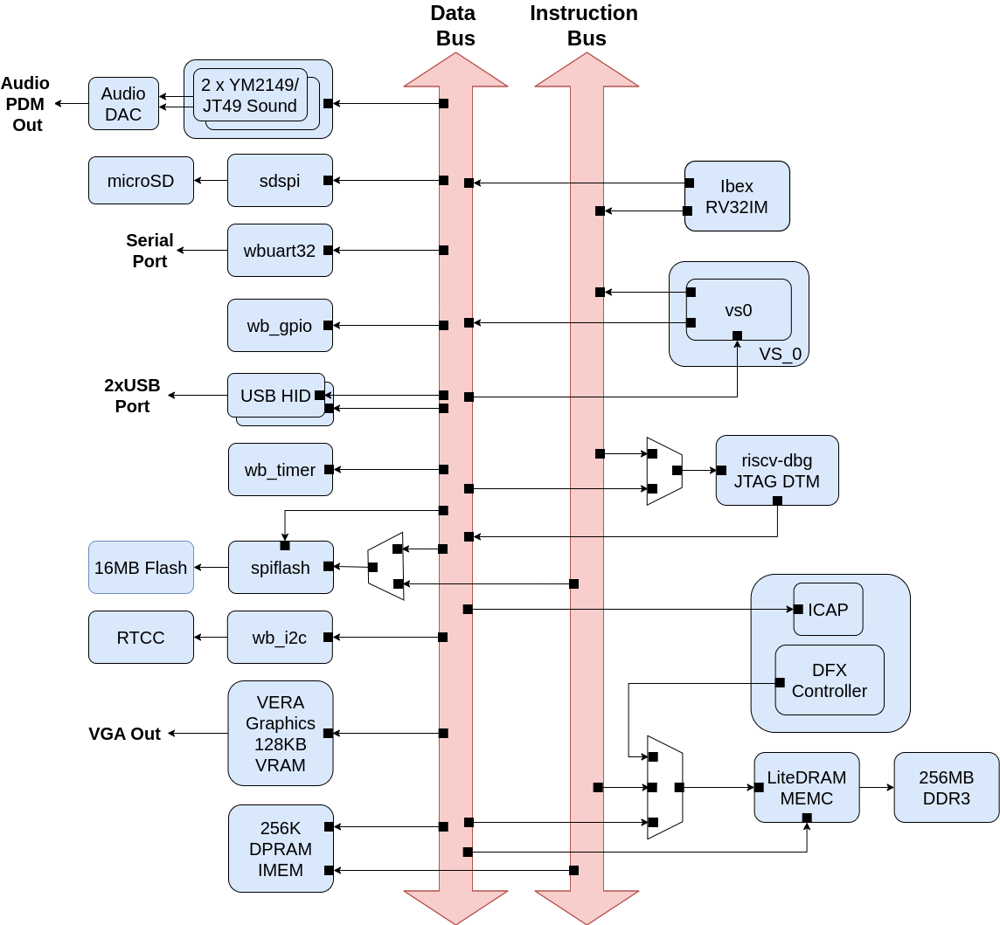

# About BoxLambda

**BoxLambda** is a homebrew project creating a retro-style FPGA-based microcomputer from open-source components. The microcomputer serves as a platform for both software and gateware experimentation.

## Current Features

- Targets the Arty-A7-100T FPGA development board.
- Ibex RISC-V core with machine timer and hardware interrupt support.
- Interrupt shadow register bank supporting low-latency interrupt handling.
- Stable low-latency access to internal memories and registers. Stable and documented instruction cycle counts.
- DDR3 external memory access through the Litex memory controller.
- OpenOCD-based debug access on FPGA and Verilator.
- VERA-based VGA graphics: 2 layers tile or bitmap mode, 2 banks of 64 sprites, 128KB Video RAM, 256 color palette.
- Dual YM2149 PSG Audio.
- SD Card Controller and FatFs File System.
- 24-pin GPIO, UART, SPI Flash Controller, I2C Controller.
- Real-time Clock and Calendar (RTCC) support.
- USB HID Keyboard and Mouse support.
- Picolibc-based standard C environment.
- DFX Partial FPGA Reconfiguration support.
- Test application suite covering all SoC components, running on FPGA and Verilator.
- Linux CMake and Bender-based Software and Gateware build system.

## Key Goals

- Create a sandbox for experimenting with software and FPGA gateware:
    - It should be **easy** to jump in and do something: create, hack, tinker.
        - **Simple Enough for One Person**: A motivated individual can develop a solid understanding of the entire system, including software and hardware.
        - **Deterministic Behavior**: The duration of operations such as internal memory or register access must be predictable by design.
        - **Self-Contained Run-Time Environment** supporting high-level interactive and low-level systems programming.
    - Create a **Modular Architecture** allowing for a mix-and-match of software and hardware components. Optionally, support Partial FPGA Reconfiguration.

- Target Hardware: Digilent's [Arty-A7](https://digilent.com/reference/programmable-logic/arty-a7/start).

- The computer supports the following peripherals:
    - USB HID Keyboard
    - USB HID Mouse (optional)
    - USB HID Joystick (optional)
    - Real-Time Clock and Calendar (optional)
    - Serial port
    - SD card storage
    - Flash Memory storage
    - VGA Display
    - Audio output

- Sound and graphics support retro-style 2D demos and gameplay.

## Status (April 2025)

- **Infrastructure** (build system, etc.): Complete.
- **Gateware**: Complete and meeting requirements.
- **Software**: Early stage development.

## GitHub

- **Source Code**: [https://github.com/epsilon537/boxlambda/](https://github.com/epsilon537/boxlambda/)
- **Project Blog**: [https://epsilon537.github.io/boxlambda/](https://epsilon537.github.io/boxlambda/)
- **Project Documentation**: [https://boxlambda.readthedocs.io/en/latest/](https://boxlambda.readthedocs.io/en/latest/)
