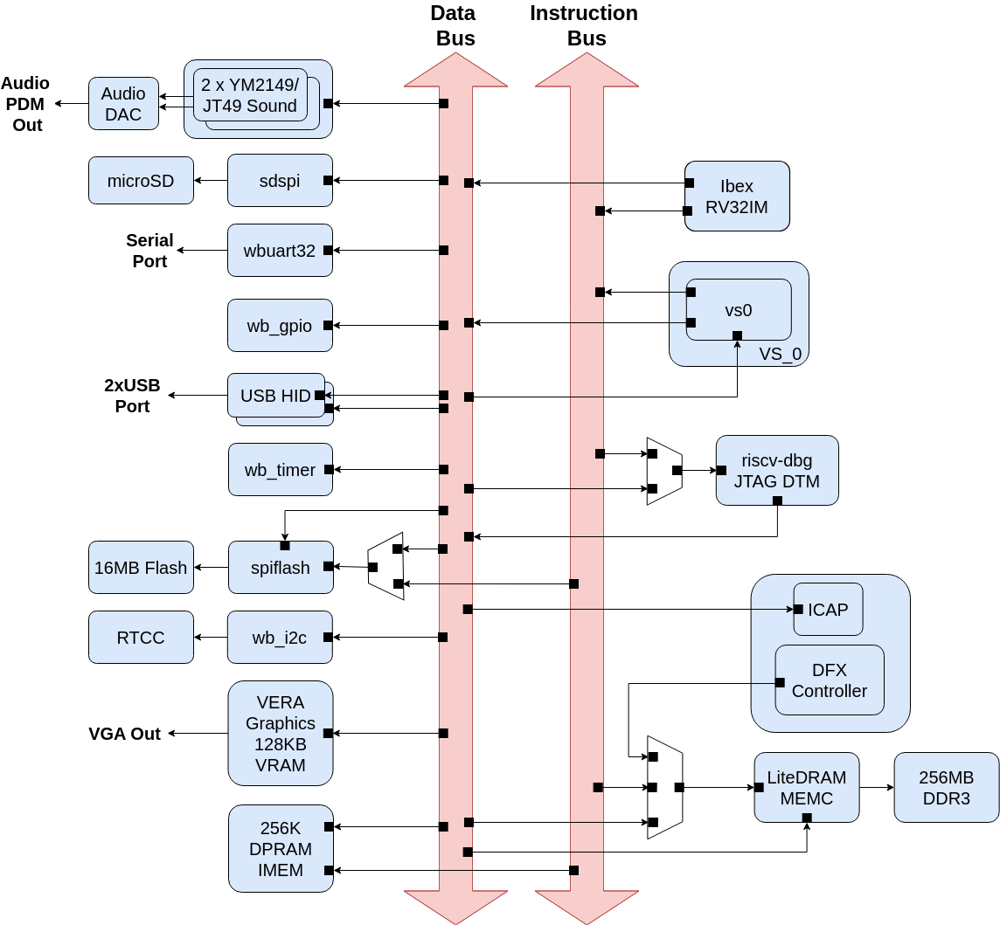

# About BoxLambda

BoxLambda is a hardware-software crossover project creating a homebrew,
retro-style FPGA-based microcomputer. The goal is to create a sandbox
environment for experimenting with software and FPGA gateware.

## The Physical Setup

*The physical setup.*

## Current Features

- Target FPGA: Arty-A7-100T.
- Ibex RISC-V core with machine timer and hardware interrupt support.
- Harvard architecture-based interconnect.
- Low-latency register and memory access across the SoC.
- Predictable instruction cycle counts.
- DFX Partial FPGA Reconfiguration support.
- DDR3 external memory access through the Litex memory controller.
- OpenOCD-based debug access on FPGA and Verilator.
- VERA-based VGA graphics: 2 layers, tile or bitmap mode, 2 banks of 64 sprites,
128KB Video RAM, 256 color palette.
- Dual YM2149 PSG Audio.
- SD Card Controller and FatFs File System.
- 24-pin GPIO, UART, SPI Flash Controller, I2C Controller.
- Real-time Clock and Calendar (RTCC) support.
- USB HID Keyboard and Mouse support.
- Picolibc-based standard C environment.
- Test application suite covering all SoC components, running on both FPGA and
Verilator.
- Mecrisp Forth core + C FFI.

## Gateware Block Diagram

## Software Block Diagram

*BoxLambda OS Architecture Block Diagram.*

## Key Goals

- Create a sandbox for experimenting with software and FPGA gateware:
    - It should be **easy** to jump in and do something: create, hack, tinker.
        - **Simple Enough for One Person**: A motivated individual can develop a solid understanding of the entire system, including software and hardware.
        - **Deterministic Behavior**: The duration of operations such as internal memory or register access must be predictable by design.
        - **Self-Contained Run-Time Environment** supporting high-level interactive and low-level systems programming.
    - Create a **Modular Architecture** allowing for a mix-and-match of software and hardware components. Optionally, support Partial FPGA Reconfiguration.

- Target Hardware: Digilent's [Arty-A7](https://digilent.com/reference/programmable-logic/arty-a7/start).

- The computer supports the following peripherals:
    - USB HID Keyboard
    - USB HID Mouse (optional)
    - USB HID Joystick (optional)
    - Real-Time Clock and Calendar (optional)
    - Serial port
    - SD card storage
    - Flash Memory storage
    - VGA Display
    - Audio output

- Sound and graphics support retro-style 2D demos and gameplay.

## Status (April 2026)

- **Infrastructure** (build system, etc.): Complete.
- **Gateware**: Complete and meeting requirements.
- **Software**: Development ongoing.
  - OS architecture: defined.
  - BoxLambda C Core: partially completed.
  - Mecrisp Forth Core: completed.
  - Mecrisp Forth Environment: partially completed.
  - Forth<->C FFI: completed.
  - Filesystem layer: completed.

## Changelog

- [Changelog](CHANGELOG.md)

## Links

- **Source Code**: [https://github.com/epsilon537/boxlambda/](https://github.com/epsilon537/boxlambda/)
- **Project Blog**: [https://epsilon537.github.io/boxlambda/](https://epsilon537.github.io/boxlambda/)

## Documentation

- [Terms and Abbreviations](docs/terms-and-abbreviations.md)
- [Requirements](docs/requirements.md)
- Installation:
    - [Prerequisites](docs/installation/prerequisites.md)
    - [Peripherals/PMODs](docs/installation/pmods.md)
    - [Installation](docs/installation/installation.md)
- Gateware:
  - Top-Level:
      - [Gateware Architecture](docs/gateware/top-level/gw-architecture.md)
      - [Clocks and Reset](docs/gateware/top-level/clocks-and-reset.md)
      - [Interrupts](docs/gateware/top-level/interrupts.md)
      - [LEDs and Switches](docs/gateware/top-level/leds-and-switches.md)
      - [FPGA Resource Utilization](docs/gateware/top-level/fpga-resource-utilization.md)
  - Gateware Components:
      - [BoxLambda SoC](docs/gateware/components/boxlambda-soc.md)
      - [Wishbone Interconnect](docs/gateware/components/wb-interconnect.md)
      - [RISCV Ibex Processor](docs/gateware/components/ibex.md)
      - [IMEM](docs/gateware/components/imem.md)
      - [RISCV-DBG Debug Core](docs/gateware/components/riscv-dbg.md)
      - [LiteDRAM Memory Controller](docs/gateware/components/litedram.md)
      - [VERA (docs/Wishbone) Graphics](docs/gateware/components/vera.md)
      - [SDSPI SD Card Controller](docs/gateware/components/sdspi.md)
      - [SPI Flash Controller](docs/gateware/components/spiflash.md)
      - [Dual YM2149 PSG Sound Core](docs/gateware/components/dual-ym2149.md)
      - [USB HID Keyboard and Mouse](docs/gateware/components/usb-hid.md)
      - [UART](docs/gateware/components/uart.md)
      - [GPIO](docs/gateware/components/gpio.md)
      - [Timer](docs/gateware/components/timer.md)
      - [I2C](docs/gateware/components/i2c.md)
      - [RTCC](docs/gateware/components/rtcc.md)
      - [VS0](docs/gateware/components/vs0.md)
      - [DFX Controller](docs/gateware/components/dfx-controller.md)
  - Gateware Project Builds:
      - [BoxLambda Base](docs/gateware/projects/boxlambda-base.md)
      - [BoxLambda DFX (docs/Experimental/Advanced)](docs/gateware/projects/boxlambda-dfx.md)
  - Gateware Testing:
    - The Gateware Test Bench:
        - [The Test Bench](docs/gateware/test/bench/test-bench.md)
        - [The System-Level Test Bench](docs/gateware/test/bench/system-level.md)
        - [The Component-Level Test Bench](docs/gateware/test/bench/component-level.md)
    - Gateware Test Builds:
        - [Hello World](docs/gateware/test/builds/hello-world.md)
        - [DDR Test](docs/gateware/test/builds/ddr.md)
        - [VERA Test](docs/gateware/test/builds/vera.md)
        - [SDSPI and FatFS Test](docs/gateware/test/builds/sdspi-and-fatfs.md)
        - [YM2149 PSG, Audio DAC, and ST-Sound Test](docs/gateware/test/builds/ym2149.md)
        - [USB HID Keyboard and Mouse Test](docs/gateware/test/builds/usb-hid.md)
        - [SPI Flash Test](docs/gateware/test/builds/spi-flash.md)
        - [Timer, UART, and GPIO Interrupt Test](docs/gateware/test/builds/timer-uart-gpio-irqs.md)
        - [I2C Test](docs/gateware/test/builds/i2c.md)
        - [Real-Time Clock and Calendar Test](docs/gateware/test/builds/rtcc.md)
        - [Reset Test](docs/gateware/test/builds/reset.md)
        - [DFX Test](docs/gateware/test/builds/dfx.md)
        - [Invalid Address Test](docs/gateware/test/builds/invalid-addr.md)
        - [Ibex Performance Test](docs/gateware/test/builds/ibex-perf.md)
- Software:
  - OS:
      - [Requirements](docs/software/os/requirements.md)
      - [Architecture](docs/software/os/architecture.md)
      - [Build](docs/software/os/build.md)
      - [Memory Layout](docs/software/os/mem-layout.md)
      - [Boot Sequence](docs/software/os/boot-seq.md)
      - [User Interface](docs/software/os/ui.md)
  - Forth:
    - [The Mecrisp Forth Core](docs/software/forth/core.md)
    - [The Forth-C FFI](docs/software/forth/c-ffi.md)
    - [Stack Notation](docs/software/forth/stack-notation.md)
    - [Forth Word Glossary](docs/software/forth/words.md)
    - [Interrupt Handling](docs/software/forth/irqs.md)
    - [Exception Handling](docs/software/forth/exception-handling.md)
    - [Interpreting](docs/software/forth/interpreting.md)
    - [Include](docs/software/forth/include.md)
    - [Filesystem Stack](docs/software/forth/fs-stack.md)
  - [Bootloader](docs/software/bootloader.md)
  - C Components:
      - [About C Components](docs/software/c-components/about.md)
      - [Register Access Layer](docs/software/c-components/register-access-layer.md)
      - [PicoLibc and the Bootstrap Component](docs/software/c-components/picolibc.md)
      - [LiteDRAM Initialization](docs/software/c-components/litedram-initialization.md)
      - [SDSPI](docs/software/c-components/sdspi.md)
      - [FatFs](docs/software/c-components/fat-fs.md)
      - [ST-Sound](docs/software/c-components/st-sound.md)
      - [VERA HAL](docs/software/c-components/vera-hal.md)
      - [USB HID](docs/software/c-components/usb-hid.md)
      - [Flash Driver](docs/software/c-components/flashdrvr.md)
      - [UART](docs/software/c-components/uart.md)
      - [GPIO](docs/software/c-components/gpio.md)
      - [RISC-V](docs/software/c-components/riscv.md)
      - [I2C](docs/software/c-components/i2c.md)
      - [Real-Time Clock and Calendar](docs/software/c-components/rtcc.md)
      - [DFX Controller HAL](docs/software/c-components/dfx-controller-hal.md)
  - Test C Components:
      - [About Test C Components](docs/software/c-components/test/about.md)
      - [Timer](docs/software/c-components/test/timer.md)
      - [Interrupt Handling](docs/software/c-components/test/irqs.md)
      - [Embedded CLI](docs/software/c-components/test/cli.md)
      - [Ymodem](docs/software/c-components/test/ymodem.md)
      - [Memory and File System CLI](docs/software/c-components/test/mem-fs-cli.md)
      - [Peek and Poke CLI](docs/software/c-components/test/peek-poke-cli.md)
      - [J1B HAL](docs/software/c-components/test/j1b-hal.md)
      - [VS0 HAL](docs/software/c-components/test/vs0-hal.md)
  - Software Testing:
    - [The Software Test Bench](docs/software/test/test-bench.md)
    - [Forth Test Suite](docs/software/test/builds/forth-testsuite.md)
- Build System:
    - [The Directory Structure](docs/build-sys/dir-struct.md)
    - The Gateware Build System:
      - [The Gateware Build Structure](docs/build-sys/gateware/build-struct.md)
      - [Building the Gateware](docs/build-sys/gateware/building.md)
    - The Software Build System:
      - [The Software Build Structure](docs/build-sys/software/build-struct.md)
      - [Building the Software](docs/build-sys/software/building.md)
- Tools:
    - [Target.py](docs/tools/target_py.md)
    - [Debugging](docs/tools/debugging.md)
- Register and Memory Map:
    - [Reset](docs/registers/reset-regs.md)
    - [UART](docs/registers/uart-regs.md)
    - [GPIO](docs/registers/gpio-regs.md)
    - [MTIMER](docs/registers/mtimer-regs.md)
    - [I2C Master](docs/registers/i2c-master-regs.md)
    - [USB HID](docs/registers/usb-hid-regs.md)
    - [SDSPI](docs/registers/sdspi-regs.md)
    - [SPI Flash](docs/registers/spiflash-regs.md)
    - [VERA](docs/registers/vera-regs.md)
    - [YM2149](docs/registers/ym2149-regs.md)
    - [DFX Controller Control Register](docs/registers/dfx-controller-ctrl-reg.md)
    - [DFX Controller Other Registers](docs/registers/dfx-controller-other-regs.md)
    - [LiteDRAM Registers](docs/registers/litedram-index.md)
    - [Memory Map](docs/registers/memory-map.md)
- Misc.:
  - [Git Workflow](docs/misc/git-workflow.md)
  - [Blog](docs/misc/blog.md)

