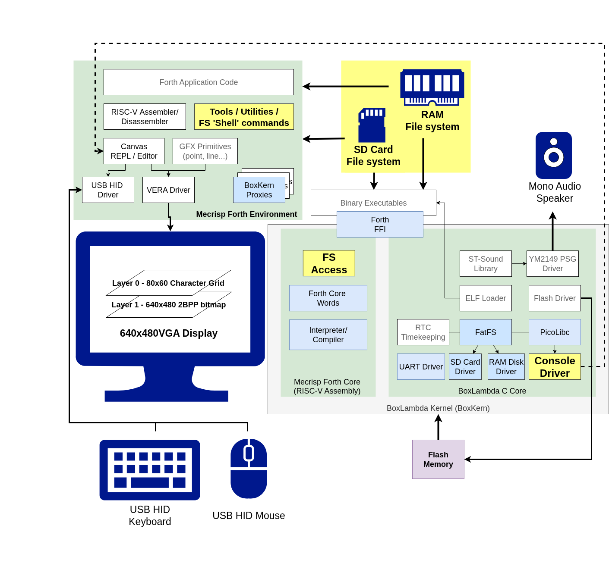
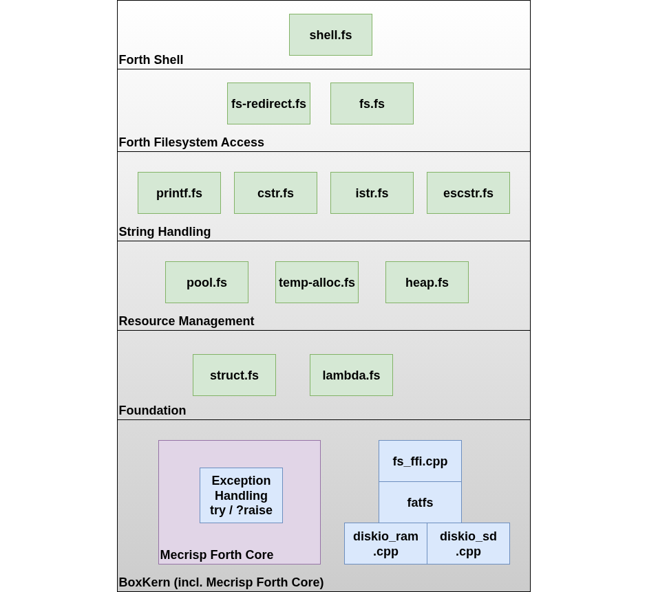
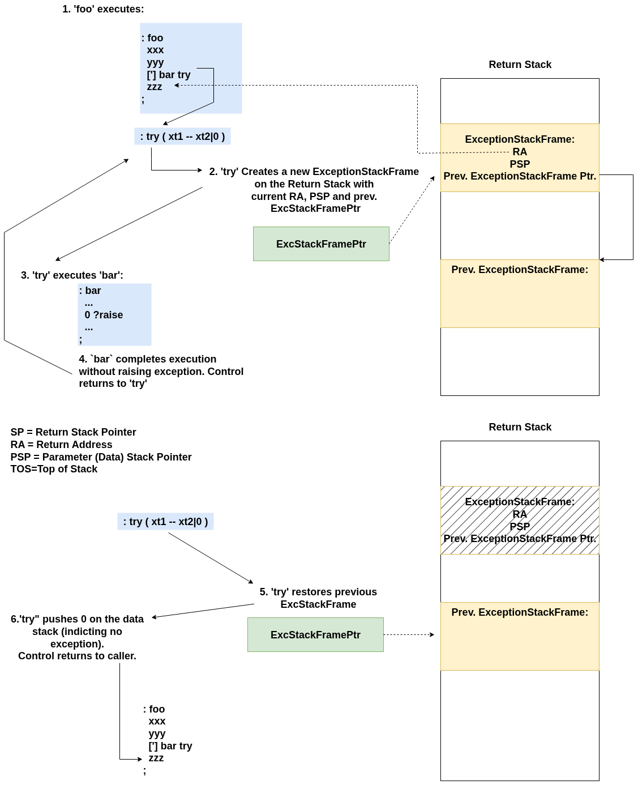
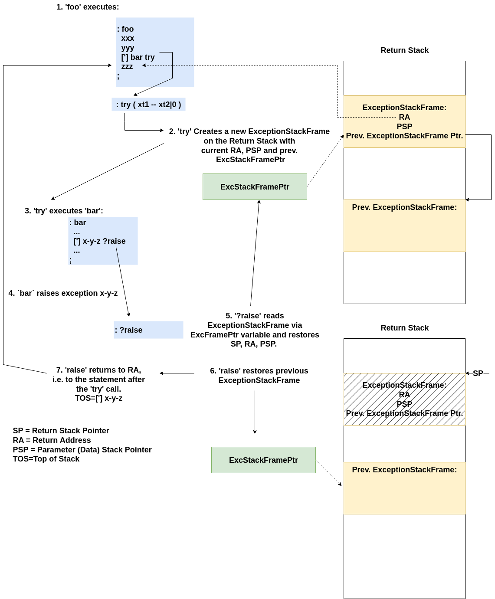
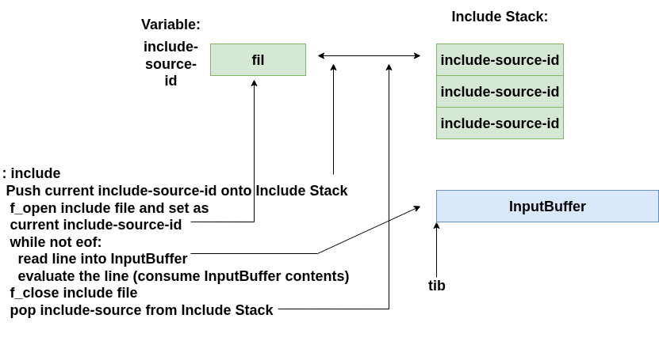
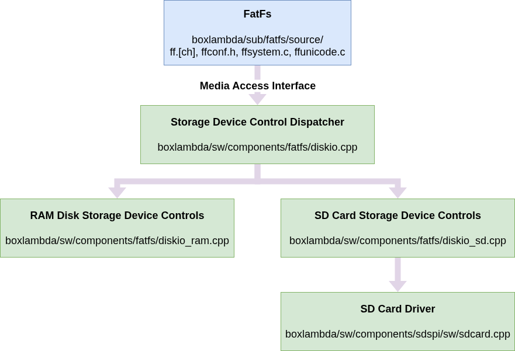

The BoxLambda OS Forth environment now as file system access. It requires a small stack of Forth modules to attain an abstraction level sufficiently high for convenient, shell-level access to the file system.

# Context

This is the software architecture I'm working towards:

[](../assets/the-file-system-stack/BoxLambda_OS_Architecture_FS_Focus.png)

*BoxLambda OS Architecture. Click to zoom.*

This post focuses on the yellow boxes.

For an overview of what BoxLambda is about and its current features, see [here](../about/).

# File System Access Words

BoxLambda's Forth file system access is derived from Spyren's [Mecrisp Cube](https://github.com/spyren/Mecrisp-Cube/blob/master/sdcard/man/FileSystem.md) project. I didn't re-use the Mecrisp Cube code, but I did borrow several ideas from this project, such as:

- The Forth Fileystem API as a proxy of the [FatFS C API](https://elm-chan.org/fsw/ff/).
- Standard Output redirection.
- Shell commands for interactive use.

Here are some examples to give you an idea of how the API works:

## File Open, Write, Read, Close

```
#256 buffer: fs-buf

[: s" fs_test.txt" FA_CREATE_ALWAYS FA_WRITE or f_open ;]
try ?except_error ( fil )
dup [: s" Hello World!" f_write ;] try ?except_error ( fil nbw )
\ 12 bytes written
#12 = ?assert ( fil )

[: s" fs_test.txt" FA_OPEN_EXISTING FA_READ or f_open ;]
try ?except_error ( fil )
dup [: fs-buf #256 f_read ;] try ?except_error ( fil numbytes )
dup #12 = ?assert ( fil numbytes )
fs-buf swap ( fil fs-buf len )
s" Hello World!" compare ?assert
[: f_close ;] try ?except_error ( )
```

The `[: .. ;]` blocks are *lambdas*, a.k.a. *anonymous functions*. In the context of the example above, they denote the boundaries of an exception handling try-block. See the [Lambdas](#lambdas-anonymous-functions) and [Exception Handling](#exception-handling) sections below.

## Current Directory, Make Directory, Change Directory, Remove File or Directory

```
[: f_getcwd ;] try ?except_error type cr
[: s" test_dir" f_mkdir ;] try ?except_error
[: s" test_dir" f_chdir ;] try ?except_error
[: s" .." f_chdir ;] try ?except_error
[: s" test_dir" f_unlink ;] try ?except_error
```

## Iterating over Glob Matches in a directory

```
  s" ./*.txt"
  [: ( patha pathl )
      basename ( basea basel )
      filinfo.fattrib fattrib>str
      filinfo.getftime time>str
      filinfo.getfdate date>str
      filinfo.fsize
      s" %08n %s %s %s %s" printf cr ( dir )
  ;] ( pata patl xt )
  glob-each
```

## Redirecting Standard Output to a File

```
[: ." fs-redirection test" cr ;] >file redirout.txt
```

## Shell Commands

The above examples show programatic use of File System Access Words, i.e., their use in compiled code. Although these Words can also be used in execution mode, they're a bit cumbersome to use interactively. The [shell.fs](https://github.com/epsilon537/boxlambda/blob/v0.4.0/fs/forth/shell.fs) Words are designed to be used interactively, so you get the feel of a (bare bones) OS shell on the Forth REPL:

```
sd0:/> ls *

00000000 2026/04/06 22:24:16 --- --- --- --- DIR --- forth
00000000 2026/04/06 22:24:18 --- --- --- --- DIR --- test

sd0:/> cd forth

sd0:/forth> ls *
...
00000490 2026/03/31 17:31:56 --- --- --- --- --- ARC irq.fs
00001137 2026/03/31 17:32:52 --- --- --- --- --- ARC boxkern-includes.fs
00001749 2026/03/31 17:33:42 --- --- --- --- --- ARC utils.fs
00000328 2026/03/31 17:35:02 --- --- --- --- --- ARC early.fs
00001219 2026/04/06 20:34:52 --- --- --- --- --- ARC init.fs

sd0:/forth> cat irq.fs

\ Setting the MTIMER Comparator
: set-raw-time-cmp ( u -- ) s>d mtime64 d+ mtimecmp64! ;

\ IRQ ID constants
16 constant irq-id-fast-0
7 constant irq-id-timer
13 irq-id-fast-0 + constant irq-id-vera
12 irq-id-fast-0 + constant irq-id-vs00
08 irq-id-fast-0 + constant irq-id-dfx
10 irq-id-fast-0 + constant irq-id-sdpsi
08 irq-id-fast-0 + constant irq-id-usb-hid-1
07 irq-id-fast-0 + constant irq-id-usb-hid-0
07 irq-id-fast-0 + constant irq-id-i2c
05 irq-id-fast-0 + constant irq-id-uart

sd0:/forth>
```

You can find the file system Word list in the documentation [here](https://boxlambda.readthedocs.io/en/v0.4.0/software/boxlambda-os/forth/words/#filesystem). The Words are defined in the following modules:

- [fs.fs](https://github.com/epsilon537/boxlambda/blob/v0.4.0/fs/forth/fs.fs)
- [fs-redirect.fs](https://github.com/epsilon537/boxlambda/blob/v0.4.0/fs/forth/fs-redirect.fs)
- [shell.fs](https://github.com/epsilon537/boxlambda/blob/v0.4.0/fs/forth/shell.fs)

# The File System Stack

[](../assets/the-file-system-stack/fs-stack-layered.png)

*BoxLambda File System Stack. Click to zoom.*

A Forth Core is quite bare bones. You are expected to provided your own abstractions, tailored to the problem you're trying to solve. In the case of BoxLambda's Forth file system and shell, these abstractions form a small software stack. The stacked components are further discussed below.

## String Handling

File/Directory names and shell commands require a toolkit of string-formatting Words for ease-of-use and testability:

- [printf.fs](https://github.com/epsilon537/boxlambda/blob/v0.4.0/fs/forth/printf.fs): C printf/sprintf style string formatting:

  ```
  basename ( basea basel )
  filinfo.fattrib fattrib>str
  filinfo.getftime time>str
  filinfo.getfdate date>str
  filinfo.fsize
  s" %08n %s %s %s %s" printf cr ( dir )
  ```

- [cstr.fs](https://github.com/epsilon537/boxlambda/blob/v0.4.0/fs/forth/cstr.fs): Forth-string-to-C-string conversion and vice versa, for interfacing with FatFS in the BoxLambda Kernel.
- [istr.fs](https://github.com/epsilon537/boxlambda/blob/v0.4.0/fs/forth/istr.fs): Out of the box, Mecrisp only supports compiled strings. For interactive testing of the file system API, it's convenient to have an `s"` Word that can be used in execution mode.
- [escstr.fs](https://github.com/epsilon537/boxlambda/blob/v0.4.0/fs/forth/escstr.fs): Support for escaped strings:

  ```
  esc-s" \'Hello World\',\nForth shouted happily." type
  ```

## Resource Management

### Heaps and Pools

Heaps and pools simplify the implementation of interactive strings and help to keep track of open file descriptors.
- [heap.fs](https://github.com/epsilon537/boxlambda/blob/v0.4.0/fs/forth/heap.fs): Borrowed from ZeptoForth. Create a heap, allocate some memory from heap, release memory back to heap when no longer needed.

  ```
  8 256 heap-size constant test-heap-size
  create test-heap test-heap-size allot

  512 test-heap allocate ( addr )
  ...
  ( addr )
  test-heap free
  ```

- [pool.fs](https://github.com/epsilon537/boxlambda/blob/v0.4.0/fs/forth/pool.fs): Borrowed from ZeptoForth. Create a pool of a given block size, allocate a block from pool, release block back to pool when no longer needed.

  ```
  create test-pool pool-size allot
  8 test-pool init-pool

  create test-pool-memory 32 allot
  test-pool-memory 32 test-pool add-pool
  test-pool allocate-pool ( addr )
  ...
  ( addr )
  test-pool free-pool
  ```

### Temporary Memory Allocation

[temp-alloc.fs](https://github.com/epsilon537/boxlambda/blob/v0.4.0/fs/forth/temp-alloc.fs)

Example:

```
\ cat <filename>
\ ( "filename" -- )
: cat
  cr
  token FA_OPEN_EXISTING FA_READ or f_open ( fil )
  256 [: ( fil buf )
    begin ( fil buf )
      over f_eof not while ( fil buf )
        2dup 256 f_gets ( fil buf addr len )
        type ( fil buf )
    repeat
    drop ( buf )
    f_close
  ;] with-temp-allot
;
```

In this example, a 256 byte buffer is allocated and put on the TOS for the lambda, i.e., the [: .. ;] block to use. Once
the lambda block has completed execution, the buffer is released again.
`Temp-alloc.fs` also provides `temp-mark>`, `temp-allot` and `>temp-mark`, to get a mark, allocate temporary memory
(moving the mark) and going back to a previously saved mark when you no longer need the memory. The equivalent of the
previous example using temp markers is:

```
\ cat <filename>
\ ( "filename" -- )
: cat
  cr
  token FA_OPEN_EXISTING FA_READ or f_open ( fil )
  temp-mark> >r
  256 temp-allot ( fil buf )
    begin ( fil buf )
      over f_eof not while ( fil buf )
        2dup 256 f_gets ( fil buf addr len )
        type ( fil buf )
    repeat
    drop ( buf )
    f_close
  r> >temp-mark
;
```

## Foundational

These are basic language building blocks (a reminder of how low-level Forth really is, out of the box):

### Structures (ZeptoForth)

[struct.fs](https://github.com/epsilon537/boxlambda/blob/v0.4.0/fs/forth/struct.fs)

```
begin-structure fil-buf
  field: .fil
  field: .buf
end-structure

create fil-buf0 fil-buf allot
create fil-buf1 fil-buf allot

\ Read and compare one buffer worth of data between to open files
\ ( -- noteqf bothzerof)
: _f_cmp_buf
    fil-buf0 .fil @ fil-buf0 .buf @ 256 f_read ( len0 )
    fil-buf1 .fil @ fil-buf1 .buf @ 256 f_read ( len0 len1 )
    2dup d0= >r ( len0 len1 R: bothzero )
    fil-buf0 .buf @ -rot fil-buf1 .buf @ swap ( buf0 len0 buf1 len1 )
    compare not r> ( noteq bothzero ) ;
```

### Lambdas - Anonymous Functions

[lambda.fs](https://github.com/epsilon537/boxlambda/blob/v0.4.0/fs/forth/lambda.fs)

A regular Word is created and invoked like this:

```
: foo <do-stuff> ; \ Define Word foo
foo \ Invoked Word foo
```

By contrast, a lambda is created and invoked like this:

```
[: <do-stuff> ;] ( xt )
execute
```

A lambda is a function without a name. You invoke the function by calling the execution token that's put on
the data stack by the `;]` Word.

Calling this a *lambda* is a stretch. Lambda functions usually create a [closure](https://en.wikipedia.org/wiki/Closure_(computer_programming)). That is not the case
here. You get an anonymous function, but not an enclosed environment as part of the package.

Despite this limitation, lambdas are quite handy in many situations. Whereever you see a Word that takes an execution token as input, you can provide a lambda definition instead:

For example, `try` is defined as:

```
try ( xt1 -- xt2|0 )
```
`Try` executes xt1. It catches and return any exception raised during the execution of xt1. `Try` returns 0 if no exception was raised.

You can use `try` like this:

```
[: s" fs_test.txt" FA_CREATE_ALWAYS FA_WRITE or f_open ;]
try ?except_error ( fil )
```

This also works in execution mode. When you encounter a compile-only Word, you can invoke it
from the REPL by putting it inside a `[: .. ;]` block:

```
> true [: if s" True" else s" False" then ;] type cr
```

#### Implementation

If, like me, you're new to Forth and struggling with concepts such as `postpone`, it's
instructive to take a loot at the implementation of `[:` and `:]`:

```
\ Begin lambda
: [: ( -- )
  state @ if
    \ [: is invoked as a compiling word, i.e. a code-generating word that
    \ executes when it's encountered in the definition of an other word.
    \ When [: _executes_... it compiles an 'ahead'. This ahead pushes
    \ 2 items on the stack: patchaddr and structmatchconst
    postpone ahead ( patchaddr structmatchconst )
    \ [: puts 'here' on the stack. This the entry point of the code that 'ahead'
    \ is skipping over.
    here -rot ( lambdaentry patchaddr structmatchconst )
    \ [: compiles an 'add sp, sp -4 sw ra, (sp)', i.e. it generates a prologue.
    postpone push_ra ( lambdaentry patchaddr structmatchconst )
  else
    \ [: is invoked while in execution state.
    ] \ Enter compilation state and push following 3 items on the stack
      \ for ;] to consume.
    here 0 0 \ ( lambdaentry patchaddr structmatchconst )
    postpone push_ra
  then
  [immediate]
;

\ End lambda
: ;] ( -- )
  \ When ;] _executes_...
  postpone exit ( lambdaentry patchaddr structmatchconst ) \ ;] compiles an
                                                           \ epilogue...
  dup 0= if \ a 0 structmatchconst means that we were in execution state when
            \ [: was entered.
    \ ...compiles a switch-to-execution-state...
    postpone [ ( lambdaentry patchaddr structmatchconst)
    2drop ( lambdaentry )
  else \ an 'ahead' was compiled by [:
    postpone then ( lambdaentry ) \ ...compiles a 'then' matching the ahead
                                  \ and consuming the 2 stack items ahead
                                  \ produced...
    literal, \ ...compiles the lambda entry point as a literal.
             \ When the literal executes (i.e., when the Word invoking
             \ [:..;] in its definition executes), the lambda entrypoint is
             \ pushed onto the stack.
  then
  [immediate] [compileonly]
;
```

So, the end result of `... [: <lambdadef> ;] ... ` is:

```
       ahead
xt:    prologue
       <lambdadef>
       epilogue
       then
       xt
```

i.e., `[: .. ;]` produces an xt representing the instructions within the `[: .. ;]` block.

### Exception Handling

[exception.fs](https://github.com/epsilon537/boxlambda/blob/v0.4.0/fs/forth/except.fs)
[exception.s](https://github.com/epsilon537/boxlambda/blob/v0.4.0/sw/components/forth/exception.s)

File system operations can return a wide variety of error codes. Without exception handling,
you have to propagate the return code to the caller, and the caller to its caller, etc. until you
get to a point in the application where you can actually handle the error. All the Words in that
chain end up with an additional output parameter, the error code, in their stack signature.

I get confused when a Words produces more than two output parameters, so I prefer to work with exceptions
instead of error return codes:

`Try` executes a piece of code (a Word or a Lambda). When that piece of code encounters an error,
it raises an exception (using `?raise`), aborting the operation invoked by `try`. The data and
return stack are rewound to where they were before the exection of the try block. Additionally,
`try` *catches* and returns the exception code that was raised, so subsequent code can act
on it:

```
: x-test-exception ." Test exception." cr ;

[: [: ." Triggering exception..." ['] x-test-exception ?raise ;]
try if execute else ." no exception" then ;]
```

`Try` and `?raise` are part of the Forth core. They are a RISC-V adaptation of exceptions as implemented in ZeptoForth. It's 30 lines of quite interesting assembly code:

```
  Definition Flag_visible, "?raise" # ( xt|0 -- | 0 )
_raise: # Raise an exception with the exception type in the TOS register.
# -----------------------------------------------------------------------------
  beq x8, zero, 1f
  laf x14, ExceptionFramePointer
  lc x15, 0(x14)
  mv sp, x15      # Switch SP to ExceptionFrame.
  pop x15         # Get previous ExceptionFramePointer from Exception Frame.
  sc x15, 0(x14)  # Make it the current ExceptionFramePointer, i.e. restore the exception chain.
  popdouble x9 ra # Switch PSP and RA to PSP and RA stored in ExceptionFrame.
                  # This means, we'll be returning to try's caller.
  ret
1: # No exception.
  drop
  ret

# -----------------------------------------------------------------------------
  Definition Flag_visible, "try" # ( xt1 -- xt2|0 )
_try: # Try to see if an exception occurs
# -----------------------------------------------------------------------------
  push x1 # Create an ExceptionStackFrame, consisting of caller's RA,...
  push x9 # ... the PSP,...
  laf x14, ExceptionFramePointer
  lc x15, 0(x14)
  push x15 # ...and the current Exception Frame Pointer.
  sc sp, 0(x14) # Make the next Exception Frame current
  popda x15 # Call the xt on the datastack
  jalr ra, x15
  laf x14, ExceptionFramePointer # If we returned here, no exception occured.
  pop x15 # This and the next two pops remove the created ExceptionStackFrame.
  sc x15, 0(x14) # Restore previous ExceptionFramePointer.
  pop x0 # Pop and discard the exception frame's saved PSP.
  pushda x0 # TOS=0
  pop x1
  ret

```

The following diagram illustrates Word `foo` successfully *trying* `bar`, i.e. bar does *not* raise an exception.

[](../assets/the-file-system-stack/foo-tries-bar-no-exception.png)

*Foo Successfully tries bar.*

In the next diagram, `foo` again *tries* `bar`, but this time, `bar` raises an exception called `x-y-z`:

[](../assets/the-file-system-stack/foo-tries-bar-throws-exception.png)

*Foo tries bar, with exception.*

Raising an exception *outside* of a try block would result in setting the state to whatever the `ExcStackFramePtr` variable points to.
To avoid unexpected behavior, the top-level REPL (i.e. the quit loop) is placed within a try-block.

Finally, [exception.fs](https://github.com/epsilon537/boxlambda/blob/v0.4.0/fs/forth/except.fs) defines some useful exception handling-related convenience Words such as

```
<this condition> averts <this exception>
<this condition> triggers <this exception>
suppress <this exception>
```

#### Caveat

A caveat to keep in mind: A raised exception returns the data and return stack to their state right before the `<xt> try` statement.
Consequently, code within a try-block that might throw an exception should not manipulate data stack items *outside* of the try-block.

For example:

```
: x-y-z ." x-y-z exception raised." cr;

: double-it ( n -- n')
  2*
  ['] x-y-z ?raise
;

: foo ( -- n )
    3
    [: dup double-it ;] try ( n exception-xt )
    drop ( n )
;

: bar ( -- n )
    3 dup
    [: double-it ;] try ( n exception-xt )
    drop ( n )
;

foo . cr
bar . cr
```

`Foo . cr` will print the value 3. However, `bar . cr` will print the value 6 because in bar's case, `double-it` reaches outside of the data stack frame restored by `?raise`.

## The File System FFI

The FAT FS Foreign Function Interface (FFI) follows the pattern discussed in the [previous blog post](https://epsilon537.github.io/boxlambda/forth-and-c/).

Here is the FFI binding for the `f_open` function, for example:

```
// File Access:
// 1. Pop input arguments of the stack
// 2. Invoked FATFS function
// 3. Push output arguments on the stack

void fs_f_open() {
  BYTE mode = (BYTE)forth_popda();
  const TCHAR *path = (const TCHAR *)forth_popda();
  FIL *fp = (FIL *)forth_popda();

  FRESULT res = f_open(fp, path, mode);

  forth_pushda(res);
}

forth_register_cfun(fs_f_open, "fs_f_open");
```

On the Forth side of the fence, the `f_open` Word invokes
`fs_f_open` as follows:

```
\ Open the file specified in input string.
\ May throw x-fr-* and x-pool-* exceptions.
\ ( addr len mode -- fil )
: f_open
  -rot path str>path ( mode )
  file-pool allocate-pool >r ( mode )
  r@ path rot ( fil path mode )
  fs_f_open ( ior )
  ?dup if ( ior )
    r@ file-pool free-pool ( ior )
    check-throw-ior ( )
  then ( )
  r> ( fil )
;

```

# Include

```
include /forth/ifdef.fs

include /forth/disasm.fs
include /forth/dump.fs
include /forth/dict.fs

\ This flag is set when building the boxkerntest target.
[ifdef] FORTH_CORE_TEST
false include-verbose !
include /test/testsuite.fs
[then]
```

The code fragment above is from [init.fs](https://github.com/epsilon537/boxlambda/blob/v0.4.0/fs/forth/init.fs). The `include` Word, i.e., the ability to load and execute Forth modules from the file system, is the main reason I targeted file system access early on in the OS project. File system-based module loading makes it possible to create and modify the Forth code base directly on the target, without having to modify and recompile the BoxLambda kernel.

This diagram shows how the `include` Word works:

[](../assets/the-file-system-stack/include-file-evaluation.png)

*Forth Include File Evaluation.*

`Include` give us file system-based module loading. However, as the file system stack in the previous section shows, `include` itself depends on quite a few other Forth modules. It would be good if those could be loaded from the file system as well. This is where the BoxKern-Include mechanism comes in:

## The BoxKern-Includes Mechanism

This is [fs/forth/boxkern-includes.fs](https://github.com/epsilon537/boxlambda/blob/v0.4.0/fs/forth/boxkern-includes.fs):

```
\ This may look like a Forth module but this not is a Forth module.
...
\ The order is important. The modules build up a stack, with shell.fs on top.
boxkern_include forth/units.fs
boxkern_include forth/utils.fs
boxkern_include forth/range.fs
boxkern_include forth/array.fs
boxkern_include forth/except.fs
boxkern_include forth/lambda.fs
boxkern_include forth/struct.fs
boxkern_include forth/heap.fs
boxkern_include forth/pool.fs
boxkern_include forth/temp-alloc.fs
boxkern_include forth/istr.fs
boxkern_include forth/escstr.fs
boxkern_include forth/tonumber.fs
boxkern_include forth/printf.fs
boxkern_include forth/cstr.fs
boxkern_include forth/fs.fs
boxkern_include forth/fs-redirect.fs
boxkern_include forth/shell.fs
```

`Boxkern-includes.fs` may look like a Forth module but it's not. The syntax is limited to:
- lines starting with `\`, which are ignored
- lines beginning with the word `boxkern_include` followed by the full path of an `.fs` Forth module to be evaluated. These Forth modules must not include any submodules themselves.

The BoxLambda kernel loads and passes `boxkern_include` files to the Forth environment at boot time using [Forth-C FFI function](https://github.com/epsilon537/boxlambda/blob/v0.4.0/sw/components/forth/forth.h)  `forth_eval_boxkern_includes_or_die()`. This mechanism allows a limited form of Forth module loading until the Forth `include` Word can be defined. The order of the modules listed in `boxkern-includes.fs` is important because new Words build upon previously defined Words. The modules in `boxkern-includes.fs` build up a stack, with [shell.fs](https://github.com/epsilon537/boxlambda/blob/v0.4.0/fs/forth/shell.fs) on top.

# The RAM Disk and Target.py

I don't have an editor running yet on BoxLambda. For the time being, I have to write Forth modules on a host PC and then transfer them to BoxLambda. To make that process relatively painless, I created on BoxLambda a RAM disk whose contents can be updated through external JTAG access. I combine this with a host PC script that can quickly transfer a directory of files from the host to the RAM disk location on the target.



*FatFs Media Access Interface.*

[diskio_ram.cpp](https://github.com/epsilon537/boxlambda/blob/v0.4.0/sw/components/fatfs/diskio_ram.cpp) is the RAM Disk Device Controller. This module plugs into the FATFS component using its [Media Access Interface](https://github.com/epsilon537/fatfs/blob/boxlambda/source/diskio.h):

The RAM Disk Device Controller treats a given memory region as a RAM disk. The BoxLambda kernel configures external memory region `0x2ff00000-0x30000000` (1MB) for this purpose.

## Target.py

A host tool called `target.py` manages the transfer of host directories as disk images to or from the target memory location. `Target.py` is a wrapper around tools like OpenOCD and mcopy.

For example: To create a `hello-world.fs` module and transfer it to the target:

- In a linux terminal, navigate to the repo's `fs/test` directory and create a `hello-world.fs` file with contents `: hello-world ." Hello World." cr ;`:

  ```
  $ cd fs/test
  fs/test$ echo ": hello-world .\" Hello World.\" cr ;" > hello-world.fs
  ```

- Transfer the contents `fs/` directory, including the new `hello-world.fs` file, to the target as a RAM disk:

  ```
  /fs/test$ cd ../..
  $ target.py -load_fs fs
  === Target Control ===
  Uploading dir as RAM disk: fs
  ...
  Loading Filesystem image...
  Done.
  ```

- On the target, navigate to directory `ram:/test`, *include* the `hello-world.fs` file, and execute the `hello-world` Word it created:

  ```
  sd0:/forth> chdrv ram:

  ram:/> cd test

  ram:/test> ls *
  ...
  00000036 2026/04/21 19:33:52 --- --- --- --- --- ARC hello-world.fs
  ...
  ram:/test> include hello-world.fs

  ram:/test> hello-world
  Hello World.

  ram:/test>
  ```

# The Target File System Tree

The `fs/` directory in the Boxlambda repo is the root of the target filesystem. Its structure will evolve over time. Currently, it contains two directories:

- `forth/` contains the system's `*.fs` Forth modules.
- `test/` contains test files used by the Forth test suite.

The example in the previous section shows how to transfer the contents of the `fs/` directory to BoxLambda's RAM disk.

Another option is to copy the contents of the `fs/` directory to an SD card and insert that card into BoxLambda's microSD slot. Then press the reset button to reboot BoxLambda from the SD card (see [here](https://boxlambda.readthedocs.io/en/v0.4.0/installation/installation/#preparing-the-sd-card) for details).

`Target.py` can do a lot more than file transfer. See [here](https://boxlambda.readthedocs.io/en/v0.4.0/tools/target_py/) for a complete description.

# Other Changes

- I introduced the Word `refill` as an alternate `query` that also supports input from files (rather than just console input).
The file id is indicated in variable `include-source-id`. If set to 0, `refill` invokes query. The `refill` Word allows
the construction of conditional compilation Words [if/ifdef/else/endif](https://github.com/epsilon537/boxlambda/blob/v0.4.0/fs/forth/ifdef.fs) which can be used during the evaluation of modules using
`include`.
- The [BoxLambda ReadTheDocs documentation](https://boxlambda.readthedocs.io/en/v0.4.0/) tree used to live in a separate branch. I moved it into the `develop`/`master` source code branch so that the
documentation co-exists with the source code. This approach allows easier cross-referencing (using relative paths) and helps to keept the documentation in sync with the code base.

# Acknowledgements

- [ZeptoForth](https://github.com/tabemann/zeptoforth): ZeptoForth is a Forth treasure chest. I'm shamelessly borrowing code from this project left and right. It's my main
Forth learning resource at the moment.
- [MecrispCube](https://github.com/spyren/Mecrisp-Cube/tree/master): The FFI, shell-like Words and the Forth file-system API are all based on ideas I've learned from the Mecrisp Cube project.
- [W. Shepherd Pitts](https://github.com/wspitts2) provided useful feedback on my old [JTAG and OpenOCD](https://epsilon537.github.io/boxlambda/openocd-loose-ends/) post. His feedback made me
realize that I was handling the cross-referencing between blog, documentation, and code all wrong. This in turn resulted in a major restructuring of the blog and documentation pages.

# Conclusion

With a Forth interpreter-compiler, a file system and a shell, BoxLambda's OS is starting to resemble an OS and is gradually becoming less dependent on a host PC and cross compiler toolchain to nurse it along.

Next steps:
- **Fast boot**: The current system compiles itself from source as it's booting from the file system. This system is very flexible. Code
changes can be made directly on the file system and don't need to be pre-built into a binary. Unfortunatley, this system is also
slow. Even with the handful of Forth modules that BoxLambda currently has, it takes a few seconds to boot up. I'll be looking at
methods to improve the boot time, for instance by adding the option to commit the compiled Forth dictionary to disk and to load it from
disk at boot time.
- **VERA graphics driver**: I'll create a Forth module that drives the [VERA Graphics subsystem](https://boxlambda.readthedocs.io/en/v0.4.0/soc/components/vera/). This will be a key building block for the [Canvas REPL/Editor](https://boxlambda.readthedocs.io/en/v0.4.0/software/boxlambda-os/architecture/#the-canvas-repl-editor).

Thanks for reading!

