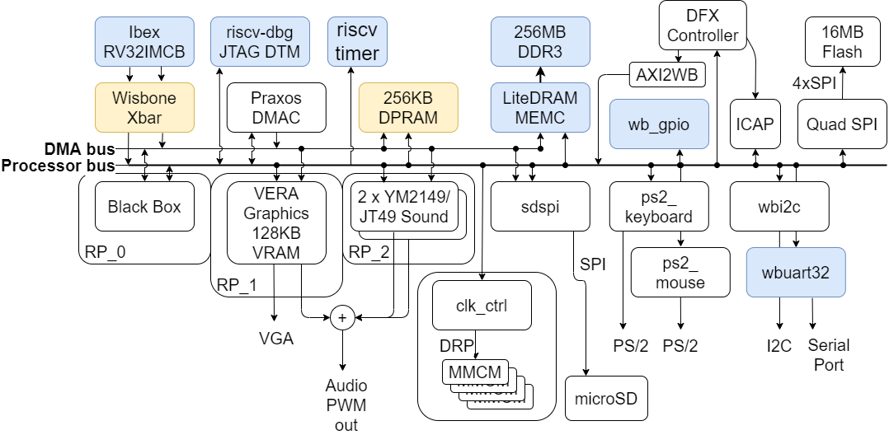
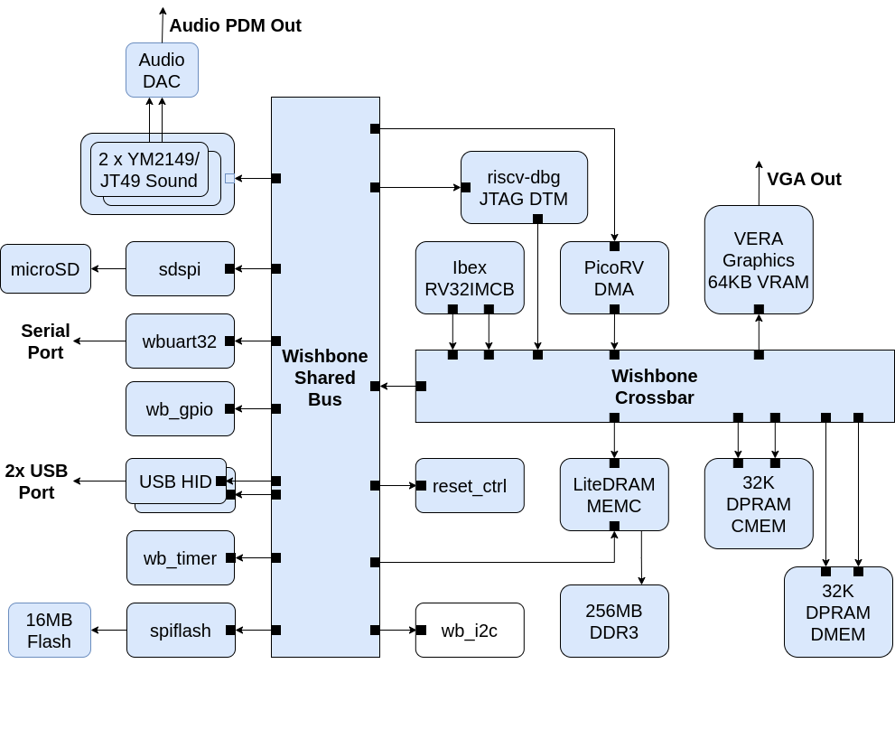

Architecture
------------

### The Arty A7-100T Configuration

*BoxLambda Draft Architecture Block Diagram for Arty A7-100T.*

This is an architecture diagram showing the Arty A7-100T configuration. Further down, I'll show the Arty A7-35T configuration.

#### Internal RAM

The system is configured with 256KB of Dual-Port RAM (DPRAM) and 128KB of Video RAM (inside the VERA module). The A7-100T has 607KB of Block RAM in total, so more than enough Block RAM should be left over for other purposes, e.g. for the *Black Box Module* (see below).

The CPU has memory-mapped access to DPRAM. As long as no other Bus Masters are competing for access to the same bus, instructions executing from DPRAM will have a fixed cycle count.

#### DMA Bus and Processor Bus

The DPRAM is hooked up to two system buses: a **DMA bus** and a **Processor bus**. Bus masters (currently only CPU and DMAC) have access to both buses as well, but the intent is that the DMA Controller uses the DMA bus for MEMC<->DPRAM transfers and the CPU uses the processor bus for DPRAM access. This intent is not hardwired into the system, however. The DMA Controller can set up transfers over the processor bus, and the processor can access external memory over the DMA bus. The two system buses are there to give bus masters some flexibility to stay out of each other's way.

Note that, besides access to external and internal memory, the DMA Controller also has access to VERA, the sound cores, and the SD SPI module via the DMA bus.

Both the Processor Bus and the DMA bus are 32-bit pipelined mode Wishbone buses.

#### The Interconnect

A bus on a block diagram is just a line connecting blocks. In reality, the *Interconnect* consists of Cross Bars, Arbiters, Address Decoders, and Bridges. I will follow up with an architecture diagram showing the BoxLambda Interconnect details. 

To build the Interconnect, I will make use of the components contributed by the gentlemen below:

- **Alexforencich** published a collection of components that can be used to build an Interconnect: [https://github.com/alexforencich/verilog-wishbone/](https://github.com/alexforencich/verilog-wishbone/)
- **ZipCPU** did the same. His components are well-documented, including cross-references with insightful articles on the ZipCPU website: [https://github.com/ZipCPU/wb2axip](https://github.com/ZipCPU/wb2axip)

#### The Black Box, and other Reconfigurable Partitions

The Black Box Partition is an empty area in the FPGA's floorplan. This is where you can insert your application-specific logic. Do you need hardware-assisted collision detection for your Bullet-Hell Shoot'em Up game? Put it in the Black Box. A DSP? A CORDIC core? More RAM? As long as it fits the floor plan, you can put it in the Black Box region. The Black Box has bus master and slave ports on both system buses.

Notice that the Black Box sits inside RP\_0, Reconfigurable Partition 0. A **Reconfigurable Partition** is a region on the FPGA where you can dynamically load a **Reconfigurable Module** (RM) into. Going back to the previous examples, the collision detector, DSP, CORDIC core, or RAM module, would be Reconfigurable Modules. You can live-load one of them into RP\_0. 

VERA and the two YM2149 cores are also placed into their specific Reconfigurable Partitions (RP\_1 resp. RP\_2), so you can swap those out for a different graphics and/or sound controller.

The CPU, DMAC, MEMC, and I/O peripheral blocks are all part of the so-called *Static Design*. These can't be swapped out for other logic on a live system. Any changes in these blocks require an update of the **Full Configuration Bitstream** (as opposed to a **Partial Configuration Bitstream** containing a Reconfigurable Module).

Reconfigurable Modules require a reconfigurable clocking strategy. That's the role of the *Clock Control* (clk_ctrl) module. The BoxLambda Clocking Strategy is a topic for a future post.

#### External Memory Access

The Memory Controller is equipped with three Wishbone ports:

- a Control Port, attached to the Processor Bus.
- a User Port, attached to the Processor Bus.
- another User Ports, attached to the DMA Bus.

Note that the CPU has memory-mapped access to DDR memory and can execute code directly from DDR memory. DDR memory access is not fully deterministic, however. CPU instructions executing from DDR will not have a fixed cycle count.

### The Arty A7-35T Configuration

*BoxLambda Draft Architecture Block Diagram for Arty A7-35T.*

This architecture diagram shows the Arty A7-35T configuration.

DFX is not supported on the A7-35T. Neither is the Hierarchical Design Flow. This means we have to stick to a monolithic design. The RTL for all components is combined into one single design, which is synthesized, implemented, and turned into a single bitstream. There is still room for RTL experimentation in this build, but you won't be able to live-load it. It's going to require an update of the Full Configuration Bitstream.

The A7-35T FPGA has much less Block RAM than the A7-100T. As a result, the amount of video RAM and the amount of DPRAM have been reduced to 64KB. 

All other components are the same as in the Arty A7-100T Configuration.

### Example Software Usage Model

BoxLambda users can make up their minds on how they want to set up this system. Here's one possible software configuration:

- *Deterministic* and/or Time-Critical CPU code and data reside in DPRAM.
- Non-Time-Critical code and data reside in DDR memory.
- The CPU accesses DPRAM, DDR memory, and hardware blocks via the Processor Bus.
- DMA activity, if any, passes over the DMA bus.

