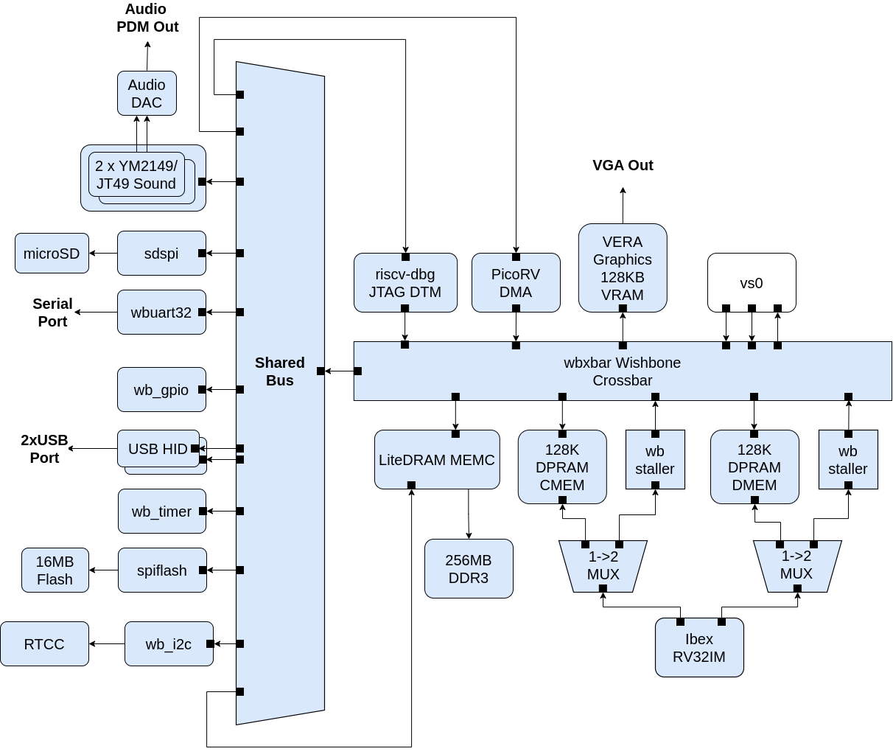
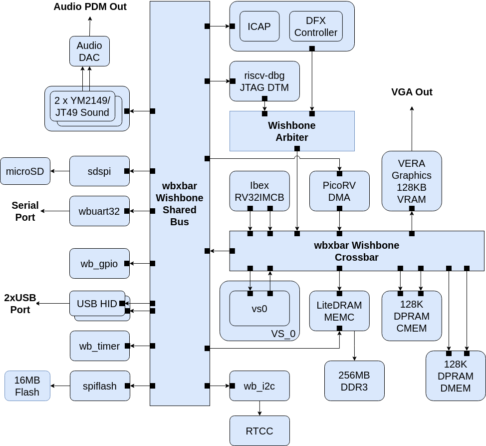

---
hide:
  - toc
---

# Architecture

## Base Configuration

*BoxLambda Base Configuration Block Diagram.*

This diagram illustrates the base configuration without DFX support. Further down, I will present the extended configuration with DFX support.

### Internal RAM

The system is equipped with two 128 KB Dual-Port RAMs (DPRAMs). Additionally, the VERA module includes 128 KB of Video RAM.

The Dual-Port RAMs, combined with the Crossbar Interconnect (see [below](#the-crossbar-interconnect)), ensure that the DMA controller can access the RAMs without stalling the CPU. Instructions executed from the DPRAM should have a fixed cycle count.

Two Dual-Port RAMs are used instead of one, enabling a **Harvard Architecture**, i.e., separate RAMs and associated signal paths for instructions and data. The DPRAM named CMEM holds CPU instructions, while DMEM contains data.

### The CPU

The CPU is an Ibex RISCV32 processor. It has separate Instruction and Data ports, supporting a Harvard Architecture.

### The Interconnect

The interconnect fabric is a 32-bit pipelined, Wishbone-based structure consisting of both a Crossbar and Shared Bus.

#### The Crossbar Interconnect

The bus masters and RAMs (including VERA graphics and the LiteDRAM external memory controller) are connected to a Crossbar Interconnect. The Crossbar Interconnect dynamically establishes and maintainsmultiple channels between bus masters and slaves. It can accept transactions from multiple bus masters simultaneously, as long as they don't target the same slave port. For example, the CPU can access external memory while the DMA controller simultaneously transfers data from internal memory to VERA, without interference.

*Crossbar Interconnect Example.*

#### The Shared Bus

A large crossbar interconnect consumes substantial FPGA resources. The fabric size grows quadratically with the number of bus master and slave pairs connected to it. In contrast, a shared bus grows linearly with the number of bus masters and slaves attached. However, a shared bus allows only one bus master at a time, causing stalling if multiple bus masters are active. To mitigate this, the *slower* slaves are placed on a shared bus, which is then connected to the crossbar interconnect linking the *faster* slaves (such as memories) and bus masters.

### The VS0 Black Box

VS0 is a component with two bus master ports, one bus slave port, an interrupt vector input, and an interrupt line output. No further details are specified about this module. Different BoxLambda variants may implement this in different ways. It might be a stack processor, or a DSP, or it might be left unused.

In the Base Configuration, VS0 is part of the Static Design, meaning a specific VS0 component is selected at build time. In the Extended Configuration (discussed below) VS0 can be dynamically loaded at runtime.

### External Memory Access

The Memory Controller is equipped with two Wishbone ports:

- A Control Port, attached to the Shared Bus.
- A User Port, attached to the Crossbar.

The CPU has memory-mapped access to DDR memory and can execute code directly from it. However, DDR memory access is not fully deterministic, so CPU instructions executed from DDR do not have a fixed cycle count.

## DFX Configuration

*BoxLambda DFX Configuration Block Diagram.*

This diagram shows the Dynamic Function Exchange (DFX) configuration. DFX, also known as Partial FPGA Reconfiguration, allows dynamic logic updates.

In this configuration, **VS0** is an "empty" area in the FPGA's floor plan where you can insert your application-specific logic. For example, if you need hardware-assisted collision detection for your Bullet-Hell shoot'em up game, you can place it in VS0. A DSP? A CORDIC core? As long as it fits, you can put it in the VS0 partition.

VS0 is a **Reconfigurable Partition**, a region in the FPGA into which you can dynamically load a **Reconfigurable Module** (RM). Returning to the previous examples, the collision detector, DSP, CORDIC core, or RAM module would be Reconfigurable Modules. You can dynamically load one of these into the VS0 partition.

Everything besides VS0 is part of the so-called *Static Design*. Logic wthin the Static Design cannot be dynamically replaced. Any modifications in the Static Design require an update to the **Full Configuration Bitstream**, whereas a **Partial Configuration Bitstream** is used solely for Reconfigurable Modules.

The DFX Configuration requires a DFX Controller, and VS0 is set up as a Reconfigurable Partition. All other components remain the same as in the Base Configuration.

I make a distinction between the Base and DFX Configurations because DFX is a Xilinx-AMD-specific feature that requires Xilinx-AMD-specific IP. The Base Configuration does not depend on this, making it easier to target other toolchains (e.g. Verilator) and FPGA devices.
