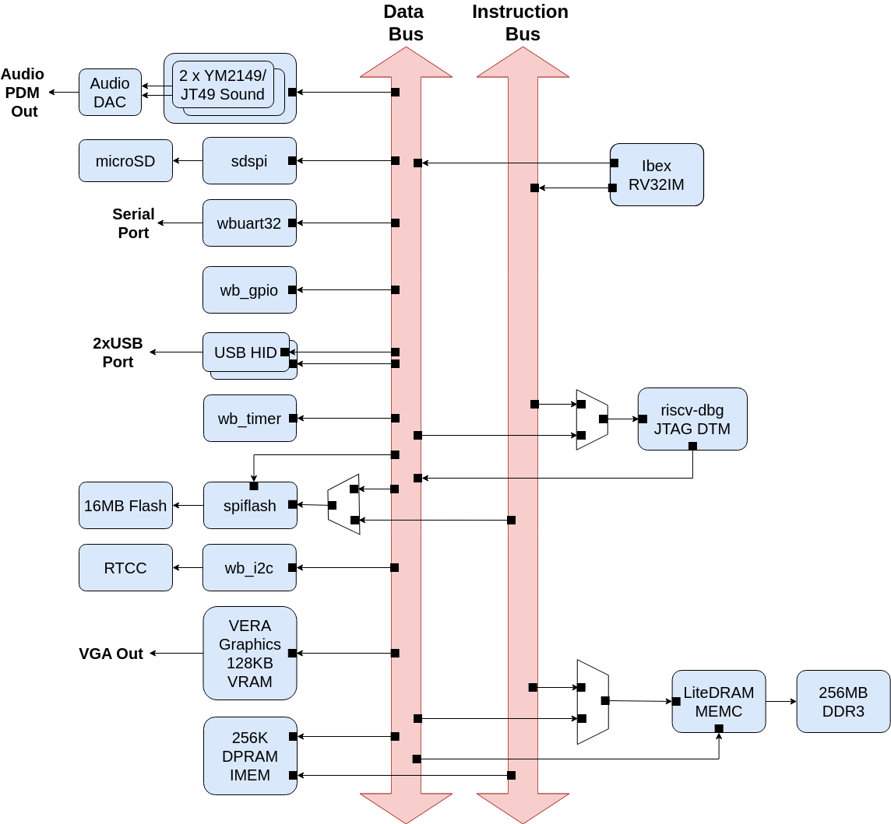
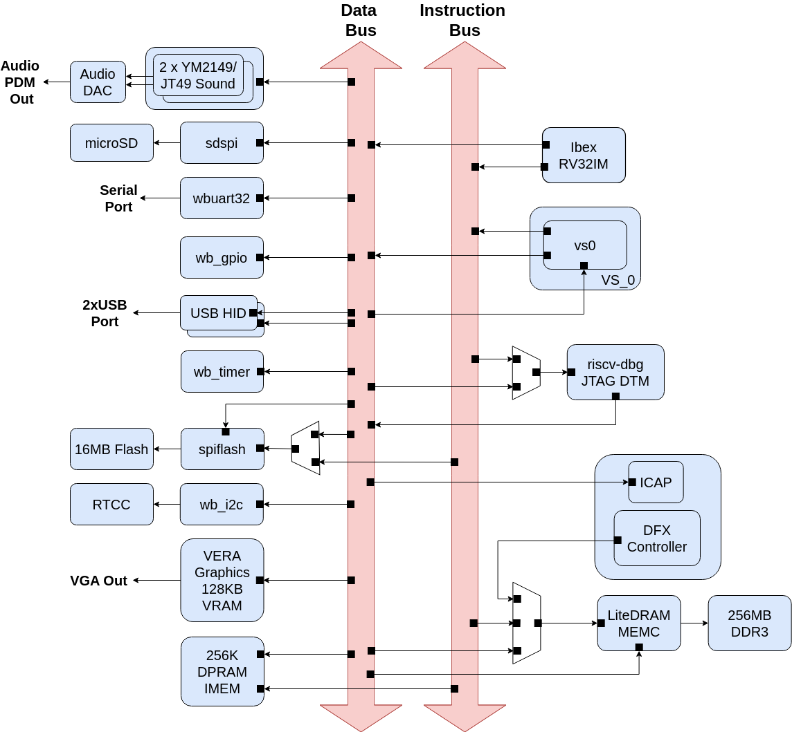

---
hide:
  - toc
---

# Architecture

## Base Configuration

*BoxLambda Base Configuration Block Diagram.*

This diagram illustrates the base configuration without DFX support. Further down, I will present the extended configuration with DFX support.

### Internal RAM

The system is equipped with a 256 KB Dual-Port RAM (IMEM). Additionally, the VERA module includes 128 KB of Video RAM.

### The CPU

The CPU is an Ibex RISCV32 processor. It has separate Instruction and Data ports, connected to an Instruction and Data Bus respectively, enabling a Harvard Architecture.

### The Interconnect

The interconnect consists of two 32-bit Wishbone buses. One bus is used exclusively for instruction fetching, the other one for data access.

### External Memory Access

The Memory Controller is equipped with two Wishbone ports:

- A Control Port, attached to the Data Bus.
- A User Port, attached to both the Instruction and the Data Bus.

The CPU has memory-mapped access to DDR memory and can execute code directly from it. However, DDR memory access is not fully deterministic. CPU instructions executed from DDR or instructions loading/storing data from/to DDR do not have a fixed cycle count.

## DFX Configuration

*BoxLambda DFX Configuration Block Diagram.*

This diagram shows the Dynamic Function Exchange (DFX) configuration. DFX, also known as Partial FPGA Reconfiguration, allows dynamic logic updates.

In this configuration, **VS0** is an "empty" area in the FPGA's floor plan where you can insert your application-specific logic. For example, if you need hardware-assisted collision detection for your Bullet-Hell shoot'em up game, you can place it in VS0. A DSP? A CORDIC core? As long as it fits, you can put it in the VS0 partition.

VS0 is a **Reconfigurable Partition**, a region in the FPGA into which you can dynamically load a **Reconfigurable Module** (RM). Returning to the previous examples, the collision detector, DSP, CORDIC core, or RAM module would be Reconfigurable Modules. You can dynamically load one of these into the VS0 partition.

Everything besides VS0 is part of the so-called *Static Design*. Logic wthin the Static Design cannot be dynamically replaced. Any modifications in the Static Design require an update to the **Full Configuration Bitstream**, whereas a **Partial Configuration Bitstream** is used solely for Reconfigurable Modules.

The DFX Configuration requires a DFX Controller, and VS0 is set up as a Reconfigurable Partition. All other components remain the same as in the Base Configuration.

I make a distinction between the Base and DFX Configurations because DFX is a Xilinx-AMD-specific feature that requires Xilinx-AMD-specific IP. The Base Configuration does not depend on the DFX feature, making it easier to target other toolchains (e.g. Verilator) and FPGA devices.

