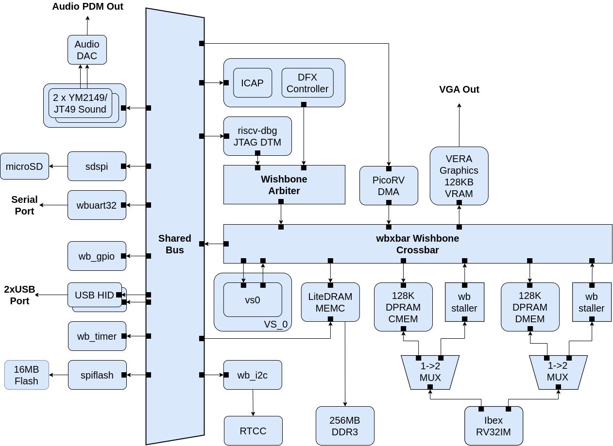

Architecture
------------

### The Base Configuration

*BoxLambda Base Configuration Block Diagram.*

This diagram shows the base configuration, without DFX support. Further down, I'll show the extended configuration with DFX support.

#### Internal RAM

The system is equipped with two Dual-Port RAMs (DPRAMs), 128 KB each. Additionally, the VERA module includes 128 KB of Video RAM. 

The Dual-Port RAMs combined with the Crossbar Interconnect (see [below](#the-crossbar-interconnect)) ensure that the DMA controller can access the RAMs without stalling the CPU. Instructions executing from DPRAM should have a fixed cycle count.

Two Dual-Port RAMs are used instead of one to allow a **Harvard Architecture**, i.e. separate RAMs and associated signal paths for instructions and data. The DPRAM called CMEM holds CPU instructions, DMEM contains data. 

#### The CPU

The CPU is an Ibex RISCV32 processor. It has separate Instruction and Data ports, supporting a Harvard Architecture.

#### The Interconnect

The Interconnect fabric is 32-bit pipelined Wishbone-based and consists of a Crossbar and Shared Bus combination.

###### The Crossbar Interconnect

The bus masters and RAMs (including VERA graphics and LiteDRAM external memory controller) are connected to a Crossbar Interconnect. A Crossbar Interconnect creates on-demand channels between bus masters and slaves and can maintain multiple such channels. A Crossbar Interconnect can accept transactions from multiple bus masters simultaneously, as long as they don't target the same slave port. E.g. without getting in each other's way, the CPU can access internal memory while the DMA controller moves data from external memory to VERA.

*Crossbar Interconnect Example.*

###### The Shared Bus

A big crossbar interconnect takes up a lot of FPGA resources. The fabric size grows with the square of the number of bus master and slave pairs attached to it. A shared bus, on the other hand, grows linearly with the number of bus masters and slaves attached to it. A disadvantage of a shared bus, however, is that only one bus master at a time can access the bus. Multiple bus masters on a shared bus will be stalling each other. As a compromise, I put the *slow* slaves on a shared bus and attached that bus to the crossbar interconnect consisting of the bus masters and *fast* slaves (read: memories).

#### The VS0 Black Box

VS0 is a component with two Bus Master ports, one Bus Slave port, an interrupt vector input, and an interrupt line output. Nothing else is specified about this module. Different BoxLambda variants may fill this in in different ways. It might be a stack processor, or a DSP, or it might be left unused.

In the Base Configuration, VS0 is part of the Static Design, i.e. a particular VS0 component is selected at built-time. In the Extended Configuration, discussed below, VS0 can be dynamically loaded at run-time.

#### External Memory Access

The Memory Controller is equipped with two Wishbone ports:

- a Control Port, attached to the Shared Bus.
- a User Port, attached to the Crossbar.

The CPU has memory-mapped access to DDR memory and can execute code directly from DDR memory. DDR memory access is not fully deterministic, however. CPU instructions executing from DDR will not have a fixed cycle count.

### The DFX Configuration

*BoxLambda DFX Configuration Block Diagram.*

This diagram shows the Dynamic Function Exchange (DFX) configuration. DFX is also known as Partial FGPA Reconfiguration.

In this configuration, **VS0** is an 'empty' area in the FPGA's floorplan. This is where you can insert your application-specific logic. Do you need hardware-assisted collision detection for your Bullet-Hell Shoot'em Up game? Put it in VS0. A DSP? A CORDIC core?  As long as it fits, you can put it in the VS0 partition.

VS0 is a **Reconfigurable Partition**, a region on the FPGA where you can dynamically load a **Reconfigurable Module** (RM) into. Going back to the previous examples, the collision detector, DSP, CORDIC core, or RAM module, would be Reconfigurable Modules. You can dynamically load one of them into the VS0 partition. 

Everything besides VS0 is part of the so-called *Static Design*. Logic in the Static Design can't be dynamically swapped out for other logic. Any changes in the Static Design require an update of the **Full Configuration Bitstream** (as opposed to a **Partial Configuration Bitstream** containing a Reconfigurable Module).

The DFX Configuration requries a DFX Controller and has VS0 set up as a Reconfiguranle Partition. All other components are the same as in the Base Configuration.

I make a distinction between the Base and DFX Configuration because DFX is a Xilinx-AMD specific feature, requiring Xilinx-AMD specific IP. The Base Configuration doesn't have this dependency which makes it easier to target other toolchains (e.g. Verilator) and FPGA devices.

