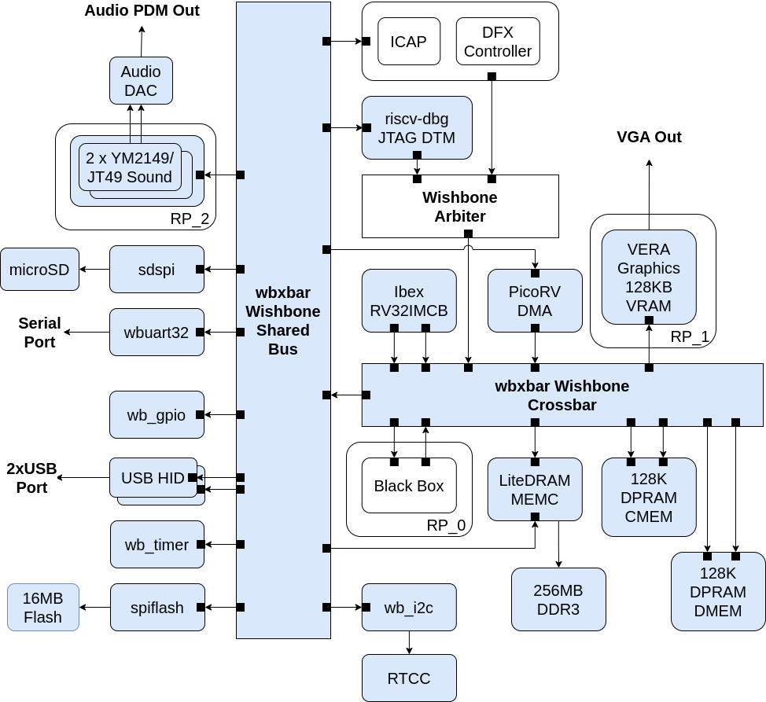
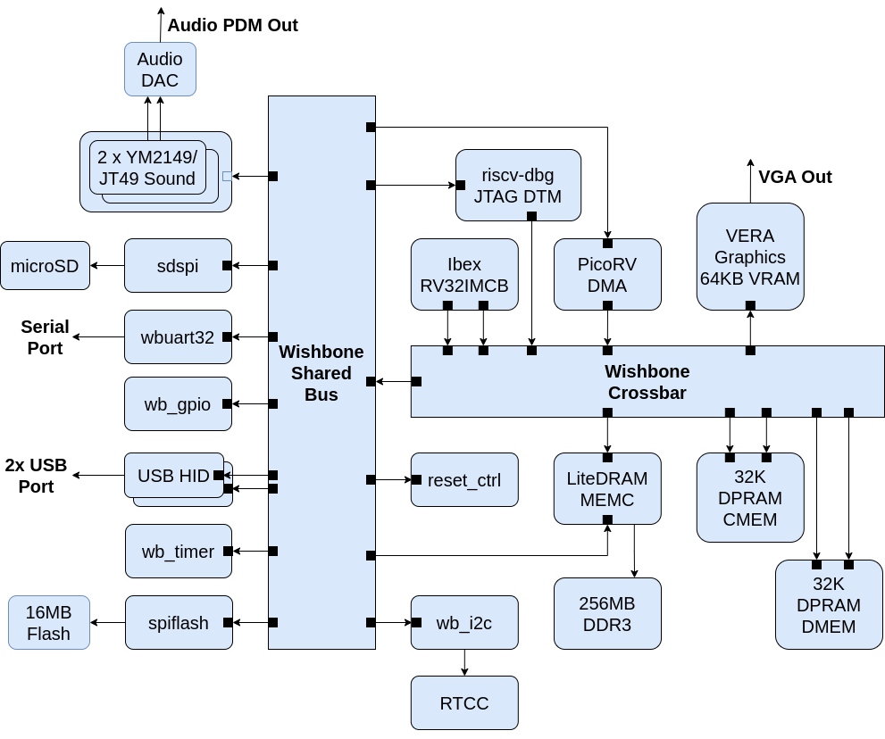

Architecture
------------

### The Arty A7-100T Configuration

*BoxLambda Architecture Block Diagram for Arty A7-100T.*

This diagram shows the Arty A7-100T configuration. Further down, I'll show the Arty A7-35T configuration.

#### Internal RAM

The system is equipped with two Dual-Port RAMs (DPRAMs), 128 KB each. Additionally, the VERA module includes 128 KB of Video RAM. 

The Dual-Port RAMs combined with the Crossbar Interconnect (see [below](#the-crossbar-interconnect)) ensure that the DMA controller can access the RAMs without stalling the CPU. Instructions executing from DPRAM should have a fixed cycle count.

Two Dual-Port RAMs are used instead of one to allow a **Harvard Architecture**, i.e. separate RAMs and associated signal paths for instructions and data. The DPRAM called CMEM holds CPU instructions, DMEM contains data. 

#### The CPU

The CPU is an Ibex RISCV32 processor. It has separate Instruction and Data ports, supporting a Harvard Architecture.

#### The Interconnect

The Interconnect fabric is 32-bit pipelined Wishbone-based and consists of a Crossbar and Shared Bus combination.

###### The Crossbar Interconnect

The bus masters and RAMs (including VERA graphics and LiteDRAM external memory controller) are connected to a Crossbar Interconnect. A Crossbar Interconnect creates on-demand channels between bus masters and slaves and can maintain multiple such channels. A Crossbar Interconnect can accept transactions from multiple bus masters simultaneously, as long as they don't target the same slave port. E.g. without getting in each other's way, the CPU can access internal memory while the DMA controller moves data from external memory to VERA.

*Crossbar Interconnect Example.*

###### The Shared Bus

A big crossbar interconnect takes up a lot of FPGA resources. The fabric size grows with the square of the number of bus master and slave pairs attached to it. A shared bus, on the other hand, grows linearly with the number of bus masters and slaves attached to it. A disadvantage of a shared bus, however, is that only one bus master at a time can access the bus. Multiple bus masters on a shared bus will be stalling each other. As a compromise, I put the *slow* slaves on a shared bus and attached that bus to the crossbar interconnect consisting of the bus masters and *fast* slaves (read: memories).

#### The Black Box, and Other Reconfigurable Partitions

The Black Box Partition is an empty area in the FPGA's floorplan. This is where you can insert your application-specific logic. Do you need hardware-assisted collision detection for your Bullet-Hell Shoot'em Up game? Put it in the Black Box. A DSP? A CORDIC core? More RAM? As long as it fits the floor plan, you can put it in the Black Box region.

Notice that the Black Box sits inside RP\_0, Reconfigurable Partition 0. A **Reconfigurable Partition** is a region on the FPGA where you can dynamically load a **Reconfigurable Module** (RM) into. Going back to the previous examples, the collision detector, DSP, CORDIC core, or RAM module, would be Reconfigurable Modules. You can live-load one of them into RP\_0. 

VERA and the two YM2149 cores are also placed into their specific Reconfigurable Partitions (RP\_1 resp. RP\_2), so you can swap those out for a different graphics and/or sound controller.

The CPU, DMAC, MEMC, and I/O peripheral blocks are all part of the so-called *Static Design*. These can't be swapped out for other logic on a live system. Any changes in these blocks require an update of the **Full Configuration Bitstream** (as opposed to a **Partial Configuration Bitstream** containing a Reconfigurable Module).

Reconfigurable Modules require a reconfigurable clocking strategy. That's the role of the *Clock Control* (clk_ctrl) module. The BoxLambda Clocking Strategy is a topic for a future post.

#### External Memory Access

The Memory Controller is equipped with two Wishbone ports:

- a Control Port, attached to the Shared Bus.
- a User Port, attached to the Crossbar.

The CPU has memory-mapped access to DDR memory and can execute code directly from DDR memory. DDR memory access is not fully deterministic, however. CPU instructions executing from DDR will not have a fixed cycle count.

### The Arty A7-35T Configuration

*BoxLambda Architecture Block Diagram for Arty A7-35T.*

This architecture diagram shows the Arty A7-35T configuration.

DFX is not supported on the A7-35T. Neither is the Hierarchical Design Flow. This means we have to stick to a monolithic design. The RTL for all components is combined into one single design, which is synthesized, implemented, and turned into a single bitstream. There is still room for RTL experimentation in this build, but you won't be able to live-load it. It's going to require an update of the Full Configuration Bitstream.

The A7-35T FPGA has much less Block RAM than the A7-100T. As a result, the amount of video RAM has been reduced to 64 KB, and the two Dual Port RAMs are reduced to 32 KB each. 

All other components are the same as in the Arty A7-100T Configuration.

