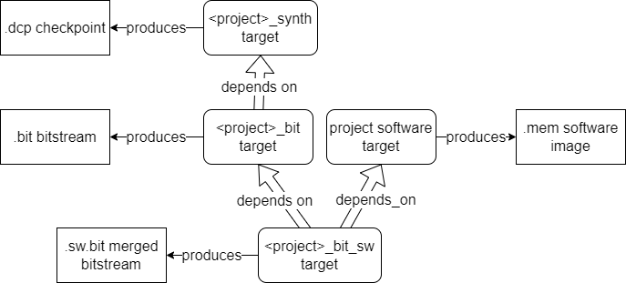
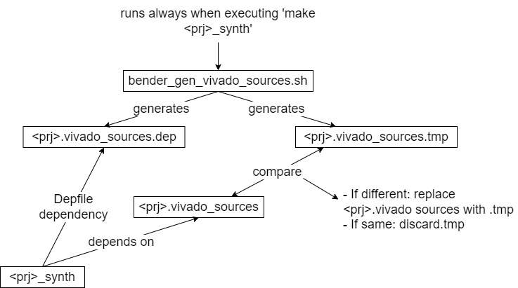

Build System and Directory Layout
=================================
The Directory Structure
-----------------------
```
<BoxLambda Root Directory>
├── boxlambda_setup.sh
├── CMakeLists.txt
├── cmake/
│   └── <CMake modules>
├── sub/
│   └── <git submodules>
├── gw/
│   ├── CMakeLists.txt
│   ├── components/
│   │   ├── CMakeLists.txt
│   │   ├── wbuart32/
│   │   │   ├── rtl/
│   │   │   ├── CMakeLists.txt
│   │   │   └── Bender.yml
│   │   └── <other gw component directories>
│   └── projects/
│       ├── CMakeLists.txt
│       ├── ddr_test/
│       │   ├── constr/
│       │   ├── rtl/
│       │   ├── sim/
│       │   ├── CMakeLists.txt
│       │   └── Bender.yml
│       └── <other gw project directories>
├── sw/
│   ├── CMakeLists.txt
│   ├── components/
│   │   ├── CMakeLists.txt
│   │   └── <sw component directories>
│   └── projects/
│       ├── CMakeLists.txt
│       ├── ddr_test/
│       │   ├── CMakeLists.txt
│       │   └── <ddr_test sources>
│       └── <other sw project directories>
└── build/
    ├── sim-a7-35/
    ├── sim-a7-100/	
    ├── arty-a7-35/	
    └── arty-a7-100/

```
Note that the software tree (*sw/*) is separate from the gateware tree (*gw/*) and the build trees (*build/*) are separate from the sw and gw source trees. 
  
The build trees are CMake build trees generated by the *boxlambda_setup.sh* script. The script generates four build trees:

- **sim-a7-35**: Arty-A7-35T simulation build tree.
- **sim-a7-100**: Arty-A7-100T simulation build tree.
- **arty-a7-35**: Arty-A7-35T FPGA build tree.
- **arty-a7-100**: Arty-A7-100T FPGA build tree.
  
The build trees are not under version control.

The Gateware Build Structure
----------------------------
### Bender

The build system is CMake based but relies on Bender for gateware package dependency Management:

[https://github.com/pulp-platform/bender](https://github.com/pulp-platform/bender)

Central to Bender is the package manifest *bender.yml*. In the manifest, you specify the HDL sources that make up the package, dependencies, include paths, targets (e.g. synth, sim), and associated *defines*.
A package directory is a directory containing a bender.yml file. When you run bender in that directory, you can ask it to generate a flat list of all the sources from the current package, and the packages it depends on. Optionally, it can generate that list, plus any *defines* associated with a given target, as a Tcl script. This makes integration with Vivado very easy.


*Project View of the Build System*

#### Bender Targets

Currently, the build system uses the following Bender targets:

- ***module_name***: set when building a component separately (OOC)

```
  - target: ibex_wb_core
    files:
      - rtl/ibex_wb_core_wrapper.sv    
```

- **vivado**: set when synthesizing using Vivado.
- **verilator**: set when building Verilator simulation model.
- **constraints**: set when retrieving *.xdc* constraints files for this component or project.
- **memory**: set when retrieving *.mem memory files for this component or project.

### Three Layers

The gateware system has three layers:

1. **The Project Layer (top)**: *Hello World* is an example project. A project is the top layer of the build system. The bender.yml manifest contains the top-level files of an SoC build, the project's *.xdc* constraints file, memory files used by the SoC, and a list of *components* the project depends on. 
2. **The Component Layer (middle)**: Components are the middle layer of the build system. They are the building blocks of an SoC. A component's sources, *defines*, and dependencies are defined in a bender.yml manifest. A component gets its HDL sources from its *rtl/* subdirectory and/or *sub/*, the submodule layer. I'm considering each Wishbone Bus Master or Slave a component.
3. **The Submodule Layer (bottom)**: Submodules are the bottom layer of the build system. They are the Git Submodules that BoxLambda is referencing, as [discussed previously](https://epsilon537.github.io/boxlambda/git-workflow-and-setup/).

### Building Gateware

Assuming all [Prerequisites](prerequisites.md) are installed, navigate to the build tree of choice and type:

```
make <gw component or project name><action>
```
where *action* is one of the following:

- **_lint**: Lint-check the given gateware component or project.
    - Depends on: gateware sources.
    - Build tree: *sim-a7-\** build trees. Gateware component and project directories.
- **_sim**: Build the Verilator simulation model (*Vmodel*) of the given gateware project. Note that only the gateware is built, not the SW project running on top of this gateware. See the *_sim_sw* target below. 
    - Depends on: gareware sources.
    - Build tree: *sim-a7-\** build trees. Gateware projects directories only.
- **_sim_sw**: Build the Verilator simulation model (*Vmodel*) of the given gateware project as well as the associated software project. The SW image memory file is copied into its proper place in the gateware build directory so it gets picked when the Verilator model executes. 
    - Depends on: *sim* target above and the software target. 
    - Build tree: *sim-a7-\** build trees. Gateware project directories only. 
- **_synth**: Synthesize the given gateware component or project. This action only exists in the *arty-a7-\** build trees. When you run the synth action on a component, Out-Of-Context (OOC) synthesis is performed. The component's input and output ports aren't hooked up to anything.
    - Depends on: gateware sources and constraints.
    - Build tree: *arty-a7-\** build trees. Gateware component and project directories.
- **_bit**: Implement the given gateware project and generate its bitstream. Note that only the gateware is built, not the SW project running on top of this gateware. The internal memory reserved for the SW program will be left empty. See the *bit_sw* action below. 
    - Depends on: *_synth* target above
    - Build tree: *arty-a7-\** build trees. Gateware project directories only.
- **_bit_sw**: Build the give gateware project as well as the associated software project. The generated SW image memory file is merged into the FPGA bitstream file. See [UpdateMem and XPM Memories](#updatemem-and-xpm-memories).
    - Depends on: *_bit* target above and on the software target associated with the gateware project. 
    - Build tree: *arty-a7-\** build trees. Gateware project directories only.
- **_load**: Load the gateware project's bitstream file onto the connected target.
    - Depends on: no dependencies. 
    - Build tree: *arty-a7-\** build trees. Gateware project directories only.
  
Some examples:
```
cd <boxlambda_root_dir>/build/sim-a7-35 && make ddr_test_sim_sw
```
```
cd <boxlambda_root_dir>/build/arty-a7-35 && make hello_world_synth
```
```
cd <boxlambda_root_dir>/build/arty-a7-100 && make hello_dbg_bit_sw && make hello_dbg_load
```

The build directory tree mimics the source tree. When a build has been completed, a gateware project's Verilator model or the Vivado project files can be found under that project's directory. E.g.:
```
$ cd build/arty-a7-35/gw/projects/hello_world
$ make hello_world_synth
...
$ ls
CMakeFiles           hello_world.constraints_file_list  project.cache          project.runs    syn_util.rpt
CTestTestfile.cmake  hello_world.mem_file_list          project.dep            project.xpr
Makefile             hello_world.vivado_sources         project.hw             spram.mem
cmake_install.cmake  hello_world.vivado_sources.dep     project.ip_user_files  syn_timing.rpt
```

#### UpdateMem and XPM Memories

A change in the contents of a *.mem* file does not require full FPGA resynthesis and reimplementation. The memory contents exist somewhere in the FPGA bitstream file. With the tool **UpdateMEM**, Vivado provides a way to merge new memory contents into the bitstream file, post-implementation. There is a catch, however. *UpdateMEM* works with memories implemented using Xilinx **XPM** macros.

When Vivado implements an XPM memory such as *xpm_memory_spram*, a so-called **MMI** file, or **Memory Map Information** file is generated. An MMI file describes how individual block RAMs make up a contiguous logical data space. The *UpdateMem* tool needs this information to determine the locations in the bitstream file to update.


*Merging a .mem file into a Bitstream File.*

*UpdateMem* also requires the instance path of the embedded processor associated with the memory in question. In case of BoxLambda, this path is:

```
wb_spram/xpm_memory_spram_inst/xpm_memory_base_inst
```

As an aside, the easiest way to determine this processor path is by running *UpdateMem* with a dummy path. *UpdateMem* will then suggest a path:

```
$ updatemem -bit ibex_soc.bit -meminfo ibex_soc.mmi -data spram.mem -proc i_dont_know -out ibex_soc.out.bit

****** updatemem v2023.1 (64-bit)
...
source /tools/Xilinx/Vivado/2023.1/scripts/updatemem/main.tcl -notrace
Command: update_mem -meminfo ibex_soc.mmi -data spram.mem -proc i_dont_know -bit ibex_soc.bit -out ibex_soc.out.bit
0 Infos, 0 Warnings, 0 Critical Warnings and 1 Errors encountered.
update_mem failed
ERROR: [Updatemem 57-85] Invalid processor specification of: i_dont_know. 
The known processors are: wb_spram/xpm_memory_spram_inst/xpm_memory_base_inst
```

#### What happens when you run *make hello_world_synth*



*Gateware Build Targets.*

When you run *make hello_world_synth*, the following happens:

1. Make determines if (re)synthesis is needed. If synthesis is up-to-date, no further action is taken.
1. Make runs a *bender script* command on the bender.yml file in the *gw/projects/hello_world/* directory. The *bender script* command is wrapped in the *scripts/bender_gen_vivado_source.sh* shell script.
2. The bender script command processes that bender.yml manifest, as well as the bender.yml manifests of any dependent components. 
3. The bender script command emits a list of all the HDL sources that make up the project.
4. Similarly, the *scripts/bender_gen_constraints_file_list.sh* and *scripts/bender_gen_mem_file_list.sh* emits the *.xdc* constraints and .mem memory file list for the project. 
5. Make feeds these file lists into a *vivado_create_project.tcl* script. 
6. The *vivado_create_project.tcl* script creates a Vivado project.
7. Make kicks off the *vivado_synth.tcl* script which opens the Vivado project and starts synthesis. The output of synthesis is a *.dcp* checkpoint file.

When you run *make hello_world_bit*, the following happens:

1. Make will first run the *hello_world_synth* rules because *hello_world_bit* depends on *hello_world_synth*. Make determines if FPGA (re)implementation and bitstream generation are needed. If the bitstream file is up-to-date, no further action is taken. 
2. Make kicks off the *vivado_impl.tcl* script which opens the Vivado project, picks up the synthesis checkpoint *.dcp* file and starts implementation.

When you run *make hello_world_bit_sw*, the following happens:

1. Make will run the *hello_world_bit* rule and the *hello_world* software build rule because *hello_world_bit_sw* depends on those. 
2. If there were any changes to the bitstream file or the software image, the latest software is merged into the latest bitstream file. See [UpdateMem and XPM Memories](#updatemem-and-xpm-memories).

### Verilator Lint Waivers

Rather than add lint waivers to the source code of git submodules, the waivers are grouped into *.vlt* files that live in the corresponding gateware component or project subdirectory. This way we avoid making unnecessary code changes in the git submodules.

For example 
[gw/components/ibex/lint.vlt](https://github.com/epsilon537/boxlambda/blob/master/gw/components/ibex/lint.vlt)

### Gateware Component/Project Directory Layout

A component or project directory typically contains the following files and subdirectories:

```
<component/project>
├── CMakeLists.txt
├── Bender.yml: The component/project Bender manifest.
├── lint.vlt: Lint waivers.
├── rtl
│   └── <Boxlambda specific RTL sources for given component/project>
└── sim
    └── <C++ test bench code for given component/source>
```

Building Software
-----------------
The software corresponding with a gateware project automatically gets compiled, converted to a memory file, and included in the gateware project as part of the build process (see gateware build rules **<project\>_bit_sw** and **<project\>_sim_sw**). Software projects can also be built independently. From the build directory just type: *make <sw project name\>*. For example:

```
$ cd sim-a7-100/sw/projects/hello_world/
$ make hello_world
...
$ ls
CMakeFiles           Makefile             hello_world      hello_world.map
CTestTestfile.cmake  cmake_install.cmake  hello_world.hex  hello_world.mem
```

Make All, Clean, and Regen
--------------------------
*make all* will lint check and build **bit_sw/sim_sw** all gateware projects.

*Make clean* in a build tree will remove all the generated files that the build system is aware of. The generated files the build system is not aware of, e.g. synthesis utilization report files, will not be removed, however. If you want to go back to a completely clean build tree, type *make regen* from the build directory. This command will completely remove and regenerate the build tree.

Creating additional build trees
-------------------------------
You can easily create additional build trees from the BoxLambda root directory with the following command:

```
cmake --preset=sim-a7-35|sim-a7-100|arty-a7-35|arty-a7-100 -B <build directory>
```

For example:

```
cmake --preset=sim-a7-100 -B build/sim-a7-100-2
```

The CMakeLists
--------------
The build system consists of a tree of *CMakeLists.txt* files: The top-level *CMakeLists.txt* adds the *gw/* and *sw/* subdirectories. The *CMakeLists.txt* files in those subdirectories add the *components/* and *projects/* subdirectories, etc., down to the individual GW and SW component and project directories.

### A Gateware Component CMakeList

The build instructions for a gateware component are grouped into one CMake function: **gw_component_rules()**. A GW component-level CMakeLists.txt file contains just a call to this function, passing in the expected parameters:

```
gw_component_rules(
    TOP_MODULE <top module name> 
    COMPONENT_NAME <component name> 
)
```

For example:

```
gw_component_rules(
    TOP_MODULE wb_wbuart_wrap_wrap 
    COMPONENT_NAME wbuart32 
)
```

The component's sources, definitions, and dependencies are still defined in its *bender.yml* manifest. The CMake build system interfaces with Bender through a set of scripts to extract the necessary info and pass it on to Vivado or Verilator.

### A Gateware Project CMakeList

The build instructions for a gateware project are also grouped into a CMake function: **gw_project_rules()**. This function has a few additional arguments compared to its component counterpart. A typical GW project CMakeLists.txt file looks like this:

```
gw_project_rules(
    TOP_MODULE <top module name>
    PROJECT_NAME <project name>
    MEM_FILE_TARGET <sw project name>
    VERILATOR_CPP_FLAGS <Verilator CPP flags, e.g. include paths>
    VERILATOR_LD_FLAGS <Verilator link flags, e.g. -lncurses>
)

#Add testcase.
add_test(NAME <test name>
    COMMAND <test command>
    WORKING_DIRECTORY ${CMAKE_CURRENT_BINARY_DIR}
)
```

For example:

```
gw_project_rules(
    TOP_MODULE ibex_soc
    PROJECT_NAME hello_world
    MEM_FILE_TARGET hello_world
    VERILATOR_CPP_FLAGS "-I${PROJECT_SOURCE_DIR}/sub/wbuart32/bench/cpp/"
    VERILATOR_LD_FLAGS "-lncurses"
)

add_test(NAME hello_world_test
    COMMAND ./Vmodel
    WORKING_DIRECTORY ${CMAKE_CURRENT_BINARY_DIR}
)
```

As is the case for GW components, the project's sources, definitions, dependencies, and constraint files are defined in its *bender.yml* manifest. The reference to the SW project delivering the memory file is *not* defined in the Bender manifest, however. The SW project name is passed in as the *MEM_FILE_TARGET* parameter in the *gw_project_rules()* call.

Any test cases are also added to the project's CMakeLists.txt file.

### Software Build Structure

CMake is designed to build software. The necessary functions for creating libraries, executables, etc. are predefined.
The only custom function added to the software CMakeLists tree is **link_internal_create_mem_file()**. This function implements the necessary instructions to link the given executable against the BoxLambda internal memory map and generate a memory file, to be used by the GW part of the build system.

The linker script to be executed is passed as an argument to the *link_internal_create_mem_file()* function. Currently, two linker scripts are defined:
- **/sw/components/bootstrap/link_internal_mem_64K.ld**: This is the linker script for an internal memory size of 64KB. This script results in a software image that can run both on the Arty-A7-35T and the Arty-A7-100T (FPGA and simulation).
- **/sw/components/bootstrap/link_internal_mem_256K.ld**: This is the linker script for an internal memory size of 256KB. This script results in a software image that only runs on the Arty-A7-100T (FPGA and simulation).

A typical SW project CMakeLists.txt file looks like this:

```
add_executable(hello_world
	EXCLUDE_FROM_ALL
    ../../../sub/ibex_wb/soc/fpga/arty-a7/sw/examples/hello/hello.c
	../../../sub/ibex_wb/soc/fpga/arty-a7/sw/libs/soc/gpio.c
	../../../sub/ibex_wb/soc/fpga/arty-a7/sw/libs/soc/utils.c
)

target_compile_options(hello_world
	PRIVATE -g)

link_internal_create_mem_file(hello_world ${PROJECT_SOURCE_DIR}/sw/components/bootstrap/link_internal_mem_64K.ld)
```

### Implementation


*CMakeLists Organization.*

The actual gateware build recipes (Bender interaction, verilating, synthesizing...) are implemented by a set of bash and tcl scripts kept in the [scripts/](https://github.com/epsilon537/boxlambda/tree/master/scripts) directory:

```
	bender_gen_constraints_file_list.sh
	bender_gen_verilator_sources.sh
	bender_gen_vivado_sources.sh
	bender_get_cpp_files.sh
	bender_get_vlts.sh
	gen_mem_file_list.sh
	prg_bitstream.tcl
	verilator_lint_check.sh
	verilator_sim.sh
	vivado_create_project.tcl
	vivado_impl.tcl
	vivado_synth.tcl
    vivado_updatemem.sh
```

Having the build recipes as scripts instead of CMake allows me to invoke and test them outside of the build system.

The CMake build instructions define the various targets and the relationships between them and invoke the above build scripts when needed. 

The CMake build definitions are located as close as possible to the part of the tree to which they apply, e.g. the *gw_project_rules()* function can be found in the [gw/projects/CMakeLists.txt](https://github.com/epsilon537/boxlambda/blob/master/gw/projects/CMakeLists.txt) file. *Gw_component_rules()* can be found in the [gw/components/CMakeLists.txt](https://github.com/epsilon537/boxlambda/blob/master/gw/components/CMakeLists.txt) file. Gateware build instructions common to both components and projects are located in the [gw/CMakeLists.txt](https://github.com/epsilon537/boxlambda/blob/master/gw/CMakeLists.txt) file.

### Cross-Compilation

RISC-V cross-compilation for C and C++ is set up by passing in a *toolchain file* to CMake. The toolchain file is located in [scripts/toolchain.cmake](https://github.com/epsilon537/boxlambda/blob/master/scripts/toolchain.cmake).

### Bender Interaction Hack

GNU Make, CMake's backend, uses the modification date of dependencies to decide if a build rule should be triggered, e.g. an object gets rebuilt when the corresponding source code has a more recent modification date than the object file itself. With Bender, however, a component's or project's *bender.yml* file is just the tip of a tree. The Bender target and package dependencies also have to be considered. Simply listing the bender.yml file as a dependency is not good enough. Instead, I'm using the Bender script output as a dependency:

1. The build system runs the *bender script* command.
2. The output of that command is stored in a temporary file. 
3. That file is compared with the Bender script output file used by the previous build of the same target. 
	- If it's different, the file is copied over, making it the Bender script output file to be used by the next build step. The Bender script output file is a dependency for synthesis, so synthesis will be triggered.
	- If the temporary file is the same as the Bender script output file used by the previous build of that target, the temporary file is discarded. Synthesis will not be triggered.

This mechanism is implemented in the [scripts/bender_gen_vivado_sources.sh](https://github.com/epsilon537/boxlambda/blob/master/scripts/bender_gen_vivado_sources.sh) and [scripts/bender_gen_verilator_sources.sh](https://github.com/epsilon537/boxlambda/blob/master/scripts/bender_gen_verilator_sources.sh) scripts. The same scripts also generate a *DepFile*: a dependency list of all the sources referenced in the Bender manifest. This DepFile is referenced by the synthesis target so synthesis (or verilation) will be triggered if any of the sources change.



*CMake and Bender Interaction.*

### *.Picoasm* - CMake Build Support for PicoRV Assembly Code

Although Ibex and PicoRV32 are both 32-bit RISC-V processors, the programming model for the two is very different. For Ibex, we build and run C/C++ code, and use the **riscv-unknown-elf-gcc** frontend for compilation and linking. For PicoRV, we write tiny assembly programs. We use **riscv-unknown-elf-as** for assembling and **riscv-unknown-elf-ld** for linking. Separate CMake toolchain variables are set up to build PicoRV code. This is done by creating an **ASM_PICO** assembler *dialect* as described in this article from Kitware:

[https://gitlab.kitware.com/cmake/community/-/wikis/doc/cmake/languages/Assembler](https://gitlab.kitware.com/cmake/community/-/wikis/doc/cmake/languages/Assembler)

The article tells you to create three files in the CMake modules directory (*cmake/* in the BoxLambda source tree). Here are the files I created for *ASM_PICO*:

[https://github.com/epsilon537/boxlambda/tree/master/cmake](https://github.com/epsilon537/boxlambda/tree/master/cmake)

A new filename extension is needed for PicoRV assembly files because CMake toolchain selection is done based on the filename extension. I decided to go for **.picoasm** for the source code and **.picobin** for the generated binaries.

*.Picoasm* assembly files use CPP as a preprocessor. CPP *#defines* allow the programmer to assign names to registers, making writing RISC-V assembly code more manageable:

```
#define hir_base x1
#define burst_base x2
#define msb_set x3
#define mask_4_lsb x4
#define src x5
#define dst x6
#define num_elems x7
#define burst_end x8
#define single_end x9
#define stat_busy x10
#define tmp x11
...
_start:
    /*Set up constants.*/
    li hir_base, HIR_REGS_BASE_ADDR
    li burst_base, BURST_REGS_BASE_ADDR
    sw zero, BURST_OFFSET(burst_base)    /*no src-to-dest alignment offset.*/
    li msb_set, 0x80000000
    li mask_4_lsb, 0xfffffff0            /*mask to clear 4 lsbs*/
    li stat_busy, STAT_BUSY
wait_start:
    lw tmp, HIR3(hir_base)               /*HIR3: ctrl-status*/
    beqz tmp, wait_start
...
```
