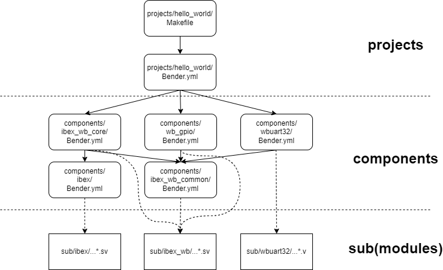

The Build System and Directory Layout
=====================================
The Build System
----------------
### Bender

The build system is makefile based but relies on Bender for dependency Management:

[https://github.com/pulp-platform/bender](https://github.com/pulp-platform/bender)

Central to Bender is the package manifest *bender.yml*. In the manifest, you specify the HDL sources that make up the package, dependencies, include paths, targets (e.g. synth, sim), and associated *defines*.
A package directory is a directory containing a bender.yml file. When you run bender in that directory, you can ask it to generate a flat list of all the sources from the current package, and the packages it depends on. Optionally, it can generate that list, plus any *defines* associated with a given target, as a Tcl script. This makes integration with Vivado very easy.



*Project View of the Build System*

### Three Layers

The build system has three layers:

1. **The Project Layer (top)**: *Hello World* is an example project. A project is the top layer of the build system. The bender.yml manifest contains the top-level files of an SoC build, the project's *.xdc* constraints file, memory files used by the SoC, and a list of *components* the project depends on. 
2. **The Component Layer (middle)**: Components are the middle layer of the build system. They are the building blocks of an SoC. A component's sources, *defines*, and dependencies are defined in a bender.yml manifest. A component gets its HDL sources from its *rtl/* subdirectory and/or from *sub/*, the submodule layer. I'm considering each Wishbone Bus Master or Slave a component.
3. **The Submodule Layer (bottom)**: Submodules are the bottom layer of the build system. They are the Git Submodules that BoxLambda is referencing, as [discussed previously](https://epsilon537.github.io/boxlambda/git-workflow-and-setup/).

The repository's directory structure reflects the three layers:

```
boxlambda
├── build_sys
├── projects
│   └── hello_world
├── components
│   ├── ibex
│   ├── ibex_wb_common
│   ├── ibex_wb_core
│   ├── wb_gpio
│   └── wbuart32
└── sub
    ├── ibex
    ├── ibex_wb
    └── wbuart32
```

### The Project Build Makefile

A project directory, such as *projects/hello_world/*, contains a Makefile, with the following build targets:

- **dryrun**: Generate a Vivado project, but don't build it.
- **synth**: Generate a Vivado project and synthesize it.
- **impl**: Generate a Vidado project, synthesize it, and implement it.
- **run**: Download the generated bitstream file to the target. setups.
- **clean**: Remove all generated files in the current directory and subdirectories.
- **lint**: Run Verilator lint checking on the project and all of its dependencies.
- **make sim**: Build the project's Verilator test bench.
- **make test**: Build the project's Verilator test bench, then run it in batch mode (non-interactive mode).
  
#### What happens when you run *make synth*

When you run *make synth*, the following happens:
1. Make runs a *bender script* command. 
2. The bender script command processes the current directory's package manifest (*bender.yml*), as well as the package manifests of any dependent components. 
3. The bender script command emits a list of all the HDL sources that make up the project. 
4. Make feeds this file list, along with a *.xdc* constraints file and any *.mem* memory files, into a *vivado.tcl* script. 
5. The vivado.tcl script generates a Vivado project file containing all the HDL sources, constraints, and memory files. 
6. The vivado.tcl script kicks off synthesis and generates timing and utilization reports when synthesis is complete.

When you run *make impl*, the same thing happens, but after completing synthesis, the vivado.tcl script proceeds to kick off implementation and bitstream generation.


*The Build System Files - arrows indicate information flow.*

The relevant files are linked below. To avoid repeating identical rules and variables across Makefiles, a *build_sys/common.mk* include file is created which contains all reusable Makefile logic.

- [build_sys/common.mk](https://github.com/epsilon537/boxlambda/blob/79a78e8425d80836294669aaa0efebf6b4cbdb99/build_sys/common.mk)
- [projects/hello_world/Makefile](https://github.com/epsilon537/boxlambda/blob/79a78e8425d80836294669aaa0efebf6b4cbdb99/projects/hello_world/Makefile)
- [projects/hello_world/Bender.yml](https://github.com/epsilon537/boxlambda/blob/79a78e8425d80836294669aaa0efebf6b4cbdb99/projects/hello_world/Bender.yml)
- [build_sys/vivado.tcl](https://github.com/epsilon537/boxlambda/blob/79a78e8425d80836294669aaa0efebf6b4cbdb99/build_sys/vivado.tcl)

### The Component Makefile

A component Makefile works the same way as a project Makefile. Make targets **clean**, **lint** and **synth** are defined, and do the same thing as in a project build. When you run **make synth**, keep in mind that you're running a partial synthesis. The component's input and output ports aren't hooked up to anything. 


*Component View of the Build System*

### The Root Makefile

The Makefile at the root of the repository has the following targets defined:

- **make clean**: Recursively run **make clean** in each component and project directory.
- **make lint**: Recursively run **make lint** in each component and project directory.
- **make synth**: Recursively run **make synth** in each component and project directory.
- **make test**: Recursively builds and runs the Verilator test bench in each project directory. *make test* fails if any of the executed test benches flag a test failure (via a non-zero return code).

### Makefile Variables

Component and Project Makefiles define the following Makefile variables:
- **TOP_DIR**: Relative path to the root directory of the repository.
- **TOP_MODULE**: Identifies the top RTL module of that particular build. This info is passed on to both Verilator and the Vivado synthesizer. Specifying the top module in a design avoids ambiguity and associated build warnings/errors.

Additionally, component Makefiles define the following Makefile variable:
- **OOC**: This is a flag indicating Out-of-Context Synthesis. The value corresponds to the Bender.yml target used to select OOC specific files and defines.


### About Memory Files

Memory files used by an FPGA build are typically generated from software. It would be annoying to have to build the hello world program, to generate a memory file, and then build the FPGA in a separate step. As a rule, a build system should start from sources, not from build artifacts created separately by other build systems. 

To combine the software and FPGA build steps, the build system has a pattern rule for *.mem* memory files. Whenever the build system encounters such a file as a dependency, it goes to that file's directory and runs make there, to make sure that the *.mem* file gets generated.

```
#Pattern rule for memory files: Go to the memory file's directory and run Make there.
%.mem : force
	$(MAKE) -C $(@D)
```

The current mechanism just assumes that the default rule in the recursive make will do the right thing. It's a bit crude, but it's a start.

### Bender Targets

Currently, the build system uses the following Bender targets:

- ***module_name***: set when building a component separately (i.e. running **make synth** in a component directory). For example:

```
  - target: ibex_wb_core
    files:
      - rtl/ibex_wb_core_wrapper.sv    
```

- **vivado**: set when synthesizing using Vivado.
- **verilator**: set when linting using Verilator.
- **memory**: set when retrieving memory files for this component or project.
- **constraints**: set when retrieving *.xdc* constraints files for this component or project.

### Verilator Lint Waivers

Rather than add lint waivers to the source code of git submodules, the waivers are grouped into *.vlt* files that live in the corresponding component's subdirectory. This way we avoid making unnecessary code changes in the git submodules.

For example:
[components/ibex/lint.vlt](https://github.com/epsilon537/boxlambda/blob/60917b7521553e19760868957e6bf05069946a2f/components/ibex/lint.vlt)

Component/Project Directory Layout
----------------------------------
A component or project directory typically contains the following files and subdirectories:

```
<component/project>
├── Makefile
├── Bender.yml: The component/project Bender manifest.
├── lint.vlt: Lint waivers.
├── generated
│   └── <files and directories generated during synthesis or verilation. 
├── src
│   └── <Boxlambda specific HDL sources for given component/project>
└── sim
    └── <C++ test bench code for given component/source>
```

The *generated/* directory is created by the build system. It is not version-controlled.
