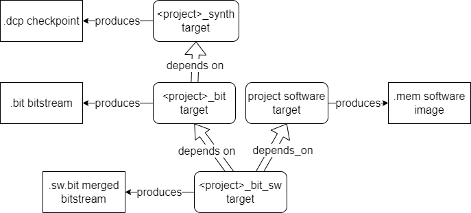

---
hide:
  - toc
---

# Building the Gateware

Assuming all [Prerequisites](prerequisites.md) are installed, navigate to the desired build tree and run the following command:

```
make <gw_component_or_project_name><action>
```

Where *action* is one of the following:

- `_lint`: Lint-check the specified gateware component or project.
    - Depends on: Gateware sources and the *gw_codegen* target.
    - Build tree: *sim-a7-100* build tree. Gateware component and project directories.
- `_sim`: Build the Verilator simulation model (*Vmodel*) for the specified gateware project, including the associated software image.
    - Depends on: Gateware sources, the associated software target, and the *gw_codegen* target.
    - Build tree: *sim-a7-100* build tree.
- `_synth`: Synthesize the specified gateware component or project. This action is only available in the *arty-a7-100* build tree. When you run the synth action on a component, Out-Of-Context (OOC) synthesis is performed, meaning the component's input and output ports are not connected to anything.
    - Depends on: Gateware sources, constraints, and the *gw_codegen* target.
    - Build tree: *arty-a7-100* build tree.
- `_bit`: Implement the specified gateware project and generate its bitstream, including the associated software image.
    - Depends on: The *_synth* target above and the associated software target.
    - Build tree: *arty-a7-100* build tree.
- `_update_sw`: Update the software image in the bitstream file or Vmodel directory. See [UpdateMem and XPM Memories](#updatemem-and-xpm-memories).
    - Depends on: The *_bit* target above (in case of arty-a7-100 builds) and the associated software target.
    - Build tree: *arty-a7-100* and *sim-a7_100* build trees.
- `_load`: Load the gateware project's bitstream file onto the connected target.
    - Depends on: No dependencies.
    - Build tree: *arty-a7-100* build tree.
- `_flash_gw`: Flash the gateware project's bitstream file onto the connected target.
    - Depends on: No dependencies.
    - Build tree: *arty-a7-100* build tree.

See [here](build_sys_gw_build_struct.md#four-layers) for more info on the *gw_codegen* target see.

### Some Examples

```
cd <boxlambda_root_dir>/build/sim-a7-100 && make ddr_test_sim
```

```
cd <boxlambda_root_dir>/build/arty-a7-100 && make hello_world_synth
```

```
cd <boxlambda_root_dir>/build/arty-a7-100 && make hello_world_bit && make hello_world_load
```

The build directory tree mirrors the source tree. After a build completes, you can find the project's Verilator model or Vivado project files under the corresponding project directory. For example:

```
$ cd build/arty-a7-100/gw/projects/hello_world
$ make hello_world_synth
...
$ ls
CMakeFiles                hello_world.constraints_file_list  project.cache        project.runs    syn_util.rpt
CTestTestfile.cmake       hello_world.mem_file_list          project.dep          project.xpr
Makefile                  hello_world.vivado_sources         project.hw           spram.mem
cmake_install.cmake       hello_world.vivado_sources.dep     project.ip_user_files syn_timing.rpt
```

<br><br>

### What Happens When You Run *make hello_world_(synth|bit)*?



*Gateware Build Targets.*

When you run *make hello_world_synth*, the following steps occur:

1. *Make* triggers the *gw_codegen* rule, executing all dependent gateware code generation *custom commands* (See also [this section](build_sys_gw_build_struct.md#four-layers)). **Note that because the code generators are always re-run, a *make \*_synth* build always rebuilds.**
2. *Make* runs the *bender script* command on the `Bender.yml` file in the *gw/projects/hello_world/* directory. This command is wrapped in the *scripts/bender_gen_vivado_source.sh* shell script.
3. The *bender script* processes the `Bender.yml` manifest and any dependent components' manifests.
4. The *bender script* generates a list of all HDL sources that make up the project.
5. Similarly, `scripts/bender_gen_prj_constraints_file_list.sh`, `scripts/bender_gen_mem_file_list.sh`, and `scripts/bender_gen_ip_file_list.sh` generate the `.xdc` constraints, `.mem` memory file list, and Vivado IP file list for the project.
6. *Make* feeds these file lists into a `vivado_create_project.tcl` script.
7. The `vivado_create_project.tcl` script creates a Vivado project.
8. *Make* runs the `vivado_synth.tcl` script, which opens the Vivado project and initiates synthesis. The result is a `.dcp` checkpoint file.

When you run *make hello_world_bit*, the following happens:

1. *Make* runs the *hello_world* software build rule because *hello_world_bit* depends on it.
2. *Make* executes the *hello_world_synth* rules because *hello_world_bit* depends on it. **Note that, because the *\*_bit* rule depends on the *\*_synth* rule, and the *\*_synth* rule always rebuilds, the *\*_bit* rule will also always rebuilds.**
2. *Make* runs the `vivado_impl.tcl` script, which opens the Vivado project, loads the `*.dcp` synthesis checkpoint, and begins the implementation phase.

When you run *make hello_world_update_sw*, the following happens:

1. *Make* runs the *hello_world* software build rule.
2. The new *hello_world* software image is merged into the bitstream file. For details, see [UpdateMem and XPM Memories](#updatemem-and-xpm-memories).

### Managing Vivado Logging and Tracing

The build system invokes Vivado through a wrapper script: *scripts/vivado_wrapper.sh*.
This script defines a *VIVADO_FLAGS* variable that controls the level of Vivado logging and tracing.

By default, the variable is set to:

```
VIVADO_FLAGS="-nolog -nojournal -notrace"
```

To debug build issues, I unset *VIVADO_FLAGS* to enable detailed logs and trace messages.

### UpdateMem and XPM Memories

Changing the contents of a *.mem* file does not require a full FPGA resynthesis and reimplementation. The memory contents are embedded within the FPGA bitstream file. Vivado's *UpdateMem* tool allows for merging new memory contents into the bitstream file post-implementation. However, *UpdateMem* works only with memories implemented using Xilinx **XPM** macros.

When Vivado implements an XPM memory, such as *xpm_memory_tdpram*, it generates a **Memory Map Information (MMI)** file, which describes how individual block RAMs compose a contiguous logical data space. The *UpdateMem* tool requires this MMI file to determine the locations in the bitstream file that need to be updated.


*Merging a .mem file into a Bitstream File.*

The *UpdateMem* script can be found here: [scripts/vivado_updatemem.sh](https://github.com/epsilon537/boxlambda/blob/master/scripts/vivado_updatemem.sh)


