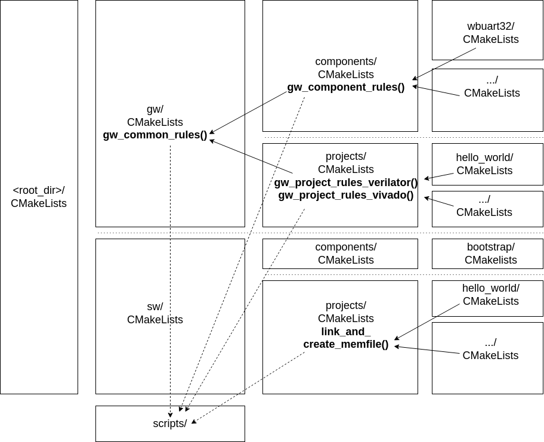
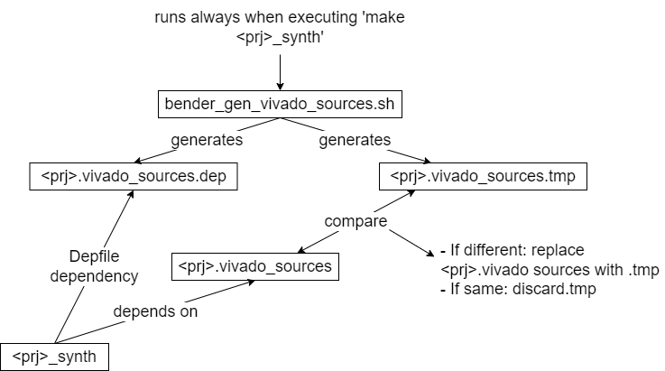

# The CMakeLists

The build system consists of a tree of *CMakeLists.txt* files. The top-level *CMakeLists.txt* adds the *gw/* and *sw/* subdirectories. The *CMakeLists.txt* files in those subdirectories add the *components/* and *projects/* subdirectories, etc., down to the individual GW and SW component and project directories.

## A Gateware Component CMakeList

The build instructions for a gateware component are grouped into one CMake function: **gw_component_rules()**. A GW component-level CMakeLists.txt file contains just a call to this function, passing in the expected parameters:

```
gw_component_rules(
    TOP_MODULE <top module name> 
    COMPONENT_NAME <component name> 
)
```

For example:

```
gw_component_rules(
    TOP_MODULE wb_wbuart_wrap_wrap 
    COMPONENT_NAME wbuart32 
)
```

The component's sources, Vivado IPs, flags, and dependencies are defined in its *Bender.yml* manifest. The CMake build system interfaces with Bender through a collection of scripts to extract the necessary info and pass it on to Vivado or Verilator.

### DFX Components

DFX Components require additional build rules. A DFX Reconfigurable Module needs to be implemented and turned into a bitstream that can be dynamically loaded onto a DFX-enabled system. The build rules to do that are defined in the *gw_rm_rules_dfx()* function. Calling this function results in a `<component>_bit` target being defined. Building that target results in a DFX partial bitstream of the given component.

Here is an example:

```
gw_component_rules(
    TOP_MODULE  vs0
    COMPONENT_NAME vs0_j1b
)

if(CMAKE_BUILD_TYPE STREQUAL "fpga")
if(BL_TARGET_FPGA STREQUAL "arty-a7-100")
  gw_rm_rules_dfx(
    COMPONENT_NAMES
      vs0_j1b
    VS_INSTS
      boxlambda_soc_inst/GENERATE_VS0_MODULE.vs0_inst
    REF_DFX_PROJECT 
      dfx_test
  )
endif()
```

The `gw_rm_rules_dfx()` parameters:

- **COMPONENT_NAMES**: The name of the component. If there are multiple RMs in the build, list the names of all RMs starting with the current component.
- **VS_INSTS**: Specify where in the SoC this component plugs into. If there are multiple RMs in the build, list the instance names in the same order as the component names list.
- **REF_DFX_PROJECT**: Specify the reference project defining the static portion of the DFX build.

## A Gateware Project CMakeList

The build instructions for a gateware project are also grouped into two CMake functions:

- **gw_project_rules_vivado()**: Gateware project build rules for Vivado builds.
- **gw_project_rules_verilator()**: Gateware project build rules for Verilator builds.

A typical GW project CMakeLists.txt file looks like this:

```
if(CMAKE_BUILD_TYPE STREQUAL "fpga")
  gw_project_rules_vivado(
      TOP_MODULE boxlambda_top
      PROJECT_NAME fatfs_test
      MEM_FILE_TARGET fatfs_test
  )
else()
  gw_project_rules_verilator(
      TOP_MODULE sim_main
      PROJECT_NAME fatfs_test
      MEM_FILE_TARGET fatfs_test
      VERILATOR_CPP_FLAGS
          "-I${PROJECT_SOURCE_DIR}/sub/wbuart32/bench/cpp/ -I${PROJECT_SOURCE_DIR}/sub/riscv-dbg/tb/remote_bitbang -I${PROJECT_SOURCE_DIR}/sub/sdspi/bench/cpp"
      VERILATOR_LD_FLAGS
          -lncurses
  )

  # Add testcase.
  add_test(NAME fatfs_test_test
      COMMAND ./Vmodel -s ${CMAKE_CURRENT_LIST_DIR}/test/sdcard.img
      WORKING_DIRECTORY ${CMAKE_CURRENT_BINARY_DIR})
endif()
```

The project's sources, flags, dependencies, Vivado IPs, and constraint files are defined in its *bender.yml* manifest. The reference to the SW project delivering the memory file is *not* defined in the Bender manifest, however. The SW project name is passed in as the *MEM_FILE_TARGET* parameter in the *gw_project_rules_vivado|verilator()* call.

Any test cases are also added to the project's CMakeLists.txt file.

## A DFX Project CMakeList

The build rules for a DFX-enabled project are created by the *gw_project_rules_dfx_vivado()* CMake function. Calling this function results in the creation of a `<project>_bit`, a `<project>_load`, and a `<project>_flash_gw` target. Building the `<project>_bit` target results in a bitstream file that can be `_loaded` or `_gw_flashed` onto the target. The gateware image expects to find a software image on flash to boot from.

Here is an example:

```
gw_project_rules_dfx_vivado(
    TOP_MODULE boxlambda_top
    PROJECT_NAME dfx_test
    VS_INSTS 
      boxlambda_soc_inst/GENERATE_VS0_MODULE.vs0_inst
    VS_DEFAULT_COMPONENTS
      vs0_stub
)
```

The `gw_project_rules_dfx_vivado()` parameters:

- **TOP_MODULE**: Name of the top module.
- **PROJECT_NAME**: Project name.
- **VS_INSTS**: DFX virtual socket instance names.
- **VS_DEFAULT_COMPONENTS**: DFX virtual socket default components, one for each `VS_INST` listed. The default component gets placed into the virtual socket in the default bitstream image.

## A Software Project CMakeList

CMake is designed to build software. The necessary functions for creating libraries, executables, etc., are predefined. The only custom function added to the software CMakeLists tree is **link_and_create_image()**. This function executes the necessary steps to link the given target using a given linker script and generate a memory file, which is used by the GW part of the build system.

Currently, two linker scripts are defined:

- **/sw/components/bootstrap/link_cmem_boot.ld**: This linker script creates software images that boot from CMEM internal memory.
- **/sw/components/bootstrap/link_flash_boot.ld**: This linker script creates software images that boot from flash memory.

A typical SW project CMakeLists.txt file looks like this:

```
#
# Hello World RAM Build
#

add_executable(hello_world_ram
 EXCLUDE_FROM_ALL
    hello.c
)

# Setting the -g flag for the hello_dbg build testing GDB access.
target_compile_options(hello_world_ram
 PRIVATE -g)

# Function defined in parent CMakeLists.txt file:
link_and_create_image(hello_world_ram ${PROJECT_SOURCE_DIR}/sw/components/bootstrap/link_cmem_boot.ld)

target_link_libraries(hello_world_ram gpio riscv)

#
# Hello World Flash Build
#

add_executable(hello_world_flsh
 EXCLUDE_FROM_ALL
    hello.c
)

# Setting the -g flag for the hello_dbg build testing GDB access.
target_compile_options(hello_world_flsh
 PRIVATE -g)

# Function defined in parent CMakeLists.txt file:
link_and_create_image(hello_world_flsh ${PROJECT_SOURCE_DIR}/sw/components/bootstrap/link_flash_boot.ld)

target_link_libraries(hello_world_flsh gpio riscv)
```

## CMakeList Organization



*CMakeLists Organization.*

The actual gateware build recipes (Bender interaction, verilating, synthesizing...) are implemented by a set of bash and tcl scripts kept in the [scripts/](https://github.com/epsilon537/boxlambda/tree/master/scripts) directory:

```
    bender_gen_prj_constraints_file_list.sh
    bender_gen_verilator_sources.sh
    bender_gen_vivado_sources_and_deps.sh
    bender_get_cpp_files.sh
    bender_get_dfx_constraints.sh
    bender_get_vlts.sh
    bender_gen_mem_file_list.sh
    bender_gen_ip_file_list.sh
    prg_bitstream.tcl
    verilator_lint_check.sh
    verilator_sim.sh
    vivado_create_project.tcl
    vivado_impl.tcl
    vivado_impl_dfx_prj.tcl
    vivado_impl_dfx_rm.tcl
    vivado_synth.tcl
    vivado_updatemem.sh
```

The build recipes are implemented as separate scripts outside the CMakeLists so they can be invoked from a Linux shell or Vivado session outside the build system.

The CMake build instructions define the various targets and the relationships between them and invoke the above build scripts when needed.

The CMake build definitions are located as close as possible to the part of the tree to which they apply, e.g. the *gw_project_rules()* function can be found in the [gw/projects/CMakeLists.txt](https://github.com/epsilon537/boxlambda/blob/master/gw/projects/CMakeLists.txt) file. *Gw_component_rules()* can be found in the [gw/components/CMakeLists.txt](https://github.com/epsilon537/boxlambda/blob/master/gw/components/CMakeLists.txt) file. Gateware build instructions common to both components and projects are located in the [gw/CMakeLists.txt](https://github.com/epsilon537/boxlambda/blob/master/gw/CMakeLists.txt) file.

## Cross-Compilation

RISC-V cross-compilation for C and C++ is set up by passing in a *toolchain file*

 to CMake. The toolchain file is located in [scripts/toolchain.cmake](https://github.com/epsilon537/boxlambda/blob/master/scripts/toolchain.cmake).

## *.Picoasm* - CMake Build Support for PicoRV Assembly Code

Although Ibex and PicoRV32 are both 32-bit RISC-V processors, the programming model for the two is very different. For Ibex, we build and run C/C++ code, and use the **riscv-unknown-elf-gcc** frontend for compilation and linking. For PicoRV, we write tiny assembly programs. We use **riscv-unknown-elf-as** for assembling and **riscv-unknown-elf-ld** for linking. Separate CMake toolchain variables are set up to build PicoRV code. This is done by creating an **ASM_PICO** assembler *dialect* as described in this article from Kitware:

[https://gitlab.kitware.com/cmake/community/-/wikis/doc/cmake/languages/Assembler](https://gitlab.kitware.com/cmake/community/-/wikis/doc/cmake/languages/Assembler)

The article tells you to create three files in the CMake modules directory (*cmake/* in the BoxLambda source tree). Here are the files I created for *ASM_PICO*:

[https://github.com/epsilon537/boxlambda/tree/master/cmake](https://github.com/epsilon537/boxlambda/tree/master/cmake)

A new filename extension is needed for PicoRV assembly files because CMake toolchain selection is done based on the filename extension. I decided to go for **.picoasm** for the source code and **.picobin** for the generated binaries.

*.Picoasm* assembly files use CPP as a preprocessor. CPP *#defines* allow the programmer to assign names to registers, making writing RISC-V assembly code more manageable:

```
#define hir_base x1
#define burst_base x2
#define msb_set x3
#define mask_4_lsb x4
#define src x5
#define dst x6
#define num_elems x7
#define burst_end x8
#define single_end x9
#define stat_busy x10
#define tmp x11
...
_start:
    /* Set up constants. */
    li hir_base, HIR_REGS_BASE_ADDR
    li burst_base, BURST_REGS_BASE_ADDR
    sw zero, BURST_OFFSET(burst_base)    /* no src-to-dest alignment offset. */
    li msb_set, 0x80000000
    li mask_4_lsb, 0xfffffff0            /* mask to clear 4 lsbs */
    li stat_busy, STAT_BUSY
wait_start:
    lw tmp, HIR3(hir_base)               /* HIR3: ctrl-status */
    beqz tmp, wait_start
...
```

## Bender Interaction Hack

GNU Make, CMake's backend, uses the modification date of dependencies to decide if a build rule should be triggered, e.g. an object gets rebuilt when the corresponding source code has a more recent modification date than the object file itself. With Bender, however, a component's or project's *Bender.yml* file is just the tip of a tree. The Bender target and package dependencies also have to be considered. Simply listing the Bender.yml file as a dependency is not good enough. Instead, I'm using the Bender script output as a dependency:

1. The build system runs the *bender script* command.
2. The output of that command is stored in a temporary file. 
3. That file is compared with the Bender script output file used by the previous build of the same target. 
    - If it's different, the file is copied over, making it the Bender script output file to be used by the next build step. The Bender script output file is a dependency for synthesis, so synthesis will be triggered.
    - If the temporary file is the same as the Bender script output file used by the previous build of that target, the temporary file is discarded. Synthesis will not be triggered.

This mechanism is implemented in the [scripts/bender_gen_vivado_sources.sh](https://github.com/epsilon537/boxlambda/blob/master/scripts/bender_gen_vivado_sources.sh) and [scripts/bender_gen_verilator_sources.sh](https://github.com/epsilon537/boxlambda/blob/master/scripts/bender_gen_verilator_sources.sh) scripts. The same scripts also generate a *DepFile*: a dependency list of all the sources referenced in the Bender manifest. This DepFile is referenced by the synthesis target so synthesis (or verilating) will be triggered if any of the sources change.



*CMake and Bender Interaction.*

