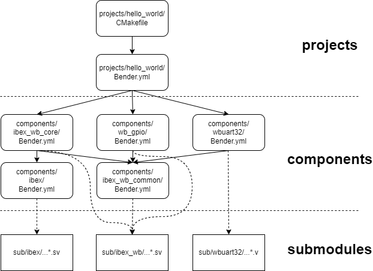

---
hide:
  - toc
---

# The Gateware Build Structure

## Bender

The build system is CMake-based but relies on Bender for gateware package dependency management:

[https://github.com/pulp-platform/bender](https://github.com/pulp-platform/bender)

Central to Bender is the package manifest file, `bender.yml`. This manifest specifies HDL sources, Vivado IPs, dependencies, include paths, targets (e.g., synthesis, simulation), and associated *defines*.

A **package directory** is a directory containing a `bender.yml` file. Running Bender in such a directory generates a flat list of all sources from the current package and its dependencies. Additionally, Bender can output this list along with any *defines* for a given target as a Tcl script, simplifying Vivado integration.



*Project/Component/Submodule View of the Build System.*

### Bender Targets

The build system currently uses the following Bender targets:

- `*module_name*`: Used when building a component separately (out-of-context).

```
    - target: ibex_wb_core
      files:
        - rtl/ibex_wb_core_wrapper.sv
```

- `vivado`: Set when synthesizing using Vivado.
- `verilator`: Set when building a Verilator simulation model.
- `prj_constraints`: Set when retrieving `.xdc` constraint files for the project.
- `dfx_constraints`: For DFX-enabled builds, set when retrieving *Pblock* constraint files for the project.
- `memory_vivado`: Set when retrieving `.mem` files required for Vivado synthesis of the component or project.
- `memory_verilator`: Set when retrieving `.mem` files needed for Verilator simulations.
- `vivado_ip_arty-a7-100`: Set in Arty-A7-100 builds when retrieving `.xci` files of Vivado IPs referenced in the component or project.
- `vivado_ip_arty-a7-35`: Set in Arty-A7-35 builds for `.xci` files of Vivado IPs. **(Deprecated)**

## Four Layers

The gateware system is organized into fours layers:

1. **The Project Layer**:
   Example: *Hello World*. This layer represents the top level of the build system. The `bender.yml` manifest includes top-level SoC build files, project-specific `.xdc` constraints, memory files, and the list of components the project depends on.

2. **The Component Layer**:
   Components form the building blocks of an SoC. Each component defines its sources, *defines*, and dependencies in a `bender.yml` manifest. Component HDL sources are located in the `rtl/` subdirectory or in `sub/` (submodule layer). Each Wishbone Bus master or slave is considered a separate component.

3. **The Submodule Layer**:
   Submodules are Git submodules referenced by BoxLambda. They form the foundation of the build system.

4. **The Code Generation Layer**:
   Some components require some form of transformation to be turned into synthesizable verilog. The component in question provides specific code generation instructions in the form of a *custom command* (*add_custom_command*) its `CMakefile.txt`. The custom command is added as a dependency to the generic *gw_codegen* target which gets executed as the first step in a gateware build. The code generated files are written to the `codegen/` subdirectory in the build tree. The code generated files are derived objects so they are not put under version control.

The following components currently rely on code generation:

   - **Ibex**: The [Ibex repo](https://github.com/epsilon537/ibex) needs to be exported using *fusesoc*.
   - **LiteDram**: The LiteDRAM module is generated from a Python-based HDL (*Migen*).
   - **Interconnect**: The *wb_mux* and *wb_arbiter* variants are generated by Python scripts ([wb_mux.py](https://github.com/epsilon537/verilog-wishbone/blob/boxlambda/rtl/wb_mux.py) and [wb_arbiter.py](https://github.com/epsilon537/verilog-wishbone/blob/boxlambda/rtl/wb_arbiter.py)) in the *verilog-wishbone* submodule that parameterizes the number of ports.
   - `imem_to_flash_vector.mem` is built from the [software project with the same name](https://github.com/epsilon537/boxlambda/tree/master/sw/projects/imem_to_flash_vector) and copied into the codegen tree.

## Verilator Lint Waivers

Instead of adding lint waivers directly to the source code of Git submodules, these waivers are grouped into `.vlt` files located in the corresponding gateware component or project subdirectory. This approach avoids unnecessary changes to submodule source code.

Example:
[gw/components/ibex/lint.vlt](https://github.com/epsilon537/boxlambda/blob/master/gw/components/ibex/lint.vlt)

