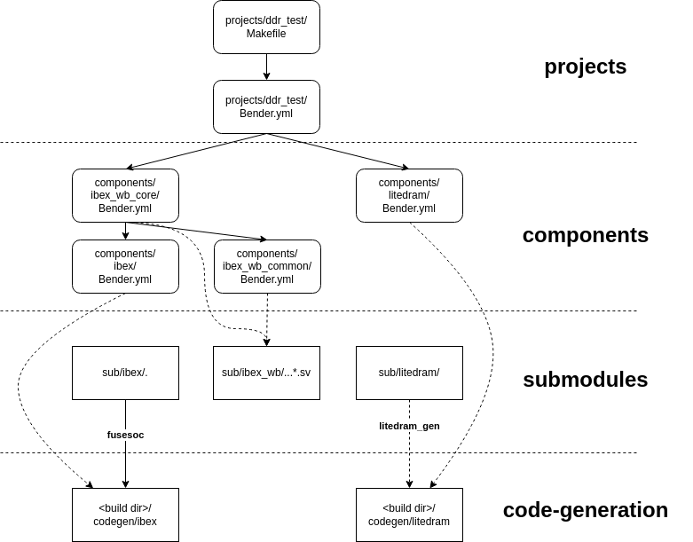

The Gateware Build Structure
----------------------------
### Bender

The build system is CMake-based but relies on Bender for gateware package dependency Management:

[https://github.com/pulp-platform/bender](https://github.com/pulp-platform/bender)

Central to Bender is the package manifest *bender.yml*. In the manifest, you specify the HDL sources, Vivado IPs, dependencies, include paths, targets (e.g. synth, sim), and associated *defines*.
A package directory is a directory containing a bender.yml file. When you run bender in that directory, you can ask it to generate a flat list of all the sources from the current package, and the packages it depends on. Optionally, it can generate that list, plus any *defines* associated with a given target, as a Tcl script. This makes integration with Vivado very easy.



*Project/Component/Submodule View of the Build System.*

#### Bender Targets

Currently, the build system uses the following Bender targets:

- ***module_name***: set when building a component separately (OOC)

```
  - target: ibex_wb_core
    files:
      - rtl/ibex_wb_core_wrapper.sv    
```

- **vivado**: set when synthesizing using Vivado.
- **verilator**: set when building Verilator simulation model.
- **prj_constraints**: set when retrieving *.xdc* constraints files for this project.
- **memory_vivado**: set when retrieving *.mem memory files required for Vivado synthesis of this component or project.
- **memory_verilator**: set when retrieving *.mem memory files required to verilate this component or project.
- **vivado_ip_arty-a7-100**: set in arty-a7-100 builds when retrieving the .xci file of Vivado IP referenced in this component or project.
- **vivado_ip_arty-a7-35**: set in arty-a7-35 builds when retrieving the .xci file of Vivado IP referenced in this component or project.

### Three Layers

The gateware system has three layers:

1. **The Project Layer (top)**: *Hello World* is an example project. A project is the top layer of the build system. The bender.yml manifest contains the top-level files of an SoC build, the project's *.xdc* constraints file, memory files used by the SoC, and a list of *components* the project depends on.
2. **The Component Layer (middle)**: Components are the middle layer of the build system. They are the building blocks of an SoC. A component's sources, *defines*, and dependencies are defined in a bender.yml manifest. A component gets its HDL sources from its *rtl/* subdirectory and/or *sub/*, the submodule layer. I'm considering each Wishbone Bus Master or Slave a component.
3. **The Submodule Layer (bottom)**: Submodules are the bottom layer of the build system. They are the Git Submodules that BoxLambda is referencing.

### Verilator Lint Waivers

Rather than add lint waivers to the source code of git submodules, the waivers are grouped into *.vlt* files that live in the corresponding gateware component or project subdirectory. This way, we avoid making unnecessary code changes in the git submodules.

For example 
[gw/components/ibex/lint.vlt](https://github.com/epsilon537/boxlambda/blob/master/gw/components/ibex/lint.vlt)

### Gateware Component/Project Directory Layout

A component or project directory typically contains the following files and subdirectories:

```
<component/project>
├── CMakeLists.txt
├── Bender.yml: The component/project Bender manifest.
├── lint.vlt: Lint waivers.
├── rtl
│   └── <Boxlambda specific RTL sources for given component/project>
└── sim
    └── <C++ test bench code for given component/source>
```
