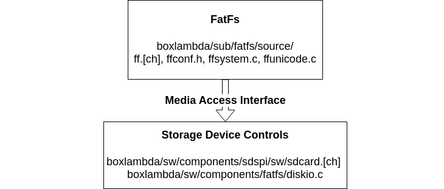

# FatFS

- **FatFs Repo**, BoxLambda fork, `boxlambda` branch:
    [https://github.com/epsilon537/fatfs/tree/boxlambda](https://github.com/epsilon537/fatfs/tree/boxlambda)

- **FatFs Submodule in the BoxLambda Directory Tree**:
    boxlambda/sub/fatfs/.

- **FatFs Website**:
    [http://elm-chan.org/fsw/ff/00index_e.html](http://elm-chan.org/fsw/ff/00index_e.html)

- **FatFs Software Component in the BoxLambda Directory Tree**:
  [boxlambda/sw/components/fatfs](https://github.com/epsilon537/boxlambda/tree/master/sw/components/fatfs)

- **Included in OS**: No

[FatFs](http://elm-chan.org/fsw/ff/00index_e.html) is a lightweight software library for small systems that implements FAT file system support. It's written in ANSI C89 and has no dependencies other than a minimal C environment. It'll compile out of the box in virtually any environment.

The FatFs library does not provide the device/media-specific *Storage Device Controls*. Those have to come from the device implementer. Two modules are provided:

- [sw/components/sdspi/sdcard.h](https://github.com/epsilon537/boxlambda/blob/master/sw/components/sdspi/sdcard.h), provided by the SDSPI software component.
- [sw/components/fatfs/diskio.c](https://github.com/epsilon537/boxlambda/blob/master/sw/components/fatfs/diskio.c), part of the FatFS software component.

*FatFs Media Access Interface.*

Both modules are based on ZipCPU's implementation in his [SDSPI repo](https://github.com/epsilon537/sdspi).

## FatFs Configuration

FatFs is very configurable, so you can trade options for footprint.
All configuration options are well-documented and centralized in the `ffconf.h` file.
Relative to the default settings, I modified the following:

- **Enable FF_USE_FIND**: filtered directory read functions, `f_findfirst()` and `f_findnext()`.
- **Enable FF_USE_STRFUNC**: string functions, `f_gets()`, `f_putc()`, `f_puts()`, and `f_printf()`.
- **Enable FF_FS_RPATH**: support for relative paths.
- **Enable FF_FS_NORTC**: I *disabled* the timestamp feature. TBD: Hook this up
  to BoxLambda's RTC.

[https://github.com/epsilon537/fatfs/blob/boxlambda/source/ffconf.h](https://github.com/epsilon537/fatfs/blob/boxlambda/source/ffconf.h)

## FatFs_Test

FatFs itself does not provide a test suite, but I found a simple test sequence in [another project](https://github.com/avrxml/asf/blob/master/thirdparty/fatfs/unit_tests/unit_tests.c). I used that code as the starting point for a BoxLambda [fatfs_test](https://github.com/epsilon537/boxlambda/blob/master/sw/projects/fatfs_test/fatfs_test.c).

