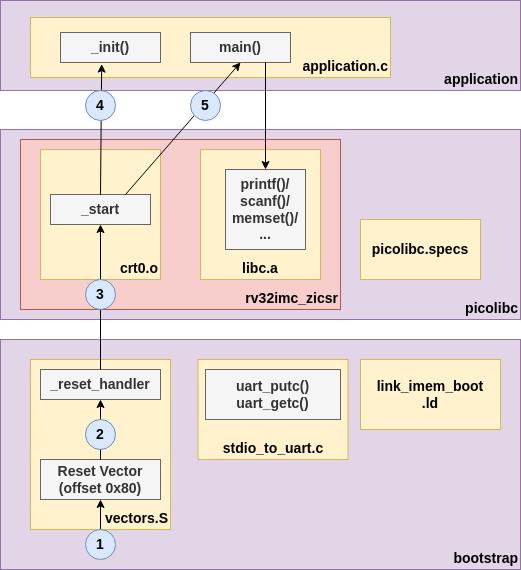

# Picolibc and the Bootstrap Component

- **PicoLibc Version**: 1.8.6

- **PicoLibc Repo**, BoxLambda fork, `boxlambda` branch:
    [https://github.com/epsilon537/picolibc](https://github.com/epsilon537/picolibc)

- **PicoLibc Submodule in the BoxLambda Directory Tree**:
    boxlambda/sub/picolibc/.

- **PicoLibc Website**:
    [https://keithp.com/picolibc/](https://keithp.com/picolibc/)

- **Bootstrap Software Component in the BoxLambda Directory Tree**:
  [boxlambda/sw/components/bootstrap](https://github.com/epsilon537/boxlambda/tree/master/sw/components/bootstrap)

- **Included in OS**: Yes

BoxLambda uses the Picolibc standard C library implementation.
[Picolibc](https://github.com/picolibc/picolibc) is a Newlib variant, blended with AVR libc, optimized for systems with limited memory.
[Newlib](https://www.sourceware.org/newlib/) is the de facto standard C library implementation for embedded systems.

## Building Picolibc

### Picolibc Configuration Scripts
A Picolibc build for a new system requires configuration scripts for that system in the [picolibc/scripts/](https://github.com/epsilon537/picolibc/tree/boxlambda/scripts) directory. They specify such things as the compiler toolchain to use, GCC processor architecture flags, and CPP preprocessor flags, tweaking specific library features.

I'm using `boxlambda` as the base name for the new scripts.

The new scripts are derived from the existing configuration files for `rv32imac`:

- [do-boxlambda-configure](https://github.com/epsilon537/picolibc/blob/boxlambda/scripts/do-boxlambda-configure) is based on [do-rv32imac-configure](https://github.com/epsilon537/picolibc/blob/boxlambda/scripts/do-rv32imac-configure).
- [cross-boxlambda.txt](https://github.com/epsilon537/picolibc/blob/boxlambda/scripts/cross-boxlambda.txt) is based on [cross-rv32imac_zicsr.txt](https://github.com/epsilon537/picolibc/blob/boxlambda/scripts/cross-rv32imac_zicsr.txt).

The differences between the derived scripts and the base scripts are minimal:

- They are referencing the `riscv32-boxlambda-elf` GCC toolchain.
- The `-march` flag is set to `rv32im_zicsr`.
- In `do-boxlambda-configure`, `picocrt` is set to `false`. We're not using the picolibc crt0 module. BoxLambda has its own variant of the crt0 module in the `bootstrap` software component.

### picolibc_build.sh


I grouped the PicoLibc build and install instructions in a [picolibc_build.sh](https://github.com/epsilon537/boxlambda/blob/master/scripts/picolibc_build.sh) shell script. This script is invoked by the build system (in [sw/CMakeLists.txt](https://github.com/epsilon537/boxlambda/blob/master/sw/CMakeLists.txt)) during build tree configuration time. The picolibc build and install directories are placed inside the build tree:

- **Picolibc build directory**: `<build dir>/sw/picolibc-build`
- **Picolibc install directory**: `<build dir>/sw/picolibc-install`

When there are changes in the Picolibc source tree, the build trees need to be regenerated. The easiest way to do that is by running `make regen` from the build tree.

## Linking against the Picolibc library: The Picolibc GCC specs file

To link the PicoLibc library into an application image, the PicoLibc *specs file* needs to be passed to GCC. `sw/CMakeLists.txt` takes care of this:

```
#Set the generated specs files as standard compile and link options.
set(SPECS "--specs=${CMAKE_CURRENT_BINARY_DIR}/picolibc-install/picolibc.specs")

#Use the picolibc specs for all compilations.
add_compile_options(
    $<$<COMPILE_LANGUAGE:CXX,C,ASM>:${SPECS}>)

add_link_options(
    $<$<COMPILE_LANGUAGE:CXX,C,ASM>:${SPECS}>)
```

The Picolibc GCC specs file can be found in the Picolib install directory.

## The Bootstrap Component

### Some Glue Required



*Picolibc on BoxLambda.*

Picolibc is a relatively generic code base that needs to be tied to the platform it's running on to function properly. To bring up the library on BoxLambda, we need to supply three pieces of code:

- A Vector Table
- A Link Map
- Standard IO Setup

More detail for each of these follows in the subsections below. I have grouped them into a single software component called **bootstrap**:

[https://github.com/epsilon537/boxlambda/tree/master/sw/components/bootstrap](https://github.com/epsilon537/boxlambda/tree/master/sw/components/bootstrap)

An application using the standard C library has to link in this bootstrap component.

### The Vector Table

The vector table is a table with code entry points for all sorts of CPU events: interrupts, exceptions, etc. The Boot/Reset Vector, i.e., the very first instruction executed when the CPU comes out of reset, is part of this table.

The Vector Table file is located at [boxlambda/sw/components/bootstrap/vectors.S](https://github.com/epsilon537/boxlambda/blob/master/sw/components/bootstrap/vectors.S).

The Ibex Boot/Reset vector is at offset 0x80. After some CPU register initialization, the code branches off to `_start`, the entry point into the `crt0` module.

For more info on vectors.S, check the [Interrupt Handling](sw_irqs.md) page.

### Crt0

*Crt0*, C-Run-Time-0, is the start-up code in charge of setting up a C environment (zeroing the BSS segment, setting up the stack, etc.) before calling `main()`.
BoxLambda's version of crt0 can be found here:

[boxlambda/sw/components/bootstrap/crt0.c](https://github.com/epsilon537/boxlambda/blob/master/sw/components/bootstrap/crt0.c).
[boxlambda/sw/components/bootstrap/crt0.h](https://github.com/epsilon537/boxlambda/blob/master/sw/components/bootstrap/crt0.h).

### Standard Input, Output, and Error

The PicoLibc integrator needs to supply `stdin`, `stdout`, and `stderr` instances and associated `getc()` and `putc()` implementations to connect them to an actual IO device.
We'll be using the UART as our IO device for the time being. Down the road, we can extend that with keyboard input and screen output implementation.

```
static int uart_putc(char c, FILE *file) {
  int res;

  (void) file;		/* Not used in this function */

  {
    while (!uart_tx_ready());
    uart_tx((uint8_t)c);
    res = (int)c;
  }

  return res;
}

static int uart_getc(FILE *file) {
  int c;
  (void) file;		/* Not used in this function */

  {
    while (!uart_rx_ready());
    c = (int)uart_rx();
  }

  return c;
}

static FILE __stdio = FDEV_SETUP_STREAM(uart_putc,
 uart_getc,
 NULL,
 _FDEV_SETUP_RW);


FILE *const stdin = &__stdio;
FILE *const stdout = &__stdio;
FILE *const stderr = &__stdio;

```

[boxlambda/sw/components/bootstrap/stdio_to_uart.c](https://github.com/epsilon537/boxlambda/blob/master/sw/components/bootstrap/stdio_to_uart.c)

## Software Startup Sequence


*The Software Startup Sequence.*

## Example Program

Here's an example application program using Picolibc:

```
#include <stdint.h>
#include <stdio.h>
#include <string.h>
#include <stdbool.h>
#include "uart.h"

//_init is executed by picolibc startup code before main().
void _init(void) {
  uart_set_baudrate(1000000);
}

//_exit is executed by the picolibc exit function.
//An implementation has to be provided to be able to user assert().
void	_exit (int status) {
	while (1);
}

int main(void) {
  int v = 123;
  static char m[10] = {0};
  char c;

  //Some basic libc tests:

  memset(m, '!', sizeof(m)-1);

  printf("printf in main() v=%d, m=%s.\n", v, m);

  printf("Enter character: ");
  c = getc(stdin);
  printf("Character entered: ");
  putc(c, stdout);

  return 0;
}

```

Notice the `_init()` function. The PicoLibc startup code executes this functio before calling `main()`. This is where we set up the UART.

