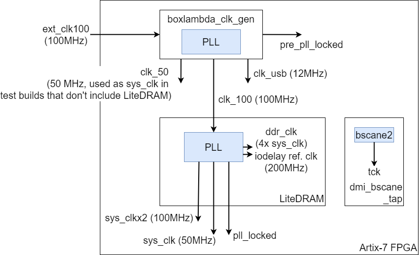
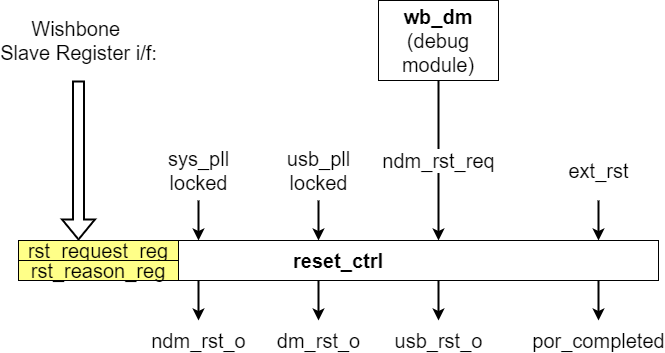

---
hide:
  - toc
---

## Clocks

*BoxLambda's Clocks.*

The following clocks are present in the SoC:

- `ext_clk_100`: A 100MHz external clock, input to the LiteDRAM core.
- `sys_clk`: A 50MHz system clock, generated by the LiteDRAM core and used by the rest of the SoC (CPU, interconnect, etc.).
- `sys_clkx2`: A 100MHz system clock, currently not used.
- `ddr_clk`: The SDRAM DDR PHY clock running at 4×*sys_clk*, generated by the LiteDRAM core.
- A 200MHz reference clock for IODELAYs, generated and used by the LiteDRAM core.
- `tck`: The JTAG clock, driven via a `BSCANE2` primitive by the FPGA's JTAG chain. The `BSCANE2` primitive is instantiated in the `dmi_bscane_tap` module.
- `usb_clk`: A 12MHz clock for the USB HID Host cores.

## Reset

### Reset Controller

- **Reset Controller Component in the BoxLambda Directory Tree**:
  [boxlambda/gw/components/reset_ctrl](https://github.com/epsilon537/boxlambda/tree/master/gw/components/reset_ctrl)

- **Reset Controller Top-Level**:
  [gw/components/reset_ctrl/rtl/reset_ctrl.sv](https://github.com/epsilon537/boxlambda/blob/master/gw/components/reset_ctrl/rtl/reset_ctrl.sv)

- **Reset Controller HAL**:
  [sw/components/reset/reset_hal.h](https://github.com/epsilon537/boxlambda/blob/master/sw/components/reset/reset_hal.h)

### Reset Domains

BoxLambda includes the following synchronous **reset domains**:

- `dm_reset`: Resets the Debug Module Logic in the system clock domain.
- `ndm_reset`: Resets the Non-Debug Module Logic in the system clock domain.
- `usb_reset`: Resets the logic in the USB clock domain.
- `vs0_reset`: Resets the VS0 module. In the DFX configuration, `vs0_reset` is driven by the DFX Controller. In the Base configuration, `vs0_reset` is part of the `ndm_reset` domain.

### Reset Sources

BoxLambda provides the following **reset sources**:

- **Power-On Reset**: Asserted for several clock cycles after power-on.
- **External Reset**: Connected to a reset button on the Arty A7 board.
- **Non-Debug Module Reset Request**: Issued by the Debug Module.
- **Software Reset**: Resets the `dm_reset`, `ndm_reset`, or `usb_reset` domain, triggered by writing to a `reset_ctrl` register.
- **DFX Controller**: Drives `vs0_reset` in the DFX configuration.

The management of non-DFX reset domains and sources is handled by the `reset_ctrl` module.

*BoxLambda's Reset Controller.*

The `reset_ctrl` module source code is located here:
[gw/components/reset_ctrl/rtl/reset_ctrl.sv](https://github.com/epsilon537/boxlambda/blob/master/gw/components/reset_ctrl/rtl/reset_ctrl.sv)

### Reset Controller Registers

Software can trigger resets by writing to the *Reset Control Register* and retrieve the reason for the most recent reset by reading the *Reset Reason Register*.

See the [Reset Register Map](registers/generated/reset_regs.md#reset-register-map) for details.

The [Reset Test](test-build-reset.md) application demonstrates the use of these registers.
