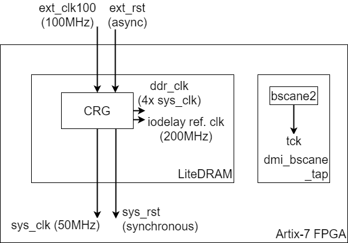

Clocks and Reset
================

The LiteDRAM core contains a PLL Clock Generator providing most of the clocks in the BoxLambda SoC.

The following clocks are present in the SoC:

- **ext_clk_100**: 100MHz external clock, input to the LiteDRAM core.
- **sys_clk**: 50MHz System Clock, generated by the LiteDRAM core, used by rest of SoC (CPU, Interconnect,...).
- **sys_clkx2**: 100MHz Double Rate System Clock, generated by the LiteRAM core, twice the rate of, and in phase with *sys_clk*. *Sys_clkx2* is used by the PicoRV core.
- **ddr_clk**: SDRAM DDR PHY clock running at 4x*sys_clk*, generated by the LiteDRAM core.
- 200MHz reference clock for IODELAYs, generated and used the LiteDRAM core.
- **tck**: JTAG clock, driven via a *BSCANE2* primitive by the FPGA's JTAG chain. The *BSCANE2* primitive is instantiated in the *dmi_bscane_tap* module.

** FIXME: The reset logic is being reworked and needs to be documented. **

*BoxLambda's Clocks.*

