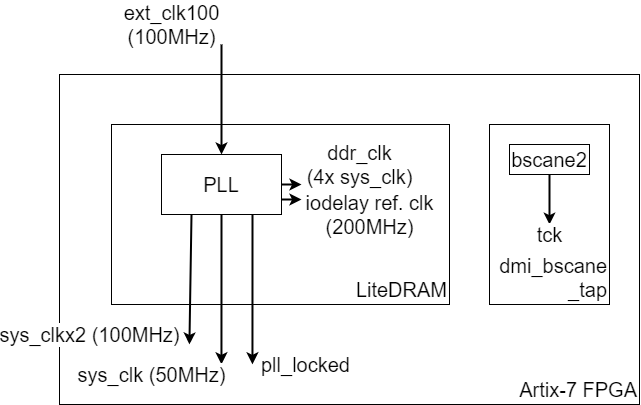

Clocks and Reset
================

The LiteDRAM core contains and Clock-and-Reset Generator.

The following clocks are present in the SoC:

- **ext_clk_100**: 100MHz external clock, input to the LiteDRAM core.
- **sys_clk**: 50MHz System Clock, generated by the LiteDRAM core, used by rest of SoC (CPU, bus fabric,...).
- **ddr_clk**: SDRAM DDR PHY clock running at 4x*sys_clk*, generated by the LiteDRAM core.
- 200MHz reference clock for IODELAYs, generated and used the LiteDRAM core.
- **tck**: JTAG clock, driven via a *BSCANE2* primitive by the FPGA's JTAG chain. The *BSCANE2* primitive is instantiated in the *dmi_bscane_tap* module.

** FIXME: The reset logic is being reworked. The info below is no longer accurate. **
  
An asynchronous external reset signal is forwarded to the LiteDRAM core, which turns it into synchronous System Reset signal (*sys_rst*).

*Clocks and Reset.*

