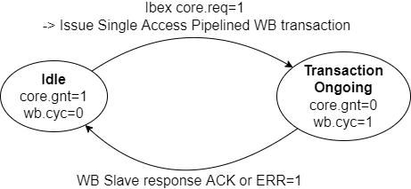

Components
==========

We're building a System-on-a-Chip (*System-on-an-FPGA*?). This section identifies the Key Components of the BoxLambda SoC.

### The Wishbone Interconnect

The Bus, or Interconnect, is the fabric stitching together the SoC internal components. For this project, the two most relevant SoC internal bus specifications are [ARM's AXI bus](https://developer.arm.com/documentation/ihi0022/latest) and the Open-Source [Wishbone bus](https://wishbone-interconnect.readthedocs.io/en/latest/).

**AXI** is very powerful, very popular, and very complex. It scales up well to very big SoCs. However, I don't think it scales down very well to simple SoCs, such as BoxLambda, where low latency and low complexity are more important than high bandwidth and scalability. Hence, for this project, I'm electing to go with **Wishbone**. 

We'll be using Wishbone in *Pipelined Mode*, as specified in the [Wishbone B4 specification](https://github.com/fossi-foundation/wishbone/blob/master/documents/spec/wbspec_b4.pdf).

#### Bus Width and Clock Frequency

We'll be using a 32-bit data bus. 

The Bus Fabric is part of the 50MHz System Clock Domain.

### RISCV Ibex Processor

There are a lot of RISC-V implementations to choose from. The **Ibex** project seems like a good choice:

[https://github.com/lowRISC/ibex](https://github.com/lowRISC/ibex)

- 32-bit RISC-V.
- High-quality, well-documented implementation.
- SystemVerilog based.
- Supports a *small* two-stage pipeline parameterization.
- Very active project.

Location of the *Ibex* submodule in the BoxLambda repo: **sub/ibex/**

The Ibex core:
[sub/ibex/rtl/ibex_top.sv](https://github.com/epsilon537/ibex/blob/acdf41b2bf3ed2f33ed5c29e65c1625d22e4aab5/rtl/ibex_top.sv)

#### Ibex Wishbone Wrapper: *Ibex_WB*

[https://github.com/epsilon537/ibex_wb](https://github.com/epsilon537/ibex_wb) forked from [https://github.com/batuhanates/ibex_wb](https://github.com/batuhanates/ibex_wb)

The Ibex RISCV core itself doesn't have Wishbone ports. *Ibex_WB* wraps around the vanilla Ibex core and attaches Wishbone port adapters to its instruction and data ports.

The *Ibex_WB* repo also includes an example SoC build consisting of an Ibex core connected via a shared Wishbone bus to a wbuart32 core and an internal memory module, along with the software to run on that platform. This example SoC is the starting point for BoxLambda's implementation. See the [Test Builds section](installation-and-test-builds.md#test-builds).

Location of the *Ibex_WB* submodule in the BoxLambda repo: **sub/ibex/**

The *wb_ibex_core*:
[sub/ibex_wb/rtl/wb_ibex_core.sv](https://github.com/epsilon537/ibex_wb/blob/87a97e38f3cf15bee80eb69bfa82166c00842b1e/rtl/wb_ibex_core.sv)

###### From Ibex to LiteDRAM

This is the Ibex Memory Interface specification:

[https://ibex-core.readthedocs.io/en/latest/03_reference/load_store_unit.html#load-store-unit](https://ibex-core.readthedocs.io/en/latest/03_reference/load_store_unit.html#load-store-unit)

There are two such interfaces. One for data, one for instructions.

The job of *core2wb* is to adapt that interface to a pipelined Wishbone bus master interface. That Wishbone bus master in turn requests access to the shared bus. It's up to *wb_interconnect_shared_bus* to grant the bus to one of the requesting bus masters and direct the transaction to the selected slave. If either one of those modules has a bug, that will result in an incorrectly behaving bus master, from the point of view of the bus slave.


*From Ibex to LiteDRAM.*

The *ibex_wb* repository no longer appears to be actively maintained. I looked long and hard at the implementation of the two modules and ultimately decided that I couldn't figure out the author's reasoning. I decided to re-implement both modules: 

- [Core2wb](https://github.com/epsilon537/ibex_wb/blob/master/rtl/core2wb.sv) has two states: *Idle* and *Transaction Ongoing*. In the Idle state, when Ibex signals a transaction request (core.req), the Ibex memory interface signals get registered, a single access pipelined Wishbone transaction is generated and *core2wb* goes to *Transaction Ongoing* state. When a WB ACK or ERR response is received, core2wb goes back to idle. While *Transaction Ongoing* state, the memory interface grant (*gnt*) signal is held low, so further transaction requests are stalled until *core2wb* is idle again Multiple outstanding transactions are currently not supported. I hope to add that capability someday.



*Core2WB State Diagram.* 

- [WB_interconnect_shared_bus](https://github.com/epsilon537/ibex_wb/blob/master/soc/common/rtl/wb_interconnect_sharedbus.sv) also has two states: In the _Idle_ state, a priority arbiter monitors the CYC signal of participating Bus Masters. When one or more Bus Masters assert CYC, the arbiter grants access to the lowest order Bus Master and goes to *Transaction Ongoing* state. When that Bus Master de-asserts CYC again, we go back to Idle state. Slave selection and forwarding of WB signals is done with combinatorial logic.


*WB_Interconnect_Shared_Bus State Diagram.* 

#### Ibex Core Configuration

I settled on RISCV configuration **RV32IMCB**: The **(I)nteger** and **(C)ompressed** instruction set are fixed in Ibex. **(M)ultiplication and Division** and **(B)it Manipulation** are enabled optional extensions.
Note that there's no Instruction or Data Cache. Code executes directly from DPRAM or DDR memory. Data access also goes straight to DPRAM or DDR memory.
The Ibex core is instantiated with the following *M* and *B* parameters, as shown in the *Ibex_wb* *ibex_soc* example:

**sub/ibex_wb/soc/fpga/arty-a7-35/rtl/ibex_soc.sv**:
```
wb_ibex_core #(
  .RV32M(ibex_pkg::RV32MFast),
  .RV32B(ibex_pkg::RV32BBalanced),
  ...
  ) wb_ibex_core (
  ...  
  .boot_addr    (32'h0),
  ...
```

*Wb_ibex_core*'s *boot_addr* port is a misnomer. *Boot_addr* specifies the base address of the vector table. The Reset Vector, i.e. the first instruction executed when the processor comes out of reset, is at offset 0x80 relative to this base address. Hence, the *real* Boot Address for BoxLambda is address 0x80.

##### Ibex Clock Frequency

The Ibex core is part of the 50MHz System Clock Domain.

### Debug Unit: *RISCV-DBG*

[https://github.com/epsilon537/riscv-dbg](https://github.com/epsilon537/riscv-dbg) forked from [https://github.com/pulp-platform/riscv-dbg](https://github.com/pulp-platform/riscv-dbg).

#### RISCV OpenOCD

OpenOCD is an open-source software package used to interface with a hardware debugger's JTAG port via one of many transport protocols. In our case, the hardware debug logic is implemented by a component called **riscv-dbg**. The overall setup looks like this:


*OpenOCD General Setup*

BoxLambda uses the RISCV fork of OpenOCD: [https://github.com/riscv/riscv-openocd](https://github.com/riscv/riscv-openocd)

#### The RISCV-DBG component

RISCV-dbg is part of the [*PULP* platform](https://github.com/pulp-platform) and depends on three additional GitHub repositories that are part of this platform:
- **common_cells**: [https://github.com/pulp-platform/common_cells](https://github.com/pulp-platform/common_cells)
- **tech_cells_generic**: [https://github.com/pulp-platform/tech_cells_generic](https://github.com/pulp-platform/tech_cells_generic)
- **pulpino**: [https://github.com/pulp-platform/pulpino](https://github.com/pulp-platform/pulpino)

As their names suggest, *common_cells* and *tech_cells_generic* provide commonly used building blocks such as FIFOs, CDC logic, reset logic, etc. *Pulpino* is an entire RISCV-based SoC project. However, the riscv-dbg pulpino dependency is limited to just a few cells for clock management.

I created git submodules for all of these repositories under the BoxLambda repository's *sub/* directory. I then created a riscv-dbg component directory with a Bender.yml manifest in it, referencing all the sources needed from those submodules: [components/riscv-dbg/Bender.yml](https://github.com/epsilon537/boxlambda/blob/951bca262fe66fa7433dd0282e7a0d52e93fac6b/components/riscv-dbg/Bender.yml).

```
boxlambda
├── components
│   └── riscv-dbg
│       └── Bender.yml
└── sub
    ├── common_cells
    ├── tech_cells_generic
    ├── pulpino	
    └── riscv-dbg

```

#### RISCV-DBG RTL Structure

RISCV-DBG has two top-levels:
- [sub/riscv-dbg/src/dm_top.sv](https://github.com/epsilon537/riscv-dbg/blob/b241f967f0dd105f7c5e020a395bbe0ec54e40e4/src/dm_top.sv)
- [sub/riscv-dbg/src/dmi_jtag.sv](https://github.com/epsilon537/riscv-dbg/blob/b241f967f0dd105f7c5e020a395bbe0ec54e40e4/src/dmi_jtag.sv)

Recall that BoxLambda uses a Wishbone interconnect. The Ibex_WB submodule implements a Wishbone wrapper for the Ibex RISCV core. It does the same for RISCV-DBG's *dm_top*:  
[sub/ibex_wb/rtl/wb_dm_top.sv](https://github.com/epsilon537/ibex_wb/blob/87a97e38f3cf15bee80eb69bfa82166c00842b1e/rtl/wb_dm_top.sv)

Refer to the *ibex_soc* example to see how RISCV-DBG is instantiated:  
[sub/ibex_wb/soc/fpga/arty-a7-35/rtl/ibex_soc.sv](https://github.com/epsilon537/ibex_wb/blob/boxlambda/soc/fpga/arty-a7-35/rtl/ibex_soc.sv)

#### OpenOCD and RISCV-DBG on Verilator

The JTAG transport protocol used on the Verilator Model is a simple socket-based protocol called **Remote Bitbang**.
The remote bitbang spec is just one page: 

[https://github.com/openocd-org/openocd/blob/master/doc/manual/jtag/drivers/remote_bitbang.txt](https://github.com/openocd-org/openocd/blob/master/doc/manual/jtag/drivers/remote_bitbang.txt)

The Verilator setup looks like this:


*BoxLambda OpenOCD Verilator Setup*

The **hello_dbg** project (directory *projects/hello_dbg/*) implements the OpenOCD Verilator setup shown above. The project contains the Hello World test build extended with the riscv-dbg component.
The project directory also contains a [test script](https://github.com/epsilon537/boxlambda/blob/2a32d1f4100204f9df4e17ba7c6e4656afff8c47/projects/hello_dbg/test/test.sh) that goes through the following steps:
1. Start the Verilator model
2. Connect OpenOCD to the model
3. Connect GDB to OpenOCD (and thus to the model)
4. Execute a UART register dump on the target
5. Check the UART register contents against expected results. 

```
boxlambda
├── projects
│   └── hello-dbg
│       ├── Bender.yml
│       ├── sim
│       │   ├── sim_main.cpp
│       │   └── sim_main.sv
│       └── test
│           ├── test.sh
│           └── test.gdb 
├── components
│   └── riscv-dbg
└── sub
    ├── common_cells
    ├── tech_cells_generic
    ├── pulpino	
    └── riscv-dbg

```

The OpenOCD configuration file for JTAG Debugging on Verilator is checked into the *openocd* directory:  
[openocd/verilator_riscv_dbg.cfg](https://github.com/epsilon537/boxlambda/blob/develop/openocd/verilator_riscv_dbg.cfg)

To summarize:

1. The above OpenOCD config file is used to connect to the JTAG TAP of a Verilator model.
2. The JTAG TAP is implemented by a riscv-dbg core connected to an Ibex RISCV32 core.
2. The JTAG TAP is used to debug the software running on the Ibex RISCV32 core.
3. The JTAG TAP is accessed using a socket-based OpenOCD transport protocol called **remote_bitbang**.

See the [Test Builds section](installation-and-test-builds.md#test-builds) for the steps needed to set up an OpenOCD JTAG debug session on Verilator.

#### OpenOCD and RISCV-DBG on Arty-A7 FPGA

The obvious approach would be to bring out the JTAG signals to PMOD pins and hook up a JTAG adapter. However, there's an alternative method that doesn't require a JTAG adapter. The riscv-dbg JTAG TAP can be hooked into the FPGA scan chain which is normally used to program the bitstream into the FPGA. On the Arty-A7, bitstream programming is done using the FTDI USB serial port, so no special adapters are needed.

The riscv-dbg codebase lets you easily switch between a variant with external JTAG pins and a variant that hooks into the FPGA scan chain, by changing a single file:
- **dmi_jtag_tap.sv**: hooks up the JTAG TAP to external pins
- **dmi_bscane_tap.sv**: hooks the JTAG TAP into the FPGA scan chain. The Xilinx primitive used to hook into the scan chain do this is called BSCANE. Hence the name.

Both files implement the same module name (*dmi_jtag_tap*) and the same module ports, so you can swap one for the other without further impact on the system. Lightweight polymorphism. It sounds cool, but it feels a bit forced. One annoying consequence is that although the JTAG ports are listed at the top-level, they are not used when building the BSCANE variant. The BSCANE primitive internally provides the actual JTAG ports. Anyway, that's the RISCV-DBG design. I'll go with it. By default, BoxLambda builds the BSCANE variant on the Arty-A7.

On the OpenOCD side, the transport protocol for this Debug-Access-via-FPGA-scan-chain-over-FTDI is anti-climactically called **ftdi**.


*BoxLambda OpenOCD Arty A7 FTDI Setup*

The OpenOCD configuration file for JTAG Debugging on Arty A7 is checked into the *openocd* directory:  
[openocd/digilent_arty_a7.cfg](https://github.com/epsilon537/boxlambda/blob/develop/openocd/digilent_arty_a7.cfg) 

To summarize:

1. The above OpenOCD config file is used to connect to the JTAG TAP of a riscv-dbg core...
2. ...to debug the software running on a connected Ibex RISCV32 core.
3. The riscv-dbg core's JTAG TAP is hooked into the Arty-A7's scan chain, normally used for loading a bitstream into the FPGA.
4. The Arty-A7 FPGA scan chain is accessible through the board's FTDI-based USB serial port.
5. The OpenOCD transport protocol name for this type of connection is **ftdi**.

See the [Test Builds section](installation-and-test-builds.md#test-builds) for the steps needed to set up an OpenOCD JTAG debug session on the Arty A7.

#### RISCV-DBG Clock Frequency

*Dm_top* and *dmi_jtag* are part of the 50MHz System Clock domain.
The JTAG clock *tck* is driven via a *BSCANE2* primitive by the FPGA's JTAG chain. The BSCANE2 primitive is instantiated in the *dmi_bscane_tap* module.
  
### LiteDRAM Memory Controller

SDRAM memory access is pretty complicated. Memory access requests get queued in the memory controller, scheduled, and turned into a sequence of commands that vary in execution time depending on the previous memory locations that were recently accessed. 

There exists a class of memory controllers, called **Static Memory Controllers**, that absorb these complexities and by design create a fixed schedule for a fixed use case, resulting in very predictable behavior. Static Memory Controllers are far off the beaten path, however. **Dynamic Memory Controllers** are more common. Dynamic Memory Controllers can handle a variety of use cases with good performance *on average*. Unfortunately, they sacrifice predictability to achieve this flexibility.

I decided to use the **LiteDRAM** memory controller: [https://github.com/enjoy-digital/litedram](https://github.com/enjoy-digital/litedram)

The LiteDRAM memory controller falls squarely into the Dynamic Memory Controller class. How do we fit this into a platform that requires deterministic behavior? I think the best approach is to use a DMA engine to transfer data between SDRAM and on-chip memory. Fixed memory access latency to on-chip memory (from any bus master that requires it) can be guaranteed using an arbiter.

#### Why choose LiteDRAM over Xilinx MIG?

- LiteDRAM is open-source, scoring good karma points. All the benefits of open-source apply: Full access to all code, access to the maintainers, many eyeballs, the option to make changes as you please, submit bug fixes, etc.
- The LiteDRAM simulation model, the entire test SoC, in fact, runs nicely in Verilator. That's a must-have for me. 
- The LiteDRAM core, configured for BoxLambda, is 50% smaller than the equivalent MIG core: 3016 LUTs and 2530 registers vs. 5673 LUTs and 5060 registers.

#### Generating a LiteDRAM core

LiteDRAM is a highly configurable core. For an overview of the core's features, please take a look at the LiteDRAM repository's README file:

[https://github.com/enjoy-digital/litedram/blob/master/README.md](https://github.com/enjoy-digital/litedram/blob/master/README.md)

You specify the configuration details in a *.yml* file. A Python script parses that *.yml* file and generates the core's Verilog as well as a CSR register access layer for software.

Details are a bit sparse, but luckily example configurations are provided:

[https://github.com/enjoy-digital/litedram/tree/master/examples](https://github.com/enjoy-digital/litedram/tree/master/examples)

Starting from the *arty.yml* example, I created the following LiteDRAM configuration file for BoxLambda:

```
#This is a LiteDRAM configuration file for the Arty A7.
{
    # General ------------------------------------------------------------------
    "speedgrade": -1,          # FPGA speedgrade
    "cpu":        "None",      # CPU type (ex vexriscv, serv, None) - We only want to generate the LiteDRAM memory controller, no CPU.
    "memtype":    "DDR3",      # DRAM type
    "uart":       "rs232",     # Type of UART interface (rs232, fifo) - not relevant in this configuration.

    # PHY ----------------------------------------------------------------------
    "cmd_latency":     0,             # Command additional latency
    "sdram_module":    "MT41K128M16", # SDRAM modules of the board or SO-DIMM
    "sdram_module_nb": 2,             # Number of byte groups
    "sdram_rank_nb":   1,             # Number of ranks
    "sdram_phy":       "A7DDRPHY",    # Type of FPGA PHY

    # Electrical ---------------------------------------------------------------
    "rtt_nom": "60ohm",  # Nominal termination
    "rtt_wr":  "60ohm",  # Write termination
    "ron":     "34ohm",  # Output driver impedance

    # Frequency ----------------------------------------------------------------
    # The generated LiteDRAM module contains clock generation primitives, for its own purposes, but also for the rest
    # of the system. The system clock is output by the LiteDRAM module and is supposed to be used as the main input clock
    # for the rest of the system. I set the system clock to 50MHz because I couldn't get timing closure at 100MHz.
    "input_clk_freq":   100e6, # Input clock frequency
    "sys_clk_freq":     50e6, # System clock frequency (DDR_clk = 4 x sys_clk)
    "iodelay_clk_freq": 200e6, # IODELAYs reference clock frequency

    # Core ---------------------------------------------------------------------
    "cmd_buffer_depth": 16,    # Depth of the command buffer

    # User Ports ---------------------------------------------------------------
    # We generate two wishbone ports, because BoxLambda has two system buses.
    # Note that these are _classic_ wishbone ports, while BoxLamdba uses a _pipelined_ wisbone bus.
    # A pipelined-to-classic wishbone adapter is needed to interface correctly to the bus.
    # At some point it would be nice to have an actual pipelined wishbone frontend, with actual pipelining capability.
    "user_ports": {
        "wishbone_0" : {
            "type":  "wishbone",
            "data_width": 32, #Set data width to 32. If not specificied it defaults to 128 bits.
            "block_until_ready": True,
        },
        "wishbone_1" : {
            "type":  "wishbone",
            "data_width": 32, #Set data width to 32. If not specificied it defaults to 128 bits.
            "block_until_ready": True,
        },
    },
}
```

Some points about the above:

- The *PHY layer*, *Electrical* and *Core* sections I left exactly as-is in the given Arty example.
- In the *General* section, I set *cpu* to *None*. BoxLambda already has a CPU. We don't need LiteX to generate one.
- In the *Frequency* section, I set *sys_clk_freq* to 50MHz. 50MHz has been the system clock frequency in the previous BoxLambda test builds as well. Also, I haven't been able to close timing at 100MHz. 
- In the *User Ports* section, I specified two 32-bit Wishbone ports. In the [BoxLambda Architecture Diagram](https://boxlambda.readthedocs.io/en/latest/architecture/#the-arty-a7-configuration), you'll see that BoxLambda has two system buses. The memory controller is hooked up to both.

I generate two LiteDRAM core variants from this configuration: 

- For simulation: ```litedram_gen artya7dram.yml --sim --gateware-dir sim/rtl --software-dir sim/sw --name litedram```
- For FPGA: ```litedram_gen artya7dram.yml --gateware-dir arty/rtl --software-dir arty/sw --name litedram```

The generated core has the following interface:

```
module litedram (
`ifndef SYNTHESIS    
  input  wire sim_trace, /*Simulation only.*/
`endif
	input  wire clk,
`ifdef SYNTHESIS  
	input  wire rst,       /*FPGA only...*/
	output wire pll_locked,
	output wire [13:0] ddram_a,
	output wire [2:0] ddram_ba,
	output wire ddram_ras_n,
	output wire ddram_cas_n,
	output wire ddram_we_n,
	output wire ddram_cs_n,
	output wire [1:0] ddram_dm,
	inout  wire [15:0] ddram_dq,
	inout  wire [1:0] ddram_dqs_p,
	inout  wire [1:0] ddram_dqs_n,
	output wire ddram_clk_p,
	output wire ddram_clk_n,
	output wire ddram_cke,
	output wire ddram_odt,
	output wire ddram_reset_n,
`endif  
	output wire init_done,  /*FPGA/Simulation common ports...*/
	output wire init_error,
	input  wire [29:0] wb_ctrl_adr,
	input  wire [31:0] wb_ctrl_dat_w,
	output wire [31:0] wb_ctrl_dat_r,
	input  wire [3:0] wb_ctrl_sel,
	input  wire wb_ctrl_cyc,
	input  wire wb_ctrl_stb,
	output wire wb_ctrl_ack,
	input  wire wb_ctrl_we,
	input  wire [2:0] wb_ctrl_cti,
	input  wire [1:0] wb_ctrl_bte,
	output wire wb_ctrl_err,
	output wire user_clk,
	output wire user_rst,
	input  wire [25:0] user_port_wishbone_0_adr,
	input  wire [31:0] user_port_wishbone_0_dat_w,
	output wire [31:0] user_port_wishbone_0_dat_r,
	input  wire [3:0] user_port_wishbone_0_sel,
	input  wire user_port_wishbone_0_cyc,
	input  wire user_port_wishbone_0_stb,
	output wire user_port_wishbone_0_ack,
	input  wire user_port_wishbone_0_we,
	output wire user_port_wishbone_0_err,
	input  wire [25:0] user_port_wishbone_1_adr,
	input  wire [31:0] user_port_wishbone_1_dat_w,
	output wire [31:0] user_port_wishbone_1_dat_r,
	input  wire [3:0] user_port_wishbone_1_sel,
	input  wire user_port_wishbone_1_cyc,
	input  wire user_port_wishbone_1_stb,
	output wire user_port_wishbone_1_ack,
	input  wire user_port_wishbone_1_we,
	output wire user_port_wishbone_1_err
);
```

Some points worth noting about this interface:

- A Wishbone control port is generated along with the two requested user ports. LiteDRAM CSR register access is done through this control port.
- All three Wishbone ports are *classic* Wishbone ports, not *pipelined*. There is no *stall* signal.
- The Wishbone port addresses are word addresses, not byte addresses.
- The LiteDRAM module takes an external input clock (*clk*) and generates a 50MHz system clock (*user_clk*). The module contains a clock generator.
- On FPGA, the LiteDRAM module takes an asynchronous reset (*rst*) and provides a synchronized reset (*user_rst*). The module contains a reset synchronizer.

#### *Litedram_wrapper*

I created a *litedram_wrapper.sv* module around litedram.v:

[https://github.com/epsilon537/boxlambda/blob/master/components/litedram/common/rtl/litedram_wrapper.sv](https://github.com/epsilon537/boxlambda/blob/master/components/litedram/common/rtl/litedram_wrapper.sv)

This wrapper contains:

- byte-to-word address adaptation on all three Wishbone ports.
- Pipelined-to-Classic Wishbone adaptation. The adapter logic comes straight out of the Wishbone B4 spec section 5.2, *Pipelined master connected to standard slave*. The *stall* signal is used to avoid pipelining:
  
```
  /*Straight out of the Wishbone B4 spec. This is how you interface a classic slave to a pipelined master.
   *The stall signal ensures that the STB signal remains asserted until an ACK is received from the slave.*/
   assign user_port_wishbone_p_0_stall = !user_port_wishbone_p_0_cyc ? 1'b0 : !user_port_wishbone_c_0_ack;
```

##### LiteDRAM Clock Frequency

See [Clocks and Reset](clocks_and_reset.md)

### The Graphics Subsystem

If you're reading this, you must be into the build-your-own-computer thing, which probably means you're aware of the super cool [Commander X16](https://www.commanderx16.com) project. Frank van de Hoef created the very elegant **VERA** (Video Embedded Retro Adapter) module for the X16. Here's a high-level specification, taken from the Commander X16 website:

VERA module specifications:

- Video generator featuring:
  - Multiple output formats (VGA, NTSC Composite, NTSC S-Video, RGB video) at a fixed resolution of 640x480@60Hz
  - Support for 2 layers, both supporting:
	- 1/2/4/8 bpp tile and bitmap modes
	- Support for up to 128 sprites (with inter-sprite collision detection).
  - Embedded video RAM of 128 KB.
  - Palette with 256 colors selected from a total range of 4096 colors.
- 16-channel stereo Programmable Sound Generator with multiple waveforms (Pulse, Sawtooth, Triangle, Noise)
- High-quality PCM audio playback from a 4 KB FIFO buffer featuring up to 48kHz 16-bit stereo sound.
- SecureDigital storage.

Other features, not mentioned in the blurb, include: 

- Fractional display scaling (scaling lower resolutions up to the 640x480 display resolution).
- Horizontal and Vertical smooth scrolling

Lucky for us, Frank recently released the VERA Verilog code under the generous MIT license. You can find the code here: 

[https://github.com/fvdhoef/vera-module](https://github.com/fvdhoef/vera-module)

I'm not particularly interested in VERA's PSG (Programmable Sound Generator), or the non-VGA output formats, so I might remove those from the build.

The 128KB of video RAM will take a big chunk out of our available Block RAM resources, but it'll be worth it. We're getting a lot of bang for our buck.

Note that the VERA is designed as a separate FPGA with a SPI slave interface. Some modifications will be required to integrate it into our SoC.

### Sound

A sound core is a perfect candidate for Partial FPGA Reconfiguration. There are a lot of options (Wave-Table synthesis, FM synthesis, PSG...) and a lot of open-source cores available. It would be pretty cool if the software application can just download its synthesizer of choice as part of the program.

Pretty much any core developed by [Jotego](https://github.com/jotego) sounds like a great idea.

Technically, I don't have to select a sound core. We already have sound through VERA's PCM audio playback. I'm going to select a sound core anyway because I like retro sounds and I'd like to mess around a bit with one of the old-school PSG chips. 

I think I'll go for a dual [**YM2149**](https://en.wikipedia.org/wiki/General_Instrument_AY-3-8910), one for music, one for sound FX, in a game context. The YM2149 was the Atari ST's sound chip, so we'll have a large music and sound FX archive at our disposal. Jotego developed an FPGA clone of the YM2149, the JT49:

[https://github.com/jotego/jt49](https://github.com/jotego/jt49)

### DMA

I was on the fence for a while, deciding whether or not I should include a DMA engine in our machine. In a previous post, I said I would use DMA to move data between external and internal memory. However, a DMA Controller is by definition a bus master, and having multiple bus masters (DMAC and CPU) adds significant complexity to the architecture: access to shared buses and slaves, impact on timing, etc. In a system with only one bus master, the CPU, you don't have to worry about any of that.

Then I snapped out of it and remembered that BoxLambda is intended to be a platform for RTL experimentation. It would be silly to restrict these RTL experiments to bus slave components only. In other words, the BoxLambda architecture is going to have to accommodate bus masters, so we might as well include a DMA Controller.

Some use cases for DMA in the scope of our computer include:

- Moving data between external (DDR) and internal (Block RAM) memory.
- Streaming from memory to the audio DAC.
- Blitting, i.e. copying data into video memory, taking into account the video memory's organization. For instance, copying a rectangular block of data into a frame buffer requires striding between rows of pixel data. Another example: Bit planes with 1, 2, or 4 bits-per-pixel color depths require barrel shifting when copying data to a specific pixel offset.

I spent many hours online searching for DMA Controllers. I was a bit surprised that there were so few options, so I kept digging. I found [ZipCPU's](https://github.com/ZipCPU/zipcpu/blob/master/rtl/peripherals/wbdmac.v), [FreeCore's](https://github.com/stffrdhrn/wb_dma), and [Ant Micro's](https://github.com/antmicro/fastvdma) DMA controllers. The Anti Micro DMAC seemed to be the most interesting option, with two Wishbone ports, pipelined mode, striding support, and support for any byte boundary alignment.

I was ready to go with the Ant Micro selection when I happened across an old post on Reddit where somebody proposed a 'smart' DMA concept: a DMAC with a tiny CPU embedded in it. That sounded like a great concept, so I pinged the author to check what became of his idea. In response, the author generously decided to release his code on GitHub! The core is called **Praxos**. Here is the repository:

[https://github.com/esherriff/Praxos](https://github.com/esherriff/Praxos)

Praxos has a tiny CPU with a small amount of program and data memory embedded in the core, allowing you to write microcode specifying the DMA behavior you want: word/non-word alignment, incrementing/decrementing/non-incrementing source and/or destination address, strides between transfers, combining sources, barrel shifting... Maximum flexibility!

It's not perfect though. Praxos only has one bus master port, an Avalon port at that. It should be doable to slap a standard Wishbone port onto it, but in its current form, I think it won't be able to take advantage of Wishbone's pipelined burst mode. That's unfortunate for a DMAC. 

Still, having the option to hack together my own application-specific DMA microcode sounds like a lot of fun. I just have to go with the Praxos option.

Many thanks to esherriff for making his code available!

### Storage

I'm going to use ZipCPU's SD Card Controller in combination with the FatFs software library to mount a FAT filesystem on the SD card:

- SD Card Controller: [https://github.com/ZipCPU/sdspi](https://github.com/ZipCPU/sdspi)
- FatFs library: [http://elm-chan.org/fsw/ff/00index_e.html](http://elm-chan.org/fsw/ff/00index_e.html)

The SD Card Controller has a Wishbone slave port.

### Keyboard and Mouse

FreeCores has PS/2 keyboard and mouse modules: [https://github.com/freecores/ps2](https://github.com/freecores/ps2)

These cores don't have a Wishbone slave port, so we're going to have to add that ourselves.

### I2C

The I2C interface can be used to hook up a [Real-Time Clock PMOD](https://digilent.com/shop/pmod-rtcc-real-time-clock-calendar/) as well as a [Wii Nunchuck Adapter](https://www.reichelt.com/be/en/arduino-8211-wiichuck-nunchuck-adapter-ard-wii-nunchuck-p282673.html?CCOUNTRY=661&LANGUAGE=nl&GROUPID=9020&START=0&OFFSET=16&SID=93757c8e4582e90848068d74dbb71d4a2c938ebd13432dc6b9c96&LANGUAGE=EN&&r=1).

ZipCPU has an I2C core with a Wishbone port: [https://github.com/ZipCPU/wbi2c](https://github.com/ZipCPU/wbi2c).

### Serial Port

ZipCPU comes to the rescue once again with a UART implementation with a Wishbone interface: [https://github.com/ZipCPU/wbuart32](https://github.com/ZipCPU/wbuart32)

Location of the *wbuart32* submodule in the BoxLambda repository: **boxlambda/fpga/wbuart32/**

### Miscellaneous Modules

- **DFX Controller**: The actual loading of a Reconfigurable Module into a Reconfigurable Partition is handled by the DFX Controller. DFX stands for **Dynamic Function Exchange** which is Xilinx-speak for Partial FPGA Reconfiguration.
- **ICAP**: Internal Configuration Access Port. This module gives access to the FPGA configuration functionality built into Xilinx FPGAs. We'll use the ICAP to implement in-system updates of the Full Configuration Bitstream, loaded into the FPGA upon boot-up.
- **Quad SPI Flash**: This is a module provided by Xilinx, giving access to the Flash Memory device attached through a Quad-SPI bus. The non-volatile Flash Memory will hold the Full Configuration Bitstream(s), System Firmware, and non-volatile system configuration parameters such as keyboard type
- **wb_gpio**: A simple GPIO core with a Wishbone interface, for sampling buttons and switches, and driving LEDs. *wb_gpio.v* is included in the *Ibex_WB* submodule.

