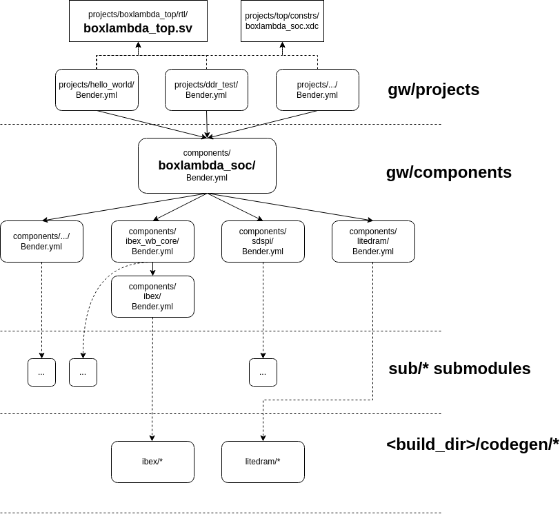

## The BoxLambda SoC Component

- **BoxLambda SoC Component in the BoxLambda Directory Tree**: 
    [boxlambda/gw/components/boxlambda_soc](https://github.com/epsilon537/boxlambda/tree/master/gw/components/boxlambda_soc)

- **BoxLambda SoC Module**:
    [gw/components/boxlambda_soc/rtl/boxlambda_soc.sv](https://github.com/epsilon537/boxlambda/blob/master/gw/components/boxlambda_soc/rtl/boxlambda_soc.sv)

The BoxLambda SoC module itself is defined as a gateware component.

```
/*The parameterized BoxLambda SoC.*/
module boxlambda_soc #(
    parameter DPRAM_BYTE_ADDR_MASK = 'h1ffff, /*DPRAM size as a mask value. Used both from CMEM and DMEM.*/
    parameter VRAM_SIZE_BYTES = 131072,
    parameter DEBUG_MODULE_ACTIVE = 1,
    parameter DRAM_ACTIVE = 1,
    parameter VERA_ACTIVE = 1,
    parameter SDSPI_ACTIVE = 1,
    parameter YM2149_ACTIVE = 1,
    parameter PICORV_ACTIVE = 1,
    parameter CMEM_FILE = "",
    parameter DMEM_FILE = ""
    ) (
    input  wire       ext_clk_100, //100MHz external clock.
    input  wire       ext_rst_n,   //External reset pin.
    
`ifdef VERILATOR  
  /*These JTAG signals are not used on FPGA (they are used in simulation).
   *On FPGA, the JTAG signals are driven by a BSCANE2 primitive inside the jtag tap module dmi_bscane_tap.sv.
   */
    input  wire       tck,
    input  wire       trst_n,
    input  wire       tms,
    input  wire       tdi,
    output wire       tdo,
`endif
    output wire       pll_locked_led, //PLL locked indication.
    output wire       init_done_led, //LiteDRAM initialization done indication.
    output wire       init_err_led, //LiteDRAM initialization error indication.
`ifdef SYNTHESIS
    /*The simulation build doesn't export DDR pins.*/
    output wire [13:0] ddram_a,
    output wire [2:0] ddram_ba,
    output wire ddram_ras_n,
    output wire ddram_cas_n,
    output wire ddram_we_n,
    output wire ddram_cs_n,
    output wire [1:0] ddram_dm,
    inout  wire [15:0] ddram_dq,
    inout  wire [1:0] ddram_dqs_p,
    inout  wire [1:0] ddram_dqs_n,
    output wire ddram_clk_p,
    output wire ddram_clk_n,
    output wire ddram_cke,
    output wire ddram_odt,
    output wire ddram_reset_n,
`endif
    // VGA interface
    output wire  [3:0] vga_r,       
    output wire  [3:0] vga_g,       
    output wire  [3:0] vga_b,       
    output wire        vga_hsync,   
    output wire        vga_vsync,   
    // SDSPI interface
    output wire  sdspi_cs_n, 
    output wire  sdspi_sck, 
    output wire  sdspi_mosi,
    input  wire	 sdspi_miso, 
    input  wire  sdspi_card_detect_n,
    // Audio interface
    output wire       audio_out,
    output wire       audio_gain,
    output wire       audio_shutdown_n,
`ifdef VERILATOR
    // Audio interface signals only used in simulation
    output wire [15:0] pcm_out,
    output wire acc1_overflow,
    output wire acc2_overflow,  
`endif
    // UART and GPIO
    input  wire       uart_rx,
    output wire       uart_tx,
    inout  wire [7:0] gpio0,
    inout  wire [3:0] gpio1
    );
```

The [Gateware Build Structure](build_sys_gw_build_struct.md#the-gateware-build-structure) section describes the three layer gateware build structure. The diagram below shows how the BoxLambda SoC component fits in that build structure.



*Build Diagram with BoxLambda SoC component and top.sv.*

Different *gw/project/* builds reference this *boxlambda_soc* component. The project builds differ in the way they instantiate the *boxlambda_soc* module, including or excluding specific subcomponents. Most *gw/projects*
 reference the same [top.sv](https://github.com/epsilon537/boxlambda/blob/master/gw/projects/top/rtl/top.sv) module, but with a different combination of *defines* in their *Bender.yml* manifest.

*Gw/project/* builds also differ in the software program they run on the SoC. This is specified in the *gw/project/*'s CMakefile.
