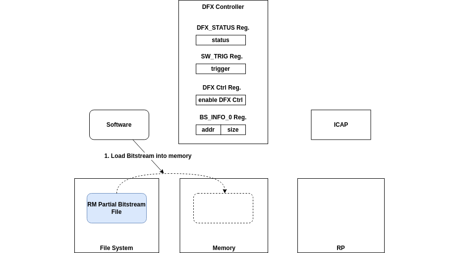
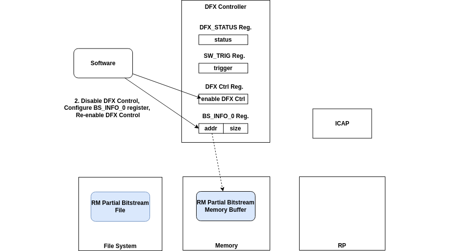
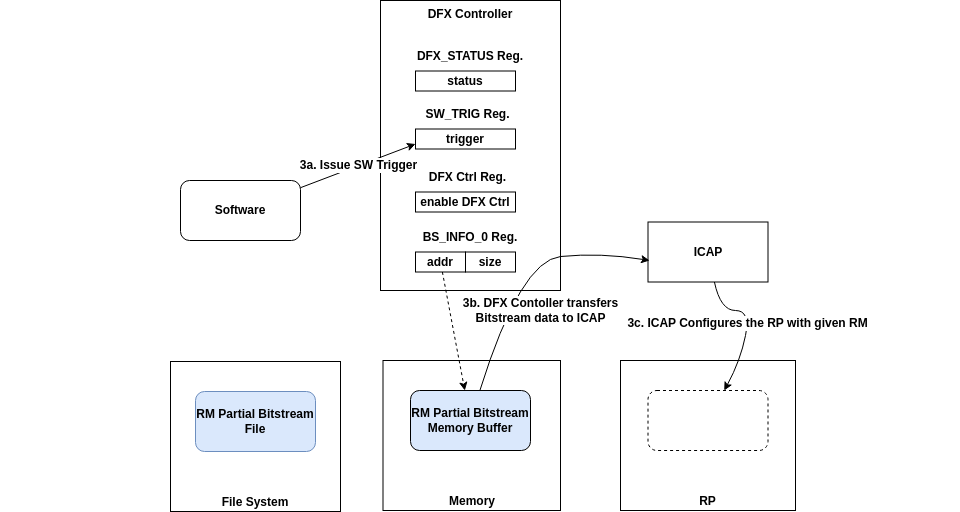
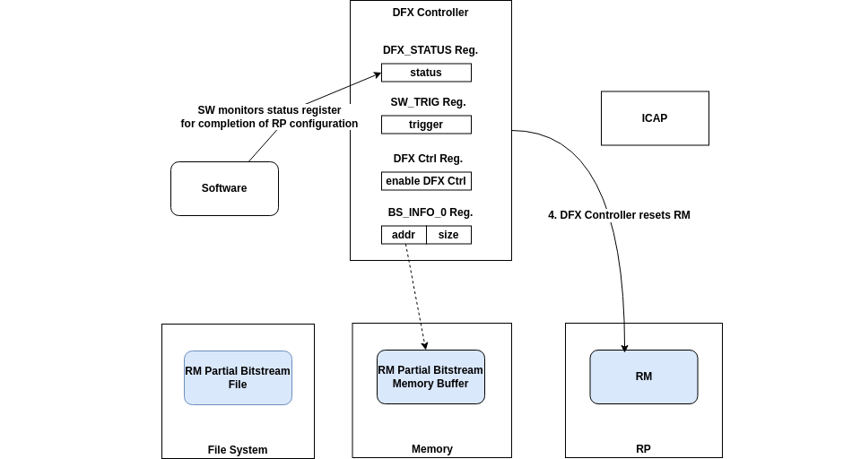
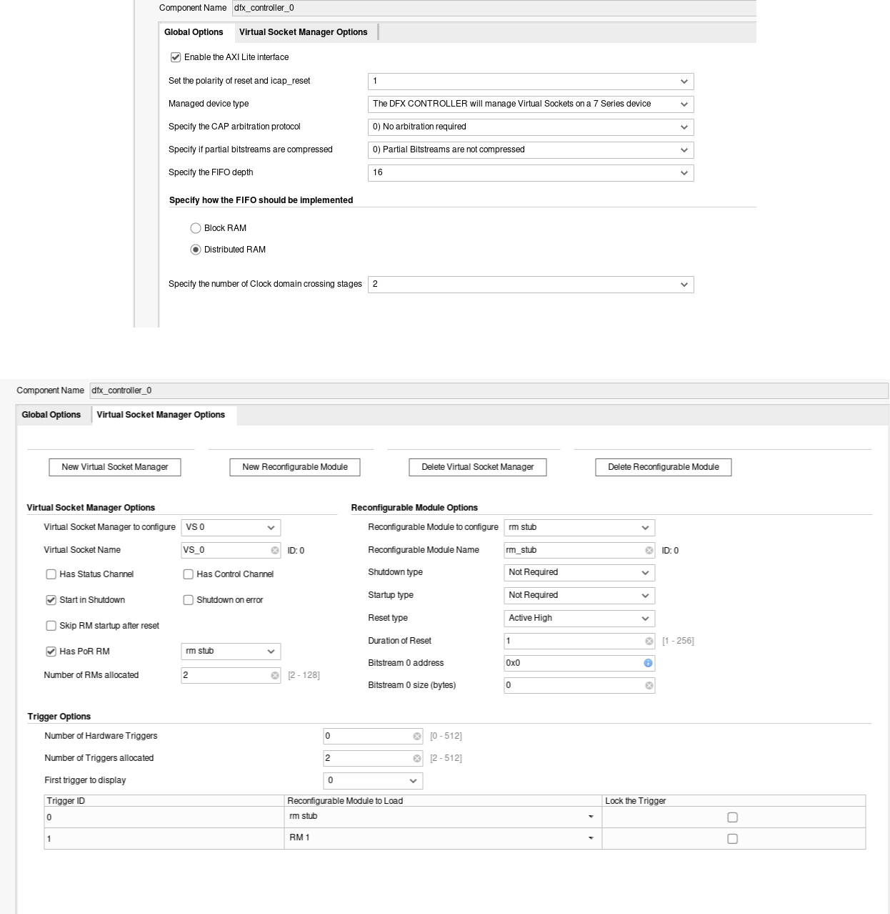
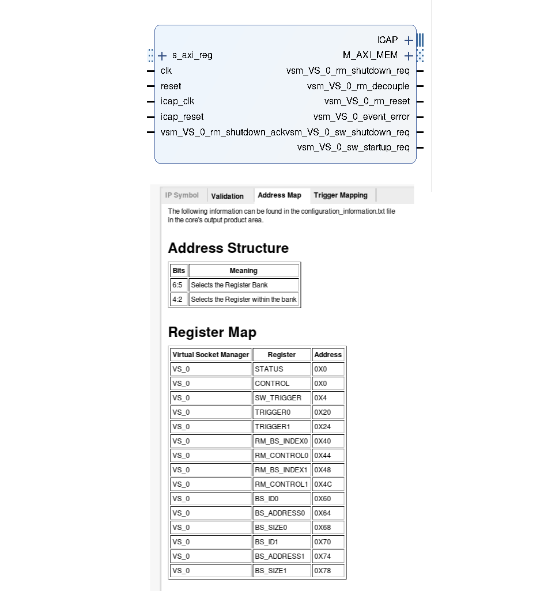
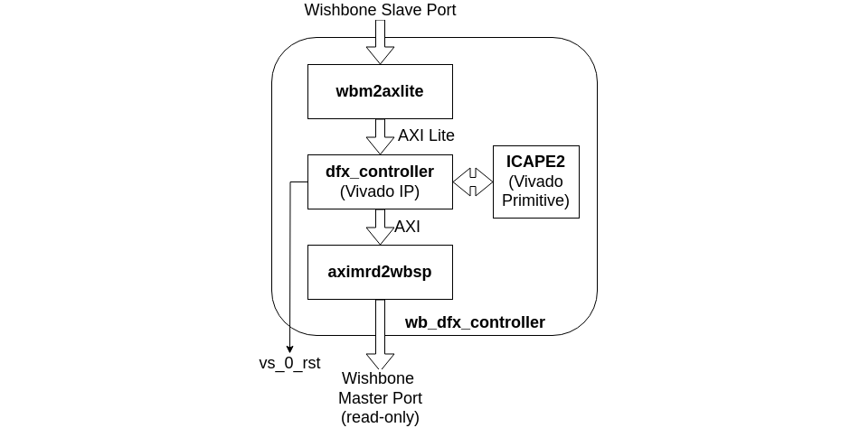

---
hide:
  - toc
---

## The DFX Controller

[AMD Xilinx DFX Controller Documentation](https://docs.amd.com/v/u/en-US/pg374-dfx-controller)

### DFX Controller Operation

To manage the loading of an RM into an RP from the SoC, a DFX Controller needs to be added to the design. The DFX Controller is a Vivado IP that provides management functions for DFX designs across many use cases. The hardware-triggered DFX use cases involve complex state machines and require extensive configuration. However, for BoxLambda, the use case is relatively simple: loading an RM into an RP under software control. Here's how it works:

1. A software program loads the RM's partial bitstream file into a memory buffer.

    

2. The software program shuts down the DFX Controller, configures the address and size of the bitstream memory buffer in the DFX Controller's `BS INFO` registers, and then re-enables the DFX Controller.

    

3. The software program issues a trigger to the DFX Controller using the `SW_TRIGGER` register. This causes the DFX Controller to start fetching the bitstream data from the configured memory location and feed it to the internal configuration access port (`ICAP`).

    

4. When the RP is configured, the DFX Controller resets the RP/RM.

    

The software program monitors the progression via the DFX Controller status register.

The `dfx_test` program contains a software routine that implements the complete sequence. See the function `dfx_load_module()` in the file [sw/projects/dfx_test/dfx_cli.cpp](https://github.com/epsilon537/boxlambda/blob/98b4f4e6d4bf33efa24f122d65c103f06b76289e/sw/projects/dfx_test/dfx_cli.cpp).

#### Binary for ICAP

The RM's partial bitstream, which is read from memory by the DFX Controller, is not in the regular bitstream file format generated by the `write_bitstream` command. The DFX Controller IP comes with a Tcl API function to convert the partial bitstream file into the format accepted by the `ICAP` primitive. This conversion is automatically done as part of the `make <component>_bit` build step. The result is a `.bin_for_icap` file. This is the file you want to dynamically load into the design using the [DFX Controller API](sw_comp_dfx_controller_hal.md).

### DFX Controller Parameterization

*DFX Controller Selected Parameters.*

The DFX Controller requires some parameterization, as shown in the screenshots above:

- The AXI Lite interface is enabled, allowing software to access the DFX Controller registers.
- The controller is managing a 7-series device.
- ICAP arbitration is not required. The DFX Controller is the only ICAP client in this design.
- FIFO depth and clock domain stages are set to the lowest possible values. Everything is running in one single clock domain, so clock domain crossing stages are not needed. However, there is no option to remove them altogether.
- Active High reset, one clock cycle wide.
- Bitstream address and size are irrelevant. They get reconfigured at run-time by software.
- Only one Virtual Socket Manager, to manage one RP.
- The number of RMs and triggers is set to two.

The resulting DFX Controller instance and register map look like this:

*DFX Controller IP and Register Map.*

Note that if you were to add a second RP to the design, the DFX Controller would need to be re-parameterized to manage two RPs.

### Wishbone to AXI Interworking

The DFX Controller IP bus interfaces are AXI-based, while BoxLambda is Wishbone-based. To bridge the two bus protocols, I'm using ZipCPU's [wbm2axilite](https://github.com/epsilon537/wb2axip/blob/c8dd694b472e74c53dcf9fa588b64e2b10ef65c0/rtl/wbm2axilite.v) and [aximrd2wbsp](https://github.com/epsilon537/wb2axip/blob/c8dd694b472e74c53dcf9fa588b64e2b10ef65c0/rtl/aximrd2wbsp.v). The resulting `wb_dfx_controller` module looks like this:

*wb_dfx_controller block diagram.*

Here's the RTL:

[gw/components/wb_dfx_controller/rtl/wb_dfx_controller.sv](https://github.com/epsilon537/boxlambda/blob/master/gw/components/wb_dfx_controller/rtl/wb_dfx_controller.sv)
