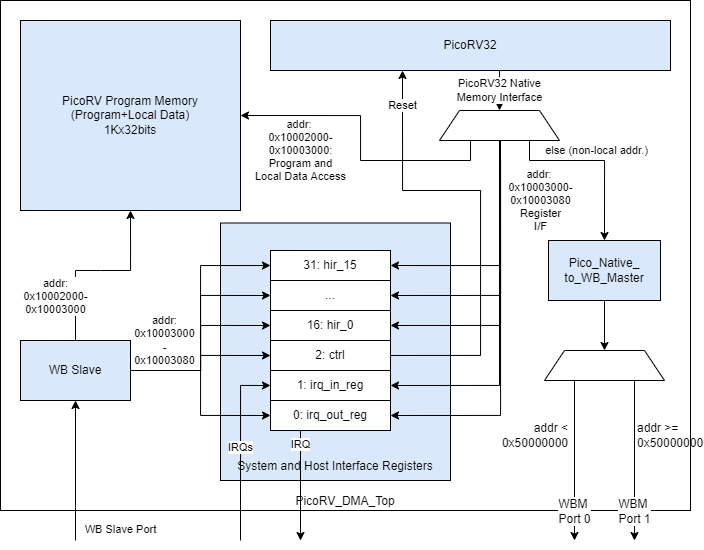
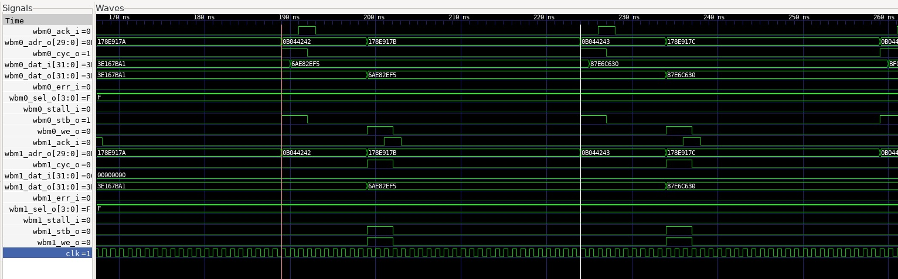

## DMA Controller

- **PicoRV32 Repo**, BoxLambda fork, *boxlambda* branch:
    [https://github.com/epsilon537/picorv32](https://github.com/epsilon537/picorv32)

- **PicoRV32 Submodule in the BoxLambda Directory Tree**: 
    boxlambda/sub/picorv32/.

- **PicoRV DMA Component in the BoxLambda Directory Tree**: 
    [boxlambda/gw/components/picorv_dma](https://github.com/epsilon537/boxlambda/tree/master/gw/components/picorv_dma)

- **PicoRV DMA Core Top-Level**:
    [gw/components/picorv_dma/rtl/picorv_dma_top.sv](https://github.com/epsilon537/boxlambda/blob/master/gw/components/picorv_dma/rtl/picorv_dma_top.sv)

- **PicoRV DMA Register interface**:
    [sw/components/picorv_dma/picorv_dma_hal.h](https://github.com/epsilon537/boxlambda/blob/master/sw/components/picorv_dma/picorv_dma_hal.h)

The goal of the DMA Controller is to use it for data transfers between external and internal memory and to assist the CPU with use cases such as graphics blitting, audio playback, and file I/O. These use cases require a lot of flexibility:

- Multiple data widths: bytes, 16-bit half-words, 32-bit words.
- Differences in data width between source and destination.
- Multiple data alignment scenarios: all possible combinations of word-aligned and unaligned sources and destinations.
- Different block sizes and strides, both in source and destination.
- Scatter-Gather.
- Bit manipulations such as bit-masking and rotation on the data being transferred.
  
To achieve these goals I decided to take a processor-based approach, using the [PicoRV32](https://github.com/YosysHQ/picorv32) RISC-V processor.

### Transfer Scenarios

If the DMA Controller is to assist in graphics blitting, audio playback, and file I/O use cases, a great deal of flexibility is required. Example transfer scenarios include, but are not limited to:

- Multiple data widths and differences in data width between source and destination.: bytes, 16-bit half-words, 32-bit words.
- Multiple data alignment scenarios: all possible combinations of word-aligned and unaligned sources and destinations.
- Different block sizes and strides, both in source and destination.
- Scatter-Gather.
- Flow Control and Rate Control.
- Bit manipulations such as bit-masking and rotation on the data being transferred.


*Example DMA Transfer Scenarios.*

With a processor-based DMA Controller, these scenarios can easily be implemented through a simple assembly program handling load and store pointer manipulations, ALU operations on the data being moved, and IRQ-driven flow and rate control.

### The PicoRV DMA Core Block Diagram



*The PicoRV DMA Core Block Diagram.*

The DMA core's top-level is located here:

[https://github.com/epsilon537/boxlambda/blob/master/gw/components/picorv_dma/rtl/picorv_dma_top.sv](https://github.com/epsilon537/boxlambda/blob/master/gw/components/picorv_dma/rtl/picorv_dma_top.sv)

Memory accesses coming from the PicoRV processor are mapped into three address spaces:

- 0x10002000-0x10003000: PicoRV **Program Memory**, or to be more accurate, Program Memory and Local Data.
- 0x10003000-0x10003080: The DMA Core's **System Registers** and **Host Interface Registers** (HIR), not to be confused with PicoRV's own registers (x0-x31).
- All other memory accesses are considered non-local and are turned into Wishbone Bus Master (WBM) transactions. These WBM transactions are dispatched to WBM port 0 or port 1 based on a cut-off address (0x50000000). The intent is to attach port 0 to the Processor Bus and port 1 to the DMA Bus. See BoxLambda's [Architecture Diagram](architecture.md#architecture).

These address spaces match with the world view of BoxLambda's Ibex RISC-V host processor.

Through the Wishbone Slave (WBS) port, the Host Processor has access to PicoRV's Program Memory, the System Registers, and the Host Interface Registers. 

Host processor access to PicoRV's Program Memory is only enabled when the PicoRV is held in reset. PicoRV reset is controlled through one of the System Registers, the **Control Register**. 

The 16 Host Interface Registers serve as the communication interface between the Host Processor and the DMA Controller. They are general-purpose registers. Their role is decided by the program that gets loaded into PicoRV's Program Memory.

System Registers **IRQ_in** and **IRQ_out** are for interrupt handling and interrupt reporting respectively:

- *IRQ_in* register: System interrupts get registered here. The PicoRV itself is configured without interrupt handling support. Instead, the program loop is expected to poll the IRQ_in register if interrupt handling is required.
- *IRQ_out* register: The PicoRV can set IRQs in this register. If any bits in the *IRQ_out* register are set, the core sets the **irq_out** output signal.

#### Usage

The intended usage is as follows:

- The Host Processor loads an application-specific microprogram into the DMA core.
- The PicoRV executes from its own Program Memory. This is expected but not enforced. The PicoRV can fetch instructions from external memory through the bus master ports.
- The Host Processor configures DMA requests and the PicoRV reports status through the Host Interface Registers. The role of the different registers is determined by the application-specific microprogram running on the PicoRV.
- Flow Control can be implemented through interrupts, or by having the PicoRV poll the given slave using the slave's register interface.
- Rate Control can be implemented through interrupts or PicoRV internal timing.
   
Note that although I primarily intend to use the PicoRV DMA core for DMA purposes, it can be used as a general-purpose auxiliary processor as well. All it takes is to load a microprogram that consists of a single jump to the main program in on-chip or external memory.

### Example

A simple word copy microprogram can look like this:

```
.include "picoasm_hal.h"
/*Word Copy test program*/
    .text
    .balign 4
    .globl _start
    /*Status register values*/
    .equ STAT_START, 1
    .equ STAT_BUSY, 3
    .equ STAT_DONE, 0
_start:
    li a0, HIR_REGS_BASE_ADDR
wait_start:
    lw a1, HIR3(a0)   /*HIR3: ctrl-status*/
    beqz a1, wait_start
    li a1, STAT_BUSY
    sw a1, HIR3(a0)   /*set status to 'Busy'*/
    lw a1, HIR0(a0)    /*HIR0: src pointer*/
    lw a2, HIR1(a0)    /*HIR1: dst pointer*/
    lw a3, HIR2(a0)    /*HIR2: num words*/
    slli a3, a3, 2    /*Multiple by 4 to convert to byte address offset.*/
    add a3, a3, a1    
loop:
    /*Copy word by word*/
    lw t0, 0(a1)
    sw t0, 0(a2)
    addi a1, a1, 4
    addi a2, a2, 4
    bltu a1, a3, loop
    sw zero, HIR3(a0) /*set to 'Done'*/
    j wait_start
```

The Ibex host processor program loads the microprogram binary into the DMA core and takes the core out of reset using a simple [HAL-level API](https://github.com/epsilon537/boxlambda/blob/master/sw/components/picorv_dma/picorv_dma_hal.h):

```
picorv_load_program(picorv_wordcopy_picobin, picorv_wordcopy_picobin_len);
picorv_sys_reg_wr(PICORV_SYS_REG_CTRL, 1);
```

Once this is done, the PicoRV DMA controller behaves just like a very basic, hardwired DMA controller. From the host processor, you configure the source and destination address, a number of words to copy, and you kick it off.

```
picorv_gp_reg_wr(PICORV_GP_REG_SRC, (unsigned)src);
picorv_gp_reg_wr(PICORV_GP_REG_DST, (unsigned)dst);
picorv_gp_reg_wr(PICORV_GP_REG_NUM_ELEMS, numElems);
printf("Kicking off DMA...\n");
picorv_gp_reg_wr(PICORV_GP_REG_CTRL_STAT, DMA_START);
printf("Waiting for completion...\n");
int dmaBusy = DMA_BUSY;
while(dmaBusy)
    dmaBusy = picorv_gp_reg_rd(PICORV_GP_REG_CTRL_STAT);
```

### Performance

This is the waveform of the DMA core copying words from port 0 to port 1, using the naive word copy program:



*Waveform of PicoRV wordcopy from port 0 to port 1.*

Using two fast Wishbone slaves, it takes 35 clock cycles to copy one word. Note that the actual word read and word write transactions only take 6 cycles. The rest, 29 cycles, is overhead. Bus utilization is at 17%. That's not good.

With some loop unrolling in the assembly microcode, I can get to 20 clock cycles to copy one word, or 30% bus utilization. Better, but still nothing to brag about.

If I double the PicoRV's clock speed, the amount of overhead would be cut in half and I would be able to achieve 46% bus utilization (6 clock cycles utilization, 7 clock cycles overhead).

Another option would be to add some logic to allow the PicoRV to kick off a short burst of read or write transactions, e.g. 4 words at a time. In that case, I would get 4x6 clock cycles utilization and 7 clock cycles overhead. That's 77% bus utilization. I can live with that.

For slower slaves, bus utilization will increase further, because the slave response time starts to dominate. E.g. if it takes 10 clock cycles for a wishbone read or write transaction, we get 4x20 clock cycles utilization and 7 clock cycles overhead (assuming previous optimizations are implemented), or 92% bus utilization. Actual throughput would go down, however, because the slave is slow.

In the case of external memory, the slave is not slow, but latency is high. The best way to improve throughput for such slaves is through block transfers with multiple outstanding reads or writes. This requires additional logic on the bus master side, the bus slave side, and the bus fabric in between. I'm keeping this on my wishlist, as a stretch goal.
