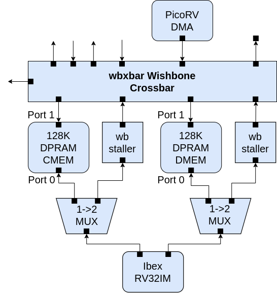

## The Dual-Port RAM Modules

- **DPRAM Repo**, BoxLambda fork, *boxlambda* branch:
    [https://github.com/epsilon537/verilog-wishbone](https://github.com/epsilon537/verilog-wishbone).

- **DPRAM Submodule in the BoxLambda Directory Tree**:
    boxlambda/sub/verilog_wishbone/.

- **DPRAM Component in the BoxLambda Directory Tree**:
    [boxlambda/gw/components/wb_dp_ram](https://github.com/epsilon537/boxlambda/tree/master/gw/components/wb_dp_ram)

- **DPRAM Core Top-Level**:
    [gw/components/wb_dp_ram/rtl/wb_dp_ram_wrapper.sv](https://github.com/epsilon537/boxlambda/blob/master/gw/components/wb_dp_ram/rtl/wb_dp_ram_wrapper.sv)

- **XPM_MEMORY_TDPRAM Documentation**:
    [https://docs.xilinx.com/r/en-US/ug974-vivado-ultrascale-libraries/XPM_MEMORY_TDPRAM](https://docs.xilinx.com/r/en-US/ug974-vivado-ultrascale-libraries/XPM_MEMORY_TDPRAM)

The *wb_dpram_wrapper.sv* module selects one of two DPRAM implementations depending on whether we're targeting simulation or FPGA synthesis.

On FPGA, I'm using an **XPM_MEMORY_TDPRAM** instance. Using an XPM macro for internal memory allows me to do post-synthesis memory image updates in the bitstream file, as described [here](build_sys_building_gw.md#updatemem-and-xpm-memories).

I did run into a spurious write issue with XPM_MEMORY_TDPRAM. To avoid the issue, I had to qualify the Write Enable (*wea/web*) signals with the *valid* signals even though the valid signals were already going to the module's Memory Enable ports (*ena/enb*):

```
    assign a_valid    = a_cyc_i & a_stb_i;
    assign b_valid    = b_cyc_i & b_stb_i;
    ...
    assign a_ram_we   = {4{a_we_i&a_valid}} & a_sel_i;
    assign b_ram_we   = {4{b_we_i&b_valid}} & b_sel_i;
    ...
    .ena(a_valid),                       // 1-bit input: Memory enable signal for port A. Must be high on clock
                                        // cycles when read or write operations are initiated. Pipelined
                                        // internally.

    .enb(b_valid),                       // 1-bit input: Memory enable signal for port B. Must be high on clock
                                        // cycles when read or write operations are initiated. Pipelined
                                        // internally.
    ...
    .wea(a_ram_we),                     // WRITE_DATA_WIDTH_A/BYTE_WRITE_WIDTH_A-bit input: Write enable vector
                                        // for port A input data port dina. 1 bit wide when word-wide writes are
                                        // used. In byte-wide write configurations, each bit controls the
                                        // writing one byte of dina to address addra. For example, to
                                        // synchronously write only bits [15-8] of dina when WRITE_DATA_WIDTH_A
                                        // is 32, wea would be 4'b0010.

    .web(b_ram_we)                      // WRITE_DATA_WIDTH_B/BYTE_WRITE_WIDTH_B-bit input: Write enable vector
                                        // for port B input data port dinb. 1 bit wide when word-wide writes are
                                        // used. In byte-wide write configurations, each bit controls the
                                        // writing one byte of dinb to address addrb. For example, to
                                        // synchronously write only bits [15-8] of dinb when WRITE_DATA_WIDTH_B
                                        // is 32, web would be 4'b0010.
    ...
```

In simulation, I'm using Alex Forencich's [wb_dp_ram.v](https://github.com/epsilon537/verilog-wishbone/blob/boxlambda/rtl/wb_dp_ram.v) module.

### Two Dual Port RAMs



*CMEM and DMEM in the BoxLambda SoC.*

BoxLambda's internal memory consists of two Dual Port instances: **CMEM** and **DMEM**. The two instances create a Harvard Architecture (see below). The RAMs are Dual Port to allow simultaneous memory access from both the CPU and the DMA Controller.


*Harvard vs. Von Neumann Architecture.*

In a Von Neumann Architecture, the CPU has access to one memory that stores both instructions and data. Instruction Fetch and Data Access transactions share one memory bus. In a Harvard Architecture, Instruction Memory is separate from Data Memory. Instruction Fetch and Data Access transactions can be executed independently.

The Ibex processor has separate Instruction and Data ports. When accessing internal memory, the instruction port by default targets CMEM, and the data port by default targets DMEM. These defaults can be overridden by mapping data to the **.cmem_bss** section and code to the **.dmem_text** section. See the [Linker Script](sw_comp_picolibc.md#the-linker-script) section for details.

### The Default CMEM memory image

The default CMEM memory image is [sw/projects/cmem_to_flash_vector/cmem.mem](https://github.com/epsilon537/boxlambda/tree/master/sw/projects/cmem_to_flash_vector). This is the *cmem_to_flash_vector* software image, checked into the source tree. When building a *<gw_project\>_bit_sw* target, this image will be replaced with the image of the software program referenced in the gateware project's *CMakeLists.txt* file (using post-synthesis memory update). When we're just building the *<gw_project\>_bit* target, however, the default *cmem_to_flash_vector* image will remain in place, setting up the project to boot from flash memory.

### Address Ranges and Sizes

| Port | Start Byte Address | End Byte Address | Size (Kbytes) |
|------|--------------------|------------------|---------------|
| CMEM Port 0 | 0x00000000 | 0x0001FFFF | 128 |
| CMEM Port 1 | 0x00000000 | 0x0001FFFF | 128 |
| DMEM Port 0 | 0x00020000 | 0x0003FFFF | 128 |
| DMEM Port 1 | 0x00020000 | 0x0003FFFF | 128 |

Both ports of CMEM and DMEM have the same address range. The CPU and the DMAC can access the same memory location using the same address. The CPU access will go through port 0. The DMAC access will go through port 1.

### DPRAM Clock Frequency

The two DPRAM instances, CMEM and DMEM, are part of the 50MHz System Clock Domain.
