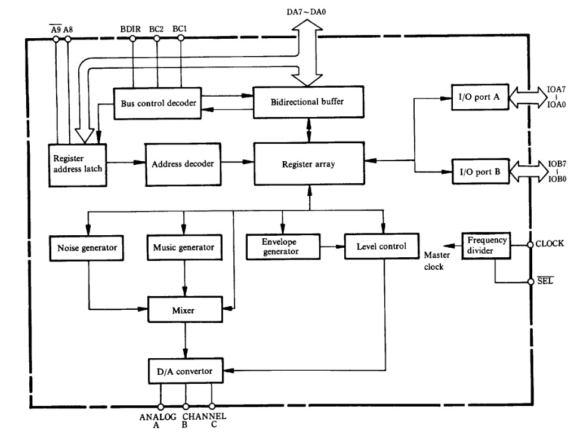
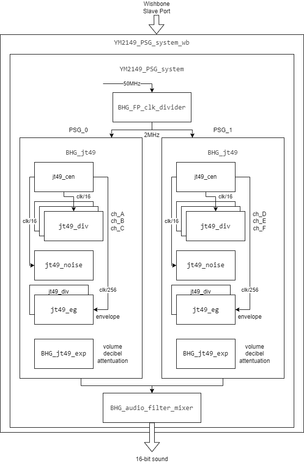
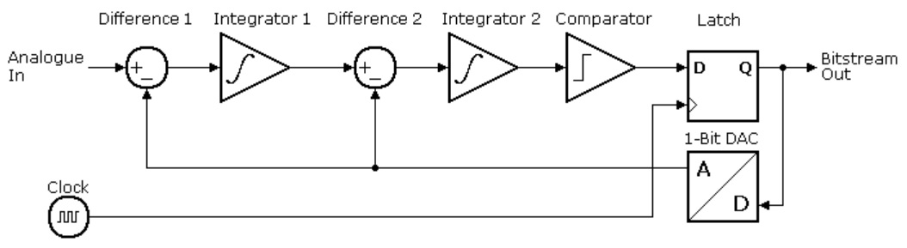

---
hide:
  - toc
---

## Dual YM2149 PSG Sound Core

- **YM2149_PSG_system Repo**, BoxLambda fork, `boxlambda` branch:
    [https://github.com/epsilon537/YM2149_PSG_system](https://github.com/epsilon537/YM2149_PSG_system).

- **YM2149_PSG_system Submodule in the BoxLambda Directory Tree**:
    boxlambda/sub/ym2149_psg_system/.

- **YM2149_PSG_system Component in the BoxLambda Directory Tree**:
    [boxlambda/gw/components/ym2149](https://github.com/epsilon537/boxlambda/tree/master/gw/components/ym2149)

- **YM2149_PSG_system Core Top-Level**:
    [sub/ym2149_psg_system/YM2149_PSG_system_wb.sv](https://github.com/epsilon537/YM2149_PSG_system/blob/boxlambda/YM2149_PSG_system_wb.sv)

- **YM2149 Data Sheet**:
    [http://www.ym2149.com/ym2149.pdf](http://www.ym2149.com/ym2149.pdf)

A sound core is a perfect candidate for Partial FPGA Reconfiguration. There are a lot of options (Wave-Table synthesis, FM synthesis, PSG...) and a lot of open-source cores available. It would be pretty cool if the software application could just download its synthesizer of choice as part of the program.

Pretty much any core developed by [Jotego](https://github.com/jotego) sounds like a great idea.

I added a Dual [**YM2149**](https://en.wikipedia.org/wiki/General_Instrument_AY-3-8910) PSG core to BoxLambda. Each core provides three PSG channels, so one core can play a 3-channel audio track and the other core can play up to three overlapping sound effects.

### Programmable Sound Generators (PSG)

A Programmable Sound Generator is a chip that generates sound by combining multiple basic waveforms (channels). Typical waveforms used are square waves, triangular waves, and noise. The shape, frequency, and volume of the different waveforms are configured by the CPU through a register interface.

PSG chips usually also include one or more envelope generators that control the variation of the sound's volume over time (ramp up, hold, ramp down, etc.). Different envelope shapes and associated parameters can be configured through the register interface.

### The YM2149

The YM2149 is a little PSG chip used in 80s arcade games, consoles, and home computer systems such as MSX and the Atari ST. The chip has a 3-channel square wave generator, a noise generator, and an envelope generator.
Here's the datasheet:
[http://www.ym2149.com/ym2149.pdf](http://www.ym2149.com/ym2149.pdf)

*YM2149 Block Diagram as shown in the datasheet.*

### A Dual YM2149 PSG Audio core: *YM2149_PSG_System*

When you're searching online for a YM2149 implementation, you'll quickly come across Jotego's *JT49* core:

[https://github.com/jotego/jt49](https://github.com/jotego/jt49)

My initial plan was to instantiate this core twice and add the PCM output signals together. However, looking a little further, I found a project from Nockieboy that already did that and added a nice audio mixer with volume, treble, and bass controls:

[https://github.com/nockieboy/YM2149_PSG_system](https://github.com/nockieboy/YM2149_PSG_system)

The project even supports I2S output, but currently, I just have a simple audio amplifier PMOD, so I wouldn't be using I2S (I added it to the wishlist).

For the most part, I was able to use the `YM2149_PSG_system` code as-is. I just had to make a few small tweaks to integrate the core into BoxLambda:

- I added a Wishbone front end.
- I made I2S support optional, controlled by a `USE_I2S` define.
- I made a few code tweaks to pacify Vivado's synthesizer.

I forked the `YM2149_PSG_system` repo to track my changes:

[https://github.com/epsilon537/YM2149_PSG_system](https://github.com/epsilon537/YM2149_PSG_system)

#### YM2149 PSG System Overview

*YM2149 PSG System Block Diagram.*

The design of the `YM2149_PSG_system` core is easy to follow:

- `YM2149_PSG_system_wb` is a Wishbone wrapper around the **YM2149_PSG_system** core.
- `BHG_jt49` represents one YM2149 device. `YM2149_PSG_system` instantiates two such modules and feeds their output to the `BHG_audio_filter_mixer`.
- `BHG_audio_filter_mixer` implements mixing logic, individual channel volume controls, master volume control, treble, and bass controls.
- Looking into the `BHG_jt49` module:
  - `jt49_div` is a configurable square wave generator module. It is instantiated three times, so we have three channels.
  - `jt49_noise` is a noise generator module (e.g., for percussion effects).
  - `jt49_eg` with the assistance of a fourth `jt49_div` instance is the sound envelope generator.
  - `jt49_cent` generates clock enables at the appropriate rate for the above modules.
  - `BHG_jt49_exp` provides decibel-based volume attenuation through a look-up table.

The core can be configured to produce stereo I2S output, but for BoxLambda, we'll set it up to produce 16-bit PCM mono audio.

### A Second Order Delta-Sigma DAC

The `YM2149_PSG_System` core produces 16-bit PCM audio. The audio amplifier PMOD expects the audio signal on a single pin, however. To bring 16-bit PCM audio to a single digital pin, we need a **one-bit Digital-to-Analog converter**. If you've never heard of one-bit DACs before, it probably sounds terrible, but it works quite well. The idea is to generate, at a rate much higher than the input sample rate, a stream of pulses such that a moving average going over the pulse stream produces a signal that tracks the input 16-bit PCM signal.

*1-bit delta-sigma modulation (blue) of a sine wave (red) - taken from [Wikipedia](https://en.wikipedia.org/wiki/Delta-sigma_modulation).*

In analog electronics, a moving average is created by attaching a simple low-pass RC filter to the one-bit DAC pin. In our case, we don't even have to do that, because the audio amplifier PMOD provides the low-pass filter.

There exist several ways to implement a one-bit DAC, with different pros and cons. One commonly used technique is called **Delta-Sigma Conversion**. It's explained very well in the following article from Uwe Beis:

[https://www.beis.de/Elektronik/DeltaSigma/DeltaSigma.html](https://www.beis.de/Elektronik/DeltaSigma/DeltaSigma.html)

*Second Order Delta Sigma Modulator Block Diagram from [https://www.beis.de/Elektronik/DeltaSigma/DeltaSigma.html](https://www.beis.de/Elektronik/DeltaSigma/DeltaSigma.html).*

I'll be using a **Second Order Delta-Sigma DAC**. An advantage of a second-order delta-sigma DAC is that it (more than its first-order counterpart) pushes the noise introduced by the Digital-to-Analog conversion out of the way, to higher frequency ranges where it gets filtered out by the low-pass filter.

The Uwe Beis article above describes the idea well enough. However, I was unable to find a reference implementation that made sense to me. I ended up writing my own, borrowing ideas from the following implementations I found online:

- [https://forum.digilent.com/topic/20332-second-order-sigma-delta-dacs-implemented-in-a-fpga/?do=findComment&comment=65787](https://forum.digilent.com/topic/20332-second-order-sigma-delta-dacs-implemented-in-a-fpga/?do=findComment&comment=65787)
- [https://github.com/briansune/Delta-Sigma-DAC-Verilog?_ga=2.154876920.117504330.1692006910-1995131070.1681993594](https://github.com/briansune/Delta-Sigma-DAC-Verilog?_ga=2.154876920.117504330.1692006910-1995131070.1681993594)

Here is my Verilog code:

[https://github.com/epsilon537/boxlambda/blob/master/gw/components/audio_dac/rtl/one_bit_dac.sv](https://github.com/epsilon537/boxlambda/blob/master/gw/components/audio_dac/rtl/one_bit_dac.sv)

It wasn't obvious to me how to size the two accumulators used in the implementation so that they don't overflow and create conversion errors. I ended up adding logic that checks for overflows and experimented with different audio samples. The outcome was that for a 16-bit input signal, the stage-1 accumulator needs to be 20 bits in size and the stage-2 accumulator needs to be 22 bits in size.

### The Audio DAC Test Project

I created a test project to test the one-bit DAC. The RTL consists of a sine wave generator connected to an instance of the one-bit DAC. The top-level module output ports include:

- The 16-bit PCM sine wave signal (Verilator build only)
- The one-bit DAC output signal
- The stage-1 accumulator overflow detect signal from the one-bit DAC (Verilator build only).
- The stage-2 accumulator overflow detect signal from the one-bit DAC (Verilator build only).

Here's the top-level Verilog:

[https://github.com/epsilon537/boxlambda/blob/master/gw/projects/audio_dac_test/rtl/audio_dac_test.sv](https://github.com/epsilon537/boxlambda/blob/master/gw/projects/audio_dac_test/rtl/audio_dac_test.sv)

The Verilator testbench ([sim_main.cpp](https://github.com/epsilon537/boxlambda/blob/master/gw/projects/audio_dac_test/sim/sim_main.cpp)) samples at 12.5MHz the 16-bit PCM signal and the one-bit DAC signal. It writes out the PCM samples as a Python array to `pcm_out.py` and the DAC samples as a Python array to `dac_out.py`. The testbench will also flag an error if any accumulator overflows are reported.

The Verilator testbench executes for 0.5s of simulated time. Then, a python module ([dac_test.py](https://github.com/epsilon537/boxlambda/blob/master/gw/projects/audio_dac_test/test/dac_test.py)) imports the generated `pcm_out.py` and `dac_out.py` and performs the following operations:

1. The PCM samples and DAC samples are converted to numpy arrays and normalized.
2. Both signals are sent through a low-pass filter.
3. An FFT is taken of the filtered signals, so we have a frequency domain view and a time domain view of both signals.
4. The time domain and the frequency domain versions of the two signals are plotted against each other for visual inspection.
5. The filtered DAC and PCM signals are correlated against each other. This is done both in the time domain and the frequency domain. If the correlation match is higher than 99%, the test is declared successful.

The test project code is located here:

[https://github.com/epsilon537/boxlambda/tree/master/gw/projects/audio_dac_test](https://github.com/epsilon537/boxlambda/tree/master/gw/projects/audio_dac_test)

See [here](test-build-ym2149.md#audio-dac-test-on-verilator) for instructions to build and run the test yourself.

### The YM2149 DAC Test Project - a Chord of Six Pitches.

This test project is a BoxLambda SoC with the `YM2149_PSG_system` core and the one-bit DAC integrated.
Through software, the `YM2149_PSG_system` core is configured to produce six tones at six different pitches.
Similar to the previous test, the Verilator testbench code checks for accumulator overflows and saves the generated audio samples to `pcm_out.py` and `dac_out.py` for further analysis in Python.

The Python script ([ym2149_test.py](https://github.com/epsilon537/boxlambda/blob/master/gw/projects/ym2149_dac_test/test/ym2149_test.py)) imports the generated `dac_out.py` and performs the following operations:

1. The DAC samples are converted to a numpy array and normalized.
2. The normalized signal is sent through a low-pass filter.
3. The frequency spectrum of the filtered signal is computed.
4. The spectrum's frequency bins up to 1000Hz are analyzed and plotted.
5. Six peak frequencies are identified and matched against the 6 expected pitches. If the deviation is small, the test is declared successful.

The test project code is located here:

[https://github.com/epsilon537/boxlambda/tree/master/gw/projects/ym2149_dac_test](https://github.com/epsilon537/boxlambda/tree/master/gw/projects/ym2149_dac_test)

See [here](test-build-ym2149.md#ym2149-dac-test-on-verilator) for instructions to build and run the test yourself.

### Dual YM2149 PSG Core Clock Frequency

The core's clock frequency and PSG clock frequency (clock enable) are core module parameters. The core is instantiated with a clock frequency of 50MHz (BoxLambda's system clock domain) and a PSG clock frequency of 2MHz. I set the PSG clock frequency to 2 MHz to match the Atari ST.
