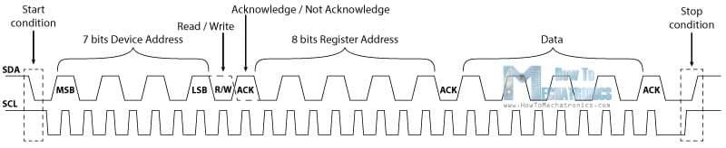
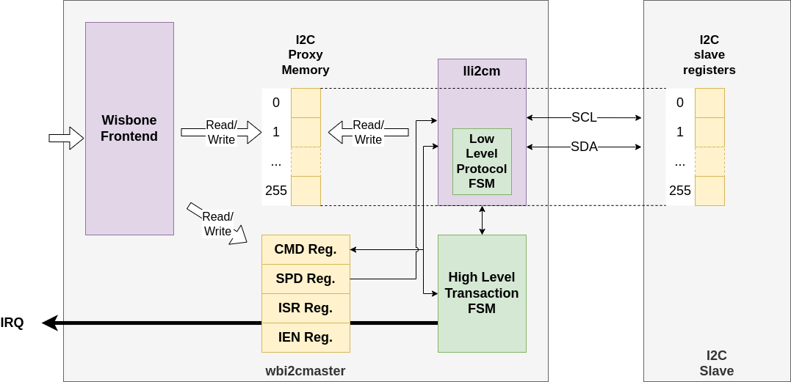
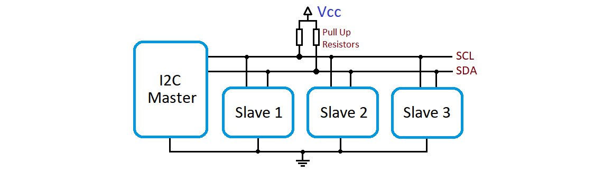
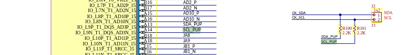

---
hide:
  - toc
---

## I2C

- **I2C Repo**, BoxLambda fork, `boxlambda` branch:
    [https://github.com/epsilon537/wbi2c](https://github.com/epsilon537/wbi2c)

- **I2C Submodule in the BoxLambda Directory Tree**:
    boxlambda/sub/wbi2c/

- **I2C Component in the BoxLambda Directory Tree**:
    [boxlambda/gw/components/i2c_master](https://github.com/epsilon537/boxlambda/tree/master/gw/components/i2c_master)

- **I2C Core Top-Level**:
    [https://github.com/epsilon537/wbi2c/blob/boxlambda/rtl/wbi2cmaster.v](https://github.com/epsilon537/wbi2c/blob/boxlambda/rtl/wbi2cmaster.v)

For info about the I2C protocol in general, please check the following resources:

- [https://www.robot-electronics.co.uk/i2c-tutorial](https://www.robot-electronics.co.uk/i2c-tutorial)
- [https://learn.sparkfun.com/tutorials/i2c/all](https://learn.sparkfun.com/tutorials/i2c/all)
- [https://ai.thestempedia.com/docs/evive/evive-technical-specifications/arduino-core-interface/i2c-communication/](https://ai.thestempedia.com/docs/evive/evive-technical-specifications/arduino-core-interface/i2c-communication/)
- [https://en.wikipedia.org/wiki/I%C2%B2C](https://en.wikipedia.org/wiki/I%C2%B2C)

### WBI2C

Although it's perfectly doable to implement I2C in software using bit banging, I chose to use a gateware-assist. I'm using the I2C Bus Master core of ZipCPU's WBI2C repo. As usual, I forked the repo so I can easily implement customizations for BoxLambda. Here's the GitHub page:

[https://github.com/epsilon537/wbi2c](https://github.com/epsilon537/wbi2c)

This is the I2C Bus Master core top-level:

[https://github.com/epsilon537/wbi2c/blob/boxlambda/rtl/wbi2cmaster.v](https://github.com/epsilon537/wbi2c/blob/boxlambda/rtl/wbi2cmaster.v)

### The Slave Register Protocol

WBI2C implements the traditional I2C protocol used to access 8-bit I2C slave registers. The protocol uses an address frame consisting of a 7-bit slave address and a read/write bit, followed by one or more byte-sized data frames. The first of these data frames contains the slave register address.



*I2C transaction with 7-bit slave address and 8-bit slave register address (Source: STEMpedia).*

10-bit addressing is not supported.

A quick note on terminology:

- **I2C Slave Address**: An I2C bus supports multiple slave devices. Each slave device has a unique address, distinguishing it from the other slaves on the bus. This address is what I'm calling the *Slave Address* in the discussion below.
- **I2C Slave Register Address**: Most I2C slaves implement multiple byte-wide configuration and status registers. These registers are addressed using the first byte of an I2C data frame (i.e. the first byte following the address frame). This address is called the *Slave Register Address*.

### Theory of Operation



*The WBI2C Master Core.*

The WBI2C core contains a 256-byte memory acting as a proxy for the register space of the I2C slave device. The idea is that software writes into the proxy memory, at the intended register addresses, and then requests WBI2C to push this data to the I2C slave registers using the I2C Slave Register Protocol. Vice versa when reading from the slave.

Going into a little more detail, to write to a single I2C slave register:

1. Software writes the register byte value into the proxy memory at the slave register address.
2. Software writes to WBI2C's command (CMD) register, specifying:
    - the 7-bit slave address.
    - the 8-bit slave register address (corresponding with a proxy memory address location).
    - the number of bytes to send (1 in case of a single register write).
    - a flag indicating that this is a write transaction.
4. WBI2C reads the register value from proxy memory and sends it to the slave using the Slave Register Protocol.
5. Software waits for the completion of the transaction by polling the CMD register `Busy` bit. Instead of polling, WBI2C can be configured to generate an IRQ when the transaction is complete.

**I2C CMD Register Layout**:

| Bit 31 | Bit 30 | Bits 29:24 | Bits 23:17 | Bit 16 | Bits 15:8 | Bits 7:0 |
|--------|--------|------------|------------|--------|-----------|----------|
| Busy   | Err.    | -         | Slave Addr. | R (1)/ W (0) | Slave Reg. Addr. | Num. Bytes |

To read from a single I2C slave register:

1. Software initiates a read transaction by writing to the WBI2C CMD register, specifying:
    - the 7-bit slave address.
    - the slave register address to read.
    - the number of bytes to read (1 in case of a single register read).
    - a flag indicating that this is a read transaction.
2. WBI2C reads the requested I2C slave register using the Slave Register Protocol and stores the retrieved byte in the proxy memory, at the slave register address.
3. Software waits for the completion of the transaction by polling the CMD register `Busy` bit. Instead of polling, WBI2C can be configured to generate an IRQ when the transaction is complete.
4. Software reads the retrieved I2C register value from the proxy memory, at the slave register address.

#### Multi-Byte Transactions

The 256-byte memory is overkill for reading and writing individual slave registers. The advantage of this memory comes into play when reading or writing a byte *sequence*. Instead of babysitting the entire transaction byte-by-byte, a bulk transaction can be kicked off. The CPU can move on to other tasks while the transaction is ongoing. In a multi-byte transaction, WBI2C automatically increments the slave register address value after each byte sent/retrieved, wrapping around to 0 if the address value goes beyond 255.

For example, let's say an I2C slave with 7-bit address 0x6F has a 64-byte SRAM at the register address range 32-95. We want to write a 16-byte character string to this SRAM, starting at register address 32.

The sequence would be as follows:

1. Software copies the 16-byte character string to the WBI2C proxy memory, starting at memory offset 32.
2. Software writes to the WBI2C CMD register specifying:
    - slave address: 0x6F
    - slave register address: 32
    - number of bytes: 16
    - the flag indicating that this is a write transaction.

3. WBI2C sends the 16 bytes to the I2C slave using a multi-byte transaction.
4. Software waits for transaction completion by polling the CMD register Busy bit, or by receiving the I2C IRQ.

To read back this 16-byte character string:

1. Software starts the transaction by writing to the WBI2C CMD register, specifying:
    - slave address: 0x6F
    - slave register address: 32
    - number of bytes: 16
    - the flag indicating that this is a read transaction.

2. WBI2C fetches the requested bytes from the I2C slave using a multi-byte transaction.
3. Software waits for transaction completion by polling the CMD Busy bit, or by receiving the I2C IRQ.
4. Software reads the 16-byte character string from the WBI2C proxy memory, starting at memory offset 32.

The [I2C Test Application](test-build-i2c.md) implements this example.

### Working with I2C slaves that don't follow the Slave Register Address Frame Format

Although the WBI2C core by design assumes that an I2C data frame starts with an 8-bit slave register address, this core *can* work with I2C slaves that don't follow this format. See [here](sw_comp_i2c.md#slave-register-protocol-not-assumed) for more info.

### Where are the Output Enables?

The WBI2C core top-level has `SCL` and `SDA` input and output ports, but no *Output Enable* ports:

```
module wbi2cmaster #(
...
) (
    input wire i_clk,
    i_reset,
    // Wishbone
    ...
    // I2C clock and data wires
    input wire i_i2c_scl,
    input wire i_i2c_sda,
    output wire o_i2c_scl,
    output wire o_i2c_sda,

    // And our output interrupt
    output wire o_int,
    // And some debug wires
    output wire [31:0] o_dbg
);
```

How do you map a pair of unidirectional ports to a bidirectional inout port at the FPGA's top-level without an output enable signal to control the direction? The answer lies in the clever nature of I2C's physical layer. The SCL and SDA lines have external pull-ups:



*I2C bus with pull-up resistors (Source: projectfpga.com)*

When neither master nor slave is driving, the lines are being pulled high. An I2C master or slave device just needs to drive the lines *low*. This means that the WBI2C core's SCL (SDA) output port can be used as the output enable of the top-level's bidirectional SCL (SDA) port:

| WBI2C SCL (SDA) output | Top-level SCL (SDA) | WBI2C SCL (SDA) input |
|---------------|---------------|-----------------|
| **1**      | output disabled, allowing<br>SCL (SDA) line to get pulled high | 1 or 0, taken from top-level SCL (SDA) pin |
| **0**      | output enabled, output value 0 | 0 |

Here is how I have it set up in BoxLambda's top-level:

```
module boxlambda_top (
    ...
    inout  wire i2c_scl,
    inout  wire i2c_sda,
    output wire i2c_scl_pup,  //SCL pull-up pin
    output wire i2c_sda_pup,  //SDA pull-up pin
    ...
)

  wire i2c_scl_i;     // SCL input to I2C core
  wire i2c_scl_o;     // SCL output from I2C core
  wire i2c_sda_i;     // SDA-line input to I2C core
  wire i2c_sda_o;     // SDA-line output from I2C core

  assign i2c_scl = i2c_scl_o ? 1'bZ : 1'b0;
  assign i2c_sda = i2c_sda_o ? 1'bZ : 1'b0;
  assign i2c_scl_i = i2c_scl_o ? i2c_scl : 1'b0;
  assign i2c_sda_i = i2c_sda_o ? i2c_sda : 1'b0;
  assign i2c_scl_pup = 1'b1;  //SCL pull-up pin.
  assign i2c_sda_pup = 1'b1;  //SDA pull-up pin.
```

## Pull-Up Pins

You might expect that the SCL and SDA pull-up resistors connect directly to the 3V3 power rail. On the Arty A7, that's not the case. The SCL and SDA pull-up resistors connect to an **SCL Pull-Up Pin** (`SCL PUP`) and **SDA Pull-Up Pin** (`SDA PUP`) respectively. For these pull-ups to work, the pull-up pins have to be statically driven high. That's what the last two lines in the above code snippet are for.



*SCL and SDA Pull-Up Pins (PUP) on Arty A7 Schematic Diagram.*

I'm sure Digilent has good reasons for adding these pull-up pins, but I don't know what they are.

### I2C Clock Frequency

The WBI2C core is part of the 50MHz System Clock Domain.

