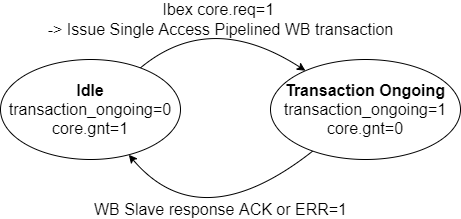

## RISCV Ibex Processor

- **Ibex Repo**, BoxLambda fork, *boxlambda* branch: 
  [https://github.com/epsilon537/ibex](https://github.com/epsilon537/ibex).

- **Ibex Submodule in the BoxLambda Directory Tree**: 
  boxlambda/sub/ibex/.

- **Ibex Component in the BoxLambda Directory Tree**: 
  [boxlambda/gw/components/ibex](https://github.com/epsilon537/boxlambda/tree/master/gw/components/ibex)

- **Ibex Core Top-Level**:
[sub/ibex/rtl/ibex_top.sv](https://github.com/epsilon537/ibex/blob/acdf41b2bf3ed2f33ed5c29e65c1625d22e4aab5/rtl/ibex_top.sv)

### Ibex Wishbone Wrapper: *Ibex_WB*

- **Ibex WB Repo**, BoxLambda fork, *boxlambda* branch: 
  [https://github.com/epsilon537/ibex_wb](https://github.com/epsilon537/ibex_wb).

- **Ibex WB Submodule in the BoxLambda Directory Tree**: 
  boxlambda/sub/ibex_wb/.

- **Ibex WB Components in the BoxLambda Directory Tree**: 
  [boxlambda/gw/components/ibex_wb_common](https://github.com/epsilon537/boxlambda/tree/master/gw/components/ibex_wb_common)
  [boxlambda/gw/components/ibex_wb_core](https://github.com/epsilon537/boxlambda/tree/master/gw/components/ibex_wb_core)

- **Ibex WB Core Top-Level**:
[sub/ibex_wb/rtl/wb_ibex_core.sv](https://github.com/epsilon537/ibex_wb/blob/87a97e38f3cf15bee80eb69bfa82166c00842b1e/rtl/wb_ibex_core.sv)

The Ibex RISCV core itself doesn't have Wishbone ports. *Ibex_WB* wraps around the vanilla Ibex core and attaches Wishbone port adapters to its instruction and data ports.

#### Core2WB

This is the Ibex Memory Interface specification:

[https://ibex-core.readthedocs.io/en/latest/03_reference/load_store_unit.html#load-store-unit](https://ibex-core.readthedocs.io/en/latest/03_reference/load_store_unit.html#load-store-unit)

There are two such interfaces. One for data, one for instructions.

The job of *core2wb* is to adapt that interface to a pipelined Wishbone bus master interface. That Wishbone bus master in turn requests access to the shared bus. 

[Core2wb](https://github.com/epsilon537/ibex_wb/blob/boxlambda/rtl/core2wb.sv) effectively has two states: Idle (*transaction_ongoing==0*) and Transaction Ongoing (*transaction_ongoing==1*). In the Idle state, when Ibex signals a transaction request (*core.req*), a single access pipelined Wishbone transaction is generated and *core2wb* goes to the Transaction Ongoing state. When a WB ACK or ERR response is received, *core2wb* goes back to Idle. While in the Transaction Ongoing state, the memory interface grant (*gnt*) signal is held low, so further transaction requests are stalled until *core2wb* is idle again.
Multiple outstanding transactions are currently not supported. I hope to add that capability someday.



*Core2WB State Diagram.* 

### Ibex Core Configuration

I settled on RISCV configuration **RV32IMCB**: The **(I)nteger** and **(C)ompressed** instruction set are fixed in Ibex. **(M)ultiplication and Division** and **(B)it Manipulation** are enabled optional extensions.
Note that there's no Instruction or Data Cache. Code executes directly from the CMEM DPRAM or DDR memory. Data access goes straight to DMEM DPRAM or DDR memory.

The Ibex core is instantiated with the following *M* and *B* parameters (see [boxlambda_soc.sv](https://github.com/epsilon537/boxlambda/blob/master/gw/components/boxlambda_soc/rtl/boxlambda_soc.sv)):

```
wb_ibex_core #(
  .RV32M(ibex_pkg::RV32MFast),
  .RV32B(ibex_pkg::RV32BBalanced),
  ...
  ) wb_ibex_core (
  ...  
  .boot_addr    (32'h0),
  ...
```

*Wb_ibex_core*'s *boot_addr* port is a misnomer. *Boot_addr* specifies the base address of the vector table. The Reset Vector, i.e. the first instruction executed when the processor comes out of reset, is at offset 0x80 relative to this base address. Hence, the *real* Boot Address for BoxLambda is address 0x80.

### Ibex Clock Frequency

The Ibex core is part of the 50MHz System Clock Domain.
