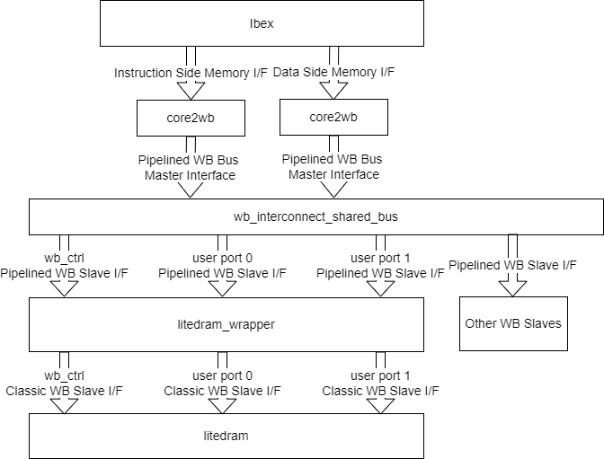
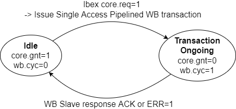
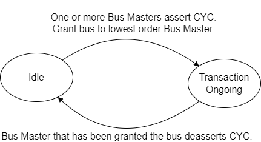

## RISCV Ibex Processor

- **Ibex Repo**, BoxLambda fork, *boxlambda* branch: 
  [https://github.com/epsilon537/ibex](https://github.com/epsilon537/ibex).

- **Ibex Submodule in the BoxLambda Directory Tree**: 
  boxlambda/sub/ibex/.

- **Ibex Component in the BoxLambda Directory Tree**: 
  [boxlambda/gw/components/ibex](https://github.com/epsilon537/boxlambda/tree/master/gw/components/ibex)

- **Ibex Core Top-Level**:
[sub/ibex/rtl/ibex_top.sv](https://github.com/epsilon537/ibex/blob/acdf41b2bf3ed2f33ed5c29e65c1625d22e4aab5/rtl/ibex_top.sv)

### Ibex Wishbone Wrapper: *Ibex_WB*

- **Ibex WB Repo**, BoxLambda fork, *boxlambda* branch: 
  [https://github.com/epsilon537/ibex_wb](https://github.com/epsilon537/ibex_wb).

- **Ibex WB Submodule in the BoxLambda Directory Tree**: 
  boxlambda/sub/ibex_wb/.

- **Ibex WB Components in the BoxLambda Directory Tree**: 
  [boxlambda/gw/components/ibex_wb_common](https://github.com/epsilon537/boxlambda/tree/master/gw/components/ibex_wb_common)
  [boxlambda/gw/components/ibex_wb_core](https://github.com/epsilon537/boxlambda/tree/master/gw/components/ibex_wb_core)

- **Ibex WB Core Top-Level**:
[sub/ibex_wb/rtl/wb_ibex_core.sv](https://github.com/epsilon537/ibex_wb/blob/87a97e38f3cf15bee80eb69bfa82166c00842b1e/rtl/wb_ibex_core.sv)

The Ibex RISCV core itself doesn't have Wishbone ports. *Ibex_WB* wraps around the vanilla Ibex core and attaches Wishbone port adapters to its instruction and data ports.

The *Ibex_WB* repo also includes an example SoC build consisting of an Ibex core connected via a shared Wishbone bus to a wbuart32 core and an internal memory module, along with the software to run on that platform. This example SoC is the starting point for BoxLambda's implementation. See the **Test Builds** section.

#### From Ibex to LiteDRAM

This is the Ibex Memory Interface specification:

[https://ibex-core.readthedocs.io/en/latest/03_reference/load_store_unit.html#load-store-unit](https://ibex-core.readthedocs.io/en/latest/03_reference/load_store_unit.html#load-store-unit)

There are two such interfaces. One for data, one for instructions.

The job of *core2wb* is to adapt that interface to a pipelined Wishbone bus master interface. That Wishbone bus master in turn requests access to the shared bus. It's up to *wb_interconnect_shared_bus* to grant the bus to one of the requesting bus masters and direct the transaction to the selected slave. If either one of those modules has a bug, that will result in an incorrectly behaving bus master, from the point of view of the bus slave.



*From Ibex to LiteDRAM.*

The *ibex_wb* repository no longer appears to be actively maintained. I looked long and hard at the implementation of the two modules and ultimately decided that I couldn't figure out the author's reasoning. I decided to re-implement both modules: 

- [Core2wb](https://github.com/epsilon537/ibex_wb/blob/master/rtl/core2wb.sv) has two states: *Idle* and *Transaction Ongoing*. In the Idle state, when Ibex signals a transaction request (core.req), the Ibex memory interface signals get registered, a single access pipelined Wishbone transaction is generated and *core2wb* goes to *Transaction Ongoing* state. When a WB ACK or ERR response is received, core2wb goes back to idle. While *Transaction Ongoing* state, the memory interface grant (*gnt*) signal is held low, so further transaction requests are stalled until *core2wb* is idle again Multiple outstanding transactions are currently not supported. I hope to add that capability someday.



*Core2WB State Diagram.* 

- [WB_interconnect_shared_bus](https://github.com/epsilon537/ibex_wb/blob/master/soc/common/rtl/wb_interconnect_sharedbus.sv) also has two states: In the _Idle_ state, a priority arbiter monitors the CYC signal of participating Bus Masters. When one or more Bus Masters assert CYC, the arbiter grants access to the lowest order Bus Master and goes to *Transaction Ongoing* state. When that Bus Master de-asserts CYC again, we go back to Idle state. Slave selection and forwarding of WB signals is done with combinatorial logic.



*WB_Interconnect_Shared_Bus State Diagram.* 

### Ibex Core Configuration

I settled on RISCV configuration **RV32IMCB**: The **(I)nteger** and **(C)ompressed** instruction set are fixed in Ibex. **(M)ultiplication and Division** and **(B)it Manipulation** are enabled optional extensions.
Note that there's no Instruction or Data Cache. Code executes directly from DPRAM or DDR memory. Data access also goes straight to DPRAM or DDR memory.
The Ibex core is instantiated with the following *M* and *B* parameters, as shown in the *Ibex_wb* *ibex_soc* example:

**sub/ibex_wb/soc/fpga/arty-a7-35/rtl/ibex_soc.sv**:
```
wb_ibex_core #(
  .RV32M(ibex_pkg::RV32MFast),
  .RV32B(ibex_pkg::RV32BBalanced),
  ...
  ) wb_ibex_core (
  ...  
  .boot_addr    (32'h0),
  ...
```

*Wb_ibex_core*'s *boot_addr* port is a misnomer. *Boot_addr* specifies the base address of the vector table. The Reset Vector, i.e. the first instruction executed when the processor comes out of reset, is at offset 0x80 relative to this base address. Hence, the *real* Boot Address for BoxLambda is address 0x80.

### Ibex Clock Frequency

The Ibex core is part of the 50MHz System Clock Domain.
