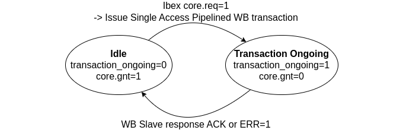

---
hide:
  - toc
---

## Ibex RISC-V Processor

- **Ibex Documentation**: [https://ibex-core.readthedocs.io/en/latest/index.html](https://ibex-core.readthedocs.io/en/latest/index.html).

- **Ibex Repo** (BoxLambda fork, `boxlambda` branch):
  [https://github.com/epsilon537/ibex](https://github.com/epsilon537/ibex).

- **Ibex as a Submodule in the BoxLambda Directory Tree**:
  boxlambda/sub/ibex/.

- **Ibex Component in the BoxLambda Directory Tree**:
  [boxlambda/gw/components/ibex](https://github.com/epsilon537/boxlambda/tree/master/gw/components/ibex)

- **Ibex Core Top-Level Module**:
[sub/ibex/rtl/ibex_top.sv](https://github.com/epsilon537/ibex/blob/acdf41b2bf3ed2f33ed5c29e65c1625d22e4aab5/rtl/ibex_top.sv)

### Ibex Wishbone Wrapper (*Ibex_WB*)

- **Ibex WB Repo**, BoxLambda fork, `boxlambda` branch:
  [https://github.com/epsilon537/ibex_wb](https://github.com/epsilon537/ibex_wb).

- **Ibex WB Submodule in the BoxLambda Directory Tree**:
  `boxlambda/sub/ibex_wb/`.

- **Ibex WB Components in the BoxLambda Directory Tree**:
  [boxlambda/gw/components/ibex_wb_common](https://github.com/epsilon537/boxlambda/tree/master/gw/components/ibex_wb_common)
  [boxlambda/gw/components/ibex_wb_core](https://github.com/epsilon537/boxlambda/tree/master/gw/components/ibex_wb_core)

- **Ibex WB Core Top-Level**:
[sub/ibex_wb/rtl/wb_ibex_core.sv](https://github.com/epsilon537/ibex_wb/blob/87a97e38f3cf15bee80eb69bfa82166c00842b1e/rtl/wb_ibex_core.sv)

The Ibex RISCV core does not natively include Wishbone ports. `Wb_ibex_core` wraps around the vanilla Ibex core and attaches Core-to-Wishbone port adapters to its instruction and data ports.

### Ibex Core Configuration

The Ibex core is instantiated with the following parameters (see [boxlambda_soc.sv](https://github.com/epsilon537/boxlambda/blob/master/gw/components/boxlambda_soc/rtl/boxlambda_soc.sv)):

```
wb_ibex_core #(
    .RV32M(ibex_pkg::RV32MSingleCycle),
    .RV32B(ibex_pkg::RV32BBalanced),
    .RegFile(`PRIM_DEFAULT_IMPL == prim_pkg::ImplGeneric ? ibex_pkg::RegFileFF : ibex_pkg::RegFileFPGA),
    .PrefetchType(ibex_pkg::PrefetchType_Single),
    .BranchTargetALU(1'b0),
    .WritebackStage(1'b0),
    .DbgTriggerEn(1'b1),
    .DmHaltAddr({2'b00, SHARED_BUS_SLAVE_ADDRS[(DM_S+1)*AW-1:DM_S*AW], 2'b00} + 32'h00000800),
    .DmExceptionAddr({2'b00, SHARED_BUS_SLAVE_ADDRS[(DM_S+1)*AW-1:DM_S*AW], 2'b00} + 32'h00000808)
) wb_ibex_core (
  ...
  .boot_addr    (32'h0),
  ...
```

- Single Cycle Multiplier.
- Balanced Support for Bit Manipulation extensions, meaning: `Zba` (address generation), `Zbb` (base), `Zbs` (single-bit operations), `Zbf` (bit-field placement), `Zbt` (ternary operations).
- Single Instruction Prefetcher: This is a custom prefetcher that prefetches just one instruction. This helps ensure that the instruction cycle counts remain constant. See [the next section](#the-single-instruction-prefetcher).
- Branch Target ALU disabled. The branch target ALU removes stalls from taken branches. While this feature reduces stalls from branches taken, enabling it currently results in timing closure issues.
- Writeback stage disabled.
- ICache disabled.
- Dynamic branch prediction disabled.
- Security features disabled.
- Memory protection disabled.
- Debug Module support enabled.

The `boot_addr` port name of `wb_ibex_core` is somewhat misleading. `Boot_addr` specifies the base address of the vector table. The Reset Vector - the first instruction executed when the processor comes out of reset - is at offset 0x80 relative to this base address. Hence, the *real* Boot Address for BoxLambda is address 0x80.

Note that there's no Instruction or Data Cache. Instruction or data accesses go directly to IMEM or DDR memory.

For information on the compiler and compile flags used to generate code for this processor configuration, see section [The Cross-Compiler](build_sys_building_sw.md#the-cross-compiler).

### The Single Instruction Prefetcher


*The Single Instruction Prefetch Buffer in the Ibex Core.*

An **Instruction Prefetcher** is a mechanism that anticipates future memory accesses and fetches instructions before they are actually needed. This helps reduce memory latency and improves performance by avoiding stalls caused by slow memory access. Because the prefetcher caches upcoming instructions, instruction cycle counts may vary. However, for BoxLambda, deterministic execution is a key goal. BoxLambda requires consistent cycle counts. To achieve this, the standard Ibex prefetcher module was replaced with a custom single-instruction prefetcher.

Here is the code:

[https://github.com/epsilon537/ibex/blob/boxlambda/rtl/ibex_single_prefetch_buffer.sv](https://github.com/epsilon537/ibex/blob/boxlambda/rtl/ibex_single_prefetch_buffer.sv)

This module is a drop-in replacement for Ibex's standard prefetcher. It's selected by instantiating the Ibex core with parameter `PrefetchType` set to `PrefetchType_Single`.

This prefetcher is very simple. It prefetches one 32-bit (i.e. uncompressed) instruction and delivers it to the Instruction Fetch (IF) stage when that stage indicates it is *ready*. The prefetched address is either the previously fetched address incremented by 4 (for linear execution) or the address specified by the IF stage in the case of a `branch_i` request. There are two special cases worth knowing about:

- If a `branch_i` request occurs while an instruction fetch transaction is ongoing, the ongoing transaction is discarded upon completion (not propagated to the IF stage). Then the branch address instruction is fetched.
- When a `branch_i` request is issued to respond to an IRQ, the `addr_o` being output by the prefetcher at the moment the `branch_i` strobe arrives, is the address of the instruction being interrupted. Execution resumes from this address when the IRQ has been serviced.

The single instruction prefetcher supports only uncompressed instructions. That's fine because BoxLambda software builds only use uncompressed instructions. Having a mix of 16-bit compressed and 32-bit uncompressable instructions would again result in less predictable instruction cycle counts, due to unaligned instruction fetches for instance.

#### Core2WB

This is the Ibex Memory Interface specification:

[https://ibex-core.readthedocs.io/en/latest/03_reference/load_store_unit.html#load-store-unit](https://ibex-core.readthedocs.io/en/latest/03_reference/load_store_unit.html#load-store-unit)

There are two such interfaces. One for data, one for instructions.

`Core2wb` adapts this interface to a pipelined Wishbone bus master interface. That Wishbone bus master in turn requests access to the shared bus.

[Core2wb](https://github.com/epsilon537/ibex_wb/blob/boxlambda/rtl/core2wb.sv) effectively has two states: Idle and Transaction Ongoing. In the Idle state, when Ibex signals a transaction request (`core.req`), a single access pipelined Wishbone transaction is generated, and `core2wb` goes to the Transaction Ongoing state. When a WB ACK or ERR response is received, `core2wb` goes back to Idle. While in the Transaction Ongoing state, the memory interface grant (`gnt`) signal is held low, so further transaction requests are stalled until `core2wb` is idle again.
Currently, multiple outstanding transactions are not supported.



*Core2WB State Diagram.*

### RISC-V Machine Mode

Machine Mode is one of the four RISC-V privilege levels and is the only one used in BoxLambda.

### Instruction Cycle Counts Summary

All on-chip memory or register accesses are now low-latency with a known, fixed instruction cycle count. Some slaves respond faster than others so the instruction cycle count varies a bit depending on the slave being addressed.

The table below summarizes the instruction cycle counts on BoxLambda according to instruction type and destination.

| Instruction | Destination | Cycles |
|-------------|-------------|--------|
| load/store  | IMEM        | 2      |
|             | VRAM        | 2      |
|             | Sprite RAM  | 2      |
|             | Palette RAM | 2      |
|             | VERA Ctrl   | 2      |
|             | SDRAM       | 15 (variable) |
|             | SDRAM Ctrl  | 3      |
|             | SPIFlash    | 131    |
|             | SPIFlash Ctrl | 2      |
|             | SDSPI       | 3      |
|             | UART        | 3      |
|             | GPIO        | 2      |
|             | USB         | 2      |
|             | ResetCtrl   | 2      |
|             | Timer       | 2      |
|             | YM2149      | 2      |
|             | I2C         | 2      |
| branch      | IMEM        | 2      |
| conditional branch taken |  IMEM  | 4      |
| conditional branch not taken | IMEM   | 2      |
| return from interrupt | IMEM   | 5      |
| integer/computational | IMEM   | 2      |
| multiplication | IMEM   | 2      |
| division/remainder | IMEM       | variable (long division)       |
| CSRSI | IMEM   | 3      |
| CSRS | IMEM   | 4      |
| CSRC | IMEM   | 2      |
| CSRCI | IMEM   | 2      |
| CSRW | IMEM   | 2      |
| CSRR | IMEM   | 2      |

### Code Generation

The Ibex repo/submodule sources are not referenced directly. The source code needs to be *exported* using *fusesoc*. This is done during the codegeneration step of a gateware build.

This is the wrapper script performing the export: [scripts/gen_ibex_core.sh](https://github.com/epsilon537/boxlambda/blob/master/scripts/gen_ibex_core.sh)

### Ibex Core Clock Frequency

The Ibex core operates within the 50MHz system clock domain.

