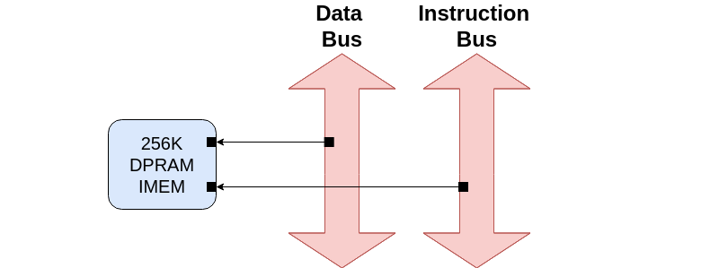

---
hide:
  - toc
---

## IMEM (Internal Memory)

- **DPRAM Repo**, BoxLambda fork, `boxlambda` branch:
    [https://github.com/epsilon537/verilog-wishbone](https://github.com/epsilon537/verilog-wishbone).

- **DPRAM Submodule in the BoxLambda Directory Tree**:
    boxlambda/sub/verilog_wishbone/.

- **DPRAM Component in the BoxLambda Directory Tree**:
    [boxlambda/gw/components/wb_dp_ram](https://github.com/epsilon537/boxlambda/tree/master/gw/components/wb_dp_ram)

- **DPRAM Core Top-Level**:
    [gw/components/wb_dp_ram/rtl/wb_dp_ram_wrapper.sv](https://github.com/epsilon537/boxlambda/blob/master/gw/components/wb_dp_ram/rtl/wb_dp_ram_wrapper.sv)

- **XPM_MEMORY_TDPRAM Documentation**:
    [https://docs.amd.com/r/2023.1-English/ug953-vivado-7series-libraries/XPM_MEMORY_TDPRAM](https://docs.amd.com/r/2023.1-English/ug953-vivado-7series-libraries/XPM_MEMORY_TDPRAM)

*Dual-Port IMEM.*

BoxLambda's internal memory (`IMEM`) is a Dual-Port RAM implemented by the `wb_dpram_wrapper.sv` module. This module selects one of two DPRAM implementations depending on whether we're targeting simulation or FPGA synthesis.

On FPGA, an `XPM_MEMORY_TDPRAM` instance used. Using an XPM macro for internal memory allows post-synthesis memory image updates in the bitstream file (see next section).

In simulations, I'm using Alex Forencich's [wb_dp_ram.v](https://github.com/epsilon537/verilog-wishbone/blob/boxlambda/rtl/wb_dp_ram.v) module.

### The Default IMEM memory image

The default IMEM memory image is generated by the [imem_to_flash_vector](https://github.com/epsilon537/boxlambda/tree/master/sw/projects/imem_to_flash_vector) software project. This project is built during the gateware code generation stage. The resulting `.mem` file is copied in the `<build dir>/codegen/` directory and used as the default IMEM memory initialization file. 

When building a `<gw_project>_bit` target, this default memory image will be replaced with the image of the software program referenced in the gateware project's `CMakeLists.txt` file (using [post-synthesis memory update](build_sys_building_gw.md#updatemem-and-xpm-memories)).

### Address Range and Size

- **Address Range**: `0x00000000-0x0003FFFF`
- **Size**: 256Kbytes

### IMEM Clock Frequency

IMEM is part of the 50MHz System Clock Domain.
