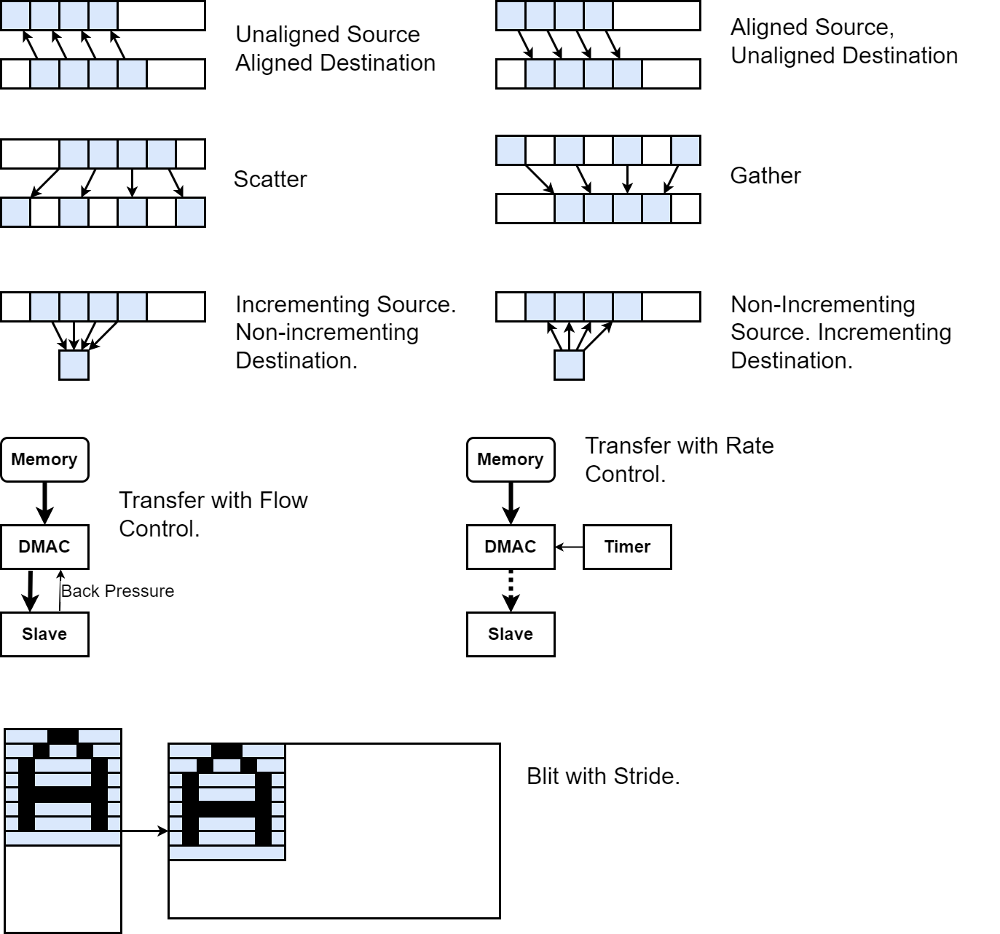
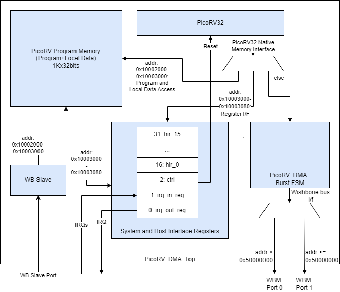
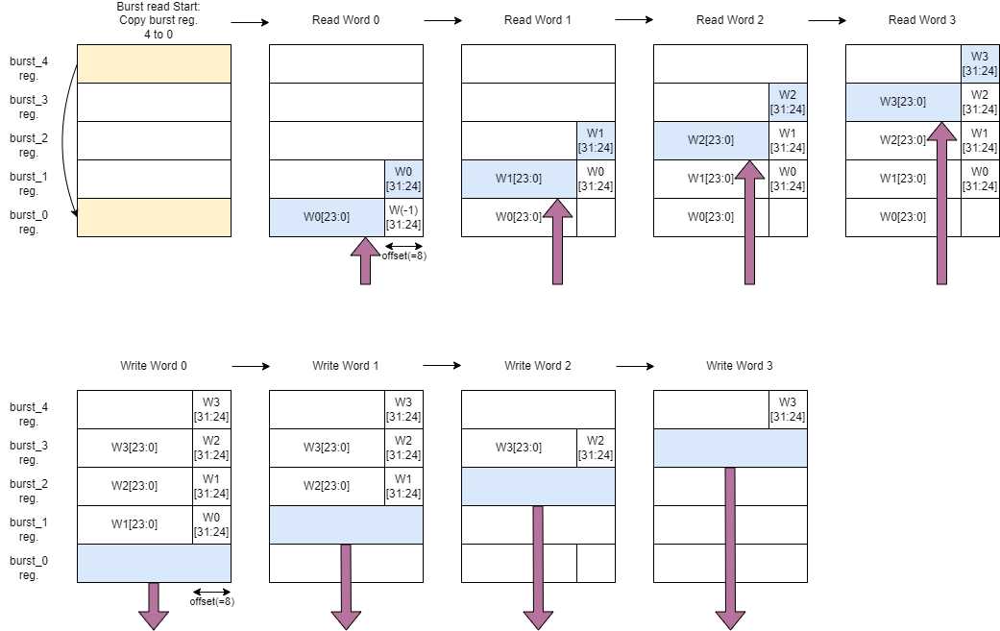
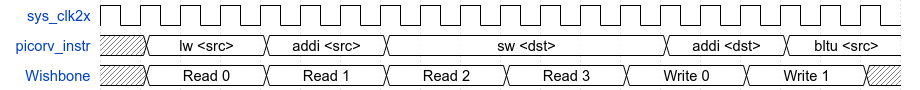
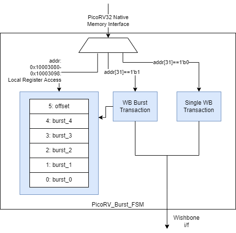
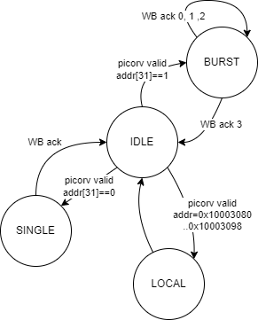
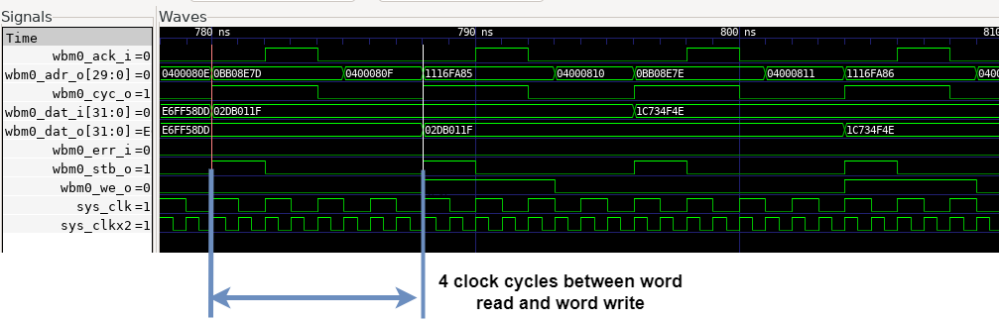
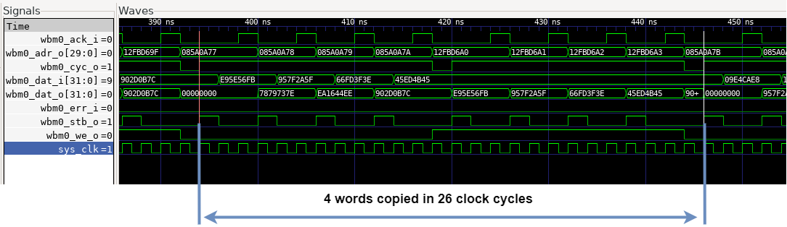

## PicoRV DMA Controller

- **PicoRV32 Repo**, BoxLambda fork, *boxlambda* branch:
    [https://github.com/epsilon537/picorv32](https://github.com/epsilon537/picorv32)

- **PicoRV32 Submodule in the BoxLambda Directory Tree**: 
    boxlambda/sub/picorv32/.

- **PicoRV DMA Component in the BoxLambda Directory Tree**: 
    [boxlambda/gw/components/picorv_dma](https://github.com/epsilon537/boxlambda/tree/master/gw/components/picorv_dma)

- **PicoRV DMA Core Top-Level**:
    [gw/components/picorv_dma/rtl/picorv_dma_top.sv](https://github.com/epsilon537/boxlambda/blob/master/gw/components/picorv_dma/rtl/picorv_dma_top.sv)

- **PicoRV DMA Register interface**:
    [sw/components/picorv_dma/picorv_dma_hal.h](https://github.com/epsilon537/boxlambda/blob/master/sw/components/picorv_dma/picorv_dma_hal.h)

The goal of the DMA Controller is to use it for data transfers between external and internal memory and to assist the CPU with use cases such as graphics blitting, audio playback, and file I/O. These use cases require a lot of flexibility:

- Multiple data widths: bytes, 16-bit half-words, 32-bit words.
- Differences in data width between source and destination.
- Multiple data alignment scenarios: all possible combinations of word-aligned and unaligned sources and destinations.
- Different block sizes and strides, both in source and destination.
- Scatter-Gather.
- Bit manipulations such as bit-masking and rotation on the data being transferred.
  
To achieve these goals I decided to take a processor-based approach, using the [PicoRV32](https://github.com/YosysHQ/picorv32) RISC-V processor.

### Transfer Scenarios

If the DMA Controller is to assist in graphics blitting, audio playback, and file I/O use cases, a great deal of flexibility is required. Example transfer scenarios include, but are not limited to:

- Multiple data widths and differences in data width between source and destination.: bytes, 16-bit half-words, 32-bit words.
- Multiple data alignment scenarios: all possible combinations of word-aligned and unaligned sources and destinations.
- Different block sizes and strides, both in source and destination.
- Scatter-Gather.
- Flow Control and Rate Control.
- Bit manipulations such as bit-masking and rotation on the data being transferred.




*Example DMA Transfer Scenarios.*

With a processor-based DMA Controller, these scenarios can easily be implemented through a simple assembly program handling load and store pointer manipulations, ALU operations on the data being moved, and IRQ-driven flow and rate control.

### The PicoRV DMA Core Block Diagram



*The PicoRV DMA Core Block Diagram.*

The DMA core's top-level is located here:

[https://github.com/epsilon537/boxlambda/blob/master/gw/components/picorv_dma/rtl/picorv_dma_top.sv](https://github.com/epsilon537/boxlambda/blob/master/gw/components/picorv_dma/rtl/picorv_dma_top.sv)

Memory accesses coming from the PicoRV processor are mapped into the following address spaces:

- **0x10002000-0x10003000**: PicoRV **Program Memory**, or to be more accurate, Program Memory and Local Data. 
- **0x10003000-0x10003080**: The DMA Core's **System Registers** and **Host Interface Registers** (HIR), not to be confused with PicoRV's own registers (x0-x31).
- **0x10003080-0x10003098**: The DMA Core's **Burst Registers**, used in Burst Mode. See the [Burst Mode](#burst-mode) section below.
- **All other memory accesses with address < 0x80000000**: These are considered non-local and are turned into **Single** Wishbone Bus Master (WBM) transactions, as opposed to **Burst** Wishbone transactions, the next line item. *Single* transactions are straightforward. A single PicoRV load or store (*lw/lb/sw/sb*) request gets turned into a single read or write Wishbone transaction.  These WBM transactions are dispatched to WBM port 0 or port 1 based on a cut-off address (0x50000000). Port 0 is attached to the Processor Bus and port 1 to the DMA Bus. See BoxLambda's [Architecture Diagram](architecture.md#architecture).
- **Memory accesses with address > 0x80000000**: These are handled as *Burst* transactions: A single PicoRV load or store request (*lw/sw*) gets turned into a burst of four Wishbone read or write transactions. The address MSB is cleared in these Wishbone transactions so they map to the same address space as memory accesses with address < 0x80000000. See the [Burst Mode](#burst-mode) section below. As is the case for *Single* transactions, the WBM transactions are dispatched to WBM port 0 or port 1 based on cut-off address 0x50000000.

Through the Wishbone Slave (WBS) port, the Host Processor has access to PicoRV's Program Memory, the System Registers, and the Host Interface Registers. The Burst Registers are not directly accessible by the Host Processor.

Host processor access to PicoRV's Program Memory is only enabled when the PicoRV is held in reset. PicoRV reset is controlled through one of the System Registers, the **Control Register**. 

The 16 Host Interface Registers serve as the communication interface between the Host Processor and the DMA Controller. They are general-purpose registers. Their role is decided by the program that gets loaded into PicoRV's Program Memory.

System Registers **IRQ_in** and **IRQ_out** are for interrupt handling and interrupt reporting respectively:

- *IRQ_in* register: System interrupts get registered here. The PicoRV itself is configured without interrupt handling support. Instead, the program loop is expected to poll the IRQ_in register if interrupt handling is required.
- *IRQ_out* register: The PicoRV can set IRQs in this register. If any bits in the *IRQ_out* register are set, the core sets the **irq_out** output signal.

#### Usage

The intended usage is as follows:

- The Host Processor loads an application-specific microprogram into the DMA core.
- The PicoRV executes from its own Program Memory. This is expected but not enforced. The PicoRV can fetch instructions from external memory through the bus master ports.
- The Host Processor configures DMA requests and the PicoRV reports status through the Host Interface Registers. The role of the different registers is determined by the application-specific microprogram running on the PicoRV.
- Flow Control can be implemented through interrupts, or by having the PicoRV poll the given slave using the slave's register interface.
- Rate Control can be implemented through interrupts or PicoRV internal timing.
   
Note that although I primarily intend to use the PicoRV DMA core for DMA purposes, it can be used as a general-purpose auxiliary processor as well. All it takes is to load a microprogram that consists of a single jump to the main program in on-chip or external memory.

### Burst Mode

In the most common DMA scenario, copying contiguous blocks of data, the data just passes unmodified through the PicoRV, which is a bottleneck. Instead, what we can do is, when the PicoRV issues a read transaction, have a little FSM module turn that into a burst of, say, 4 read transactions and store the result in a few **Burst Registers**. When the PicoRV issues a write transaction, the FSM can then write the contents of the burst registers to the address specified by the PicoRV. Additionally, this FSM can absorb a byte offset between source and destination, by storing the read words with a configurable byte offset in the Burst Registers. This way unaligned copies can be also handled efficiently.



*PicoRV DMA Burst Mode Sequence with 1-byte alignment offset. The top row shows a Burst Read and the bottom row a subsequent Burst Write.*

In the diagram above, the top row shows a burst of four words being read and stored, with byte offset, in *Burst Registers*. The bottom row shows those four words being written out, from the burst registers to their destination. In this example, the destination-to-source byte offset is one byte.

A couple of things are worth noting:

- The burst read sequence and the burst write sequence are triggered by a PicoRV word read / word write request.
- These PicoRV word read / word write requests are *Posted Reads* and *Posted Writes*, i.e. the transaction completes immediately toward the PicoRV. The PicoRV does not stall until the entire burst is read or written. The PicoRV will only stall when a new read or write request is posted before a previous burst transaction has been completed. The posted burst transactions give the PicoRV copy-loop a few clock cycles of breathing room to do pointer arithmetic etc. without causing delays in the data path.  



*The PicoRV Instruction Sequence vs. Wishbone Transactions in Burst Mode.*

- The address MSB is used to distinguish between Burst Mode transactions and regular transactions.



*Block Diagram of the PicoRV Burst FSM Module.*



*The PicoRV Burst FSM Module's FSM.*

The Burst FSM module Verilog code can be found here: [picorv_burst_fsm.sv](https://github.com/epsilon537/boxlambda/blob/master/gw/components/picorv_dma/rtl/picorv_burst_fsm.sv).

### Example

A simple word copy microprogram, using *Single* mode transactions, looks like this:

```
.include "picoasm_hal.h"
/*Word Copy test program*/
    .text
    .balign 4
    .globl _start
    /*Status register values*/
    .equ STAT_START, 1
    .equ STAT_BUSY, 3
    .equ STAT_DONE, 0
_start:
    li a0, HIR_REGS_BASE_ADDR
wait_start:
    lw a1, HIR3(a0)   /*HIR3: ctrl-status*/
    beqz a1, wait_start
    li a1, STAT_BUSY
    sw a1, HIR3(a0)   /*set status to 'Busy'*/
    lw a1, HIR0(a0)    /*HIR0: src pointer*/
    lw a2, HIR1(a0)    /*HIR1: dst pointer*/
    lw a3, HIR2(a0)    /*HIR2: num words*/
    slli a3, a3, 2    /*Multiple by 4 to convert to byte address offset.*/
    add a3, a3, a1    
loop:
    /*Copy word by word*/
    lw t0, 0(a1)
    sw t0, 0(a2)
    addi a1, a1, 4
    addi a2, a2, 4
    bltu a1, a3, loop
    sw zero, HIR3(a0) /*set to 'Done'*/
    j wait_start
```

The Ibex host processor program loads the microprogram binary into the DMA core and takes the core out of reset using a simple [HAL-level API](https://github.com/epsilon537/boxlambda/blob/master/sw/components/picorv_dma/picorv_dma_hal.h):

```
picorv_load_program(picorv_wordcopy_picobin, picorv_wordcopy_picobin_len);
picorv_sys_reg_wr(PICORV_SYS_REG_CTRL, 1);
```

Once this is done, the PicoRV DMA controller behaves just like a very basic, hardwired DMA controller. From the host processor, you configure the source and destination address, a number of words to copy, and you kick it off.

```
picorv_gp_reg_wr(PICORV_GP_REG_SRC, (unsigned)src);
picorv_gp_reg_wr(PICORV_GP_REG_DST, (unsigned)dst);
picorv_gp_reg_wr(PICORV_GP_REG_NUM_ELEMS, numElems);
printf("Kicking off DMA...\n");
picorv_gp_reg_wr(PICORV_GP_REG_CTRL_STAT, DMA_START);
printf("Waiting for completion...\n");
int dmaBusy = DMA_BUSY;
while(dmaBusy)
    dmaBusy = picorv_gp_reg_rd(PICORV_GP_REG_CTRL_STAT);
```

#### Burst Mode Programs

[Wordcopy_burst.picoasm](https://github.com/epsilon537/boxlambda/blob/master/sw/components/picorv_dma/test/wordcopy_burst.picoasm) is a PicoRV assembly program for doing word-aligned DMA copies, using Burst Mode.
This is the core loop:

```
    ...
    or src, src, msb_set                 /*Set msb to engage burst mode*/
    or dst, dst, msb_set                 /*Set msb to engage burst mode*/
    or burst_end, burst_end, msb_set     /*Set msb to engage burst mode*/

burst_loop:
    /*Copy 4-word burst by 4-word burst*/
    lw tmp, 0(src)
    addi src, src, 16
    sw tmp, 0(dst)
    addi dst, dst, 16
    bltu src, burst_end, burst_loop
    ...
```

[Bytecopy_burst.picoasm](https://github.com/epsilon537/boxlambda/blob/master/sw/components/picorv_dma/test/bytecopy_burst.picoasm) is a PicoRV assembly program implementing byte copy / unaligned word copy using Burst Mode. The core loop of the program is identical to the one shown above. However, it does require quite a bit of set-up code and wind-down code to handle all the alignment cases as well as transfer sizes that are not necessarily a multiple of 4 words.

### Performance

In *Single* mode, 4x unrolled word copy results in a bus utilization of 60%.



*PicoRV32 4x unrolled Word Copy, Single Mode.*

A DMA wordcopy using Burst Mode results in 92% bus utilization.



*PicoRV32 Word Copy Using Burst Mode.*

### The PicoRV DMA Core Clock Frequencies

The PicoRV DMA core uses two clocks:

- The PicoRV CPU and Program memory run in the 100MHz *sys_clkx2* domain.
- The rest of the core (Burst FSM, Wishbone, registers...) runs in the 50MHz *sys_clk* domain.
