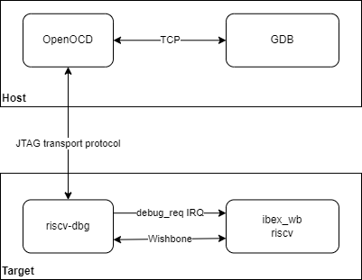
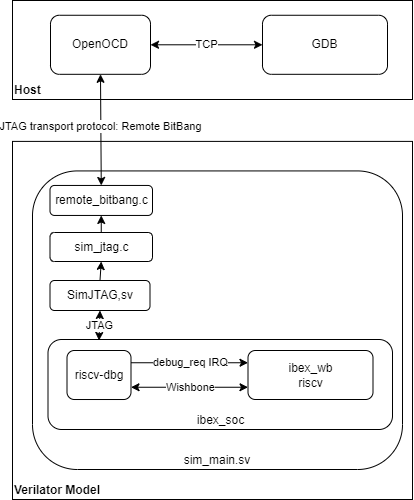
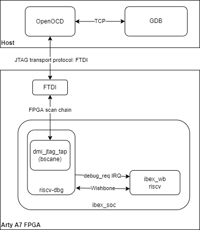

---
hide:
  - toc
---

# The RISCV-DBG Debug Core

- **RISCV-DBG Repository (BoxLambda Fork, `boxlambda` Branch)**:
  [https://github.com/epsilon537/riscv-dbg](https://github.com/epsilon537/riscv-dbg)

- **RISCV-DBG Submodule in the BoxLambda Directory Tree**:
  `boxlambda/sub/riscv-dbg/`

- **RISCV-DBG Gateware Component in the BoxLambda Directory Tree**:
  [boxlambda/gw/components/riscv-dbg](https://github.com/epsilon537/boxlambda/tree/master/gw/components/riscv-dbg)

## RISCV OpenOCD

OpenOCD is an open-source software package that interfaces with a hardware debugger's JTAG port via various transport protocols. On BoxLambda, the hardware debug logic is implemented by `riscv-dbg`. The overall setup is illustrated below:


*OpenOCD General Setup*

### The RISCV-DBG Component

`Riscv-dbg` is part of the [PULP Platform](https://github.com/pulp-platform). It depends on the following repositories from the platform:

- `common_cells`: [https://github.com/pulp-platform/common_cells](https://github.com/pulp-platform/common_cells)
- `tech_cells_generic`: [https://github.com/pulp-platform/tech_cells_generic](https://github.com/pulp-platform/tech_cells_generic)
- `pulpino`: [https://github.com/pulp-platform/pulpino](https://github.com/pulp-platform/pulpino)

As their names suggest, `common_cells` and `tech_cells_generic` provide essential building blocks like FIFOs, CDC logic, and reset logic. The `pulpino` dependency is minimal, limited to a few clock management cells.

To integrate these dependencies, git submodules were created under the `sub/` directory in the BoxLambda repository. A `Bender.yml` manifest in the `riscv-dbg` component directory references all the necessary sources:
[gw/components/riscv-dbg/Bender.yml](https://github.com/epsilon537/boxlambda/blob/master/gw/components/riscv-dbg/Bender.yml).

The directory structure looks as follows:

```plaintext
boxlambda
├── gw
│   └── components
│       └── riscv-dbg
│           └── Bender.yml
└── sub
    ├── common_cells
    ├── tech_cells_generic
    ├── pulpino
    └── riscv-dbg
```

## RISCV-DBG RTL Structure

`Riscv-dbg` includes two top-level modules:

- [`dm_top.sv`](https://github.com/epsilon537/riscv-dbg/blob/b241f967f0dd105f7c5e020a395bbe0ec54e40e4/src/dm_top.sv)
- [`dmi_jtag.sv`](https://github.com/epsilon537/riscv-dbg/blob/b241f967f0dd105f7c5e020a395bbe0ec54e40e4/src/dmi_jtag.sv)

BoxLambda uses a Wishbone interconnect. The `ibex_wb` submodule provides a Wishbone wrapper for the Ibex RISCV core. Similarly, it wraps `dm_top` for `riscv-dbg`:
[`wb_dm_top.sv`](https://github.com/epsilon537/ibex_wb/blob/87a97e38f3cf15bee80eb69bfa82166c00842b1e/rtl/wb_dm_top.sv)

### OpenOCD and RISCV-DBG on Verilator

In the Verilator model, the JTAG transport protocol is **Remote Bitbang**, a simple socket-based protocol. The protocol specification is concise and available here:
[Remote Bitbang Protocol](https://github.com/openocd-org/openocd/blob/master/doc/manual/jtag/drivers/remote_bitbang.txt)

The Verilator setup is shown below:


*BoxLambda OpenOCD Verilator Setup*

The *hello_world* project (`gw/projects/hello_world/`) demonstrates the OpenOCD Verilator setup. Its test script performs the following steps:

1. Starts the Verilator model.
2. Connects OpenOCD to the model.
3. Links GDB to OpenOCD (and thus the model).
4. Executes a UART register dump on the target.
5. Compares the UART register values with expected results.

Relevant directory structure:

```plaintext
boxlambda
├── gw
│   ├── projects
│   │   └── hello_world
│   │       ├── Bender.yml
│   │       ├── sim
│   │       │   ├── sim_main.cpp
│   │       │   └── sim_main.sv
│   │       └── test
│   │           ├── test.sh
│   │           └── test.gdb
│   └── components
│       └── riscv-dbg
└── sub
    ├── common_cells
    ├── tech_cells_generic
    ├── pulpino
    └── riscv-dbg
```

The OpenOCD configuration file for Verilator-based debugging:
[`verilator.openocd.cfg`](https://github.com/epsilon537/boxlambda/blob/master/scripts/verilator.openocd.cfg)

To summarize:

1. The above OpenOCD config file is used to connect to the JTAG TAP of a Verilator model.
2. The JTAG TAP is implemented by the `riscv-dbg` core.
3. The `riscv-dbg` core provides debug support for the connected Ibex RISCV32 core.
4. The JTAG TAP is accessed using a socket-based OpenOCD transport protocol called `remote_bitbang`.

For a step-by-step guide on setting up a debug session, refer to [this section](test-build-hello-world.md#connecting-gdb-to-the-hello-world-build-on-verilator).

## OpenOCD and RISCV-DBG on Arty-A7 FPGA

The most straightforward approach for debugging on the Arty-A7 FPGA would be to expose the JTAG signals to PMOD pins and use a JTAG adapter. However, an alternative approach eliminates the need for a JTAG adapter. The `riscv-dbg` JTAG TAP can be integrated into the FPGA scan chain, typically used to program the FPGA bitstream.

On the Arty-A7, bitstream programming is done through the FTDI-based USB serial port, eliminating the need for special adapters. The `riscv-dbg` codebase provides two variants for this configuration:

- [`dmi_jtag_tap.sv`](https://github.com/epsilon537/riscv-dbg/blob/boxlambda/src/dmi_jtag_tap.sv): Connects the JTAG TAP to external pins.
- [`dmi_bscane_tap.sv`](https://github.com/epsilon537/riscv-dbg/blob/boxlambda/src/dmi_bscane_tap.sv): Integrates the JTAG TAP into the FPGA scan chain using the Xilinx `BSCANE` primitive.

Both files implement the same module (`dmi_jtag_tap`) with identical ports, enabling seamless swapping. By default, BoxLambda builds the `BSCANE` variant for the Arty-A7.

On the OpenOCD side, the transport protocol used for this debug-access-via-FPGA-scan-chain-over-FTDI setup is called `ftdi`. The configuration is depicted below:


*BoxLambda OpenOCD Arty A7 FTDI Setup*

OpenOCD configuration files for debugging on the Arty-A7 are available in the `scripts/` directory: [`scripts/arty_a7_100t.openocd.cfg`](https://github.com/epsilon537/boxlambda/blob/master/scripts/arty_a7_100t.openocd.cfg)

To summarize:

1. The above OpenOCD configuration file is used to connect to the JTAG TAP of the `riscv-dbg` core.
2. The `riscv-dbg` core provides debug support for the connected Ibex RISCV32 core.
3. The JTAG TAP is integrated into the Arty-A7's FPGA scan chain (normally used for bitstream programming).
4. The FPGA scan chain is accessible via the board’s FTDI-based USB serial port.
5. The OpenOCD transport protocol used for this connection is `ftdi`.

### Starting a Debug Session on the Arty-A7

For detailed steps on setting up an OpenOCD JTAG debug session on the Arty-A7, refer to [this section](test-build-hello-world.md#connecting-gdb-to-the-hello-world-build-on-arty-a7).

## RISCV-DBG Clock Frequency

The `riscv-dbg` components `dm_top` and `dmi_jtag` operate in the 50 MHz system clock domain.

The JTAG clock (`tck`) is driven via the FPGA’s JTAG chain using the Xilinx `BSCANE2` primitive. This primitive is instantiated in the [`dmi_bscane_tap`](https://github.com/epsilon537/riscv-dbg/blob/boxlambda/src/dmi_bscane_tap.sv) module.

