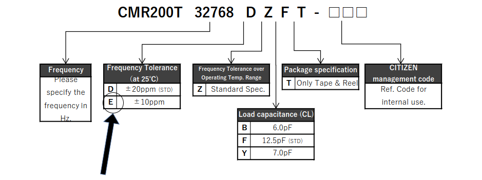

# Real-Time Clock and Calendar (RTCC)

BoxLambda uses I2C to interface with a [Real-Time Clock and Calendar PMOD](https://digilent.com/shop/pmod-rtcc-real-time-clock-calendar/) from Digilent. This PMOD is powered by Microchip's MCP79410. It includes a coin cell battery backup so time and date can be maintained even while BoxLambda is switched off.

The MCP79410 datasheet: [http://ww1.microchip.com/downloads/en/DeviceDoc/22266d.pdf](http://ww1.microchip.com/downloads/en/DeviceDoc/22266d.pdf)

## Clock Drift

The MCP79410 uses a low-cost 32.768 kHz crystal. Typically, these crystals are not very accurate. Over time, the clock will drift relative to the wall clock. However, Digilent's RTCC PMOD uses a *CMR200T_E* crystal with a reasonably good frequency tolerance of ±10ppm.

*CMR200T E crystal.*

[http://cfd.citizen.co.jp/cms/cfd/pdf/english/CMR200T_E.pdf](http://cfd.citizen.co.jp/cms/cfd/pdf/english/CMR200T_E.pdf)

A 10 ppm frequency error would result in 5 minutes of clock drift per year:

$$
\textrm{Clock Drift}=\textrm{365 days/yr}\times\textrm{24 h/day}\times\textrm{60 min./h}\times10/1000000\approx\textrm{5 min./yr}
$$

For BoxLambda's purposes, that's good enough. Additionally, the MCP79410 provides a digital timing compensation feature, so accuracy can be further improved if needed.

