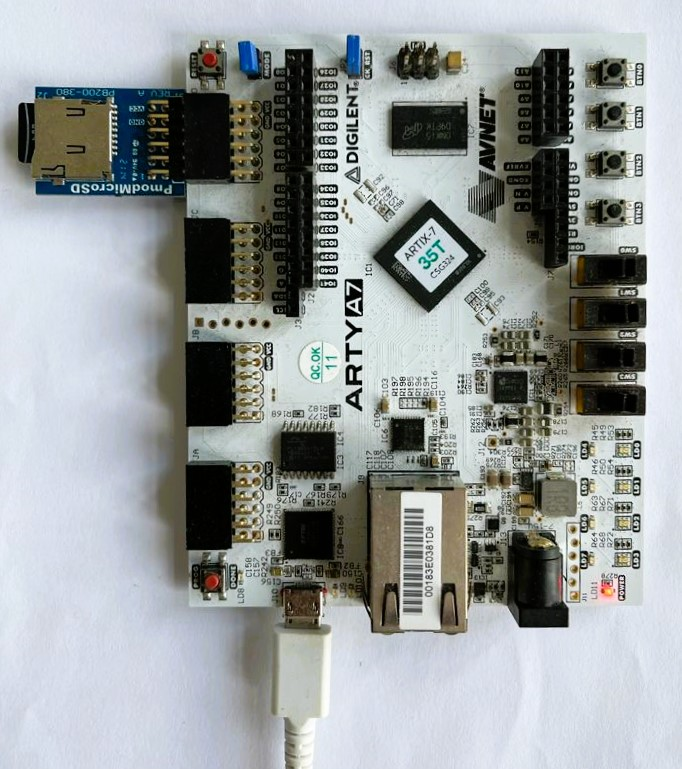
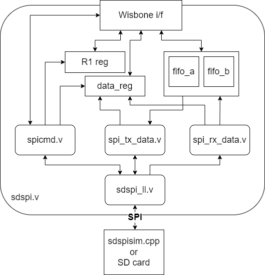

## SDSPI SD Card Controller

- **SDSPSI Repo**, BoxLambda fork, *boxlambda* branch:
    [https://github.com/epsilon537/sdspi/tree/boxlambda](https://github.com/epsilon537/sdspi/tree/boxlambda).

- **SDSPI Submodule in the BoxLambda Directory Tree**: 
    boxlambda/sub/sdspi/.

- **SDSPI Gateware Component in the BoxLambda Directory Tree**: 
    [boxlambda/gw/components/sdspi](https://github.com/epsilon537/boxlambda/tree/master/gw/components/sdspi)

- **SDSPI Core Top-Level**:
    [sub/sdspi/rtl/sdspi.v](https://github.com/epsilon537/sdspi/blob/boxlambda/rtl/sdspi.v)

- **SDSPI Core Documentation**:
    [https://github.com/epsilon537/sdspi/blob/master/doc/spec.pdf](https://github.com/epsilon537/sdspi/blob/master/doc/spec.pdf)

### The MicroSD Card Interface and SPI Mode



*SDSPI in the BoxLambda Architecture.*

On the Arty, BoxLambda uses Digilent's [MicroSD PMOD](https://digilent.com/shop/pmod-microsd-microsd-card-slot/) plugged into the **JD** Connector.

The MicroSD card can operate in two modes: SD card mode and SPI mode. In SPI mode, a 1-bit SPI bus is used as the interface between the SD-Card Controller (Master) and the SD card (Slave). SPI mode is selected by pulling the Chip Select line low. 
The SDSPI core currently only supports SPI mode.

The SPI bus speed is software-configurable through a clock divider setting in the SDSPI core. The minimum value of this divider is 4. Given BoxLambda's 50MHz system clock rate, this limits the bus speed to 12.5MHz.

Other than the SPI signals (*SCK*, *MISO*, *MOSI*, *CS*), the MicroSD card interface has two *DAT* data lines that we won't be using and a *CD* Card Detect signal, which appears to be active-low, even though the [MicroSD PMOD Reference Manual](https://digilent.com/reference/pmod/pmodmicrosd/reference-manual?redirect=1) didn't say so.

### SDSPI Core

**Sdspi_test** is a test SoC containing the SDSPI core along with other BoxLambda components. The SDSPI core is instantiated in the [sdspi_test_soc.sv](https://github.com/epsilon537/boxlambda/blob/master/gw/projects/sdspi_test/rtl/sdspi_test_soc.sv) top-level module as follows:

```
sdspi #(.OPT_LITTLE_ENDIAN(1'b1)) sdspi_inst (
		.i_clk(sys_clk), .i_sd_reset(ndmreset | (~sys_rst_n)),
		// Wishbone interface
		.i_wb_cyc(wbs[SDSPI_S].cyc), .i_wb_stb(wbs[SDSPI_S].stb), .i_wb_we(wbs[SDSPI_S].we),
		.i_wb_addr(wbs[SDSPI_S].adr[3:2]),
		.i_wb_data(wbs[SDSPI_S].dat_m),
		.i_wb_sel(wbs[SDSPI_S].sel),
		.o_wb_stall(wbs[SDSPI_S].stall),
		.o_wb_ack(wbs[SDSPI_S].ack),
		.o_wb_data(wbs[SDSPI_S].dat_s),
		// SDCard interface
		.o_cs_n(sdspi_cs_n), .o_sck(sdspi_sck), .o_mosi(sdspi_mosi),
		.i_miso(sdspi_miso), .i_card_detect(~sdspi_card_detect_n),
		// Interrupt
		.o_int(),
		// .. and whether or not we can use the SPI port
		.i_bus_grant(1'b1),
		// And some wires for debugging it all
		.o_debug()
	);
```

The Wishbone signals plug straight into the test SoC's system bus. The SD Card interface signals go straight to the top-level ports.
Interrupts are currently not hooked up.



*SDSPI Simplified Block Diagram.*

The above is a simplified block diagram illustrating the SDSPI core internal. I won't be going into the details here. Dan Gisselquist did a great job documenting the core in the [spec](https://github.com/ZipCPU/sdspi/blob/master/doc/gpl-3.0.pdf) and the source code.

### SDSPISIM

On the Verilator test bench, the MicroSD card PMOD is replaced with an SDSPISIM co-simulator. SDSPISIM was easy to plug into BoxLambda's test bench. The interface is similar to the UARTSIM co-simulator, already in use in the test bench, and also provided by Dan Gisselquist. 

Here're the hooks to both co-simulators in the test bench's **tick()** function. The tick() function is the heart of the test bench advancing the simulation by one clock cycle:

```
  //Feed SDSPI co-sim
  top->sdspi_miso = (*sdspi)(top->sdspi_cs_n, top->sdspi_sck, top->sdspi_mosi);

  //Feed our model's uart_tx signal and baud rate to the UART co-simulator.
  //and feed the UART co-simulator output to our model
  top->uart_rx = (*uart)(top->uart_tx, top->rootp->sim_main__DOT__dut__DOT__wb_uart__DOT__wbuart__DOT__uart_setup);
```

For the complete test bench code, see [sim_main.cpp](https://github.com/epsilon537/boxlambda/blob/master/gw/projects/sdspi_test/sim/sim_main.cpp) in the *sdspi_test* project.

SDSPISIM reads from and writes to an **sdcard.img** file. That file can be mounted in Linux, so you can FAT format it and put files on it for the simulated system to use, or vice versa. 

### SDSPI Operation

The SDSPI core's register interface, the initialization sequence, and the overall operation of the core are well-documented in the SDSPI core [spec](https://github.com/ZipCPU/sdspi/blob/master/doc/spec.pdf).

[Sdtest.c](https://github.com/epsilon537/boxlambda/blob/master/sw/projects/sdspi_test/sdtest.c) demonstrates and tests the SDSPI core operation. This is a modified version of Dan's *sdtest.c* in the [Zbasic repo](https://github.com/ZipCPU/zbasic). The *Zbasic* repo integrates the SDSPI core and other peripherals developed by Dan into a [ZipCPU Platform](https://zipcpu.com/projects.html).

*Sdtest.c* runs on the RISCV processor that's part of the SDSPI Test SoC.


