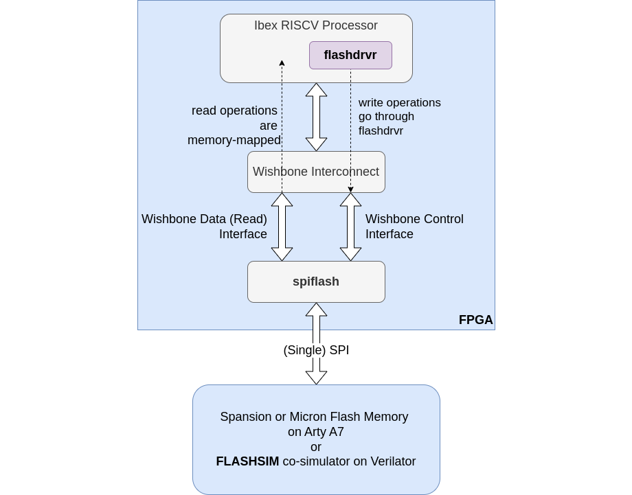
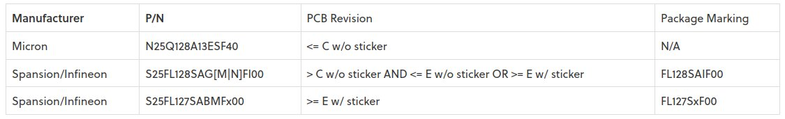
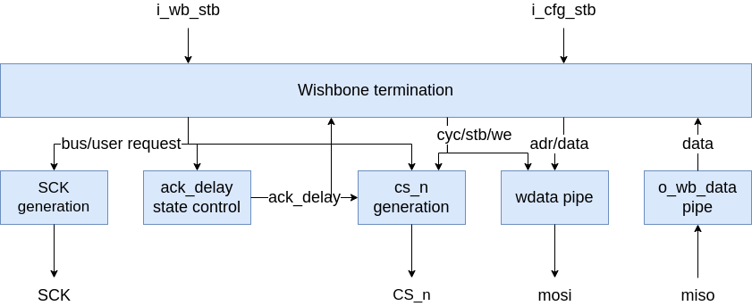
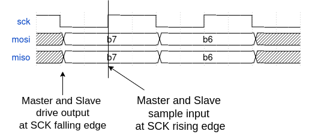
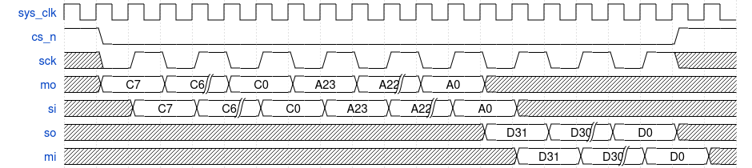
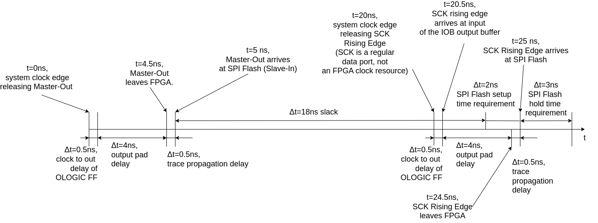
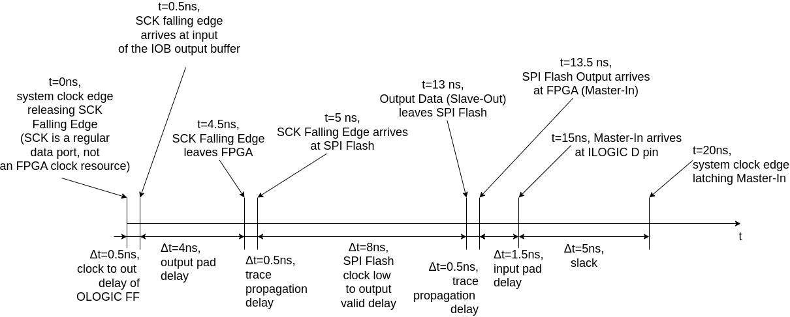

---
hide:
  - toc
---

## SPI Flash Controller

- **SPI Flash Gateware Component in the BoxLambda Directory Tree**:
    [boxlambda/gw/components/spiflash](https://github.com/epsilon537/boxlambda/tree/master/gw/components/spiflash)

- **SPI Flash Core Top-Level**:
    [boxlambda/gw/components/spiflash/rtl/spiflash.v](https://github.com/epsilon537/boxlambda/tree/master/gw/components/spiflash/rtl/spiflash.v)



*SPI Flash on BoxLambda.*

### SPI Flash Core Considerations

#### Quad-SPI Flash vs. Single-SPI Flash


*Arty A7 SPI Flash (source: Arty A7 Reference Manual)*.

The Arty A7 has a quad-SPI flash device, so using a quad-SPI flash core would make sense. I chose to use a single-SPI flash core, however, for a couple of reasons:

- A single-SPI flash core is less complex than a quad-SPI flash core. single-SPI flash is also slower than quad-SPI flash, but I don't have a specific performance requirement for flash access. I do have a simplicity requirement, so I choose to trade performance for simplicity.
- The flash device used on the Arty A7 depends on the PCB revision. Some revisions use Micron, other revisions use Spansian. Quad-SPI flash access is not standardized across SPI flash devices, however. E.g. the command sequence needed to get the device into quad-SPI mode is device-dependent. The latency between a read command and the resulting data is device-dependent as well in quad-SPI mode. In single-SPI mode, these devices behave the same (at least when it comes to the limited feature set I'll be using in BoxLambda).



*Arty A7 PCB revisions and their flash devices.*

#### Memory Mapped Read Access

I would like to be able to boot software from flash memory. That means that the CPU should be able to read from flash memory as if it were a regular ROM module. The flash core should present to the SoC a memory-mapped Wishbone read interface that can address the entire 16MB flash memory range.

#### Writing to Flash

To enable writing to flash memory, the flash core should include a Wishbone control interface through which a driver can issue SPI flash commands.

#### Configurable SPI Clock Frequency

To have a bit more control over timing, I would like to be able to configure a SCK clock frequency relative to the system clock frequency.

#### Simulating Flash

As always, I want to simulate the entire setup in Verilator. I'll need to attach a SPI Flash co-simulation model to the testbench.

### The ZipCPU SpiXpress core

ZipCPU's spixpress core meets all of the above requirements, except the configurable SCK frequency bit. It's a single-SPI core with a Wishbone read interface and a control interface. The repository also includes driver software for the SPI core and a C++ SPI Flash device co-simulation model for Verilator. Here is the GitHub repository:

[https://github.com/ZipCPU/qspiflash](https://github.com/ZipCPU/qspiflash)

The repository is named *qspiflash* but it includes a quad-SPI, Dual-SPI, and single-SPI core (and a co-simulation model supporting all three).

Dan Gisselquist wrote this article describing the design of the single-SPI core:

[https://zipcpu.com/blog/2018/08/16/spiflash.html](https://zipcpu.com/blog/2018/08/16/spiflash.html)



*The simplified SpiXpress SPI Flash Core Design.*

### The BoxLambda SPI Flash Core Variant

BoxLambda's SPI Flash core uses the ZipCPU spixpress core as a starting point. I made the following changes relative to the original core:

- The SCK output port of the core is the actual SPI clock signal, rather than an enable signal to be used in conjunction with a DDR primitive.
- I added a clock divider parameter for SCK. I'm using a clock divider value of two in the BoxLambda SoC.
- The core shifts out the serial output data at the SCK falling edge and shifts in the serial input data at the SCK rising edge. I modified the **Flashsim** co-simulator module to behave like this as well. This is the standard SPI timing design.



- I removed the pipeline logic.
- BoxLambda is a little-endian platform. When reading 32-bit words from Flash, the input is shifted in in little-endian fashion.

The BoxLambda version of the Spiflash core and Flashsim co-simulator can be found here:

[https://github.com/epsilon537/boxlambda/blob/master/gw/components/spiflash/rtl/spiflash.v](https://github.com/epsilon537/boxlambda/blob/master/gw/components/spiflash/rtl/spiflash.v)

[https://github.com/epsilon537/boxlambda/blob/master/gw/components/spiflash/sim/flashsim.cpp](https://github.com/epsilon537/boxlambda/blob/master/gw/components/spiflash/sim/flashsim.cpp)

### Reading from Flash - the Data Interface

The SPI Flash core has a 32-bit Wishbone read interface. Through this interface, the user can request the core to read 32-bit words at a time from Flash memory. At SPI level, the transaction looks like this:



*Reading a 32-bit word from SPI Flash. 8 (C)ommand bits, followed by 24 (A)ddress bits, followed by 32 (D)ata bits.*

- *C7-C0*: Command Bits. The Read Command ID is 0x03.
- *A23-A0*: Address Bits covering the complete 16MB address range.
- *D31-D0*: Data Bits.
- *cs_n*: Active Low Chip Select of the SPI device.
- *sclk*: SPI Clock.
- *mo*: Master Out.
- *si*: Slave In.
- *so*: Slave Out.
- *mi*: Master In.

### The Control Interface and Flash Driver

The SPI Flash core has a simple but clever control interface (invented by Dan, not me). From the *spiflash.v* header:

```
//     Control Port
//     [31:9]    Unused bits, ignored on write, read as zero
//     [8]    CS_n
//             Can be activated via a write to the control port.
//             This will render the memory addresses unreadable.
//             Write a '1' to this value to return the memory to
//             normal operation.
//     [7:0]    BYTE-DATA
//             Following a write to the control port where bit [8]
//             is low, the controller will send bits [7:0] out the
//             SPI port, top bit first.  Once accomplished, the
//             control port may be read to see what values were
//             read from the SPI port.  Those values will be stored
//             in these same bits [7:0].
```

I.e. the control port consists of a single 9-bit register. By setting the CS_n bit to 0, software can choose to 'grab' the SPI Flash port and keep ownership of it for multiple SPI transactions. When done, software releases the SPI Flash port again by setting CS_n to one in the control register.

As an example, the Flash Driver code sequence to read the Flash Device ID looks like this:

```
    /*Write Flash ID Command Byte*/
    m_fpga->writeio(FLASHCFG, CFG_USERMODE | 0x9f);

    /*Write 0 Byte - While this gets sent to SPI Flash,
     *8-bits of miso response get shifted in.*/
    m_fpga->writeio(FLASHCFG, CFG_USERMODE | 0x00);

    /*Read the byte that got shifted in.*/
    r = m_fpga->readio(FLASHCFG) & 0x0ff;

    /*Write another 0 Byte - so we can retrieve the next response byte.*/
    m_fpga->writeio(FLASHCFG, CFG_USERMODE | 0x00);

    /*Read the byte that got shifted in.*/
    r = (r<<8) | (m_fpga->readio(FLASHCFG) & 0x0ff);

    /*Etc, until the 4-byte response to the Flash Id. command is retrieved.*/
    m_fpga->writeio(FLASHCFG, CFG_USERMODE | 0x00);
    r = (r<<8) | (m_fpga->readio(FLASHCFG) & 0x0ff);
    m_fpga->writeio(FLASHCFG, CFG_USERMODE | 0x00);
    r = (r<<8) | (m_fpga->readio(FLASHCFG) & 0x0ff);
    m_id = r;
```

### Timing

Is an SCK frequency of 25MHz slow enough to stay out of trouble? I took a look at the timing.
For MOSI timing, I'm taking into account the following delays:

- The Clock-to-Out delay in the FPGA's output flip-flop OLOGIC: 0.5ns
- The FPGA IOB pad output delay: 4ns.
- Estimated trace propagations delay assuming a signal speed of 15cm/ns: 0.5ns
- SPI Flash setup and hold time requirement: 2ns / 3ns



*SPI Flash MOSI Timing.*

I end up with 18ns of slack. That's plenty.

For MISO timing, I'm taking into account the following delays:

- The Clock-to-Out delay in the FPGA IO Tile's output flip-flop OLOGIC: 0.5ns
- The FPGA IOB pad output delay: 4ns.
- Estimated trace propagations delay assuming a signal speed of 15cm/ns: 0.5ns
- SPI flash Clock Low to Output valid delay: 8ns
- The FPGA IOB pad input delay: 1.5ns



*SPI Flash MISO Timing.*

Here I get only 5ns of slack. That's much less than I expected, but it should still be good enough.

### SpiFlash Core Clock Frequency

The SpiFlash core is part of the 50MHz System Clock Domain.

The SPI bus clock frequency is 25Mhz and is derived from the System Clock Domain through a clock divider.

### SpiFlash Memory Layout

The Arty A7 is equipped with 16Mbytes of flash memory.

Flash memory address range: 0x11000000-0x11ffffff, allocated as follows:

    - 0x11000000-0x113fffff: 4Mbytes Reserved for Bitstreams
    - 0x11400000-0x117fffff: 4Mbytes Reserved for software images that boot from flash memory.
    - 0x11800000-0x11ffffff: 8Mbytes Available for non-volatile data storage.

