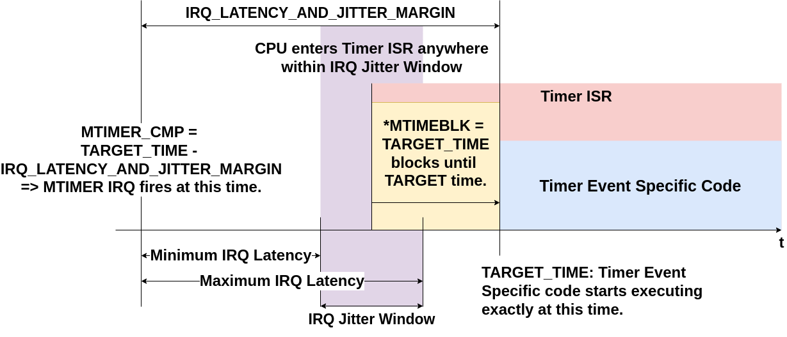

---
hide:
  - toc
---

# Timer

The Timer module is part of the **Ibex** RISCV repo. See the [Ibex Component page](components_ibex.md) for the Ibex repo link and submodule path.

- **Timer Component in the BoxLambda Directory Tree**:
    [boxlambda/gw/components/wb_timer](https://github.com/epsilon537/boxlambda/tree/master/gw/components/wb_timer)

- **Timer Module Top-Level**:
    [boxlambda/gw/components/wb_timer/rtl/wb_timer.sv](https://github.com/epsilon537/boxlambda/tree/master/gw/components/wb_timer/rtl/wb_timer.sv)

- **Timer Spec**: See section 3.1.15 (*Machine Timer Registers*) of the RISC-V Privileged Specification:
    [https://riscv.org/wp-content/uploads/2017/05/riscv-privileged-v1.10.pdf](https://riscv.org/wp-content/uploads/2017/05/riscv-privileged-v1.10.pdf)

`Wb_timer` is a basic timer module capable of generating interrupts based on the RISC-V **Machine Timer** Registers. The RISC-V spec defines two Machine Time Registers:

- `Mtime` is a 64-bit real-time counter. The RISC-V spec doesn't specify the frequency. On BoxLambda, it's running at 50MHz, the system clock frequency. Mtime is a Wishbone-accessible register.
- `Mtimecmp` is a 64-bit timer compare register. When `mtime` is greater than or equal to `mtimecmp`, a timer interrupt is posted. The interrupt is cleared by writing to the mtimecmp register and setting it to a value greater than `mtime`. `Mtimecmp` is a Wishbone-accessible register.

BoxLambda's `wb_timer` defines a third register: `mtimeblk`. A write operation to this register blocks the CPU until the lower 8 bits of the `mtime` register match the written value. This mechanism can be used to absorb Timer interrupt jitter, as shown in the diagram below:

*Absorbing Timer Interrupt Jitter with MTIMEBLK.*

You program a Timer interrupt to fire a few clock cycles before the desired time. Then, inside the timer ISR, you write to `MTIMEBLK` to block until the desired time is reached exactly.

The [timer_uart_gpio_irqs](https://github.com/epsilon537/boxlambda/blob/master/sw/projects/timer_uart_gpio_irqs/timer_uart_gpio_irqs.c) test implements this mechanism.

## Timer Clock Frequency

The Timer module is part of the 50MHz System Clock Domain.

