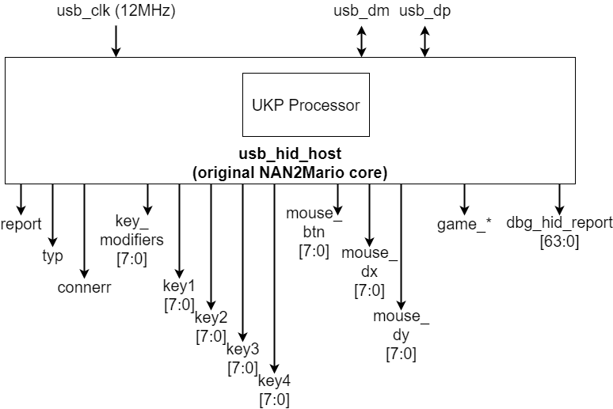
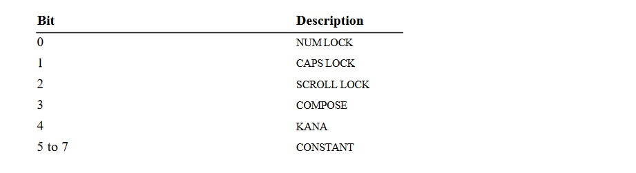
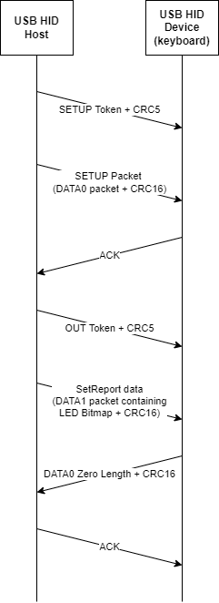
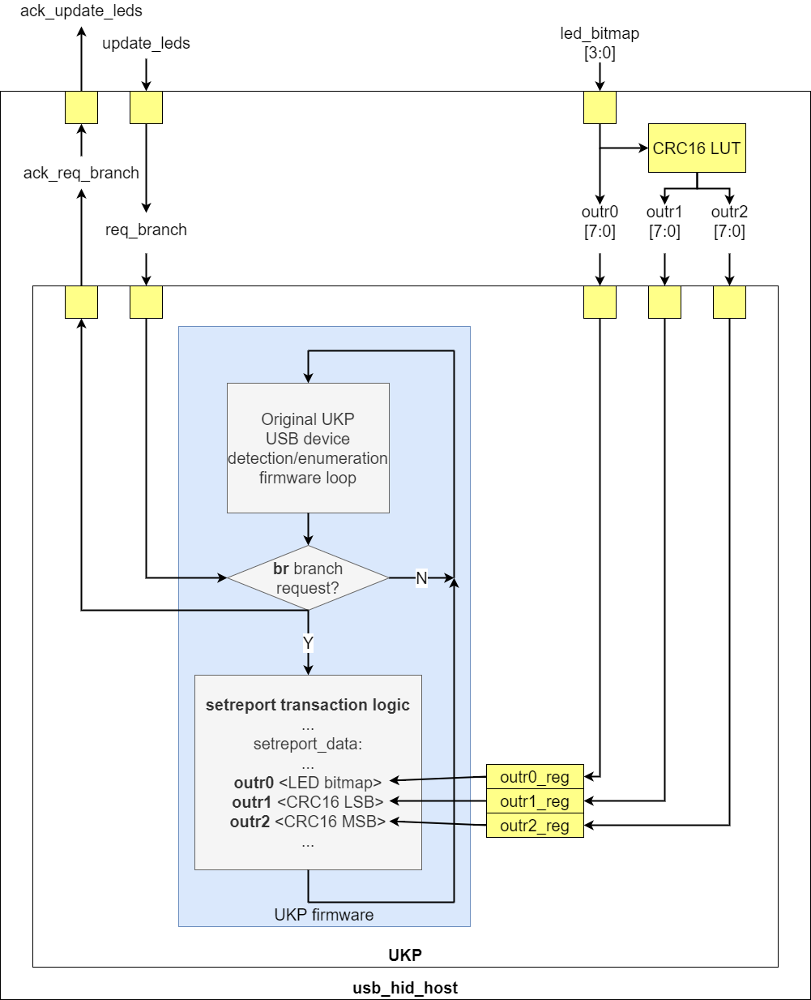
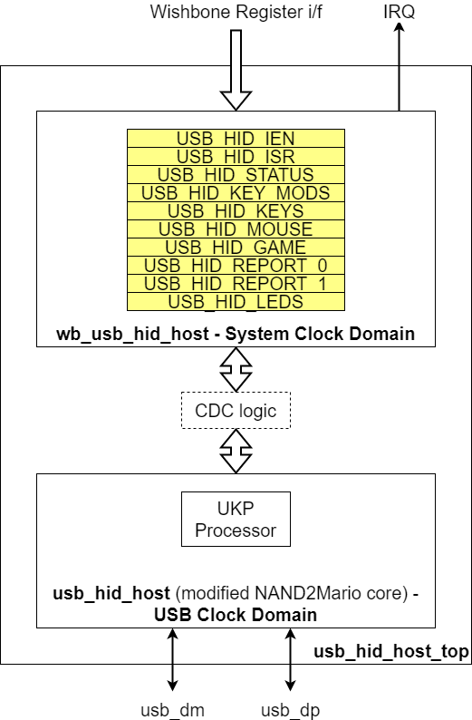
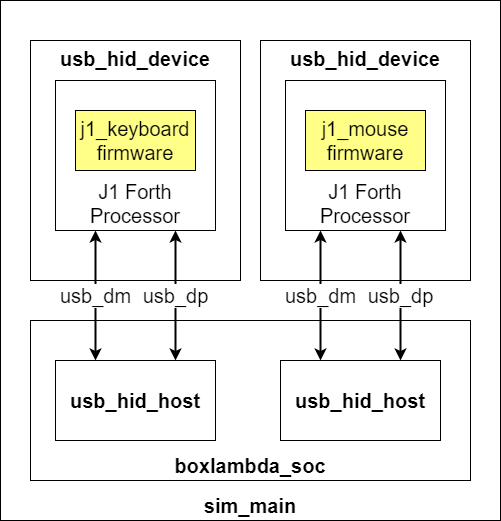

---
hide:
  - toc
---

## USB HID Keyboard and Mouse

- **Usb_hid_host Repo**, BoxLambda fork, `boxlambda` branch:
    [https://github.com/epsilon537/usb_hid_host](https://github.com/epsilon537/usb_hid_host)

- **Usb_hid_host Submodule in the BoxLambda Directory Tree**:
    boxlambda/sub/usb_hid_host/.

- **Usb_hid_host Component in the BoxLambda Directory Tree**:
    [boxlambda/gw/components/usb_hid_host](https://github.com/epsilon537/boxlambda/tree/master/gw/components/usb_hid_host)

- **Usb_hid_host Top-Level**:
    [gw/components/usb_hid_host/rtl/usb_hid_host_top.sv](https://github.com/epsilon537/boxlambda/blob/master/gw/components/usb_hid_host/rtl/usb_hid_host_top.sv)

- **Usb_hid_device Repo**, BoxLambda fork, `boxlambda` branch:
    [https://github.com/epsilon537/usb_hid_device](https://github.com/epsilon537/usb_hid_device)

- **Usb_hid_device Submodule in the BoxLambda Directory Tree**:
    boxlambda/sub/usb_hid_device/.

- **Usb_hid_device Component in the BoxLambda Directory Tree**:
    [boxlambda/gw/components/usb_hid_device](https://github.com/epsilon537/boxlambda/tree/master/gw/components/usb_hid_device)

- **Usb_hid_device Top-Level**:
    [sub/usb_hid_device/rtl/top_usb_device.sv](https://github.com/epsilon537/usb_hid_device/blob/boxlambda/rtl/top_usb_device.sv)

### The NAND2Mario usb_hid_host core

The USB HID Host core used by BoxLambda is based on the NAND2Mario usb_hid_host core.

*The NAND2Mario usb_hid_host core.*

The NAND2Mario usb_hid_host core is easy to use. You don't need a USB software stack. UKP, a little 4-bit processor inside the core handles the USB enumeration. You don't need a USB PHY chip either. You can just hook up the USB D-/D+ pins directly to a simple USB PMOD.

Usb_hid_host requires a 12MHz clock. You just hook up the clock, reset, USB D-/D+ and the core takes care of the rest. Usb_hid_host has the following output ports:

- `report`: a strobe signal indicating that a new report has been received from the attached device (e.g. a key press, a mouse movement,...).
- `typ`: the type of the attached USB device: keyboard, mouse, or gamepad.
- `connerr`: a connection error indication.
- `key_modifiers`: if the attached device is a keyboard, indicates which key modifiers (ctrl, shift,...) are being held down.
- `key1-4`: if the attached device is a keyboard, indicates which non-modifier keys are being pressed, with a max. of 4 keys being pressed simultaneously.
- `mouse_btn`: if the attached device is a mouse, indicates which mouse buttons are being pressed.
- `mouse_dx`: if the attached device is a mouse, indicates the mouse's horizontal movement.
- `mouse_dy`: if the attached device is a mouse, indicates the mouse's vertical movement.
- `game_*`: if the attached device is a gamepad, indicates the gamepad joystick directions and buttons being pressed. I haven't tested these yet. I currently don't have a gamepad.
- `dbg_hid_report`: the raw HID report, for debug purposes.

### USB HIDBP

The [USB HID Spec](https://www.usb.org/sites/default/files/hid1_11.pdf) is big and complicated. A complete implementation would require a lot more infrastructure than just a small usb_hid_host core. Usb_hid_host implements a subset of the USB HID spec called the *Boot Protocol* (USB HIDBP). The Boot Protocol was added to the spec to humor BIOS developers. The Boot Protocol is much simpler than its counterpart, the *Report Protocol*, which is the protocol used by the big USB stacks in Linux or Windows.

Unfortunately, not all keyboards and mice support the Boot Protocol. Basic/Low-end keyboards and mice have a higher chance of supporting the Boot Protocol. I'm using a *Dell KB212-B* keyboard and a *Dell OCJ339* mouse.

### Controlling USB keyboard LEDs - Background

The BoxLambda fork of usb_hid_host adds keyboard LED control support to the NAND2Mario core.

The best information I could find online describing USB HID in general, and keyboard LED control in particular, is this page from the **OSDev Wiki**:

[https://wiki.osdev.org/USB_Human_Interface_Devices](https://wiki.osdev.org/USB_Human_Interface_Devices).

For the lower-level details, e.g. how to set up a *Control Transfer* to the device, I found [USB in a nutshell](https://www.beyondlogic.org/usbnutshell/usb1.shtml) very helpful.

Briefly, the USB host controls keyboard LEDs by sending a *SetReport* message to the device using a [Control Transfer](https://www.beyondlogic.org/usbnutshell/usb4.shtml#Control). The message contains a bitmap specifying which LEDs should be on and off.

*SetReport Keyboard LED bitmap.*

The entire packet sequence looks like this:

*SetReport Sequence Diagram.*

### Adding Keyboard LED Control to the NAND2Mario usb_hid_host core

*Keyboard LED control in the usb_hid_host core.*

To add USB keyboard LED control to the usb_hid_host core, I implemented the following changes in the UKP processor:

- I extended the UKP opcode width from 4 bits to 5 bits. This gave me space to add new instructions.
- I added a conditional *Branch Request* (`br`) instruction and a `req_branch_stb` input port to the UKP module. Through the `req_branch_stb` signal, the user (usb_hid_host) can request the branch to be taken. When the branch has been taken, an ack_req_branch_stb is sent back to the user.
- I added `outr0, outr1, and outr2` instructions, associated with three 8-bit registers and three 8-bit input ports of the UKP module, also called outr0, outr1, and outr2. When an outr<x> instruction executes, the contents of the associated register will be transmitted over the USB port.

With these UKP changes, the usb_hid_host core can, upon request, have the UKP firmware branch to a section of microcode that sends a *SetReport* request to the device. The parameters of this message, i.e. the LED bitmap and the CRC16 value are specified in outr0 and outr1/2.

### Wishbone Frontend and Clock Domain Crossing

*Usb_hid_host core in USB Clock Domain with Wishbone Frontend in System Clock Domain.*

I added a Wishbone frontend to the usb_hid_host core so it could be integrated into the BoxLambda SoC. The BoxLambda SoC system clock runs at 50MHz while the usb_hid_host core runs at 12MHz, so Clock Domain Crossing (CDC)) logic is needed between these two clock domains.

In both directions, USB to System Clock and System Clock to USB, I'm using a Multi-Cycle Path (MCP) strategy to pass signals across the clock domains. In the System Clock to USB direction (fast to slow clock), I'm using feedback. Keyboard LED update requests are acknowledged.

The MCP CDC strategy is based on the following paper:

[http://www.sunburst-design.com/papers/CummingsSNUG2008Boston_CDC.pdf](http://www.sunburst-design.com/papers/CummingsSNUG2008Boston_CDC.pdf)

### Simulation and USB HID Device Emulation

To test the usb_hid_host core in simulation, I have to connect it to an emulated USB HID device. The emulated mouse and keyboard are based on this project from Pbing:

[https://github.com/pbing/USB](https://github.com/pbing/USB)

The design is based on a [J1](https://github.com/pbing/J1_WB) processor executing Forth-based firmware.

To test USB mouse support, I'm using Pbing's mouse emulation as-is. To test USB keyboard support, I created a firmware variant that emulates a keyboard with a key being pressed. The firmware also accepts the SetReport messages for LED control and will set GPIOs depending on the value of the received LED bitmap.

The simulation top-level, [sim_main.sv](https://github.com/epsilon537/boxlambda/blob/master/gw/projects/usb_hid_sys_test/sim/sim_main.sv), hooks up the mouse and the keyboard emulations to the two usb_hid_host instances of the BoxLambda SoC. `Sim_main.sv` includes logic tracking the USB ports' output enables and driving the USB D+/D- lines high or low to emulate the pull-up/pull-down behavior of a low-speed USB device (See [https://www.beyondlogic.org/usbnutshell/usb2.shtml#SpeedIdentification](https://www.beyondlogic.org/usbnutshell/usb2.shtml#SpeedIdentification)).

*USB HID System Test Simulation Setup.*

