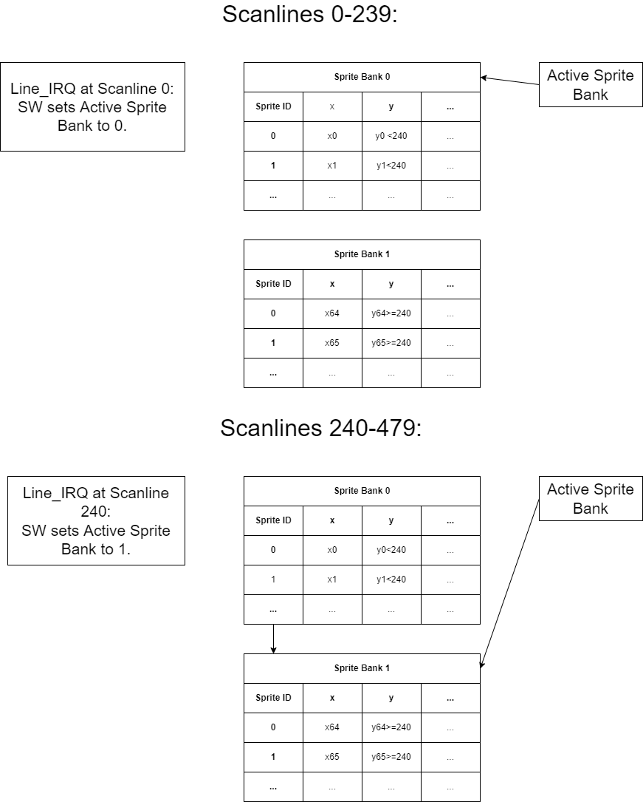

## VERA (Wishbone) Graphics

- **VERA Wishbone Repo**, BoxLambda fork, *boxlambda* branch: 
  [https://github.com/epsilon537/vera_wishbone](https://github.com/epsilon537/vera_wishbone).

- **VERA Wishbone Submodule in the BoxLambda Directory Tree**: 
  boxlambda/sub/vera_wishbone/.

- **VERA Gateware Component in the BoxLambda Directory Tree**: 
  [boxlambda/gw/components/vera](https://github.com/epsilon537/boxlambda/tree/master/gw/components/vera)

- **VERA Wishbone Core Top-Level**:
[sub/vera_wishbone/fpga/source/vera_top.v](https://github.com/epsilon537/vera_wishbone/blob/boxlambda/fpga/source/vera_top.v)

Frank van den Hoef's [VERA Versatile Embedded Retro Adapter](https://github.com/fvdhoef/vera-module), used by the [Commander X16 project](https://www.commanderx16.com/), is a standalone FPGA with an 8-bit external bus interface. **VERA Wisbone**, discussed here is an adaption of the graphics subsystem of the original VERA core for the BoxLambda SoC.

Note: The original VERA core also supports PSG Audio, PCM Audio, and a SPI Controller for storage. These subcomponents have not been carried over to VERA Wishbone.

### Features

VERA Wishbone's feature summary:

- 32-bit pipelined Wishbone slave interface.
- VGA output format at a fixed resolution of 640x480@60Hz (same as original VERA).
- Support for 2 layers, both supporting either tile or bitmap mode (same as original VERA).
- Support for 2 banks of 64 sprites. Guaranteed max. of 512 sprite pixels per scanline.
- Configurable Embedded video RAM size of up to 128kB.
- Palette with 256 colors selected from a total range of 4096 colors (same as original VERA).

### Overview


*The VERA Wishbone Block Diagram.*

In the above diagram, the big arrows show the main data flow. The small arrows are control signals. The labels next to the arrowheads show what is being presented to the block at that point. E.g. the *Composer* presents a *line_idx* and *render_start* signal to the *Layer 0 Renderer*. Data path bus widths are indicated by a number between brackets.

The easiest way to understand what's going on is by going through the diagram from bottom to top:

1. The **video_vga** block generates the 640x480@60Hz VGA signal (RGB 4:4:4, Hsync and Vsync).
2. The video_vga block pulls the pixel data from the **Composer** block. The 8-bit pixel data passes through the **palette_ram** to be converted to RGB 4:4:4.
3. The Composer block in turn pulls the necessary data from three **Line Buffers**: one for each layer and one for sprites. The Composer and video_vga blocks operate at VGA pixel clock rate, i.e. 640 pixels worth of data flows when a scanline is being drawn. No data flows during horizontal or vertical retrace.
4. The Line Buffers exist to give the renderers some leeway. The **Layer Renderers**, for instance, need to produce 640 pixels worth of data each scanline but they have 800 pixels worth of time to do so (the horizontal retrace time is 'extra time'). For the **Sprite Renderer**, the numbers are a bit different, but the concept is the same.
5. The renderers contain the bulk of VERA's video generation logic. There are two identical Layer Renderer blocks and one Sprite Renderer. The Layer Renderers implement the different tile and Bitmap Modes, retrieve the necessary data from the **vram_if** block, and store the rendered output data in their respective Line Buffers. The Sprite Renderer does the same thing for sprites.
6. The vram_if block contains **128KB** of embedded video memory. It has four ports: one for each renderer and one for the CPU (via the external bus). A time slot scheduler gives each port in turn access to VRAM.

### Video RAM

The video RAM (VRAM) is a Single Port RAM instance of four byte-wide columns (matching a 32-bit Wishbone data bus with four byte-enables). The amount of RAM is configurable, up to 128KB, through a **VRAM_SIZE_BYTES** parameter/macro.

The **vram_if** module has four ports: Two Line Renderers, the Sprite Renderer, and the CPU. The vram_if module arbitrates access to the VRAM using a time slot scheduler. There are four equal time slot *beats*. Each port is assigned one slot during which it can access VRAM. The duration of a timeslot is one clock cycle.


*Time Slot Scheduled VRAM Access.*

With this mechanism, bandwidth utilization on one port does not have any impact on any of the other ports. A port that tries to use more than its share of the bus bandwidth is stalled. In practice, the only port where this can happen is the CPU port.

### The Composer

The Composer receives basic control signals from the video_vga block: *next pixel*, *next line*, *next frame*, *vblank*. It uses these signals for the following purposes:

- Generate control/timing signals towards the other blocks, e.g. *line index*, *render start*, *frame done*, *sprite Line Buffer erase start*.
- Keep track of the horizontal and vertical screen position counters, both regular and scaled.  
- Generate line IRQs.
- Determine the active area of the screen, where the border isn't shown.
- Compose the display, reading out the pixel data from the three Line Buffers.
   
### The Layer Renderer

The Layer Render's implementation is, conceptually at least, reasonably straightforward:

1. Depending on the scanline index and the current position in the Line Buffer, it retrieves the appropriate map entry from VRAM (assuming Tile Mode).
2. It retrieves the corresponding tile pixel data, also from VRAM.
3. It writes out the pixel data to the next few positions in the Line Buffer.

Steps 1 and 2 are always sequential, but as much as possible they overlap with step 3, i.e. while pixel data is being rendered out to the Line Buffer, new map and/or tile data is being retrieved from VRAM.

Below you see the waveform of the Layer Renderer operating in 8bpp Tile Mode, 8 pixel wide tiles. One full FSM (Finite State Machine) cycle is shown, i.e. the pattern between the two vertical cursors is repeating.
You can see the VRAM reads (*buf_strobe* and *bus_ack*) happening in parallel with the Line Buffer writes (*lb_wridx_r*). You can also see how the Renderer FSM cycles through its states (*fetch map*, *wait fetch map*, *fetch tile*, *wait fetch tile*, *render*, etc.).


*Layer Rendering Waveform.*

#### Other Layer Renderer Responsibilities

Other responsibilities of the Layer Renderer include:

- Bitmap Mode: Simpler than Tile Mode, but more expensive in terms of required memory resources. In Bitmap Mode, VRAM holds a frame buffer.
- Handling of vertical and horizontal scrolling.
- Handling of the different colors-depths: 8bpp, 4bpp, 2bpp, 1bpp.
- Handling of the different tile widths and heights.
- Tile V-flip and H-flip.
  
### The Layer Line Buffer

The Layer Renderer has an 8-bit write-only interface to its Line Buffer. The Line Buffer contains 8 bits per entry. One entry corresponds to one pixel.
The Layer Line Buffer implements a double buffering scheme: While the renderer is writing out one scan line, the Composer is reading out the other line. When they are done with the respective scan lines, they switch places.  
  
### The Sprite Renderer

The Sprite Renderer's operation is a bit more complicated:

1. The **Sprite Attribute RAM** is scanned front-to-back to find the next sprite ID that is active on the current scan line.
2. When an active Sprite has been found, its pixel data for the current scan line is retrieved from VRAM.
3. The pixel data is written out to the correct positions in the Line Buffer. That means there may be multiple overlapping writes into the Sprite Line Buffer. The Sprite Line Buffer is written in Sprite ID order, at the position determined by the sprite's X-coordinate.

The sequence of scanning the sprite attribute RAM, retrieving sprite pixel data, and rendering it out to the Line Buffer is entirely sequential. There is no pipelining.

In the waveform below, you can see two sprites getting rendered out on a scanline: sprite ID 4 at position 192, and sprite ID 5 at position 256. The two sprites have 8bpp color depth and are 8 pixels wide. You can see that, for each sprite, two VRAM read operations are performed (*bus_strobe* and *bus_ack* signals), and 8 entries are accessed in the Sprite Line Buffer (*linebuf_idx_r*).


*Sprite Rendering Waveform.*

#### Sprite Banks

The Sprite Attribute RAM consists of two banks of 64 sprite IDs. A bit in the *VERA_CTRL* register is used to select the active bank. 

Sprite Banking may help with sprite multiplexing or animation: While one sprite bank is active, software can prepare the inactive bank's entries and switch over at the right moment, triggered by a *line_irq*, for instance.


*Double Buffering with Sprite Banks Example.*



*Sprite Multiplexing with Sprite Banks Example.*

Note: Sprite Banking does not exist in the original VERA core. The original VERA core uses a single bank of 128 Sprite IDs.

#### A Fixed Sprite-Pixels-per-Scanline Limit

The Sprites-per-Scanline limit is inversely proportional to the sprite width. That makes sense. It takes roughly twice as long to render a 16-pixel-wide sprite than an 8-pixel-wide sprite. Conversely, the number of *sprite pixels* that can be rendered on a given scanline is relatively constant. For VERA Wishbone running at 50MHz, this constant is 512 pixels, i.e. the Sprite Renderer can render a maximum of 512 sprite pixels on any scanline, guaranteed.

The original Sprite Renderer code kept track of rendering time to decide when to abort rendering, to avoid exceeding its time budget. VERA Wishbone replaces that code with logic that keeps track of the number of sprite pixels rendered. When 512 sprite pixels are rendered, further sprite rendering is aborted for the given scanline.


*Examples of the 512 Sprite Pixel Limit.*

The VERA Wishbone changes relative to the original VERA code make it easier for a programmer to plan sprites. The programmer knows ahead of time exactly how many sprites of a given size he can have on the same scanline. This number is independent of the Layer Renderer settings and the VRAM loading by the CPU (or any other Wishbone bus master accessing VRAM, such as a DMA core).

#### Other Sprite Renderer Responsibilities

Other responsibilities of the Sprite Renderer include:

- Decoding and handling of sprite attributes: color-depth, width, height, z-depth, and collision mask.
- Sprite-to-Sprite Collision Detection.
- Handling pixel transparency.

### The Sprite Line Buffer

The Sprite Line Buffer contains 16 bits per entry. One entry corresponds to one pixel. Each entry contains the sprite pixel's collision data and z-value (layering depth relative to layers 0 and 1), along with the pixel data. The Sprite Renderer's collision handling logic has to be able to read back the collision data of the sprite pixels that are already rendered out, so the Sprite Renderer has a 16-bit read-and-write interface to its Line Buffer.

Like the Layer Line Buffer, the Sprite Line Buffer implements a double buffering scheme.

The Sprite Line Buffer also contains erase logic. When the Composer has read one scanline, it sends a signal to the Sprite Line Buffer to erase that line. Erasing is necessary because the Sprite Renderer doesn't necessarily write to each position in the line buffer. If the line were not erased, stale pixels (and associated meta-data) from a previous scanline may shine through.

### Wishbone Interface and Memory Mapped Access

The VERA Wishbone core has a pipelined Wishbone slave interface. The interface has a 32-bit data port, 4-byte lane enables, and a 17-bit word-addressed address port.

In the original VERA core, VRAM, Palette RAM, and Sprite RAM were accessed indirectly through its register interface. In VERA Wishbone, this indirect access method has been replaced with a memory-mapped interface.

The following table shows the memory-mapped address ranges:

| Address Range           | Description       | Access     |
| ----------------------- | ----------------- | ---------- |
| 0x10100000 - 0x10100100 | VERA Registers    | Read/Write |
| 0x10101000 - 0x10101400 | Sprite attributes | Write Only |
| 0x10102000 - 0x10102200 | Palette           | Write Only |
| 0x10140000 - 0x10160000 | Video RAM (128KB) | Read/Write |

Note:

- The above addresses are absolute, as seen by the processor. The VERA core's base address is 0x10100000.
- The Video RAM address range depends on the amount of Video RAM set by the *VRAM_SIZE_BYTES* macro. The range 0x10140000-0x10160000 corresponds to a *VRAM_SIZE_BYTES* setting of 131072 (128K).

### Register Interface / Programmer's Reference.

For a description of the VERA Wishbone registers, refer to the [VERA Programmer's Reference](https://github.com/epsilon537/vera_wishbone/blob/boxlambda/doc/VERA%20Programmer's%20Reference.md).

### Top-Level Interface and Output Pins 

The *vera_wishbone* top-level interface is straightforward:

```
module vera_top #(
	parameter VRAM_SIZE_BYTES=(128*1024) //Max. 128KB.
	)
  (
  input  wire       clk,
  input  wire       reset,

  //32-bit pipelined Wishbone interface.
  input wire [16:0]  wb_adr,
  input wire [31:0]  wb_dat_w,
  output wire [31:0] wb_dat_r,
  input wire [3:0]   wb_sel,
  output wire        wb_stall,
  input wire         wb_cyc,
  input wire         wb_stb,
  output wire        wb_ack,
  input wire         wb_we,
  output wire        wb_err,

  // IRQ
  output wire        irq_n,

  // VGA interface
  output reg  [3:0]  vga_r,       
  output reg  [3:0]  vga_g,       
  output reg  [3:0]  vga_b,       
  output reg         vga_hsync,   
  output reg         vga_vsync   
  );
```

It is assumed that [Diligent's VGA PMOD](https://digilent.com/reference/pmod/pmodvga/start) is being used. The VGA signals are sent to PMOD ports JB and JC with the following pin layout:

| Pin       | Description | Pin       | Description |
| --------- | ----------- | --------- | ----------- |
| JB Pin 1  | R0          | JC Pin 1  | G0          |
| JB Pin 2  | R1          | JC Pin 2  | G1          |
| JB Pin 3  | R2          | JC Pin 3  | G2          |
| JB Pin 4  | R3          | JC Pin 4  | G3          |
| JB Pin 5  | GND         | JC Pin 5  | GND         |
| JB Pin 6  | VCC         | JC Pin 6  | VC3V3       |
| JB Pin 7  | B0          | JC Pin 7  | HS          |
| JB Pin 8  | B1          | JC Pin 8  | VS          |
| JB Pin 9  | B2          | JC Pin 9  | NC          |
| JB Pin 10 | B3          | JC Pin 10 | NC          |
| JB Pin 11 | GND         | JC Pin 11 | GND         |
| JB Pin 12 | VCC3V3      | JC Pin 12 | VCC         |

### The VERA Gateware Component

The VERA gateware component in the BoxLambda tree, [boxlambda/gw/components/vera](https://github.com/epsilon537/boxlambda/tree/master/gw/components/vera), contains just a *CMakeLists.txt* file and a *Bender.yml* file listing the core's verilog sources to be pulled in from the *vera_wishbone* submodule. There is no wrapper module. The *vera_top* module is directly instantiated in the BoxLambda gateware project top-level.

### VERA Wishbone Clock Frequency

The VERA Wishbone core operates at **50MHz**, BoxLambda's system clock frequency. However, the **video_vga** and **composer** modules need to run at 25MHz, the 640x480@60Hz VGA pixel clock rate. These blocks use a toggling clock enable signal to do so. [Clock enables are preferred over clock dividers](https://electronics.stackexchange.com/questions/222972/advantage-of-clock-enable-over-clock-division).
