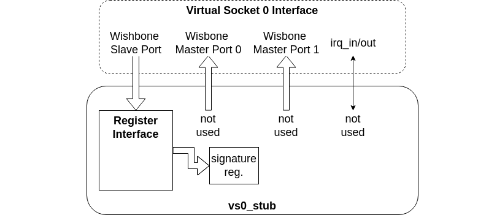
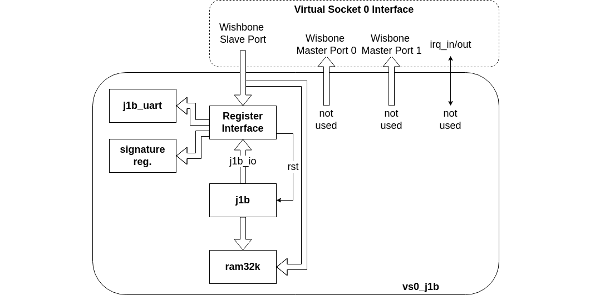

## VS0

- **VS0 Stub** Component in the BoxLambda Directory Tree:
  [boxlambda/gw/components/vs0_stub](https://github.com/epsilon537/boxlambda/tree/master/gw/components/vs0_stub)

- **VS0 J1B** Component in the BoxLambda Directory Tree:
  [boxlambda/gw/components/vs0_j1b](https://github.com/epsilon537/boxlambda/tree/master/gw/components/vs0_j1b)

VS0 is a component with two Bus Master ports, one Bus Slave port, an interrupt vector input, and an interrupt line output. No other specifications are provided for this module. Different BoxLambda variants may implement it in different ways. It could be a stack processor, a DSP, or it might remain unused.

```verilog
module vs0 (
    input logic sys_clk,
    input logic rst,

    // 32-bit pipelined Wishbone master interface 0.
    output logic [27:0] wbm_0_adr_o,
    output logic [31:0] wbm_0_dat_o,
    input logic [31:0] wbm_0_dat_i,
    output logic wbm_0_we_o,
    output logic [3:0] wbm_0_sel_o,
    output logic wbm_0_stb_o,
    input logic wbm_0_ack_i,
    input logic wbm_0_stall_i,
    output logic wbm_0_cyc_o,
    input logic wbm_0_err_i,

    // 32-bit pipelined Wishbone master interface 1.
    output logic [27:0] wbm_1_adr_o,
    output logic [31:0] wbm_1_dat_o,
    input logic [31:0] wbm_1_dat_i,
    output logic wbm_1_we_o,
    output logic [3:0] wbm_1_sel_o,
    output logic wbm_1_stb_o,
    input logic wbm_1_ack_i,
    input logic wbm_1_stall_i,
    output logic wbm_1_cyc_o,
    input logic wbm_1_err_i,

    // 32-bit pipelined Wishbone slave interface.
    input logic [17:0] wbs_adr,
    input logic [31:0] wbs_dat_w,
    output logic [31:0] wbs_dat_r,
    input logic [3:0] wbs_sel,
    output logic wbs_stall,
    input logic wbs_cyc,
    input logic wbs_stb,
    output logic wbs_ack,
    input logic wbs_we,
    output logic wbs_err,

    // Input IRQs from the rest of the system.
    input wire [31:0] irq_in,
    // Output IRQ signal.
    output wire irq_out
);
```

In the Base Configuration, VS0 is part of the Static Design, meaning a particular VS0 component is selected at build time.

In the Extended Configuration, VS0 is a **Reconfigurable Partition**, a region on the FPGA where you can dynamically load a **Reconfigurable Module (RM)**. For example, a collision detector, DSP, CORDIC core, or RAM module could be VS0 Reconfigurable Modules. You can dynamically load one of them into the VS0 partition.

Currently, two VS0 RMs are included in the BoxLambda source tree to demonstrate the DFX feature:

- **Vs0_stub** is an almost-empty module. All it does is properly terminate the VS0 module interface signals, so they aren't left dangling. Wishbone reads and writes to the module are acknowledged, but no functionality is triggered.



*The vs0_stub.*

- **Vs0_j1b** is a J1B Core fitted to the VS0 interface.



*The J1B Core fitted to the VS0 interface.*

The register interface is borrowed from the PicoRV DMA Controller component. Through this interface, both Ibex and the J1B CPU have access to the J1B UART registers. The transmit direction for Ibex is the receive direction for J1B, and vice versa. The Wishbone Slave port also gives the Ibex CPU access to the J1B's program memory, allowing it to install the J1B firmware. Finally, the register interface includes a control register, which is used to take the J1B out of reset after the firmware has been loaded into the core.

If I were to integrate the J1B core into BoxLambda properly—something I might do in the future—I would hook up the complete interface, giving the J1B core full access to the entire BoxLambda SoC. However, doing so at this time would be a distraction from the task at hand: demonstrating DFX in BoxLambda. Hence, for now, the lazy, demo-like integration shown above.

### VS0 Clock Frequency

The VS0 core is part of the 50 MHz System Clock Domain.

### Creating a New VS0 RM (DFX)

The easiest way to create a new VS0 RM is to copy the *vs0_stub* component directory and make the following modifications:

1. Replace the stub module definitions in *rtl/vs0.vs* with the logic you want. Do not modify the module interface.
2. In the *Bender.yml* file, rename *vs0_stub* to your component's name.
3. In the *CMakeLists.txt* file, rename *vs0_stub* to your component's name.
4. Add your new VS0 component directory to the build system by adding an *add_subdirectory(<vs0_component_name>)* line to the file *gw/components/CMakeLists.txt*.

### Building a VS0 Bitstream (DFX)

To build a VS0 Bitstream:

1. Navigate to the VS0 component directory in the `arty-a7-100` build tree.
2. Type *make <vs0_component_name>_bit*.
3. The generated bitstream file will be called *<vs0_component_name>_pblock_vs0_partial.bin.bin_for_icap*.

See the [DFX Test Build](test-build-dfx.md) for an example.
