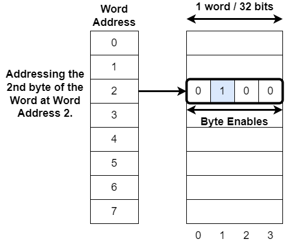

## Wishbone Interconnect

- **Crossbar and Arbiter Repo**, BoxLambda fork, *boxlambda* branch:
  [https://github.com/epsilon537/wb2axip](https://github.com/epsilon537/wb2axip)

- **Crossbar Submodule in the BoxLambda Directory Tree**:
  `boxlambda/sub/wb2axip/`

- **Shared Bus / MUX Repo**, BoxLambda fork, *boxlambda* branch:
  [https://github.com/epsilon537/verilog-wishbone](https://github.com/epsilon537/verilog-wishbone)

- **Shared Bus / MUX Submodule in the BoxLambda Directory Tree**:
  `boxlambda/sub/verilog-wishbone/`

- **Crossbar/Arbiter/MUX Component in the BoxLambda Directory Tree**:
  [boxlambda/gw/components/wbxbar](https://github.com/epsilon537/boxlambda/tree/master/gw/components/wbxbar)

- **Crossbar Top-Level Module**:
  [sub/wb2axip/rtl/wbxbar.v](https://github.com/epsilon537/wb2axip/blob/boxlambda/rtl/wbxbar.v)

- **Arbiter Module**:
  [sub/wb2axip/rtl/wbarbiter.v](https://github.com/epsilon537/wb2axip/blob/boxlambda/rtl/wbarbiter.v)

- **Shared Bus Top-Level Module**:
  [gw/components/wbxbar/rtl/wb_shared_bus_15.sv](https://github.com/epsilon537/boxlambda/blob/master/gw/components/wbxbar/rtl/wb_shared_bus_15.sv)

- **Wishbone Staller Module**:
  [gw/components/wbxbar/rtl/wb_staller.sv](https://github.com/epsilon537/boxlambda/blob/master/gw/components/wbxbar/rtl/wb_staller.sv)

The interconnect serves as the backbone connecting the internal components of the SoC. For this project, the two most relevant SoC internal bus specifications are [ARM's AXI bus](https://developer.arm.com/documentation/ihi0022/latest) and the open-source [Wishbone bus](https://wishbone-interconnect.readthedocs.io/en/latest/).

**AXI** is a powerful and widely adopted interconnect standard that scales efficiently for large SoCs. However, I it does not scale down effectively to simpler SoCs like BoxLambda, where low latency and reduced complexity are prioritized over high bandwidth and scalability. For this project, I am using **Wishbone** instead.

BoxLambda uses Wishbone in *Pipelined Mode*, as defined in the [Wishbone B4 specification](https://github.com/fossi-foundation/wishbone/blob/master/documents/spec/wbspec_b4.pdf).

### Crossbar, Shared Bus, and Bus Arbiter

BoxLambda incorporates a *Crossbar*, a *Shared Bus*, and, in the case of the DFX Configuration, a *Bus Arbiter*. Refer to the [Architecture](architecture.md#architecture) section to see how these components fit into the overall architecture.

I am using ZipCPU's [WBXbar](https://github.com/epsilon537/wb2axip/blob/boxlambda/rtl/wbxbar.v) module for the crossbar. This module is well-documented in this ZipCPU blog post:

[https://zipcpu.com/blog/2019/07/17/crossbar.html](https://zipcpu.com/blog/2019/07/17/crossbar.html)

The Wishbone Bus Arbiter, [WBArbiter](https://github.com/epsilon537/wb2axip/blob/boxlambda/rtl/wbarbiter.v), is sourced from the same ZipCPU *wb2axip* repo.

The Shared Bus is a 1-to-15 MUX generated by the [wb_mux.py](https://github.com/epsilon537/verilog-wishbone/blob/boxlambda/rtl/wb_mux.py) Python script. For convenience, I wrote a [wb_if](https://github.com/epsilon537/ibex_wb/blob/boxlambda/rtl/wb_if.sv) aware SystemVerilog wrapper for it:

[gw/components/wbxbar/rtl/wb_shared_bus_15.sv](https://github.com/epsilon537/boxlambda/blob/master/gw/components/wbxbar/rtl/wb_shared_bus_15.sv)

### Wishbone Staller / Transaction Separator

In the [Architecture](architecture.md#architecture) diagram, you'll see that the CPU instruction and data ports are connected to the crossbar through [wb_staller](https://github.com/epsilon537/boxlambda/blob/master/gw/components/wbxbar/rtl/wb_staller.sv) modules.
WB_staller stalls the Wishbone Bus Master for one clock cycle at the beginning of a transaction. It's purposed is to separate transactions, i.e. preventing back-to-back transactions with CYC continuously asserted. Back-to-back transactions within the same xbar channel have lower latency than non-back-to-back transactions. As a result, the cycle count of transactions passing through the crossbar (e.g. register access) becomes less predictable. The wb_stallers avoid this issue.

### Word Addressing

BoxLambda uses Word Addressing rather than Byte Addressing.

*Byte Addressing (left) vs. Word Addressing (right).*

A byte can still be accessed using a word-addressed bus. This is achieved through byte enable signals:

*Addressing a byte using Word Addressing and Byte Enables.*

### Interconnect Bus Width and Clock Frequency

BoxLambda's interconnect features a 32-bit data bus and a 28-bit word-address bus.

The interconnect operates within the 50 MHz system clock domain.

### Handling Invalid Addresses

A small 'feature' was added to WBXbar (which may be controversial): transactions to invalid addresses are acknowledged rather than rejected. In such cases, the Wishbone error signal, which would typically be asserted, is suppressed. Reads from an invalid address returns `0xDEADBEEF`.

This feature is enabled with the *OPT_ACK_INVALID_ADDR* and *OPT_TIMEOUT* parameters of WBXbar. Specifically:

- *OPT_ACK_INVALID_ADDR* causes Wishbone accesses to addresses outside the configured address map to be acknowledged. The return data is set to `ERROR_DATA_PATTERN`, which is also a WBXbar parameter.
- *OPT_TIMEOUT* is set to 511. This causes WBXbar to abort a Wishbone transaction after 511 clock cycles. This is used to terminate transactions with non-responding slaves.

The rationale behind this is to prevent an unrecoverable CPU exception when accidentally accessing an invalid address in the REPL.

For test builds, invalid addresses should trigger Wishbone errors, so a top-level flag was introduced to control this behavior. This flag, ACK_INVALID_ADDR, is set to 0 for all test builds except the *invalid_address* test build. For the *boxlambda_base*, *boxlambda_dfx*, and *invalid_address* test builds, this flag is set to 1.
