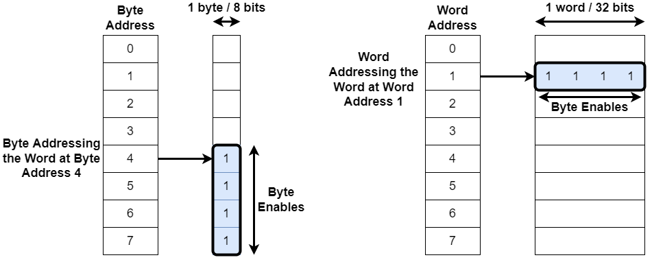
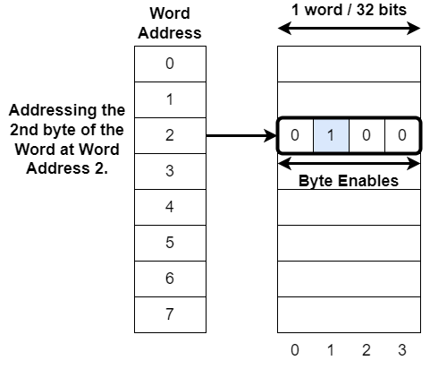

## The Wishbone Interconnect

- **Crossbar Repo**, BoxLambda fork, *boxlambda* branch: 
  [https://github.com/epsilon537/wb2axip](https://github.com/epsilon537/wb2axip).

- **Crossbar Submodule in the BoxLambda Directory Tree**: 
  boxlambda/sub/wb2axip/.

- **Crossbar Component in the BoxLambda Directory Tree**: 
  [boxlambda/gw/components/wbxbar](https://github.com/epsilon537/boxlambda/tree/master/gw/components/wbxbar)

- **Crossbar Top-Level**:
[sub/wb2axip/rtl/wbxbar.v](https://github.com/epsilon537/wb2axip/blob/boxlambda/rtl/wbxbar.v)

The Bus, or Interconnect, is the fabric stitching together the SoC internal components. For this project, the two most relevant SoC internal bus specifications are [ARM's AXI bus](https://developer.arm.com/documentation/ihi0022/latest) and the Open-Source [Wishbone bus](https://wishbone-interconnect.readthedocs.io/en/latest/).

**AXI** is very powerful, very popular, and very complex. It scales up well to very big SoCs. However, I don't think it scales down very well to simple SoCs, such as BoxLambda, where low latency and low complexity are more important than high bandwidth and scalability. Hence, for this project, I'm electing to go with **Wishbone**. 

We'll be using Wishbone in *Pipelined Mode*, as specified in the [Wishbone B4 specification](https://github.com/fossi-foundation/wishbone/blob/master/documents/spec/wbspec_b4.pdf).

### Crossbar and Shared Bus

BoxLambda uses a crossbar and shared bus combination. Refer to the [Architecture](architecture.md#architecture) section for more info.

### Word Addressing

BoxLambda uses Word Addressing, as opposed to Byte Addressing.

*Byte Addressing (left) vs. Word Addressing (right).*

Note that you can still address a byte using a Word Addressing bus. That's what the Byte Enables are for:

*Addressing a byte using Word Addressing and Byte Enables.*

### Bus Width and Clock Frequency

BoxLambda's Interconnect uses a 32-bit data bus and a 28-bit word address bus. 

The Interconnect is part of the 50MHz System Clock Domain.

### WBXBAR

I'm using *ZipCPU's* [WBXBAR](https://github.com/ZipCPU/wb2axip/blob/master/rtl/wbxbar.v) module for both the crossbar and the shared bus. A crossbar instance with one bus master port is equivalent to a shared bus instance with one bus master port.

The WBXBAR crossbar module is well-documented in this ZipCPU Blog post:

[https://zipcpu.com/blog/2019/07/17/crossbar.html](https://zipcpu.com/blog/2019/07/17/crossbar.html)

At the top of this page you'll find a link to the BoxLambda fork of WBXBAR. It contains a few minor code tweaks in the for-loop generators to make Vivado happy.
