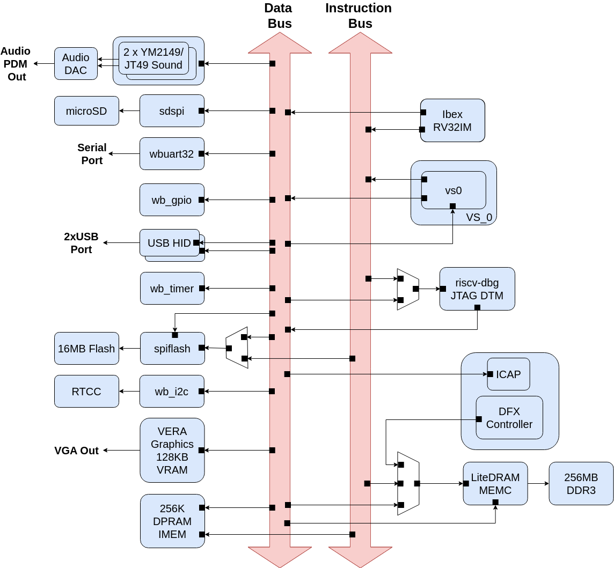

# Wishbone Interconnect

- **Wishbone Arbiter and MUX Repo**, BoxLambda fork, `boxlambda` branch:
  [https://github.com/epsilon537/verilog-wishbone](https://github.com/epsilon537/verilog-wishbone)

- **Wishbone Arbiter and MUX Submodule in the BoxLambda Directory Tree**:
  boxlambda/sub/verilog-wishbone/

- **Interconnect Component in the BoxLambda Directory Tree**:
  [boxlambda/gw/components/interconnect](https://github.com/epsilon537/boxlambda/tree/master/gw/components/interconnect)

- **Instruction Bus Module**:
  [boxlambda/gw/components/interconnect/rtl/instruction_bus.sv](https://github.com/epsilon537/boxlambda/blob/master/gw/components/interconnect/rtl/instruction_bus.sv)

- **Data Bus Module**:
  [boxlambda/gw/components/interconnect/rtl/data_bus.sv](https://github.com/epsilon537/boxlambda/blob/master/gw/components/interconnect/rtl/data_bus.sv)

The interconnect serves as the backbone connecting the internal components of the SoC. BoxLambda uses the Wishbone *Pipelined* bus protocol, as defined in the [Wishbone B4 specification](https://github.com/fossi-foundation/wishbone/blob/master/documents/spec/wbspec_b4.pdf).

Using the pipelined wishbone bus protocol does *not* imply that BoxLamba supports multiple outstanding transactions. It doesn't, currently. BoxLambda uses the pipelined protocol to have the option of supporting multiple outstanding transactions in case some day the need arises.

## The Instruction Bus and the Data Bus

*BoxLambda Block Diagram.*

The Ibex CPU has an instruction and a data port, respectively connected via an Instruction and a Data Bus to the slaves they need to be able to reach. The few slaves that have to be hooked up to both buses use a 2-to-1 wishbone arbiter to select between the two buses. In theory, the arbitration will introduce delays when there's concurrent access. In practice, the programmer will know when he's in such a situation and there will be no surprises (or maybe a little one. See the [Arbiters without Overhead](#arbiters-without-overhead-most-of-the-time) section below).

Note that both buses have multiple bus masters:

- The Data Bus is connected to:
    - The Ibex CPU data port.
    - VS0 (DFX Virtual Socket 0) port 1.
    - The Debug Module.

- The Instruction Bus is connected to:
    - The Ibex CPU instruction port.
    - VS0 port 0.

*The Data Bus and the Instruction Bus.*

The buses use an arbiter to select which bus master can access the MUX, but during normal operation, there will be no conflict:

- The VS0 bus master port gives us the option of experimenting with alternative CPU designs as DFX Reconfigurable Modules. In such a configuration, the Ibex CPU would go quiet after launching the VS0-based CPU, and VS0 would effectively become the only bus master on the system.

- The Debug Module is not active during normal operation.

In other words, during normal operation, only the CPU is active. You won't have multiple masters competing for the bus, so register and internal memory access times remain known and constant.

## Arbiters without Overhead (most of the time)

The wishbone arbiters present a minor problem, however. Arbiters typically introduce some transaction overhead. Luckily, there's a way to avoid that: I added a parameter to the arbiter module that allows you to select a default port. Transactions going through the default port will not suffer arbitration overhead when there are no requests on the other ports. The Bus Master-facing arbiters have their default port connected to the CPU.

*Arbiter without arbitration overhead on the default port.*

The arbiter design is adapted from [Alex Forencich's](https://github.com/alexforencich) wishbone arbiter implementation. The arbiter is code-generated using a Python script:

[https://github.com/epsilon537/verilog-wishbone/blob/boxlambda/rtl/wb_arbiter.py](https://github.com/epsilon537/verilog-wishbone/blob/boxlambda/rtl/wb_arbiter.py)

## Word Addressing

BoxLambda uses Word Addressing rather than Byte Addressing.

*Byte Addressing (left) vs. Word Addressing (right).*

A byte can still be accessed using a word-addressed bus. This is achieved through byte enable signals:

*Addressing a byte using Word Addressing and Byte Enables.*

## Interconnect Bus Width and Clock Frequency

BoxLambda's interconnect features a 32-bit data bus and a 28-bit word-address bus.

The interconnect operates within the 50 MHz system clock domain.

## Handling Invalid Addresses

The Data Bus can optionally acknowledge transactions to invalid addresses. With this feature enabled, if there is no slave response to a read or write request within a timeout period (512 clock cycles), the Data Bus will acknowledge the transaction. In case of read requests, a dummy value of `0xDEADBEEF` is returned.

The rationale behind this feature is to prevent a system lock-up when the user accidentally accesses an invalid address from the REPL.

For test builds, invalid addresses should trigger Wishbone errors, so a top-level flag was introduced to control this behavior. This flag, `ACK_INVALID_ADDR`, is set to 0 for all test builds except the *invalid_address* test build. For the *boxlambda_base*, *boxlambda_dfx*, and *invalid_address* test builds, this flag is set to 1.

