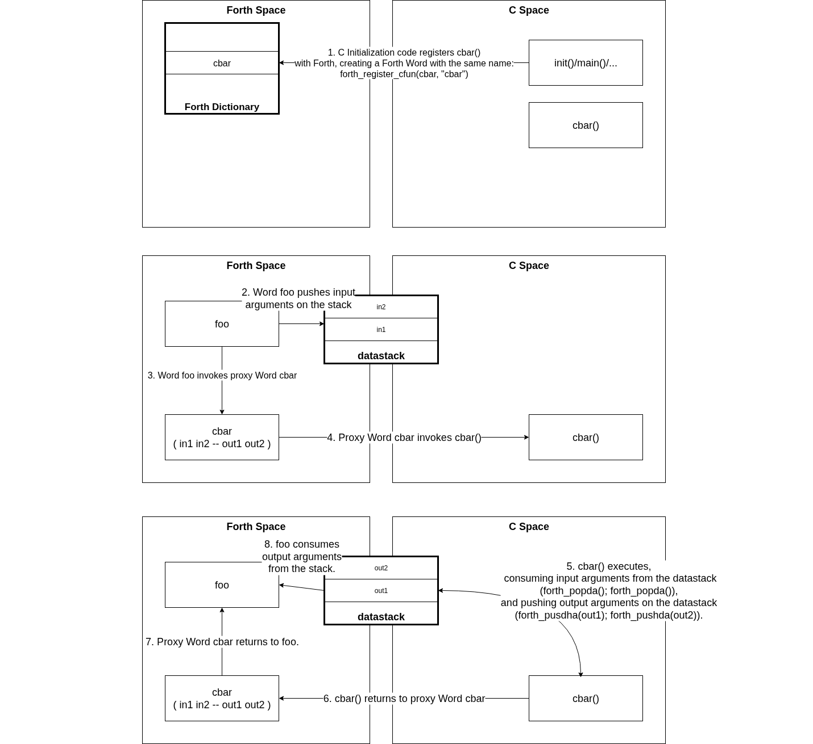

# The Forth-C Foreign Function Interface (FFI)

API:

- [sw/components/forth_core/forth.h](https://github.com/epsilon537/boxlambda/blob/master/sw/components/forth_core/forth.h):

Implementation:

- [sw/components/forth_core/forth.cpp](https://github.com/epsilon537/boxlambda/blob/master/sw/components/forth_core/forth.cpp)
- The `c-fun` Word in [sw/components/forth_core/init.fs](https://github.com/epsilon537/boxlambda/blob/master/sw/components/forth_core/init.fs)
- Forth to C: [sw/components/forth_core/c-ffi.s](https://github.com/epsilon537/boxlambda/blob/master/sw/components/forth_core/c-ffi.s)
- C to Forth: [sw/components/forth_core/mecrisp-quintus-boxlambda.s](https://github.com/epsilon537/boxlambda/blob/master/sw/components/forth_core/mecrisp-quintus-boxlambda.s)

The BoxLambda C-Forth FFI is loosely based on Peter Schmid's work for the [Mecrisp Cube project](https://github.com/spyren/Mecrisp-Cube/tree/master).

C has one stack, which is used to keep track of the call stack, stack frames
(local variables), and - when a lot of parameters are involved - parameter
passing. Forth uses two stacks: a **Return Stack** and a **Data Stack**. The return
stack is used to keep track of the call stack and stack frames. The Data Stack
is used for parameter passing.

On BoxLambda, the C stack acts as a return stack when in Forth space. It's a natural
fit. It doesn't require any additional software constructs. The C compiler
manages the C stack, while on the Forth side, the Mecrisp Quintus Forth Core is already using the
RISC-V stack pointer register (x2) as the return stack pointer.

The Data Stack does require a software construct. The `forth_core_init()` function initializes a global `datastack` object with the following layout in C (see [forth.h](https://github.com/epsilon537/boxlambda/blob/master/sw/components/forth_core/forth.h)):

```
typedef struct {
  uint32_t tos;
  uint32_t *psp;
} Forth_Datastack;

extern Forth_Datastack datastack;
```

The `tos` field is the *Top Of (data) Stack*. The `psp` field is the *Parameter Stack Pointer*. The Parameter Stack is an old-school term for Data Stack.

This `datastack` object acts as the mailbox between C and Forth.

In C space, the data stack is manipulated using the following two accessors:

```
// Push a value onto the data stack
void forth_pushda(uint32_t val);

// Pop a value from the data stack
uint32_t forth_popda();
```

## C Calling Forth

When C calls Forth, the calling function puts input parameters on the data stack using `forth_pushda()` before invoking the Forth Word. Afterwards (i.e., when the Forth Word has executed and returned to C), it picks up any return values using `forth_popda()`.

### Example 1

Here's an example of C calling Forth:

```
  uint32_t first_arg = 42;
  uint32_t second_arg = 43;

  forth_pushda(second_arg);
  forth_pushda(first_arg);

  forth_execute_word("foo");

  uint32_t res1 = forth_popda();
  uint32_t res2 = forth_popda();

  printf("Foo returned %d and %d.\n", res1, res2);
```

In this example, `foo` is a Word that takes 2 arguments and return two values. For example:

```
: foo ." In foo..." 2dup . . cr /mod ;
```

[](assets/c-calls-forth.png)

*C Calling Forth.*

### Example 2

If C needs to call Forth Word `foo` many times, it's better to store foo's execution token (*xt*) so we don't have to do a dictionary search each time:

```
  uint32_t foo_xt = forth_find_word("foo");

  uint32_t first_arg = 42;
  uint32_t second_arg = 43;
  uint32_t res1, res2;

  for (int ii=0; ii<100; ii++) {
      forth_pushda(second_arg);
      forth_pushda(first_arg);

      forth_execute_xt(foo_xt);

      res1 = forth_popda();
      res2 = forth_popda();
      printf("Foo returned %d and %d.\n", res1, res2);
  }
```

## Forth Calling C

When Forth calls C, it updates the `datastack` object with its current *TOS* and *PSP* values. It then invokes one of the registered C functions. The registered C function retrieves input parameters from the stack using `forth_popda()` and pushes output parameters/return values on the stack using `forth_pushda()`.

C functions are registered with Forth using the following macro from [forth.h](https://github.com/epsilon537/boxlambda/blob/master/sw/components/forth_core/forth.h):

```
// Register a C function with signature: void fun(void). Fun uses the datastack object for parameter passing.
#define forth_register_cfun(fun, wordname) \
           forth_pushda((uint32_t)fun), forth_eval("c-fun " wordname)
```

Note the expected ```void fun(void)``` signature. Forth registered C functions don't have any C-style input parameters or return values. The `datastack` object is used exclusively for parameter passing.

### Example

Let's say we have a function `cbar()` which takes two input parameters off the data stack, prints them, and then pushes values 77 and 88 on the stack as output arguments:

```
void cbar() {
  uint32_t first_arg = forth_popda();
  uint32_t second_arg = forth_popda();

  printf("test_c_fun called with args %d and %d.\n", first_arg, second_arg);

  printf("Returning values 77 88 to Forth.\n");

  forth_pushda(77);
  forth_pushda(88);
}
```

Here's an example of Forth calling this C function with input values 11 and 22:

Preparation in C space, at initialization time:

```
  forth_core_init();
  forth_register_cfun(cbar, "cbar");
```

From Forth:

```
11 22 cbar . . cr
```

The `. . cr` after calling `cbar` pops the output arguments off the stack, prints them, and then prints a carriage return.

[](assets/forth-calls-c.png)

*Forth Calling C.*

## The Forth-C FFI API

[sw/components/forth_core/forth.h](https://github.com/epsilon537/boxlambda/blob/master/sw/components/forth_core/forth.h):


```
// Initialize the Forth environment.
void forth_core_init();
void forth_repl();

// Push a value onto the data stack
void forth_pushda(uint32_t val);

// Pop a value from the data stack
uint32_t forth_popda();

// Find a word and return its xt, or 0 if word is not found.
uint32_t forth_find_word(const char *s);

// Execute the given xt (looked up using forth_find_word).
void forth_execute_xt(uint32_t xt);

// A wrapper for the two previous actions. Look up a word,
// if found, executed it and return 0. If not found, return -1.
uint32_t forth_execute_word(const char *s);

// Evaluate the given string.
void forth_evaluate(const char *s, uint32_t count);
#define forth_eval(s) forth_evaluate(s, strlen(s))

// Evaluate the multi-line buffer pointed to by s line-by-line?
// If verbose flag is set, print each line as its being loaded.
void forth_load_buf(char *s, bool verbose);

// Register a C function with signature: void fun(void). Fun uses the datastack object for parameter passing.
#define forth_register_cfun(fun, wordname) \
           forth_pushda((uint32_t)fun), forth_eval("c-fun " wordname)
```

## Register Usage

When C code calls a Forth Word, or a Forth Word calls C, we have to consider
both the [RISC-V C
ABI](https://riscv.org/wp-content/uploads/2024/12/riscv-calling.pdf) and the
Mecrisp Quintus Forth register usage convention.

### Register Usage in case of C Calling Forth

To maintain the C environment when C calls a Forth Word, the Forth code has to execute as if it were a C function.

The table below summarizes the actions that should be taken per register when C calls Forth:

| Register to preserve | C ABI Name | C ABI Description | Mecrisp Forth Description | Required action when C calls Forth |
|----------|------------|-------------------|---------------------------|-----------------------------------|
| x0     | zero  | Hard-wired zero | Hard-wired zero | None. |
| x1     | ra    | Return address  | Return address | Save on RS before calling Forth Word, restore afterwards. |
| x2     | sp    | Stack pointer, must be 16-byte aligned | Return Stack pointer (RS) | None. Forth maintains the C stack as RS |
| x3     | gp    | Global pointer  | Loop index | Restore gp when returning back to C. |
| x4     | tp    | Thread pointer  | Loop limit | Restore tp when returning back to C. |
| x5     | t0    | Temporary, not preserved across calls | Scratch register, must be saved before use | None. |
| x6     | t1    | Temporary, not preserved across calls | Scratch register, must be saved before use | None. |
| x7     | t2    | Temporary, not preserved across calls | Scratch register, must be saved before use | None. |
| x8     | s0/fp | Saved register/frame pointer, preserved across calls/must be saved before use | Top of data stack (TOS) | x8=datastack.tos upon entry. Datastack.tos=x8 when returning to C. |
| x9     | s1    | Saved register, preserved across calls/must be saved before use | Data stack pointer (PSP) | x9=datastack.psp upon entry. Datastack.psp=x9 when returning to C. |
| x10    | a0    | Function argument/return value, not preserved across calls/no need save before use | Scratch register, must be saved before use | None. |
| x11    | a1    | Function argument/return value, not preserved across calls/no need save before use | Scratch register, must be saved before use | None. |
| x12    | a2    | Function argument, not preserved across calls/no need save before use | Scratch register, must be saved before use | None. |
| x13    | a3    | Function argument, not preserved across calls/no need save before use | Scratch register, must be saved before use | None. |
| x14    | a4    | Function argument, not preserved across calls/no need save before use | Free scratch register, not preserved across calls | None. |
| x15    | a5    | Function argument, not preserved across calls/no need save before use | Free scratch register, not preserved across calls | None. |
| x16-31 | --    | -- | Unused in vanilla forth cores | None. |

Because BoxLambda is a single-threaded platform, we can save the global pointer (x3/gp)
and thread pointer (x4/tp) once, during Forth core initialization. We can store them in
global variables so we can easily retrieve them when needed.

We'll also save the C stack pointer (x2/sp) into a global variable upon entry
into Forth so we can restore to this point if the Forth *reset* Word is
invoked.

See `forth_core_init_` and `forth_core_fun_` in [mecrisp-quintus-boxlambda.s](https://github.com/epsilon537/boxlambda/blob/master/sw/components/forth_core/mecrisp-quintus-boxlambda.s).

### Register Usage in case of Forth Calling C

To maintain the Forth environment when Forth calls a C function, the C code has to execute as if it were a Forth Word.

The table below summarizes the actions that should be taken per register.

| Register to preserve | C ABI Name | C ABI Description | Mecrisp Forth Description | Required action when Forth calls C |
|----------|------------|-------------------|---------------------------|-----------------------------------|
| x0     | zero  | Hard-wired zero | Hard-wired zero | None. |
| x1     | ra    | Return address  | Return address | Save on RS before calling C, restore afterwards. |
| x2     | sp    | Stack pointer, must be 16-byte aligned | Return Stack pointer (RS) | Save on RS, 16-byte align before calling C, restore afterwards. |
| x3     | gp    | Global pointer  | Loop index | Save on RS and switch to gp before calling C, restore afterwards. |
| x4     | tp    | Thread pointer  | Loop limit | Save on RS and switch to tp before calling C, restore afterwards. |
| x5     | t0    | Temporary, not preserved across calls | Scratch register, must be saved before use | Save on RS before Calling C, restore afterwards. |
| x6     | t1    | Temporary, not preserved across calls | Scratch register, must be saved before use | Save on RS before Calling C, restore afterwards. |
| x7     | t2    | Temporary, not preserved across calls | Scratch register, must be saved before use | Save on RS before Calling C, restore afterwards. |
| x8     | s0/fp | Saved register/frame pointer, preserved across calls/must be saved before use | Top of data stack (TOS) | datastack.tos=x8 upon entry. X8=datastack.tos when returning to Forth. |
| x9     | s1    | Saved register, preserved across calls/must be saved before use | Data stack pointer (PSP) | Datastack.psp=x9 upon entry. X9=datastack.psp when returning to Forth. |
| x10    | a0    | Function argument/return value, not preserved across calls/no need save before use | Scratch register, must be saved before use | Save on RS before Calling C, restore afterwards. |
| x11    | a1    | Function argument/return value, not preserved across calls/no need save before use | Scratch register, must be saved before use | Save on RS before Calling C, restore afterwards. |
| x12    | a2    | Function argument, not preserved across calls/no need save before use | Scratch register, must be saved before use | Save on RS before Calling C, restore afterwards. |
| x13    | a3    | Function argument, not preserved across calls/no need save before use | Scratch register, must be saved before use | Save on RS before Calling C, restore afterwards. |
| x14    | a4    | Function argument, not preserved across calls/no need save before use | Free scratch register, not preserved across calls | None. |
| x15    | a5    | Function argument, not preserved across calls/no need save before use | Free scratch register, not preserved across calls | None. |
| x16-31 | --    | -- | Unused in vanilla forth cores | None. |

See `call-c` in [c-ffi.s](https://github.com/epsilon537/boxlambda/blob/master/sw/components/forth_core/c-ffi.s) along with Word `c-fun` in [init.fs](https://github.com/epsilon537/boxlambda/blob/master/sw/components/forth_core/init.fs).

