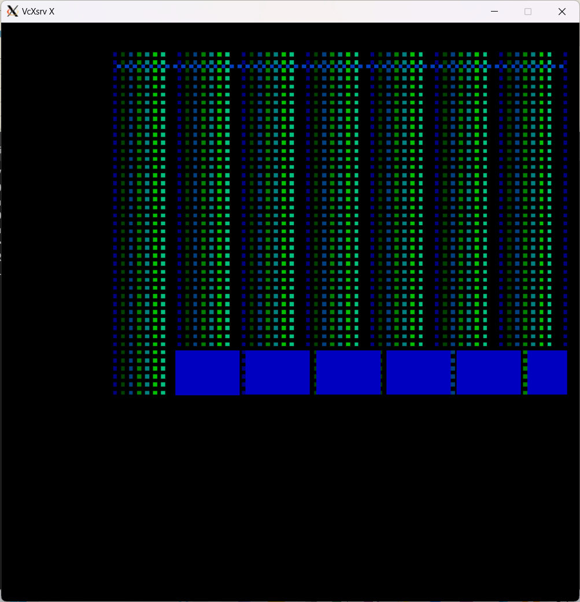
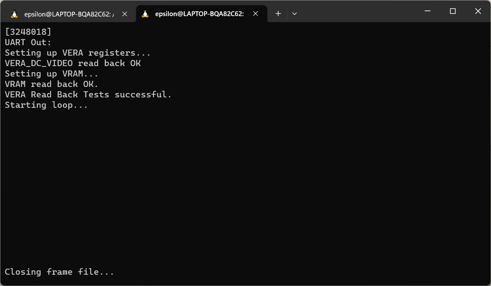

# VERA Test

## Vera_integrated on Verilator

Build the *vera_integrated* project:
```
cd build/sim-a7-100/gw/projects/vera_integrated
make vera_integrated_sim
```
Execute the generated Verilator model:
```
./Vmodel
```
Vmodel opens a window where the VGA output is rendered pixel-by-pixel. You should see the following frame appear:



*Frame generated by vera_integrated Verilator model.*

The terminal window should look like this:



*Vera_integrated Verilator model terminal window output.*

## Vera_integrated on the Arty A7

Hook up the VGA PMOD as described [here](pmods.md#vga-pmod).

Build the vera_integrated project in an Arty A7 build tree:
```
cd build/arty-a7-100/gw/projects/vera_integrated
make vera_integrated_bit
```

Download the generated bitstream file to the Arty A7:
```
make vera_integrated_load
```

The display should now show a bunch of colored squares. Here's a picture of my setup.


*Arty A7 Setup for the vera_integrated Test SoC.*
