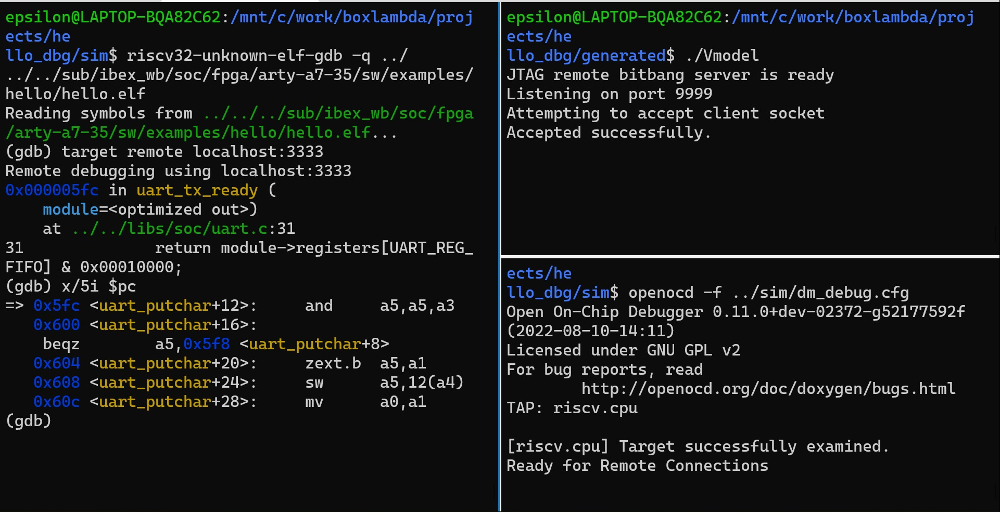

Installation and Test Builds
============================
Installation
------------

Before you try any of the Test Builds below, you need to set up the repository:

   1. Install the [Prerequisites](../documentation/#prerequisites). 
   1. Get the BoxLambda repository:
```
git clone https://github.com/epsilon537/boxlambda/
cd boxlambda
```
   1. Switch to the *hello_dbg* tag: 
```
git checkout hello_dbg
```
   1. Get the submodules: 
```
git submodule update --init --recursive
```

Test Builds
-----------

### Hello World on the Arty A7-35T

Project directory **boxlambda/projects/hello_world/** contains a test SoC build consisting of an Ibex_WB core, 64KB internal memory, a wbuart32 core, a timer, and a GPIO module.

To build the *Hello World!* example, go through the following steps:

1. Build the project:
   1. ```cd projects/hello_world```
   2. ```make impl```  
1. Start Vivado and download the generated bitstream to your Arty A7-35T: *projects/hello_world/generated/project.runs/impl_1/ibex_soc.bit*

### Hello World Verilator Build

To try out the Verilator Test Bench for *Hello World*:

1. Build the testbench:
   1. ```cd projects/hello_world```
   2. ```make sim```
1. Execute the testbench:
   1. ```cd generated```
   2. Without tracing (fast): ```./Vmodel -i```
   3. With tracing (slow): ```./Vmodel -t```
1. View the generated traces: ```gtkwave simx.fst```

### Connecting GDB to the Hello_DBG build on Arty A7

1. Build the test project:
```
cd projects/hello_dbg
make impl
```
1. Start Vivado and download the generated bitstream to your Arty A7-35T:  
   *projects/hello_dbg/generated/project.runs/impl_1/ibex_soc.bit*
1. Verify that the *Hello World* test program is running: The four LEDs on the Arty A7 should be blinking simultaneously.
1. If you're running on WSL, check the **When on WSL** note below.
1. Start OpenOCD with the *digilent_arty_a7.cfg* config file: 
```
sudo openocd -f <boxlambda root directory>/openocd/digilent_arty_a7.cfg
Info : clock speed 1000 kHz
Info : JTAG tap: riscv.cpu tap/device found: 0x0362d093 (mfg: 0x049 (Xilinx), part: 0x362d, ver: 0x0)
Info : [riscv.cpu] datacount=2 progbufsize=8
Info : Examined RISC-V core; found 1 harts
Info :  hart 0: XLEN=32, misa=0x40101106
[riscv.cpu] Target successfully examined.
Info : starting gdb server for riscv.cpu on 3333
Info : Listening on port 3333 for gdb connections
Ready for Remote Connections
Info : Listening on port 6666 for tcl connections
Info : Listening on port 4444 for telnet connections
```
1. Launch GDB with hello.elf:	
```
cd <boxlambda root directory>/sub/ibex_wb/soc/fpga/arty-a7-35/sw/examples/hello
riscv32-unknown-elf-gdb hello.elf
```
1. Connect GDB to the target. From the GDB shell:
```
(gdb) target remote localhost:3333
Remote debugging using localhost:3333
0x00000c90 in delay_loop_ibex (loops=3125000) at ../../libs/soc/utils.c:12
12              asm volatile(
```

#### When on WSL

If you're running on WSL, you need to make sure that the USB port connected to the Arty A7 is forwarded to WSL. The following article describes how to do this:

[https://docs.microsoft.com/en-us/windows/wsl/connect-usb](https://docs.microsoft.com/en-us/windows/wsl/connect-usb)

On my machine, these are the steps:

1. From a Windows Command Shell:
	
```
C:\Users\ruben>usbipd wsl list
BUSID  VID:PID    DEVICE                                                        STATE
1-2    0403:6010  USB Serial Converter A, USB Serial Converter B                Not attached
1-3    0461:4d15  USB Input Device                                              Not attached
1-7    13d3:5666  USB2.0 HD UVC WebCam                                          Not attached
1-14   8087:0aaa  Intel(R) Wireless Bluetooth(R)                                Not attached

C:\Users\ruben>usbipd wsl attach --busid 1-2
```

1. From a Linux shell on WSL:

```
epsilon@LAPTOP-BQA82C62:~$ lsusb
Bus 002 Device 001: ID 1d6b:0003 Linux Foundation 3.0 root hub
Bus 001 Device 002: ID 0403:6010 Future Technology Devices International, Ltd FT2232C/D/H Dual UART/FIFO IC
Bus 001 Device 001: ID 1d6b:0002 Linux Foundation 2.0 root hub
```

### Connecting GDB to the Hello_DBG build on Verilator


*OpenOCD JTAG Debug Session on Verilator*

1. Build the test project:

	```
	cd projects/hello_dbg
	make sim
	```

1. Launch the Verilator model:

	```
	cd generated
	./Vmodel
	```

1. Start OpenOCD with the *verilator_riscv_dbg.cfg* config file:

	```
	openocd -f <boxlambda root directory>/openocd/verilator_riscv_dbg.cfg
	Open On-Chip Debugger 0.11.0+dev-02372-g52177592f (2022-08-10-14:11)
	Licensed under GNU GPL v2
	For bug reports, read
			http://openocd.org/doc/doxygen/bugs.html
	TAP: riscv.cpu

	[riscv.cpu] Target successfully examined.
	Ready for Remote Connections on port 3333.
	```

1. Launch GDB with hello.elf:	

	```
	cd <boxlambda root directory>/sub/ibex_wb/soc/fpga/arty-a7-35/sw/examples/hello
	riscv32-unknown-elf-gdb hello.elf
	```
1. Connect GDB to the target. From the GDB shell:

	```
	(gdb) target remote localhost:3333
	Remote debugging using localhost:3333
	0x000005fc in uart_tx_ready (module=<optimized out>) at ../../libs/soc/uart.c:31
	31              return module->registers[UART_REG_FIFO] & 0x00010000;
	```

Prerequisites
-------------

- **Host OS**: Linux or Linux WSL.
- **Vivado ML** Edition V2021.2, Linux version:
  
  [https://www.xilinx.com/support/download/index.html/content/xilinx/en/downloadNav/vivado-design-tools/2021-1.html](https://www.xilinx.com/support/download/index.html/content/xilinx/en/downloadNav/vivado-design-tools/2021-1.html)
  
  Make sure you also install your Arty A7 or Nexys A7 board files. Digilent has excellent instructions for installing Vivado and Digilent board files:
  
  [https://digilent.com/reference/vivado/installing-vivado/v2019.2](https://digilent.com/reference/vivado/installing-vivado/v2019.2)

- RISCV Compiler Toolchain **rv32imcb**. This is the cross compiler for building the code that'll run on the Ibex processor. I'm using the **20220210-1** pre-built binaries from *lowRISC*: 
	[https://github.com/lowRISC/lowrisc-toolchains/releases](https://github.com/lowRISC/lowrisc-toolchains/releases)

  Add the toolchain's *bin/* directory to your *PATH*. E.g.:

```
export RISCV_TOOLCHAIN=$HOME/lowrisc-toolchain-gcc-rv32imcb-20220210-1
export PATH=$PATH:$RISCV_TOOLCHAIN/bin
```

- **GNU Make** version 4.2.1: [https://www.gnu.org/software/make/](https://www.gnu.org/software/make/)
  
  Please make sure make is in your *PATH*.
  
- **Bender** 0.25.2: [https://github.com/pulp-platform/bender](https://github.com/pulp-platform/bender)

  Add bender to your *PATH*.

- **Verilator** 4.216: [https://verilator.org/guide/latest/install.html](https://verilator.org/guide/latest/install.html)

  Add verilator to your *PATH*.

- **Ncurses**: ```sudo apt-get install libncurses5-dev libncursesw5-dev libncursesw5```

- **Gtkwave**: [http://gtkwave.sourceforge.net/](http://gtkwave.sourceforge.net/)

- **RISCV OpenOCD**

  Build RISCV OpenOCD from source:
  
  1. ```git clone https://github.com/riscv/riscv-openocd```
  2. ```cd riscv-openocd```
  3. ```git submodule update --init --recursive```
  4. ```./bootstrap```
  5. ```./configure --prefix=$RISCV --disable-werror --disable-wextra --enable-remote-bitbang --enable-ftdi```
  6. ```make```
  7. ```sudo make install```
  8. Add the install directory (*/usr/local/bin* in my case) to your PATH.  
	 &nbsp;
