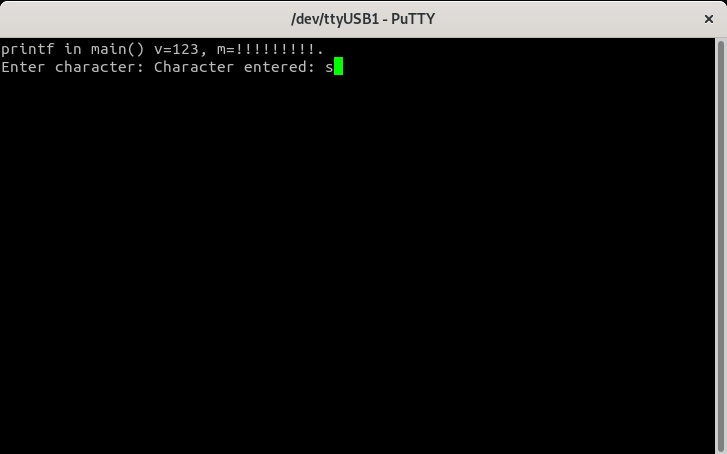
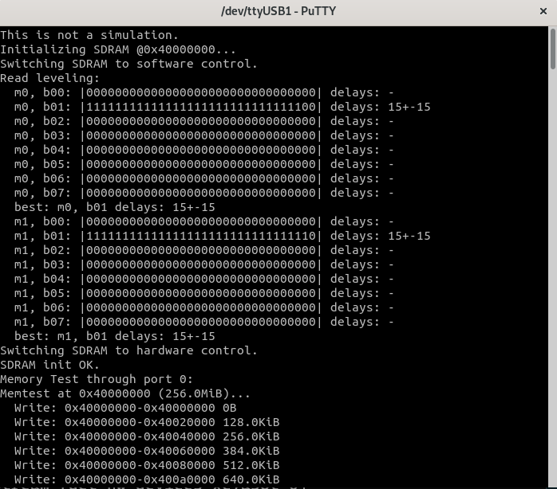

Installation, Configuration and Test Builds
===========================================
Prerequisites
-------------

- **Host OS**: Linux or Linux WSL.
  
- **Vivado ML** Edition V2021.2, Linux version:
  
    [https://www.xilinx.com/support/download/index.html/content/xilinx/en/downloadNav/vivado-design-tools/2021-1.html](https://www.xilinx.com/support/download/index.html/content/xilinx/en/downloadNav/vivado-design-tools/2021-1.html)
    
    Make sure you also install your Arty A7 board files. Digilent has excellent instructions for installing Vivado and Digilent board files:
    
    [https://digilent.com/reference/vivado/installing-vivado/v2019.2](https://digilent.com/reference/vivado/installing-vivado/v2019.2)

- RISCV Compiler Toolchain **rv32imcb**. This is the cross-compiler for building the code that'll run on the Ibex processor. I'm using the **20220210-1** pre-built binaries from *lowRISC*:
   
	[https://github.com/lowRISC/lowrisc-toolchains/releases](https://github.com/lowRISC/lowrisc-toolchains/releases)

    Add the toolchain's *bin/* directory to your *PATH*. E.g.:

```
    export RISCV_TOOLCHAIN=$HOME/lowrisc-toolchain-gcc-rv32imcb-20220210-1
    export PATH=$PATH:$RISCV_TOOLCHAIN/bin
```

- **GNU Make** version 4.2.1: 
  
    [https://www.gnu.org/software/make/](https://www.gnu.org/software/make/)
    
    Please make sure make is in your *PATH*.
  
- **Bender** 0.27.1: 
  
    [https://github.com/pulp-platform/bender/releases/tag/v0.27.1](https://github.com/pulp-platform/bender/releases/tag/v0.27.1)
    
    Add bender to your *PATH*.

- **Verilator** 4.216: 
  
    [https://verilator.org/guide/latest/install.html](https://verilator.org/guide/latest/install.html)

    Add verilator to your *PATH*.

- **Ncurses**:
  
```
    sudo apt-get install libncurses5-dev libncursesw5-dev libncursesw5
```

- **Gtkwave**: 
  
    [http://gtkwave.sourceforge.net/](http://gtkwave.sourceforge.net/)

- **RISCV OpenOCD**

    Build RISCV OpenOCD from source:
    
```
      git clone https://github.com/riscv/riscv-openocd
      cd riscv-openocd
      git submodule update --init --recursive
      ./bootstrap
      ./configure --disable-werror --disable-wextra --enable-remote-bitbang --enable-ftdi
      make
      sudo make install
``` 
      Add the install directory (*/usr/local/bin* in my case) to your PATH.  

- **LiteX**: The installation instructions are on the LiteX Wiki:

    [https://github.com/enjoy-digital/litex/wiki/Installation](https://github.com/enjoy-digital/litex/wiki/Installation)

- **CMake**: Version 3.24 or later.
  
    On Ubuntu, follow these instructions: [https://apt.kitware.com/](https://apt.kitware.com/)
  
    On other distros, please use your distro's package installer to get version 3.23 or later.

- **SDL2**
  [https://wiki.libsdl.org/SDL2/Installation](https://wiki.libsdl.org/SDL2/Installation)
  Also, make sure to set environment variable **SDL2_DIR** to point to the SDL2 directory containing files *SDL2Config.cmake* or *sdl2-config.cmake*. In my case (Ubuntu WSL), I added the following line to my *~/.bashrc*:

    `export SDL2_DIR=/usr/lib/x86_64-linux-gnu/cmake/SDL2/`

Installation
------------

Before you try any of the Test Builds below, you need to set up the repository:

Install the [Prerequisites](#prerequisites). 

Get the BoxLambda repository:
```
git clone https://github.com/epsilon537/boxlambda/
cd boxlambda
```
Switch to the **boxlambda_cmake** tag: 
```
git checkout boxlambda_cmake
```

Set up the repository. This initializes the git submodules used and creates the default build trees: 
```
./boxlambda_setup.sh
```

User-Level Access to the Arty A7 USB JTAG Adapter.
--------------------------------------------------
OpenOCD might not have permission to access the USB JTAG adapter when run at user level. To fix this issue, you need to add a rule to **/etc/udev/rules.d**.
Create a file with the name **99-openocd.rules** in the **/etc/udev/rules.d** directory. This file should have the following contents:

```
# Original FT2232 VID:PID
SUBSYSTEM=="usb", ATTRS{idVendor}=="0403", ATTRS{idProduct}=="6010", MODE="666", GROUP="plugdev"

```

On WSL
------
### USBIPD-WIN

For USB device access to work at all on WSL, it's necessary to attach the USB device to WSL (by default, USB ports stay under native Windows control). This is done using **usbipd-win**, which can be installed from this location: 

[https://github.com/dorssel/usbipd-win/releases](https://github.com/dorssel/usbipd-win/releases).

Additional info about connecting USB devices to WSL can be found here: 

[https://learn.microsoft.com/en-us/windows/wsl/connect-usb](https://learn.microsoft.com/en-us/windows/wsl/connect-usb).

For convenience, I created a one-line Windows batch script that attaches the Arty USB JTAG port to WSL: 

*boxlambda/scripts/usb_fwd_to_wsl.bat*:

```
usbipd wsl attach -i 0403:6010 -a
```

#### Udev

On Ubuntu WSL, *udev*, the system service in charge of enforcing device permissions, isn't running by default. To fix this, add the following lines to **/etc/wsl.conf**:

```
[boot]
command="service udev start"
```

Without *udev* running, OpenOCD or Vivado will not have access to the Arty USB JTAG adapter when executed at user level.

Test Builds
-----------

### Hello World on the Arty A7-35T

Project directory **boxlambda/gw/projects/hello_world/** contains a test SoC build consisting of an Ibex_WB core, 64KB internal memory, a wbuart32 core, a timer, and a GPIO module.

To build the *Hello World!* example, go through the following steps:

Build the project:
```
cd build/arty-a7-[35|100]/gw/projects/hello_world
make hello_world_impl
```
Download the bitstream to the target:
```
make hello_world_load
```

### Hello World Verilator Build

To try out the Verilator Test Bench for *Hello World*:

Build the testbench:
```
cd build/sim/gw/projects/hello_world
make hello_world_sim
```
Execute the testbench, with (```./Vmodel -i```) or without (```./Vmodel -t```) tracing:
```
./Vmodel -i/-t
```
View the generated traces: 
```
gtkwave simx.fst
```

### Connecting GDB to the Hello_DBG build on Arty A7

If you're running on WSL, check the [On WSL](installation-and-test-builds.md#on-wsl) section above to make sure that the USB JTAG adapter is visible and accessible in the WSL environment.

Build and run the test project:
```
cd build/arty-a7-[35|100]/gw/projects/hello_dbg
make hello_dbg_impl
make hello_dbg_load
```

Verify that the *Hello World* test program is running: The four LEDs on the Arty A7 should be blinking simultaneously.

Start OpenOCD with the *digilent_arty_a7.cfg* config file. 
Note: If OpenOCD can't connect to the USB JTAG adapter, your USB device permissions might not be set correctly. Check the *User-Level Access to the Arty A7 USB JTAG Adapter* section above for a fix.
```
openocd -f <boxlambda root directory>/scripts/digilent_arty_a7.cfg
Info : clock speed 1000 kHz
Info : JTAG tap: riscv.cpu tap/device found: 0x0362d093 (mfg: 0x049 (Xilinx), part: 0x362d, ver: 0x0)
Info : [riscv.cpu] datacount=2 progbufsize=8
Info : Examined RISC-V core; found 1 harts
Info :  hart 0: XLEN=32, misa=0x40101106
[riscv.cpu] Target successfully examined.
Info : starting gdb server for riscv.cpu on 3333
Info : Listening on port 3333 for gdb connections
Ready for Remote Connections
Info : Listening on port 6666 for tcl connections
Info : Listening on port 4444 for telnet connections
```
Launch GDB with hello.elf:	
```
cd <boxlambda root directory>/build/arty-a7-[35|100]/sw/projects/hello_world
riscv32-unknown-elf-gdb hello_world
```
Connect GDB to the target. From the GDB shell:
```
(gdb) target remote localhost:3333
Remote debugging using localhost:3333
?? () at crt0.S:81
81        jal x0, reset_handler
```
Notice that the CPU is stopped at the very first instruction of the boot sequence.

### Connecting GDB to the Hello_DBG build on Verilator
Build the test project:
```
cd build/sim/gw/projects/hello_dbg
make hello_dbg_sim
```
Launch the Verilator model with the *-d* flag to indicate that a debugger will be attached to the simulated processor:
```
./Vmodel -d
```
Start OpenOCD with the *verilator_riscv_dbg.cfg* config file:
```
openocd -f <boxlambda root directory>/scripts/verilator_riscv_dbg.cfg
Open On-Chip Debugger 0.11.0+dev-02372-g52177592f (2022-08-10-14:11)
Licensed under GNU GPL v2
For bug reports, read
		http://openocd.org/doc/doxygen/bugs.html
TAP: riscv.cpu
[riscv.cpu] Target successfully examined.
Ready for Remote Connections on port 3333.
```
Launch GDB with hello.elf:
```
cd <boxlambda root directory>/build/sim/sw/projects/hello_world
riscv32-unknown-elf-gdb hello_world
```
Connect GDB to the target. From the GDB shell:
```
(gdb) target remote localhost:3333
Remote debugging using localhost:3333
?? () at crt0.S:81
81        jal x0, reset_handler
```
Notice that the CPU is stopped at the very first instruction of the boot sequence.

### Picolibc Test Image on Verilator

Build the test project:
```
cd build/sim/gw/projects/picolibc_test
make picolibc_test_sim
```
Execute the generated verilator model in interactive mode:
```
./Vmodel -i
```
You should see something like this:


### Picolibc_test Image on Arty A7
Build the test project:
```
cd build/arty-a7-[35|100]/gw/projects/picolibc_test
make picolibc_test_impl
```
Connect a terminal program such as Putty or Teraterm to Arty's USB serial port. **Settings: 115200 8N1**.
Run the project:
```
make picolibc_test_load
```
Verify the test program's output in the terminal. Enter a character to verify that stdin (standard input) is also working.



### DDR Test Image on Verilator
Build the test project:
```
cd build/sim/gw/projects/ddr_test
make ddr_test_sim
```
Execute the generated verilator model in interactive mode:
```
./Vmodel -i
```
You should see something like this:


*DDR Test on Verilator.* 

### DDR Test Image on Arty A7
If you're running on WSL, check BoxLambda's documentation [On WSL](https://boxlambda.readthedocs.io/en/latest/installation-and-test-builds/#on-wsl) section.

Build the test project:
```
cd build/arty-a7-[35|100]/gw/projects/ddr_test
make ddr_test_impl
```
Connect a terminal program such as Putty or Teraterm to Arty's USB serial port. **Settings: 115200 8N1**.

Run the project:
```
make ddr_test_load
```
Verify the test program's output in the terminal. You should see something like this:



*DDR Test on Arty A7-35T.*

  &nbsp;
