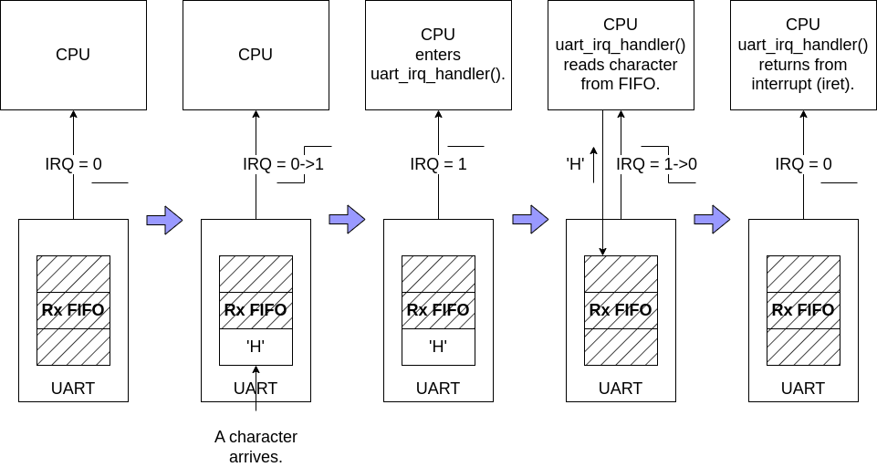
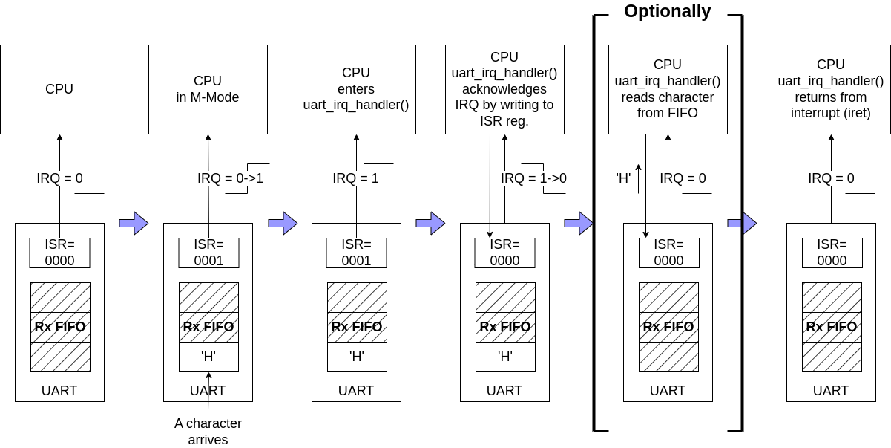
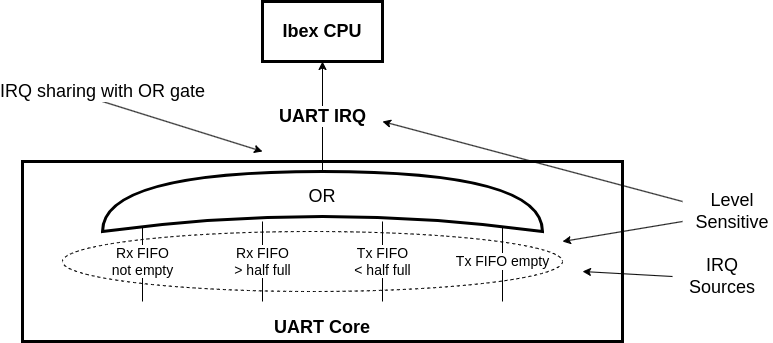
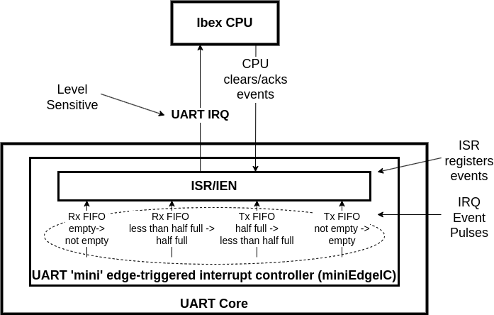
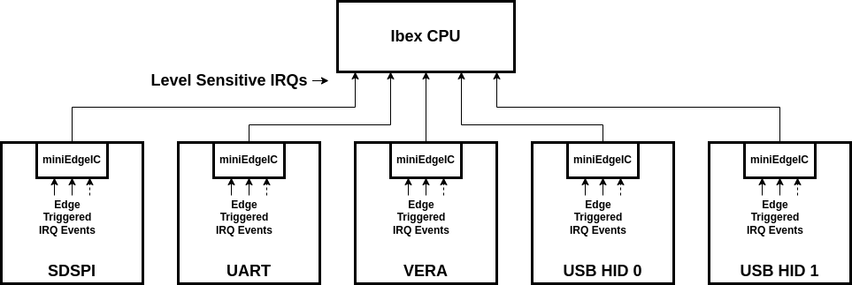

---
hide:
  - toc
---

## Interrupts

### The Interrupt Handling Protocol: Condition-Based vs. Event-Based Interrupts

A core, such as a UART, may raise an interrupt request (IRQ) when it detects an event or condition that may be of interest to the software running on the CPU. For example, in the case of a UART, the condition might be *Rx-FIFO-Not-Empty*, or the event might be *Character-Enters-Empty-Rx-FIFO*. Interrupt triggers come in two types:

- **Condition-Based Interrupts**: A core that implements condition-based interrupts will assert its interrupt request (IRQ) line when a certain condition is met, as long as that condition persists. The CPU's interrupt handler routine must resolve the condition generating the interrupt before returning from the interrupt. For example, a UART core that implements condition-based interrupts will assert its IRQ line when the RX FIFO is not empty. The IRQ line remains asserted as long as the RX FIFO is not empty. This means that the interrupt handler must either read all the data from the RX FIFO or disable the corresponding UART interrupt before returning. If the interrupt handler returns before emptying the FIFO or disabling the interrupt source, the CPU would be immediately re-interrupted.

*Condition-Based Interrupt Example.*

Note that in the condition-based interrupt example, there is no explicit interrupt acknowledgment. The IRQ is de-asserted once the FIFO is empty.

- **Event-Based Interrupts**: A core implementing event-based interrupts will assert its IRQ line when a specific event occurs. The IRQ line remains asserted until the CPU clears/acknowledges the event by writing to an interrupt register inside the core. For example, a UART core that implements event-based interrupts will assert its IRQ line when the RX FIFO transitions from empty to non-empty. The IRQ line remains asserted until the CPU writes a 1 into the `Rx_Data_Avl` bit position of the UART core's Interrupt Status Register.

*Event-Based Interrupt Example.*

In the event-based interrupt example, the interrupt is explicitly acknowledged by writing to the ISR register. Additionally, the interrupt handler routine *may* read the received character from the Rx FIFO, but this is not required. Retrieving the character from the Rx FIFO may be deferred until later, once the CPU is no longer in interrupted mode. In the event-based protocol, interrupt handling is decoupled from managing the condition that triggered the interrupt.

#### WBUART and SDSPI Interrupt Protocol Modification

The original **wbuart** and **sdspi** cores use condition-based interrupts. However, I find the event-based protocol easier to work with, so I modified these cores to generate event-based interrupts.

For **wbuart**, I added an Interrupt Enable (IEN) register and an Interrupt Status (ISR) register. The ISR bits get set when specific events occur:

- `ISR[0]`: The UART Rx FIFO goes from an empty to a non-empty state.
- `ISR[1]`: The UART Rx FIFO goes from less-than-half-full to half-full.
- `ISR[2]`: The UART Tx FIFO goes from half-full to less-than-half-full.
- `ISR[3]`: The UART Tx FIFO goes from non-empty to empty.

ISR bits are cleared by the CPU writing a 1 into the bit position of the event it wants to acknowledge. When any IEN-enabled ISR bits are set, the **wbuart** core's IRQ line is asserted.

The modification of **sdspi** is almost identical. Here, the events are:

- `ISR[0]`: The device transitioned from a `busy` state to an `idle` state.
- `ISR[1]`: The removal of an SD card is detected.

Except for [wb_timer](components_timer.md), which follows its own protocol, the other cores in the BoxLambda SoC already implement the event-based protocol.

#### Edge-Triggered Interrupt Controllers Connected to a Level-Sensitive CPU

The terms *Condition-Based* and *Event-Based* interrupts are terms I coined for this discussion. Some might argue that the generally accepted term for what I call *Condition-Based* is *Level-Triggered*, and the official term for an *Event-Based* interrupt is *Edge-Triggered*. Depending on your perspective, there's some truth to that. Different people interpret these terms in different ways. You can find the Wikipedia definition of edge- and level-triggered [here](https://en.wikipedia.org/wiki/Interrupt#Triggering_methods).

The Ibex CPU is level-sensitive, responding to the levels of the incoming IRQ lines. It does not register edges or pulses.

However, when I modified the UART core to generate event-based interrupts, I essentially added a lightweight, **edge-triggered interrupt controller** inside the UART core.

Here’s the original UART core:

*The UART Core before modification: Level Sensitivity from source to CPU.*

Here’s the UART core after modification:

*The UART Core after modification: Level-Sensitive CPU with a 'Mini' Edge-Triggered Interrupt Controller inside the UART Core.*

From this perspective, the overall interrupt architecture of the BoxLambda SoC consists of a level-sensitive CPU connected to several small, edge-triggered interrupt controllers (*MiniEdgeICs*) inside the component cores.

*BoxLambda SoC with Mini, Edge-Triggered Interrupt Controllers inside the component cores.*

### Ibex RISC-V Interrupt Assignments

*BoxLambda Interrupt Diagram.*

The RISC-V specification defines an elaborate interrupt architecture, offering various options and flexibility for different implementations. A simpler starting point for BoxLambda is the specific interrupt handling implementation chosen for the Ibex RISC-V processor, documented here:

[https://ibex-core.readthedocs.io/en/latest/03_reference/exception_interrupts.html](https://ibex-core.readthedocs.io/en/latest/03_reference/exception_interrupts.html)

Briefly, the Ibex core has:

- 15 ports for **Fast** local interrupts. The BoxLambda SoC components that can post IRQs (not all of them do) are connected to these fast interrupts.
- 1 port for a **Timer** interrupt. The `wb_timer` module is connected to this interrupt line.
- An **External Interrupt** port to connect to a *Platform-Level Interrupt Controller*. This will not be used in BoxLambda.
- A **Non-Maskable Interrupt** (NMI) port, which will remain unconnected until a suitable use case is found.

RISC-V defines 32 IRQ IDs. Ibex maps the timer interrupt to IRQ ID 7 and the fast interrupts to IRQ IDs 16 to 30.

The following table lists the BoxLambda interrupts and the events they report:

| IRQ_ID | IRQ Name                                | Events |
|--------|-----------------------------------------|--------|
| 31     | NMI                                     | Not Used |
| 30     | Not Assigned                            |        |
| 29     | VERA IRQ                                | Vsync, Line IRQ, Sprite Collision |
| 28     | VS0 Interrupt                           |        |
| 27     | Not Assigned                            |        |
| 26     | SDSPI IRQ                               | Device Busy->Idle, Card Removed |
| 25     | GPIO                                    | Rising or Falling Edge on input pin |
| 24     | usb_hid_1 IRQ                           | USB report received, LED set confirmation |
| 23     | usb_hid_0 IRQ                           | USB report received, LED set confirmation |
| 22     | I2C IRQ                                 | Device Busy->Idle |
| 21     | UART                                    | Rx FIFO not empty, Rx FIFO half full, Tx FIFO half empty, Tx FIFO empty |
| 20     | Not Assigned                            |     |
| 19     | Not Assigned                            |     |
| 18     | Not Assigned                            |     |
| 17     | Not Assigned                            |        |
| 16     | Not Assigned                            |     |
|  7     | Timer IRQ                               | Timer counter >= timer compare value |

### Interrupt Jitter

When the CPU receives an IRQ it has to complete that instruction before it can jump to the interrupt vector. This constraint causes some interrupt latency jitter/variation. For asynchronous events, such as key presses, that won't matter. However, for critically timed events, there may be cases where you want to execute a sequence of instructions *exactly* at a given time, without any jitter. The [Timer module](components_timer.md#timer) includes a mechanism (`mtimeblk`) that can be used to remove this jitter.

### Interrupt Handling Software

See the [Interrupt Handling](sw_comp_irqs.md) page.
