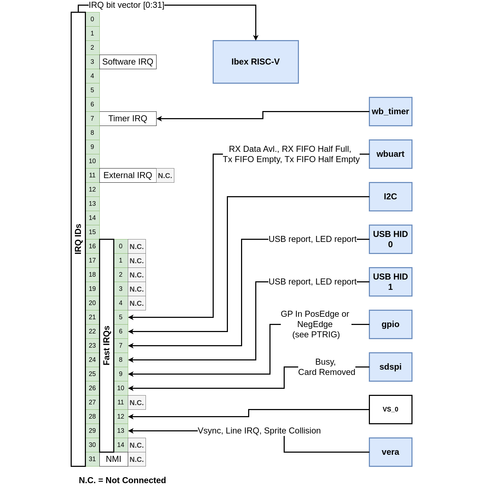

## Interrupts

### The Interrupt Handling Protocol - Condition- vs. Event-Based Interrupts
A core, e.g. a UART, may raise an interrupt request (IRQ) when it detects an event or condition that may be of interest to software running on the CPU. In the case of a UART, the condition might be *Rx-FIFO-Not-Empty*, or the event might be *Character-Enters-Empty-Rx-FIFO*. Interrupt triggers come in two flavors:

- **Condition-Based Interrupts**: A core that implements condition-based interrupts will assert its interrupt request (IRQ) line when a certain condition is met, for as long as that condition is met. The CPU's interrupt handler routine has to remove the condition generating the interrupt before it can return from interrupt. E.g. A UART core that implements condition-based interrupts will assert its IRQ line when the RX FIFO is not empty. The IRQ line remains asserted as long as the RX FIFO is not empty. This means that the interrupt handler routine servicing this interrupt will have to read all the data from the RX FIFO or disable the corresponding UART interrupt before it can return from interrupt. If the interrupt handler routine would return before emptying the FIFO or disabling the interrupt source, the CPU would immediately get re-interrupted.

*Condition-Based Interrupt Example.*

Note that in the condition-based interrupt example, there is no explicit interrupt acknowledgment. The IRQ is de-asserted when the FIFO is empty.

- **Event-Based Interrupts**: A core implementing event-based interrupts will assert its IRQ line when a specific event happens. The IRQ line remains asserted until the CPU clears/acknowledges the event by writing to an interrupt register inside the core. E.g. a UART core that implements event-based interrupts will assert its IRQ line when the RX FIFO goes from an empty to a non-empty state. The IRQ line remains asserted until the CPU writes a 1 into the *Rx_Data_Avl* bit position of the UART core's Interrupt Status Register.

*Event-Based Interrupt Example.*

In the event-based interrupt example, the interrupt is explicitly acknowledged by a write to the ISR register. Also, the interrupt handler routine *may* read the received character from the Rx FIFO, but this is not required. Retrieving the character from the Rx FIFO may be deferred to a later time when the CPU is no longer in interrupted mode. In the event-based protocol, interrupt handling is decoupled from handling the condition that triggered the interrupt.

#### WBUART and SDSPI Interrupt Protocol Modification
The original **wbuart** and **sdspi** cores use condition-based interrupts. I find it easier to work with the event-based protocol, however. I modified those cores to generate event-based interrupts.

In the case of wbuart, I added an Interrupt Enable (IEN) register and an Interrupt Status (ISR) register. The ISR bits get set when specific events happen:

- **ISR[0]**: The UART Rx FIFO goes from an empty to a non-empty state
- **ISR[1]**: The UART Rx FIFO goes from less-than-half-full to half-full.
- **ISR[2]**: The UART Tx FIFO goes from half-full to less than half-full.
- **ISR[3]**: The UART Tx FIFO goes from non-empty to empty.

ISR bits get cleared by the CPU writing a 1 into the bit position of the event it wants to acknowledge. When any IEN-enabled ISR bits are set, the wbuart core's IRQ line is asserted.

The modification of the sdspi is almost identical. Here, the events are:

- **ISR[0]**: The device transitioned from a *busy* state to an *idle* state.
- **ISR[1]**: The removal of an SD card is detected.

Except for [wb_timer](components_timer.md), which follows its own protocol, the other cores on the BoxLambda SoC already implement the event-based protocol.

#### Edge Triggered Interrupt Controllers connected to a Level-Sensitive CPU
The terms *Condition-based* and *Event-based* interrupt are just terms I came up with for this discussion. Some would say that the generally accepted term for what I'm calling *Condition-Based* is *Level-Triggered*, while the official name of an *Event-Based* interrupt is *Edge-Triggered* interrupt. Depending on your perspective, there's some truth to that. Different people have different takes on these terms. You can find the Wikipedia definition of edge- and level-triggered [here](https://en.wikipedia.org/wiki/Interrupt#Triggering_methods).

The Ibex CPU is level-sensitive, no question about that. It responds to the levels of the incoming IRQ lines. It does not register edges or pulses.

However, you could argue that when I modified the UART core to generate event-based interrupts, I added a lightweight, **edge-triggered interrupt controller** to that core.

Here's the original UART core:

*The UART Core before modification: Level Sensitivity from source to CPU.*

Here's the UART core after modification:

*The UART Core after modification: Level Sensitive CPU, 'Mini' Edge-Triggered Interrupt Controller inside UART Core.*

From this perspective, the overall interrupt architecture of the BoxLambda SoC is that of a level-sensitive CPU connected to a bunch of small, edge-triggered interrupt controllers (*MiniEdgeICs*) inside the components cores.

*BoxLambda SoC with Mini, Edge-Triggered Interrupt Controllers inside the component cores.*

### Ibex RISC-V Interrupt Assignments

*BoxLambda Interrupt Diagram.*

The RISC-V spec defines an elaborate interrupt architecture, with lots of options and flexibility for different types of implementations. An easier starting point for BoxLambda is the specific interrupt handling implementation chosen for the Ibex RISC-V processor, documented here:

[https://ibex-core.readthedocs.io/en/latest/03_reference/exception_interrupts.html](https://ibex-core.readthedocs.io/en/latest/03_reference/exception_interrupts.html)

Briefly, the Ibex core has:

- 15 ports for **Fast**, local interrupts. The BoxLambda SoC components that can post IRQs (not all of them do) are connected to these fast interrupts.
- 1 port for a **Timer** interrupt. The *wb_timer* module is connected to this interrupt line.
- An **External Interrupt** port to connect a so-called *Platform-Level Interrupt Controller*. I'm not going to use this.
- A **Non-Maskable Interrupt** (NMI) port, which I'll also leave unconnected until I find a good use for it.

RISC-V defines 32 IRQ IDs. Ibex maps the timer interrupt to IRQ ID 7 and the fast interrupts to IRQ IDs 16 to 31.

I'm using the same mapping to connect the IRQs to the [PicoRV DMA Controller](components_picorv_dma.md), i.e. Ibex and PicoRV see the same set of interrupts with the same IRQ_IDs/ISR bit positions. Note, however, that the PicoRV doesn't directly support interrupts. The PicoRV microcode detects signaled interrupts by polling its Interrupt Status Register. Check the PicoRV DMA Controller link earlier in this paragraph for more details.

This table lists the BoxLambda interrupts and the events they report:

| IRQ_ID | IRQ Name                                | Events |
|--------|-----------------------------------------|--------|
| 30     | RM_2 interrupt (Default: not assigned)  |        |
| 29     | RM_1 interrupt (Default: VERA IRQ)      | Vsync, Line IRQ, Sprite Collision |
| 28     | RM_0 interrupt (Default: not assigned)  |        |
| 27     | PICORV DMAC IRQ                         | Programmable |
| 26     | SDSPI IRQ                               | Device Busy->Idle, Card Removed |
| 25     | GPIO                                    | Rising or Falling Edge on input pin |
| 24     | usb_hid_1 IRQ                           | USB report received, LED set confirmation |
| 23     | usb_hid_0 IRQ                           | USB report received, LED set confirmation |
| 22     | I2C IRQ                                 | Device Busy->Idle |
| 21     | UART                                    | Rx FIFO not empty, Rx FIFO half full, Tx FIFO half empty, Tx FIFO empty |
| 20     | not assigned                            |     |
| 19     | not assigned                            |     |
| 18     | not assigned                            |     |
| 17     | DFX Controller IRQ                      | TBD |
| 16     | ICAP IRQ                                | TBD |
|  7     | Timer IRQ                               | timer counter >= timer compare value |

### Interrupt Handling Software

See the [Interrupt Handling](sw_comp_irqs.md) page.

