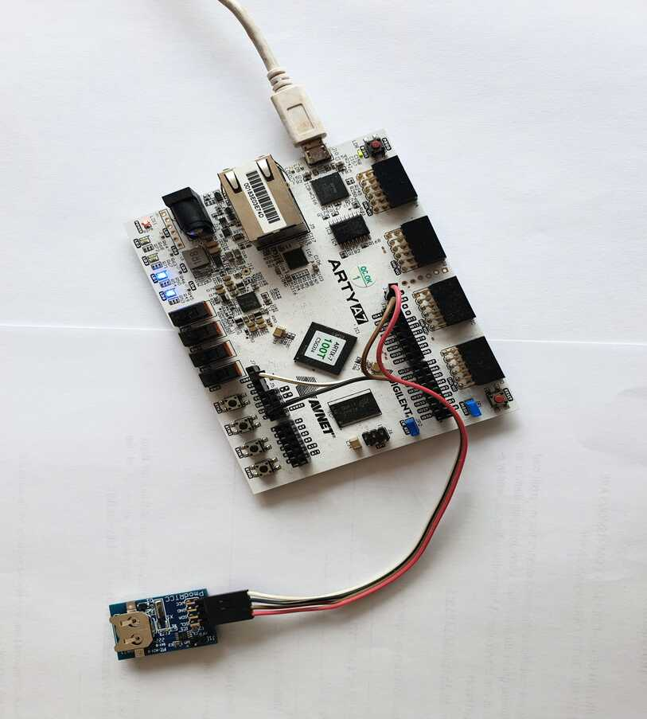

---
hide:
  - toc
---

## Hooking Up the Peripherals (PMODs)

### VGA PMOD

Hook up [Diligent's VGA PMOD](https://digilent.com/reference/pmod/pmodvga/start) to PMOD ports JB and JC. Connect a VGA display.

*VGA PMOD Setup.*

### MicroSD PMOD

Hook up Digilent's [MicroSD PMOD](https://digilent.com/shop/pmod-microsd-microsd-card-slot/) to port **JD** and insert an SD card into the card reader.

*MicroSD PMOD Setup.*

### Audio PMOD

To make space for the keyboard and mouse, I moved the audio PMOD to the ChipKit header of the Arty A7 board. Hook up Digilent's [PMOD Amp2](https://digilent.com/shop/pmod-amp2-audio-amplifier/) as follows:

| Audio PMOD Pin | Arty A7 Board Pin |
|----------------|-------------------|
| 1 (*AIN*) | ChipKit Header IO0 |
| 2 (*GAIN*) | ChipKit Header IO1 |
| 3 | Not Connected |
| 4 (*~SHUTDOWN*) | ChipKit Header IO3 |
| 5 (*GND*) | ChipKit Header GND |
| 6 (*VCC*) | ChipKit Header 3V3 |

*Audio PMOD Setup.*

### USB Host PMOD

I'm using the following PMOD from Machdyne:

*The Machdyne USB host dual socket PMOD.*

[https://machdyne.com/product/usb-host-dual-socket-pmod/](https://machdyne.com/product/usb-host-dual-socket-pmod/)

Hook up the PMOD to port **JA** and connect a keyboard and/or a mouse.

*Arty A7 Setup with USB PMOD attached to port JA.*

### RTCC PMOD

The Real-Time Clock and Calendar PMOD is from Digilent:

[https://digilent.com/shop/pmod-rtcc-real-time-clock-calendar/](https://digilent.com/shop/pmod-rtcc-real-time-clock-calendar/)

There aren't enough PMOD ports on the Arty A7 to accommodate all BoxLambda peripherals. Instead of using a PMOD port, I hooked up the RTCC PMOD to the I2C pins of the ChipKit Header:

| RTCC PMOD Pin | Arty A7 Board Pin |
|----------|-------------|
| 1 (*SCL*) | ChipKit Header SCL |
| 2 (*SDA*) | ChipKit Header SDA |
| 3 (*GND*) | ChipKit Header GND |
| 4 (*VCC*) | ChipKit Header IOREF |

*RTCC PMOD Setup.*

