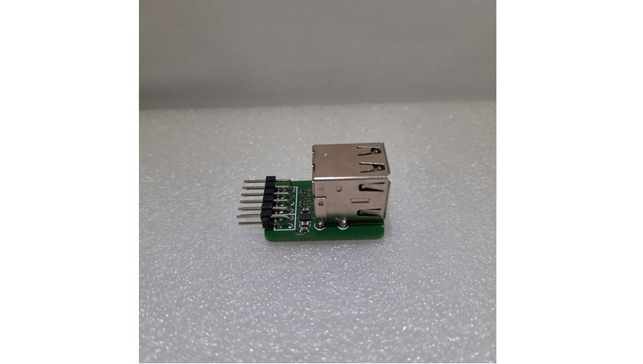

## Hooking Up the Peripherals (PMODs)

### VGA PMOD

Hook up [Diligent's VGA PMOD](https://digilent.com/reference/pmod/pmodvga/start) to PMOD ports JB and JC. Connect a VGA display.

*VGA PMOD Setup.*

### MicroSD PMOD

Hook up Digilent's [MicroSD PMOD](https://digilent.com/shop/pmod-microsd-microsd-card-slot/) to port **JD** and insert an SD card into the card reader. 

*MicroSD PMOD Setup.*

### Audio PMOD

To make space for the keyboard and mouse, I moved the audio PMOD to the ChipKit header of the Arty A7 board. Hook up Digilent's [PMOD Amp2](https://digilent.com/shop/pmod-amp2-audio-amplifier/) as follows:

- PMOD Pin 1 (*AIN*) to ChipKit IO 0.
- PMOD Pin 2 (*GAIN*) to ChipKit IO 1.
- PMOD Pin 3 Not Connected.
- PMOD Pin 4 (*~SHUTDOWN*) to ChipKit IO 3.
- PMOD Pin 5 (*GND*) to Ground.
- PMOD Pin 6 (*VCC*) to 3V3.

*Audio PMOD Setup.*

### USB Host PMOD

I'm using the following PMOD from Machdyne:

*The Machdyne USB host dual socket PMOD.*

[https://machdyne.com/product/usb-host-dual-socket-pmod/](https://machdyne.com/product/usb-host-dual-socket-pmod/)

Hook up the PMOD to port **JA** and connect a keyboard and/or a mouse.

*Arty A7 Setup with USB PMOD attached to port JA.*
